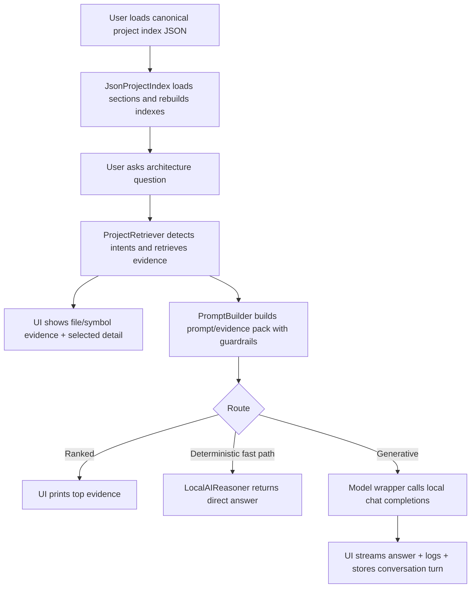
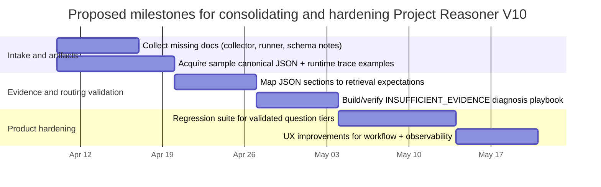

# Deep research intake for Project Reasoner V10

## Executive summary

The available “project text” currently consists of the Project Reasoner V10 source files and embedded help/UX copy (no separate narrative PRD, roadmap, or stakeholder brief was provided; those details are therefore marked as **unspecified** where relevant). fileciteturn0file5turn0file8turn0file6

Project Reasoner V10 appears to be a desktop GUI tool that loads a **canonical project index JSON** generated by a companion “V10 data collector,” then answers software architecture questions by combining retrieval/ranking over the JSON evidence with a local model (via a local model provider). It emphasizes **strict evidence-grounding** (do not invent files/symbols/flows; report uncertainty when evidence is partial), supports multiple answer routes (ranked retrieval-only vs. generative synthesis), and includes workflow affordances to generate/load the canonical JSON and inspect “static context” (packaging metadata and documentation intent) extracted from files like `pyproject.toml` and `README.md`. fileciteturn0file5turn0file6turn0file8turn0file12turn0file17turn0file19turn0file2

The GUI is implemented with PySide6 (Qt for Python), which is the official Qt Python binding maintained by entity["company","The Qt Company","qt framework vendor"]. citeturn0search1 fileciteturn0file8

The local-model integration targets an entity["company","Ollama","local llm runtime"]-style deployment (localhost HTTP endpoints), including both `/api/tags` model listing and OpenAI-compatible `/v1/chat/completions` usage patterns. citeturn2search0turn1search0 fileciteturn0file9turn0file14

## Project scope and objectives

### Interpreted project scope

Project Reasoner V10 is a “project architecture reasoning” environment driven by a generated JSON index. Within the UI, users load a JSON artifact described as “the architecture knowledge base used by retrieval, ranking, and local AI reasoning.” fileciteturn0file5turn0file8

The JSON index is designed to include (at least) files, symbols, snippets, structural metadata, entry files, runtime hints, semantic roles, Qt signal maps, widget registries, execution chains, and subsystems. fileciteturn0file5turn0file6

The tool is explicitly framed as reusable and not meant to be hard-wired to a single downstream project; in particular, it should remain generic and avoid being merged with project-specific shell logic. fileciteturn0file5

### Key objectives extracted from the project text

The following objectives are supported directly by the embedded help copy and code structure:

The primary objective is to enable a user to ask architecture questions and receive answers based on a loaded canonical JSON index, using retrieval and (when appropriate) local generative synthesis. fileciteturn0file5turn0file8turn0file0

A critical objective is to enforce “strict grounding” and reduce hallucinations: answers should use only evidence items (files/symbols/snippets) supplied from retrieved content; when evidence is partial, the system should explicitly communicate uncertainty rather than inventing details. fileciteturn0file12turn0file3turn0file5

A supporting objective is to streamline workflows for generating the canonical JSON index (via an analysis pipeline invoked from the UI) and then loading/using it for reasoning. fileciteturn0file5turn0file8

Another objective is to provide an operator-friendly UI for inspecting both the retrieved evidence and the prompt/evidence pack sent to the local model, including conversation memory and “static context” summaries of packaging/docs signals. fileciteturn0file8turn0file17turn0file19

### Out-of-scope or unspecified

No explicit licensing/distribution target (internal tool vs. public release), platform support statement (Windows/macOS/Linux), or non-functional requirements (latency targets, memory ceilings, privacy constraints) are specified in the provided project text. **Unspecified.** fileciteturn0file5turn0file8

No explicit definition of the downstream “target project(s)” is included beyond example question sets referencing an EEG application layout (e.g., `shell/...`, `plugins/...`). The specific target projects are therefore **unspecified** beyond being Python projects that can be indexed by the collector. fileciteturn0file5turn0file0turn0file11

## System architecture and data flow

### High-level components

The code indicates these primary components:

A GUI main window (Project JSON explorer / local AI reasoner) that coordinates JSON loading, question input, evidence display, prompt preview, and answer display. fileciteturn0file8

A JSON index loader that reads the canonical JSON, retains full section-level data, and rebuilds key indexes (files, modules, symbols, import/call graphs) for retrieval and UI. fileciteturn0file6

A retrieval engine that detects query intents, selects section priorities, retrieves file/symbol/snippet evidence, and may expand the query using candidate callees derived from snippet text. fileciteturn0file0turn0file16

A prompt builder that constructs an “evidence pack” prompt with explicit guardrails and answer-style constraints (prefer code excerpts vs. prose), and that instructs the model not to invent code or entities not present in evidence. fileciteturn0file12

A local AI bridge that can sometimes answer deterministically without calling the model (fast paths), otherwise submits a grounded prompt to the model wrapper and streams answer/token/status messages to the GUI. fileciteturn0file3turn0file8

A local model registry + model wrapper built for localhost endpoints consistent with Ollama’s API (model listing and chat completions). fileciteturn0file9turn0file14turn0file8 citeturn2search0turn1search0

A static context inspector dialog/widget that summarizes packaging metadata and documentation intent extracted into the JSON index. fileciteturn0file17turn0file19turn0file18

### Evidence-grounded reasoning flow

The intended interactive loop is:

The user loads a canonical JSON index file, which becomes the authoritative local “knowledge base” for subsequent reasoning. fileciteturn0file5turn0file6turn0file8

For each question, the system detects a likely intent/routing category and retrieves evidence (files, symbols, snippets) from the loaded JSON; evidence is displayed in the UI and incorporated into a prompt/evidence pack. fileciteturn0file5turn0file0turn0file8turn0file12

Depending on the route, the tool either returns ranked evidence (retrieval-only), answers via a deterministic/fast path, or sends the prompt to the local model for generative synthesis—while maintaining strict grounding rules. fileciteturn0file8turn0file3turn0file12

The following diagram is a compact representation of the flow described above. fileciteturn0file8turn0file0turn0file12turn0file3

### Local model integration assumptions

The code is aligned with Ollama-style localhost endpoints for listing models and issuing chat completions. The official Ollama API documentation describes a default base URL at `http://localhost:11434/api`, a model listing endpoint `GET /api/tags`, and OpenAI-compatible `POST /v1/chat/completions`. citeturn2search1turn2search0turn1search0 fileciteturn0file9turn0file14

The help content recommends specific local models (e.g., “qwen2.5-coder:32b”) and mentions alternatives; that is consistent with public model cards describing Qwen2.5-Coder variants and sizes on entity["company","Hugging Face","model hosting platform"] and Qwen’s own site. citeturn0search0turn0search2 fileciteturn0file5turn0file14

## Deliverables and operational requirements

### Delivered artifacts indicated by the project text

The project text implies at least two primary artifacts:

A “human-facing entry point” GUI (this app) that loads the canonical JSON and answers questions. fileciteturn0file8turn0file1turn0file5

A “canonical main” JSON project index produced by a V10 collector/analysis pipeline; runtime trace JSON is referenced as a supporting (non-canonical) artifact. fileciteturn0file5turn0file6turn0file2

A test indicates the collector output contains **packaging metadata** and **documentation intent** sections, including fields like `project_name`, `declared_version`, `packaging_files_found`, `documentation_files_found`, and `run_instructions`. fileciteturn0file2turn0file6turn0file19

### Deliverables table

Deadlines and accountable owners are not specified in the provided text; they are marked **unspecified** as requested.

| Deliverable | Deadline | Responsible party | Required resources | Notes |
|---|---|---|---|---|
| Desktop GUI “Project Reasoner V10” | Unspecified | Unspecified | Python runtime; PySide6/Qt for Python; local filesystem | Provides question input, evidence panels, answer panel, prompt preview, logs, history. fileciteturn0file8turn0file5 |
| Canonical project index JSON (collector output) | Unspecified | Unspecified | V10 data collector; access to target project codebase | Must be loaded before reasoning; includes many top-level sections beyond core indexes. fileciteturn0file5turn0file6 |
| Retrieval and ranking subsystem (ProjectRetriever) | Unspecified | Unspecified | Loaded JSON index containing file/symbol/snippet indexes | Intent detection + evidence retrieval; increases limits for some “explain”/runtime-heavy questions. fileciteturn0file0turn0file16 |
| Prompt/evidence pack builder with grounding guardrails | Unspecified | Unspecified | Retrieved evidence bundle + conversation memory | Enforces “use only evidence,” “do not invent code,” and “calibrated language.” fileciteturn0file12 |
| Local AI bridge with deterministic fast paths | Unspecified | Unspecified | Local model wrapper; UI signal wiring | Can return direct answers for some deterministic prompts; otherwise routes to model call with strict system rules. fileciteturn0file3turn0file8 |
| Local model registry and model wrapper integration | Unspecified | Unspecified | Running Ollama instance on localhost; models pulled locally; network access to localhost ports | Uses model listing and OpenAI-compatible chat completions endpoints in codebase. fileciteturn0file9turn0file14 citeturn2search0turn1search0 |
| Static context inspector (packaging + docs intent) | Unspecified | Unspecified | JSON index sections: `packaging_metadata`, `documentation_intent` | Summarizes project name/deps/entrypoints and documentation-derived run instructions. fileciteturn0file17turn0file19turn0file18 |

### Operational requirements implied by the design

The app must have access to a recent, valid canonical JSON index; the help text explicitly warns that answer quality depends heavily on index freshness and that significant codebase changes require regenerating and reloading the JSON. fileciteturn0file5turn0file6

The local-model runtime requires an accessible model provider on localhost and a selected model; the UI includes a “Refresh Models” control tied to the local model registry. fileciteturn0file5turn0file8turn0file9 citeturn2search0turn1search0

The app supports (and in some pathways expects) a persistent cache directory and a `governance_state.json` file that encodes governance/safety/architecture constraints for the local AI runtime. fileciteturn0file5turn0file14

## Constraints, assumptions, and success criteria

### Constraints explicitly specified

Strict grounding is a hard constraint: prompts include system constraints such as “use only the evidence items shown,” “do not answer from memory when evidence does not support the claim,” and “do not invent files/classes/functions/snippets/flows,” with additional rules about only copying code from provided source snippets. fileciteturn0file12turn0file3turn0file5

A project-path filtering constraint exists: the retriever blocks certain paths/directories (including explicitly excluding `developer_tools/` from being treated as the target project evidence), to prevent tool-internal code from contaminating target-project evidence. fileciteturn0file0turn0file5

The system acknowledges an “INSUFFICIENT_EVIDENCE” diagnosis pathway with validator rules such as “forbidden_symbols,” “forbidden_paths,” and “ignored_required_snippets,” indicating that answers may be rejected if they cite symbols/paths not present in the allowed evidence set or omit required snippet citations for “code-with-code” questions. fileciteturn0file5turn0file12

### Assumptions inferred from the code and help text

The local AI provider is assumed to run on localhost and expose model listing and chat endpoints; this aligns with Ollama’s documented defaults. fileciteturn0file9turn0file14 citeturn2search1turn1search0turn2search0

The canonical JSON is assumed to contain both “core” indexes (files, symbols, import/call graphs) and “advanced” top-level sections (signal maps, widget registries, execution chains, subsystems, and various hotspot/index summaries). fileciteturn0file6turn0file5turn0file0

Project profile detection is assumed to be possible from already-loaded metadata (e.g., hints for Qt/PySide projects), but the profile system is described as intentionally passive/placeholder and may not yet change behavior unless wired into retrieval. fileciteturn0file11turn0file0turn0file17

### Success criteria

The help text supplies a “Validated Question Examples” hierarchy (tiers), including deterministic locator questions (exact file and symbol ownership lookups), signal/action questions (Qt signal map), flow/chain questions (startup chain), and responsibility questions. Correctly answering these validated forms (without hallucination) is an implied success criterion. fileciteturn0file5turn0file0turn0file12turn0file3

A second success criterion is operational robustness: the system should avoid false “INSUFFICIENT_EVIDENCE” failures by maintaining correct branch alignment between the indexed codebase and the running codebase, properly loading JSON sections (avoid type mismatches), and ensuring that relevant structured evidence is actually injected into prompts. fileciteturn0file5turn0file6turn0file12

A third success criterion is usability: users can see evidence lists, selected details, prompt/evidence pack preview, logs, and conversation history to debug outcomes and iterate on question phrasing. fileciteturn0file8turn0file5turn0file4

## Risks, dependencies, and open questions

### Key dependencies

PySide6 / Qt for Python is a foundational dependency for the GUI layer. fileciteturn0file8 citeturn0search1

The local model provider depends on localhost HTTP APIs consistent with Ollama’s documented endpoints (`/api/tags` and OpenAI-compatible `/v1/chat/completions`). fileciteturn0file9turn0file14 citeturn2search0turn1search0

The entire reasoning system depends on the availability and correctness of the canonical JSON schema and the data collector that generates it (referenced by help/test, but not fully included as source text in the currently provided files). fileciteturn0file5turn0file2turn0file6

### Principal risks

Index staleness risk: if the target codebase changes but the JSON index is not regenerated, evidence retrieval will drift, lowering answer quality and increasing false “insufficient evidence” outcomes. fileciteturn0file5turn0file6

Validator mismatch risk: strict “no unseen symbols/paths” constraints can create false negatives if retrieval fails to surface the correct evidence in the top-N set even when it exists somewhere in the JSON. fileciteturn0file5turn0file0turn0file16

Runtime/environment risk: local model endpoints may not be running, models may not be pulled, or firewall/port configuration may block localhost calls, preventing AI synthesis. fileciteturn0file9turn0file14 citeturn2search1turn1search0

Scope creep risk: the appendix guidance explicitly warns against merging the generic tool domain with project-specific shell logic or non-canonical runtime scenarios, implying maintainability and portability risks if that boundary is violated. fileciteturn0file5

### Dependencies and integration points that are missing or ambiguous

The help text references `runner.py` as the “human-facing entry point” for creating the main JSON, and references an internal runtime collector. Those referenced components are **not present** in the provided project text set and are therefore **unspecified** (location, CLI, config, schema guarantees). fileciteturn0file5turn0file8

A core function `get_section_priority` is imported by the retriever, but its implementation is not included in the provided text, leaving section priority policy **unspecified**. fileciteturn0file0

The full intent routing function is described in help and referenced by imports, but the complete routing policy details beyond what is shown in help text are **partially unspecified** in the currently provided text set. fileciteturn0file5turn0file8turn0file7

### Open questions checklist

These questions are not answered by the provided project text and should be treated as **open**:

What is the authoritative schema/versioning contract for the canonical project index JSON (e.g., required vs optional sections)? **Unspecified.** fileciteturn0file6turn0file5

Where is the end-to-end collector pipeline defined (collector_main, runner, runtime collector), and what inputs/config flags does it accept? **Unspecified.** fileciteturn0file5turn0file2

What are the acceptance criteria for the “validated question” tiers (expected outputs, tolerances, regression harness)? **Unspecified** beyond the example question list. fileciteturn0file5turn0file0

What are the intended deployment constraints (internal-only vs distributable app; supported OS; packaging strategy)? **Unspecified.** fileciteturn0file5turn0file6

What governance modes exist in `governance_state.json` beyond an integer `mode`, and how do they alter behavior? **Unspecified** beyond the minimal governance reader behavior shown. fileciteturn0file14turn0file5

## Research paths and next-step action checklist

### Research paths to fill gaps

Primary-source path: Obtain and analyze at least one real canonical project index JSON produced by the V10 collector for a representative project, then map which top-level sections are populated and how they correlate with successful answers. fileciteturn0file6turn0file5

Collector pipeline path: Locate the missing collector sources (runner GUI/CLI, collector_main, runtime collector) and document the exact workflow to generate (a) canonical JSON and (b) runtime trace helpers, clarifying which artifact is canonical and when splitting is needed. fileciteturn0file5turn0file2

Validation path: Reconstruct or locate the validator that produces “INSUFFICIENT_EVIDENCE,” then produce a failure taxonomy (forbidden symbol/path, missing snippet requirements, branch mismatch) with reproducible examples and remediation steps. fileciteturn0file5turn0file12turn0file3

Model/runtime path: Verify local model provider behavior against official Ollama API contracts (model listing + chat completions + streaming), then document installation/pull steps and operational checks that the UI could automate or surface more clearly. citeturn2search0turn1search0turn2search6 fileciteturn0file9turn0file14turn0file5

### Proposed milestone timeline

The project text does not provide dates; the following is a **proposed** timeline anchored to the current date (2026-04-10) to structure next steps. fileciteturn0file5turn0file8turn0file6

### Prioritized action checklist

Top priority actions (directly unblock deeper understanding and future Q&A capability):

Acquire the “canonical main JSON” and (if used) the runtime trace JSON for at least one target project run; without these artifacts, many schema and evidence questions remain unspecified. fileciteturn0file5turn0file6

Locate the missing collector pipeline sources (runner/collector_main/runtime collector) and document the exact generation workflow, inputs, and outputs; the help text treats this as foundational to correct tool usage. fileciteturn0file5turn0file2

Extract and formalize acceptance criteria from the validated question tiers into a regression suite that can be run against a known indexed project; this is the clearest path to measuring success and preventing regressions. fileciteturn0file5turn0file8turn0file0

Confirm local model operations end-to-end (model listing, chat completions, streaming) against official API docs, and document required runtime checks (Ollama running, model pulled, ports reachable). citeturn2search0turn1search0turn2search1 fileciteturn0file9turn0file14

Second priority actions (increase reliability and reduce false failures):

Audit the section-priority and scoring policies (including the missing `get_section_priority` implementation) to understand why correct evidence may fail to reach top-N; tune retrieval to reduce “evidence exists but scores too low” cases. fileciteturn0file0turn0file16turn0file5

Clarify the governance mode surface area beyond `{"mode": 0}` and decide how governance state should be versioned/distributed with indexed projects. fileciteturn0file14turn0file5

Third priority actions (improve maintainability and portability):

Document and enforce the “reusable domain contract” boundaries (generic vs target-project-specific behavior), especially around runtime scenario ingestion and excluded paths. fileciteturn0file5turn0file0

Create a short operator runbook embedded into the help UI describing the full workflow (Select Project -> Run Analysis -> Load JSON -> Ask Local AI -> Diagnose insufficient evidence), aligned with the app’s existing controls. fileciteturn0file5turn0file8