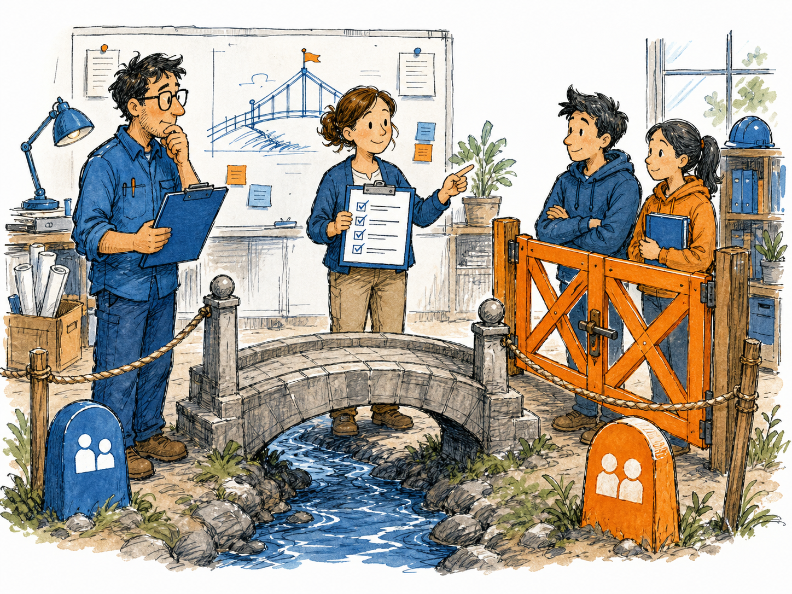
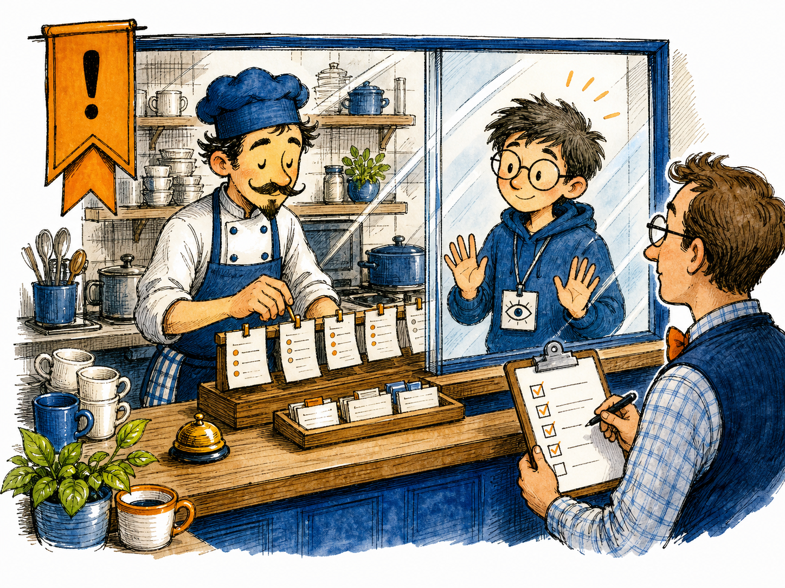
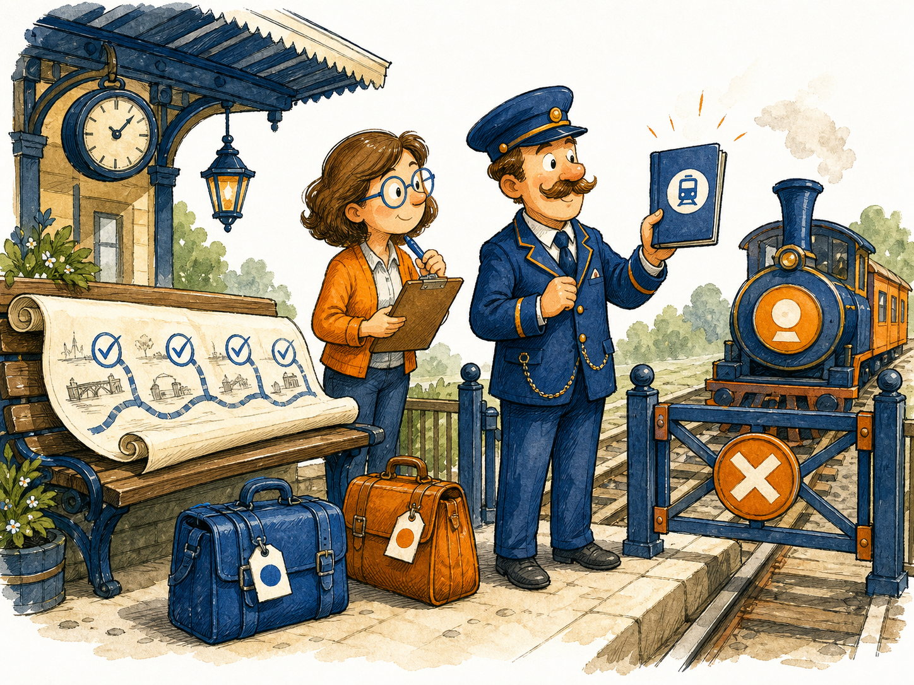

# Adviser to Pilot/Copilot Bridge Help

This help page explains the frozen bridge recorded in `.project_reference/chats/049 From Adviser to Pilot_Copilot.md`.
That file is source evidence for this help page, not an active runtime artifact.



Image note:

- Subject: The governed bridge from Adviser toward Pilot/Copilot.
- Asset path: `assets/drawings/adviser_to_pilot_bridge_opener.png`.
- Asset format and size: local PNG bitmap, generated as hand-made daily-life cartoon artwork for desktop help display.
- Alt text: Hand-drawn bridge scene where a reviewer checks a list before future helpers may cross a closed gate.
- Caption: The bridge exists, but crossing still requires the checklist.
- Prompt summary: gorgeous hand-made daily-life cartoon, office bridge metaphor, reviewer with checklist, future helpers behind a closed gate, KANDA blue/orange teaching colors, original scene only.
- Density-rule justification: this is the chapter-opener image for a normal-to-large help page about the bridge status and next safe scope.

## What This Help Page Covers

**Technical:** The `049` source records that the Adviser phase is closed, the post-Adviser bridge is complete through M35, and runtime Pilot/Copilot behavior is still not active. The help page summarizes the phase boundary, the non-authority doctrine, the frozen milestone chain, and the next safe work item: P0, a governed Pilot/Copilot scope charter and entry-gate design.

**In plain English:** The bridge is like a finished railway platform between two parts of the project. The route has been inspected and closed safely, but nobody gets to drive the next train yet. The next move is to write the ticket rules for the new trip, not to start the train.

> **Further reading:** Source evidence: `.project_reference/chats/049 From Adviser to Pilot_Copilot.md`; active help layout prompt: `kanda_prompt_workspace/prompt_library/ACTIVE_PROMPTS/12_generalized_project_canons/desktop_help_document_layout_canon.md`.

## Current Frozen State

| Area | State | Meaning |
|---|---|---|
| Adviser | Closed and frozen through M16 | The offline Adviser runway exists and remains advisory-only. |
| Shadow-mode bridge | Closed and frozen | The bridge defined observation boundaries without runtime authority. |
| Auxiliar/Assistant bridge | Closed and frozen | Assistance design and non-runtime assistance evidence were completed without activating Assistant. |
| Pilot/Copilot boundary | Designed and frozen | The future boundary exists, but Pilot/Copilot is not active. |
| M35 handoff closure | Frozen | The bridge roadmap is closed: 18 done, 0 to go. |
| Next safe action | P0 only | Start a new governed Pilot/Copilot scope charter and entry gate. |

## The Authority Boundary



Image note:

- Subject: Non-runtime shadow observation and look-only assistance.
- Asset path: `assets/drawings/adviser_to_pilot_shadow_observation_cafe.png`.
- Asset format and size: local PNG bitmap, generated as hand-made daily-life cartoon artwork for desktop help display.
- Alt text: Hand-drawn cafe scene where an observer watches routing tickets from behind glass while a reviewer checks the process.
- Caption: The helper may watch the counter, but it does not serve the order.
- Prompt summary: gorgeous hand-made daily-life cartoon, cafe counter metaphor, observer behind glass, reviewer checklist, KANDA blue/orange teaching colors, original scene only.
- Density-rule justification: this image explains the central authority boundary, distinct from the opener and final roadmap handoff.

**Technical:** The bridge doctrine is: ML or ML-like logic may recommend, observe, compare, or produce bounded evidence; the router and governance decide. The frozen bridge forbids route authority, prompt auto-loading, runtime activation, persistence, gold mutation, registry mutation, provider calls, embeddings, and freeze actions.

**In plain English:** The helper can stand at the cafe window and notice whether the order looks wrong. It cannot step behind the counter, serve the customer, rewrite the menu, or open the cash register.

> **Further reading:** `049` bridge sections on "Current Project State", "Smoothness and Error-Prevention Strategy", and "Patch Delivery Rules to Preserve".

## What Must Not Happen Next

Do not continue by saying:

- activate Pilot;
- start Copilot;
- enable runtime;
- let Pilot route;
- let Copilot load prompts;
- write shadow reports;
- mutate gold sets or registries;
- call providers, models, embeddings, vector indexes, network, subprocesses, or dynamic imports;
- skip validation and freeze before the next governed milestone.

**Technical:** These actions would cross from frozen bridge design into runtime authority or ungoverned autonomy. They would violate the non-authority boundary established by M17 through M35 and would confuse evidence with permission.

**In plain English:** The bridge is finished, but that does not mean the next vehicle is already allowed to move. The rules for the next vehicle must be written, checked, and frozen first.

> **Further reading:** `049` final current project state and next chat opening instruction.

## The Next Safe Step: P0



Image note:

- Subject: The frozen bridge roadmap and the next governed Pilot/Copilot scope.
- Asset path: `assets/drawings/adviser_to_pilot_frozen_roadmap_station.png`.
- Asset format and size: local PNG bitmap, generated as hand-made daily-life cartoon artwork for desktop help display.
- Alt text: Hand-drawn train platform where a completed roadmap sits beside a closed gate and a conductor presents a charter booklet.
- Caption: The roadmap is stamped complete; the next train still needs a charter.
- Prompt summary: gorgeous hand-made daily-life cartoon, railway platform metaphor, completed roadmap, closed gate, charter booklet, KANDA blue/orange teaching colors, original scene only.
- Density-rule justification: this image anchors the final section because the next safe action is the most important user decision after reading the page.

**Technical:** The next safe action is `P0 - Routing Signal Scorer v3 Pilot/Copilot Scope Charter and Entry Gate Design v1`. P0 must remain design-only. It may define scope, entry criteria, forbidden operations, and validation expectations, but it must not implement Pilot runtime, activate Pilot/Copilot, load prompts, add persistence, mutate gold sets, or grant routing authority.

**In plain English:** The next chapter begins by writing the boarding rules. It does not start the engine.

> **Further reading:** `049` sections "Next Chat Opening Instruction" and "Final Current Project State".

## Operating Rule

The one-line rule for future work is:

```text
The Adviser-to-Pilot/Copilot bridge is closed and frozen; the next chapter is Pilot/Copilot P0 as a governed scope charter, not runtime activation.
```

## Quick Checklist

Before any next patch, verify:

- the request is classified as Routed Work Path;
- the active prompt/router context is loaded;
- the owning box and allowed files are declared;
- the patch is one concept only;
- validation commands are provided;
- no runtime authority, prompt loading, persistence, provider calls, gold mutation, registry mutation, or freeze bypass is added;
- freeze happens only after local validation and human confirmation.
