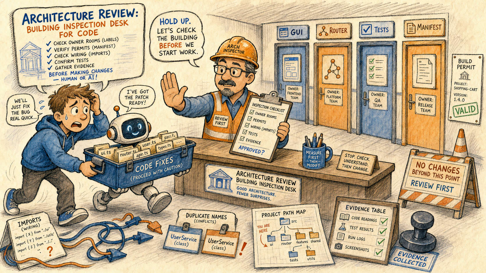
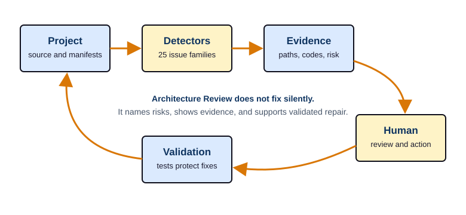

# Architecture Review

Page summary: Architecture Review is a building inspection desk for code. Before a person or an AI repair crew changes the project, it checks owner rooms, permits, wiring, tests, manifests, public names, and evidence stamps so the next fix lands in the right place.



## How To Use This

1. Open the `Architecture Review` tab and click `Load this tool now` if the panel has not loaded yet.
2. Check `Project root`; use `Browse...` when the field is not the repository you want to inspect.
3. Leave `Mode` on `validate` for the first pass. Use `diff` to preview generated changes, `scan` to print the manifest JSON, and `write` only when you deliberately want the worker to write architecture artifacts.
4. Click `Run Selected Mode` or one of the mode buttons, then read the `Output` panel as evidence. The tab reports risks and artifacts; it does not silently approve a patch.
5. Use `AI Review First Check` only after deterministic output exists. Treat it as an advisory second opinion over the latest output, not as the authority.
6. Use `Save Output` when the result needs to become handoff evidence for a review, bundle, issue, or later help-page update.

## What This Tab Owns

**Technical:** `Architecture Review` is registered as the lazy tool with tab id `architecture_review`, legacy help catalog `tab1_architecture.json`, source hint `kanda_reasoner_app/manage_architecture/manage_architecture_gui.py`, and runtime class `ArchitectureManagerWindow`. The shell help button resolves this rich local help page through the manifest before falling back to the legacy JSON catalog. The tool itself loads a sibling worker script, runs the selected mode in a `QThread`, captures stdout/stderr into the output panel, and exposes a read-only advisory AI review path over the last deterministic result.

**In plain English:** This tab is the inspection desk before repair work. It checks whether the project has rooms with clear labels, wiring that does not loop back on itself, permits for generated files, and test records before anyone carries a toolbox into the wrong place.

**Invariant:** Local code and generated evidence are the truth. Books, official docs, and AI comments are used to explain the design, not to overrule what the current code does.

## Routed Help And Loading Path

The visible `Help` button belongs to the shell host, not the inner worker window. The shell reads the `ToolSpec` for `Architecture Review`, sees `help_catalog="tab1_architecture.json"`, and calls the rich help resolver. The resolver finds the manifest page with `legacy_help_catalog` equal to `tab1_architecture.json` and opens `rendered/architecture_review.html` with the shared local CSS.

If the rich rendered file or CSS is missing, the shell can fall back to the old catalog formatter. That fallback is useful for safety, but it is not the desired user experience. The canonical path for this tab is rendered as a wrapped route so the help page never grows wider than the desktop help window:

1. `Help` button.
2. `tab1_architecture.json` legacy catalog key.
3. `help_docs/manifest.json` page registration.
4. `rendered/architecture_review.html` local document.
5. `css/book_help.css` local book layout.

## Control Reference

Table AR-1 is rendered as stacked control records instead of a wide four-column table. This keeps the full contract text visible at normal desktop width and at narrow help-window width.

### Shell and host controls

- `Help`
  - Area: Shell.
  - Technical contract: Opens the rich local help file through the legacy catalog resolver.
  - In plain English: Opens this guide.
- `Load this tool now`
  - Area: Shell.
  - Technical contract: Imports and embeds `ArchitectureManagerWindow` only when requested or when the lazy tab is activated.
  - In plain English: Brings the inspection desk into the room.
- `Source` label
  - Area: Shell.
  - Technical contract: Shows `kanda_reasoner_app/manage_architecture/manage_architecture_gui.py` as the GUI source hint.
  - In plain English: Shows where this tool lives.
- `Worker Script:`
  - Area: Host row.
  - Technical contract: Shows or lets the GUI move the worker selector into the shell status row.
  - In plain English: Shows which inspector script will run.
- Worker script path
  - Area: Worker.
  - Technical contract: Defaults to sibling `manage_architecture.py`; must exist before a run starts.
  - In plain English: The inspection checklist must be present.

### Input, mode, and safety controls

- `Project root`
  - Area: Input.
  - Technical contract: Converted to `Path` and checked with `exists()` before the worker thread starts.
  - In plain English: Pick the building to inspect.
- `Browse...` for project root
  - Area: Input.
  - Technical contract: Opens a directory chooser and writes the selected root into the field.
  - In plain English: Choose the correct building folder.
- `Mode` combo
  - Area: Mode.
  - Technical contract: Selects `validate`, `diff`, `scan`, or `write` for the worker.
  - In plain English: Pick inspection, preview, map printout, or controlled writing.
- `Require confirm before write`
  - Area: Safety.
  - Technical contract: When checked, `write` mode opens a warning dialog before files can be updated.
  - In plain English: Requires a permit before construction work.

### Command and toolbar controls

- `Run Selected Mode`
  - Area: Command.
  - Technical contract: Runs the current combo selection through `run_mode`.
  - In plain English: Start the selected inspection.
- `Validate`
  - Area: Command.
  - Technical contract: Runs validation without writing generated artifacts.
  - In plain English: Inspect first.
- `Diff`
  - Area: Command.
  - Technical contract: Previews changes that would be made to architecture files.
  - In plain English: Show the permit draft.
- `Scan`
  - Area: Command.
  - Technical contract: Prints the full architecture manifest JSON.
  - In plain English: Print the building map.
- `Write`
  - Area: Command.
  - Technical contract: Writes architecture artifacts only after explicit write confirmation when strict mode is enabled.
  - In plain English: Stamp and file the approved paperwork.
- `Run`
  - Area: Toolbar.
  - Technical contract: Shortcut to `run_selected_mode`.
  - In plain English: Start the selected mode from the toolbar.
- `Clear Output`
  - Area: Toolbar.
  - Technical contract: Clears the read-only output panel.
  - In plain English: Clear the inspection desk.
- `Save Output`
  - Area: Toolbar.
  - Technical contract: Writes the current output panel text to a user-selected `.txt` file.
  - In plain English: Save the inspection report.
- `Mode Help` and `What do these modes do?`
  - Area: Toolbar/button.
  - Technical contract: Show the built-in message box explaining the four worker modes.
  - In plain English: Quick reminder of each mode.

### AI, output, and status controls

- `AI model:` combo
  - Area: AI.
  - Technical contract: Stores the selected local advisory model in `QSettings`; blank means auto.
  - In plain English: Pick the local reviewer voice.
- `Refresh AI Models`
  - Area: AI.
  - Technical contract: Lists available local Ollama models through the Tab 1 adapter.
  - In plain English: Refresh reviewer choices.
- `AI Review First Check`
  - Area: AI.
  - Technical contract: Reads the current output panel, starts an advisory worker, and appends the result.
  - In plain English: Ask a second reader after the first report exists.
- `Output` panel
  - Area: Output.
  - Technical contract: Read-only `QPlainTextEdit` with no line wrap; receives captured output and status lines.
  - In plain English: The inspection ledger.
- Activity indicator and status bar
  - Area: Status.
  - Technical contract: Shows heuristic or AI review activity and final success/error messages.
  - In plain English: The desk light that says what is running.

## Mode Chapters

Table AR-2 is rendered as mode cards so each mode keeps its authority level, common-user meaning, and failure warning inside the page.

- `validate`
  - Technical behavior: Calls the worker in validation mode and reports architecture risks without writing the generated architecture files.
  - Common-user meaning: Walk through the building and list problems before repairs.
  - Failure mode to watch: A clean-looking run is only useful when the selected root and worker script are correct.
- `diff`
  - Technical behavior: Previews changes that would be written to `__init__.py`, `ARCHITECTURE.md`, and `architecture_manifest.json`.
  - Common-user meaning: Show the paperwork before filing it.
  - Failure mode to watch: Treat the preview as evidence, not as proof that files have already changed.
- `scan`
  - Technical behavior: Prints the full manifest JSON describing project structure.
  - Common-user meaning: Print the full map of the building.
  - Failure mode to watch: Large output can be dense; save it when it becomes review evidence.
- `write`
  - Technical behavior: Writes `architecture_manifest.json`, minimal `__init__.py` facades, and `ARCHITECTURE.md`, with confirmation when strict mode is checked.
  - Common-user meaning: File the approved inspection paperwork.
  - Failure mode to watch: Wrong root plus write mode can update the wrong building, so strict confirmation stays on by default.

## Execution And Safety Pipeline



When a mode starts, the GUI verifies the worker script path and project root. For `write`, it may ask for confirmation. It blocks concurrent deterministic and AI work by checking whether either worker thread is already active. It then appends a command-style line to the output panel:

```text
> in-process run: <worker-script> --root <project-root> --<mode>
```

The run happens inside `ArchitectureRunWorker`, moved to a `QThread`. The worker imports the selected script from its file path, looks first for a `run(root, mode)` function, and falls back to `main()` with temporary `sys.argv` if needed. It redirects stdout and stderr to a string buffer and emits the captured text back to the GUI. On success, the output receives `[finished] mode=<mode> exit_code=0`; on failure, it receives `[finished] mode=<mode> exit_code=1` plus details.

**In plain English:** The inspector does not wander through the building while the desk is open to other work. The desk locks one inspection at a time, writes down exactly which checklist was used, and then stamps the result.

## Advisory AI Review Boundary

The AI review controls are installed into the Architecture Review button row. They are deliberately read-only. The AI worker receives the latest deterministic output, the selected project root, and the chosen local model name. It cannot replace `validate`, `diff`, `scan`, or `write`, and it should not be treated as permission to change files.

The AI review button refuses to run when the output panel is empty. The user-facing message is: `Run Tab 1 First Check before asking for an AI review.` If deterministic work or another AI review is already running, the tab asks the user to wait. If local model discovery or advisory review fails, deterministic review remains the authority.

**In plain English:** Ask the AI reviewer to read the inspection report after the inspector has written it. Do not ask the reviewer to inspect an empty desk, and do not let the reviewer become the permit office.

## Workflow With Human Repair


1. Load the tab and confirm the worker script.
2. Confirm the project root.
3. Run `validate` first unless you specifically need `scan` or `diff`.
4. Read issue codes and evidence paths before touching source.
5. Repair the smallest owner box that explains the evidence.
6. Run focused tests and rerun Architecture Review.
7. Save output when the evidence must travel to a reviewer, patch bundle, or freeze step.

## Issue Family Catalog


Each issue family below has a detector name or evidence family, a plain-English reading, and a failure mode. Table AR-3 is rendered as issue cards instead of a six-column table, because the six-column version exceeded the help page width.

1. Duplicate public symbols
   - Evidence or code surface: `symbol_index`, `web_ai_symbol_index`, `primary_definition_index`, `DUPLICATE_PUBLIC_SYMBOL`.
   - Technical: Two or more files define or export the same public class, function, or constant.
   - In plain English: Two workers wear the same name tag.
   - If ignored: The wrong file can be imported, edited, or trusted.
2. Symbol shadowing
   - Evidence or code surface: `source_file_index`, `imports`, `SYMBOL_SHADOWING`.
   - Technical: A local name hides an imported or outer name with the same spelling.
   - In plain English: A new label covers the old label.
   - If ignored: Calls can hit a variable or helper different from the intended one.
3. Wrong owner box
   - Evidence or code surface: `web_ai_file_responsibility_index`, `boundary_index`, `WRONG_OWNER_BOX`.
   - Technical: Code lives in a box whose stated responsibility does not match the code's role.
   - In plain English: Kitchen tools are stored in the bathroom cabinet.
   - If ignored: Future repair lands on the symptom instead of the owner.
4. Cross-box boundary violations
   - Evidence or code surface: `import_graph`, `call_edges`, `boundary_violation_index`, `CROSS_BOX_BOUNDARY_VIOLATION`.
   - Technical: One architecture box reaches directly into another box it should not control.
   - In plain English: A cashier edits the chef's recipe.
   - If ignored: Boxes become tightly coupled and fragile.
5. Circular imports
   - Evidence or code surface: `import_graph`, `module_summary_index`, `CIRCULAR_IMPORT`.
   - Technical: Modules depend on each other in a loop.
   - In plain English: Door A requires key B while door B requires key A.
   - If ignored: Startup can fail or depend on import order.
6. Side effect on import
   - Evidence or code surface: `source_file_index`, `call_edges`, `entry_points_detail`, `SIDE_EFFECT_ON_IMPORT`.
   - Technical: Importing a module performs work beyond defining names.
   - In plain English: Opening a folder starts a machine by surprise.
   - If ignored: Inspection can write files, launch tools, or mutate state.
7. Mixed responsibility files
   - Evidence or code surface: `semantic_roles`, `symbol_index`, `MIXED_RESPONSIBILITY_FILE`.
   - Technical: One file owns unrelated roles such as GUI, collection, validation, and prompt rules.
   - In plain English: One person is driver, mechanic, accountant, and doctor.
   - If ignored: The file becomes hard to test and dangerous to refactor.
8. Stale or deprecated variants
   - Evidence or code surface: `canonical_conflict_index`, `legacy_shadow_hotspots`, `STALE_VARIANT_SOURCE_OF_TRUTH`, `DEPRECATED_VARIANT_STILL_REFERENCED`.
   - Technical: Old versions, backups, or temporary copies still look active.
   - In plain English: Old signs still point to a closed office.
   - If ignored: Human or AI repair can target a dead path.
9. Misplaced tests
   - Evidence or code surface: `test_links`, `web_ai_test_protection_index`, `MISPLACED_TEST`.
   - Technical: A test file exists but is in the wrong folder or protects the wrong target.
   - In plain English: The inspection report is filed under the wrong building.
   - If ignored: Active code appears protected while it is not.
10. Test protection gap
   - Evidence or code surface: `test_links`, `TEST_PROTECTION_GAP`.
   - Technical: Important active source has no focused direct or indirect test protection.
   - In plain English: A bridge has no inspection record.
   - If ignored: Critical behavior can break silently.
11. Unsafe path and platform assumptions
   - Evidence or code surface: `collection_config`, `packaging_metadata`, `UNSAFE_PATH_PLATFORM_ASSUMPTION`.
   - Technical: Code assumes a path style, operating system, encoding, or current directory that may not hold.
   - In plain English: The map only works in one city.
   - If ignored: The tool works on one machine and fails on another.
12. Canonical vs working-copy boundary errors
   - Evidence or code surface: `persistence_io_index`, `reasoner_project_truths`, `CANONICAL_WORKING_COPY_BOUNDARY`.
   - Technical: Protected canonical data is confused with local AI working copies.
   - In plain English: The official permit drawer is mixed with scratch notes.
   - If ignored: Experiments can corrupt the source of truth.
13. Generated artifact contract errors
   - Evidence or code surface: `stable_evidence_id_summary`, route manifests, `GENERATED_ARTIFACT_CONTRACT`.
   - Technical: Generated files miss expected names, formats, locations, or required sections.
   - In plain English: The delivery box lacks its label or contents list.
   - If ignored: Downstream tools consume incomplete or stale output.
14. Public API instability
   - Evidence or code surface: `__all__`, `symbol_index`, `call_edges`, `PUBLIC_API_INSTABILITY`.
   - Technical: A public function, class, or export changes without compatibility planning.
   - In plain English: A front-door sign changes without telling visitors.
   - If ignored: Other callers still use the old public surface and crash.
15. Dead code and unreachable files
   - Evidence or code surface: `import_graph`, `call_edges`, `entry_points_detail`, `DEAD_CODE_UNREACHABLE_FILE`.
   - Technical: Files or functions exist but nothing active reaches them.
   - In plain English: Empty rooms still appear on the map.
   - If ignored: Noise increases and AI attention is wasted.
16. Inconsistent source of truth
   - Evidence or code surface: `documentation_intent`, `source_file_index`, `STALE_VARIANT_SOURCE_OF_TRUTH`.
   - Technical: Docs, generated data, or code disagree about what is active.
   - In plain English: Two notice boards give different instructions.
   - If ignored: Developers follow stale guidance.
17. Test asserts internal detail
   - Evidence or code surface: `control_flow`, `runtime_trace_raw`, `TEST_ASSERTS_INTERNAL_DETAIL`.
   - Technical: A test depends on private implementation detail rather than public behavior.
   - In plain English: The inspector checks paint under the wall instead of the door opening.
   - If ignored: Safe refactors look broken while user-visible bugs may be missed.
18. Import heaviness and slow startup risk
   - Evidence or code surface: `import_graph`, `module_centrality_index`, `IMPORT_HEAVINESS_STARTUP`.
   - Technical: Lightweight paths import heavy modules too early.
   - In plain English: A small desk requires the whole warehouse to open.
   - If ignored: Startup becomes slow, fragile, or dependent on optional packages.
19. Bundle safety issues
   - Evidence or code surface: bundle manifests, files-changed lists, `BUNDLE_SAFETY`.
   - Technical: A delivered patch changes too much, lacks a manifest, or modifies the wrong files.
   - In plain English: A small repair box arrives with half the workshop inside.
   - If ignored: A narrow fix becomes an accidental rewrite.
20. Project-wide AI confusion risks
   - Evidence or code surface: `canonical_conflict_index`, `responsibility_overlap_index`, `PROJECT_WIDE_AI_CONFUSION`.
   - Technical: Project layout makes AI likely to pick the wrong file, owner, or symbol.
   - In plain English: Several identical room signs confuse the assistant.
   - If ignored: AI assistance becomes less reliable even when code parses.
21. Cross-box public symbol collision
   - Evidence or code surface: `boundary_index`, `CROSS_BOX_PUBLIC_SYMBOL_COLLISION`.
   - Technical: Different architecture boxes expose the same public name.
   - In plain English: Two departments publish the same front-desk label.
   - If ignored: Import order or guesswork decides the owner.
22. Shared mutable state coupling
   - Evidence or code surface: `attribute_state_map`, `object_ownership`, `SHARED_MUTABLE_STATE_COUPLING`.
   - Technical: Multiple boxes read and write the same mutable state without a clear adapter.
   - In plain English: Two offices use the same whiteboard and erase each other.
   - If ignored: One box silently changes another box's runtime behavior.
23. Inconsistent error contract at boundaries
   - Evidence or code surface: `call_edges`, `control_flow`, `BOUNDARY_ERROR_CONTRACT`.
   - Technical: One boundary raises, another swallows, and another returns unclear values.
   - In plain English: One guard rings an alarm, another hides it, another shrugs.
   - If ignored: Failures disappear or surface in the wrong place.
24. Tests assert implementation internals instead of public contracts
   - Evidence or code surface: `test_links`, `symbol_index`, `TEST_ASSERTS_INTERNAL_DETAIL`.
   - Technical: Tests inspect private names instead of externally observable behavior.
   - In plain English: A test grades the backstage rope instead of the show.
   - If ignored: Tests become brittle and miss public failures.
25. Missing `__all__` or uncontrolled public surface
   - Evidence or code surface: `__all__`, `source_file_index`, `MISSING_PUBLIC_SURFACE_CONTROL`, `MISSING___ALL___FOR_EXPOSES`.
   - Technical: A module does not clearly state which names are public.
   - In plain English: Every drawer looks open to visitors.
   - If ignored: Private helpers become accidental public API.

## Artifact Contracts And Write Risk

Architecture Review cares about files that become future evidence. `architecture_manifest.json` records the structure map. `ARCHITECTURE.md` is a human-readable architecture summary. Minimal `__init__.py` facades define public import surfaces. If those files are stale, mismatched, or written for the wrong root, later tools can reason from a bad map.

**Technical:** `write` mode is intentionally guarded because it can update generated architecture files. The GUI does not hide that risk. It shows a confirmation dialog saying write mode can update `__init__.py` files, `ARCHITECTURE.md`, and `architecture_manifest.json`.

**In plain English:** Filing the wrong building plan is worse than finding no plan at all. Keep `validate` and `diff` ahead of `write` unless you are deliberately refreshing architecture paperwork.

## Book Grounding Map

Books are conceptual grounding only. They supplement local code inspection, official documentation, maintainer docs, specifications, and reputable references. The exact KANDA feature names are project-specific, so each group below maps the feature area to the nearest stable book-grounded discipline and records the five-book basis used for this rebuilt page.

The book map is rendered as stacked reference blocks instead of a wide table. Each block keeps five books plus the local concept they contributed.

### Owner boxes, architecture boundaries, wrong-owner warnings, and cross-box public surfaces

- Stable book-grounded domain: Software architecture and domain boundaries.
- Five verified books used: `Clean Architecture` by Robert C. Martin, Prentice Hall, 2017; `Software Architecture in Practice`, 4th ed., by Len Bass, Paul Clements, and Rick Kazman, Addison-Wesley, 2021; `Fundamentals of Software Architecture` by Mark Richards and Neal Ford, O'Reilly, 2020; `Patterns of Enterprise Application Architecture` by Martin Fowler, Addison-Wesley, 2002; `Domain-Driven Design` by Eric Evans, Addison-Wesley, 2003.
- Concept contributed: Boundaries are contracts; owner names should match responsibility; public interfaces should reduce coupling rather than spread it.

### Python imports, public names, `__all__`, import side effects, circular imports, and path handling

- Stable book-grounded domain: Python module design and application structure.
- Five verified books used: `Fluent Python`, 2nd ed., by Luciano Ramalho, O'Reilly, 2022; `Effective Python`, 2nd ed., by Brett Slatkin, Addison-Wesley, 2019; `Architecture Patterns with Python` by Harry Percival and Bob Gregory, O'Reilly, 2020; `Python Distilled` by David Beazley, Addison-Wesley, 2021; `Python in Practice` by Mark Summerfield, Addison-Wesley, 2013.
- Concept contributed: Python modules should expose intentional public surfaces, keep imports predictable, and isolate application boundaries.

### Validation modes, tests, evidence output, test protection gaps, and internal-detail tests

- Stable book-grounded domain: Testing, legacy-code safety, and change evidence.
- Five verified books used: `Working Effectively with Legacy Code` by Michael Feathers, Prentice Hall, 2004; `Test-Driven Development: By Example` by Kent Beck, Addison-Wesley, 2002; `xUnit Test Patterns` by Gerard Meszaros, Addison-Wesley, 2007; `Growing Object-Oriented Software, Guided by Tests` by Steve Freeman and Nat Pryce, Addison-Wesley, 2009; `Unit Testing Principles, Practices, and Patterns` by Vladimir Khorikov, Manning, 2020.
- Concept contributed: A warning is useful when it connects to testable behavior, focused evidence, and change points that can be verified after repair.

### Unsafe paths, canonical/working-copy split, generated artifact contracts, error contracts, and bundle safety

- Stable book-grounded domain: Secure design, threat modeling, and reliable data contracts.
- Five verified books used: `Secure by Design` by Dan Bergh Johnsson, Daniel Deogun, and Daniel Sawano, Manning, 2019; `Threat Modeling: Designing for Security` by Adam Shostack, Wiley, 2014; `Web Application Security` by Andrew Hoffman, O'Reilly, 2020; `Secure Coding: Principles and Practices` by Mark G. Graff and Kenneth R. van Wyk, O'Reilly, 2003; `Designing Data-Intensive Applications` by Martin Kleppmann, O'Reilly, 2017.
- Concept contributed: Boundary mistakes should be treated as risk paths: wrong roots, mixed truth stores, unclear errors, and malformed artifacts can mislead downstream systems.

### Qt shell help button, lazy loading, worker threads, local rendered help, and advisory AI controls

- Stable book-grounded domain: Desktop GUI workflows, responsiveness, and operational safety.
- Five verified books used: `Rapid GUI Programming with Python and Qt` by Mark Summerfield, Prentice Hall, 2007; `Create GUI Applications with Python & Qt6` by Martin Fitzpatrick, 2021; `Qt 6 C++ GUI Programming Cookbook` by Lee Zhi Eng, Packt, 2022; `Software Engineering at Google` by Titus Winters, Tom Manshreck, and Hyrum Wright, O'Reilly, 2020; `Release It!`, 2nd ed., by Michael T. Nygard, Pragmatic Bookshelf, 2018.
- Concept contributed: GUI tools should keep long work off the main UI path, make status visible, preserve local deterministic evidence, and contain advisory systems behind clear authority boundaries.

### Help-file layout, local rendered docs, local image assets, manifests, saved outputs, and future maintainer handoff

- Stable book-grounded domain: Documentation as an engineering artifact.
- Five verified books used: `Docs for Developers` by Jared Bhatti, Zachary Sarah Corleissen, Jen Lambourne, David Nunez, and Heidi Waterhouse, O'Reilly, 2021; `Living Documentation` by Cyrille Martraire, Addison-Wesley, 2019; `Software Engineering at Google` by Titus Winters, Tom Manshreck, and Hyrum Wright, O'Reilly, 2020; `Refactoring`, 2nd ed., by Martin Fowler, Addison-Wesley, 2018; `Software Design X-Rays` by Adam Tornhill, Pragmatic Bookshelf, 2018.
- Concept contributed: Help is not decoration; it is a maintained artifact that should document source truth, design intent, failure modes, evidence paths, and how future readers should change the system.

## Official And Maintainer Reference Map

This rebuilt page also uses official or maintainer sources as the technical base:

- Local KANDA code: `tool_specs.py`, `lazy_tabs.py`, `help_docs/path_resolver.py`, `help_docs/renderer.py`, `manage_architecture_gui.py`, `ai_review/gui_integration.py`, and `tab1_architecture.json`.
- Python documentation categories: import system behavior, module execution, `__all__` conventions, `pathlib.Path`, `json`, and command argument handling.
- Qt for Python documentation categories: `QThread`, `QMessageBox`, `QPlainTextEdit`, `QComboBox`, `QSettings`, and local help rendering widgets.
- Security and reliability references: OWASP secure architecture guidance, threat-modeling practice, and SRE-style reliability testing concepts.
- KANDA help-layout canon: local-only rendered HTML, shared CSS, source/rendered parity, local image assets, hidden maintainer-only artwork records, and the summary-linked opener requirement.

## Operating Checklist


Before running:

- Confirm the worker script path exists.
- Confirm `Project root` points to the intended repository.
- Prefer `validate` before `diff`, `scan`, or `write`.
- Keep write confirmation enabled unless you have a specific governed reason.

After running:

- Read issue codes and evidence paths before deciding what to edit.
- Treat output as a diagnostic report, not as automatic permission.
- If the output is empty, do not run advisory AI review yet.
- Save output before handing evidence to another person, AI workflow, patch bundle, or freeze step.

Before changing code:

- Identify the owner box.
- Check whether the warning is about public surface, import wiring, test protection, generated artifacts, or truth-store boundaries.
- Patch the narrowest source that explains the evidence.
- Rerun focused tests and the relevant Architecture Review mode.

## Authority Boundary

Architecture Review reports risks and generated architecture evidence. It does not approve patches, choose prompts, override the router, replace tests, freeze features, or make advisory AI authoritative. `write` mode can update architecture artifacts, but only as the selected worker mode, and strict confirmation exists because writing is a higher-risk action than validating.

The help page follows the same boundary. It explains controls, modes, issue families, and failure contracts. It does not modify runtime behavior by itself.

## Validation Rule

Use this page successfully when a common user can answer "what do I click and why?" and an engineer can answer "what code path, invariant, artifact, evidence family, and failure mode does this represent?" The page must stay in parity with the rendered HTML, the manifest must route `tab1_architecture.json` to `architecture_review`, all image paths must exist locally, and the opener image must remain tied to the page summary.
