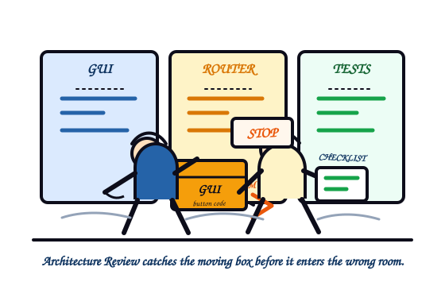
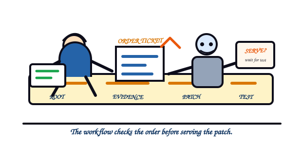
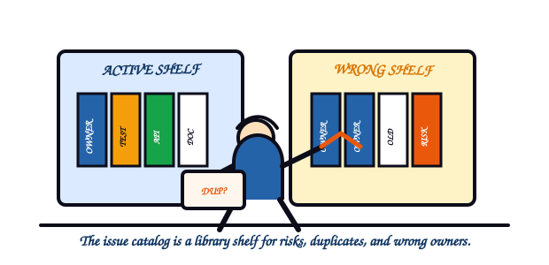
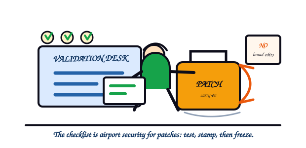

# Architecture Review Help

Architecture Review is the first safety lens in the KANDA Reasoner desktop GUI. It identifies architectural risks before a human or AI patches the wrong file, crosses a box boundary, or trusts stale project structure.

Image note:

- Subject: Architecture Review catching wrong owner-box placement.
- Asset path: `assets/drawings/architecture_review_opener.svg`.
- Alt text: Colorful moving-day cartoon where Architecture Review stops a GUI box from entering the Router room.
- Caption: Architecture Review catches the moving box before it enters the wrong room.
- Prompt summary: colorful hand-drawn editorial cartoon, daily-life moving-day metaphor, expressive figures, flat KANDA blue/orange teaching colors, visible hatching, original scene only.
- Density-rule justification: this is the chapter-opener drawing for a large help file with 25 issue families.

## What Problem This Solves

**Technical:** Architecture Review reads project structure, import evidence, symbol ownership, boundary metadata, test links, and generated artifact contracts. It turns that evidence into named issue families that can be validated before any patch is accepted.

**In plain English:** The tool is a map reader. It helps you see when the project has two roads with the same name, a file living in the wrong neighborhood, or a test that protects the wrong thing.

## How The Workflow Works

Image note:

- Subject: Architecture Review workflow sequencing.
- Asset path: `assets/drawings/architecture_review_workflow_cafe.svg`.
- Alt text: Colorful cafe cartoon where the Architecture Review workflow checks an order ticket before serving a patch.
- Caption: The workflow checks the order before serving the patch.
- Prompt summary: colorful daily-life cafe counter metaphor, order ticket as evidence, robot waiting to serve patch, flat KANDA colors, original scene only.
- Density-rule justification: this drawing explains the workflow section, separate from the issue catalog and checklist.

1. Load the Architecture Review tab.
2. Select or confirm the project root.
3. Run the architecture review.
4. Read each issue as an evidence-backed warning, not as an automatic command.
5. Fix narrowly in the owning box.
6. Validate with focused tests before freezing any milestone.

## Authority Boundary

Architecture Review reports architecture risks. It does not change files, approve patches, select prompts, freeze features, or override routing logic.

## Complete Issue Family Catalog

Image note:

- Subject: Architecture Review issue families as risk categories.
- Asset path: `assets/drawings/architecture_review_issue_catalog_library.svg`.
- Alt text: Colorful library cartoon where duplicate and misplaced books represent architecture issue families.
- Caption: The issue catalog is a library shelf for risks, duplicates, and wrong owners.
- Prompt summary: colorful daily-life library shelf metaphor, duplicate books and wrong shelf risks, expressive reviewer, flat KANDA colors, original scene only.
- Density-rule justification: this drawing anchors the 25 issue-family catalog, which is the largest section of the help file.

Each issue family uses the same explanation contract:

- **Technical:** what evidence and detector code identify.
- **In plain English:** what a non-specialist should understand before touching code.
- **Further reading:** local anchors to the source map. The rendered desktop file stays local-only and does not load remote resources.

### 1. Duplicate public symbols

**Technical:** Check `symbol_index`, `web_ai_symbol_index`, `primary_definition_index`, and `DUPLICATE_PUBLIC_SYMBOL`.

**In plain English:** Two active files wear the same public name, so the wrong one can be edited.

> **Further reading:** Architecture boundaries; Python public names.

### 2. Symbol shadowing

**Technical:** Check `files`, `source_file_index`, `symbol_index`, `imports`, and `SYMBOL_SHADOWING`.

**In plain English:** A local label hides another label with the same spelling.

> **Further reading:** Python import system; Python public names.

### 3. Wrong owner box

**Technical:** Check `web_ai_file_responsibility_index`, `boundary_index`, `semantic_roles`, and `WRONG_OWNER_BOX`.

**In plain English:** Useful code lives in the wrong drawer.

> **Further reading:** Architecture boundaries; secure design reviews.

### 4. Cross-box boundary violations

**Technical:** Check `import_graph`, `call_edges`, `boundary_violation_index`, and `CROSS_BOX_BOUNDARY_VIOLATION`.

**In plain English:** One part of the app touches private controls owned by another part.

> **Further reading:** Architecture boundaries; secure architecture.

### 5. Circular imports

**Technical:** Check `import_graph`, `module_summary_index`, and `CIRCULAR_IMPORT`.

**In plain English:** File A waits for File B while File B waits for File A.

> **Further reading:** Python import system; architecture boundaries.

### 6. Side effect on import

**Technical:** Check `source_file_index`, `call_edges`, `entry_points_detail`, and `SIDE_EFFECT_ON_IMPORT`.

**In plain English:** Looking at a file should not launch work or change state.

> **Further reading:** Python import system; testing reliability.

### 7. Mixed responsibility files

**Technical:** Check `web_ai_file_responsibility_index`, `semantic_roles`, `symbol_index`, and `MIXED_RESPONSIBILITY_FILE`.

**In plain English:** One file has too many jobs.

> **Further reading:** Architecture boundaries; secure design reviews.

### 8. Stale or deprecated variants

**Technical:** Check `canonical_conflict_index`, `legacy_shadow_hotspots`, `STALE_VARIANT_SOURCE_OF_TRUTH`, and `DEPRECATED_VARIANT_STILL_REFERENCED`.

**In plain English:** Old signs still point to closed roads.

> **Further reading:** Architecture boundaries; testing reliability.

### 9. Misplaced tests

**Technical:** Check `test_links`, `web_ai_test_protection_index`, and `MISPLACED_TEST`.

**In plain English:** A test exists but protects the wrong target.

> **Further reading:** Testing reliability; Python import system.

### 10. Test protection gap

**Technical:** Check `web_ai_test_protection_index`, `test_links`, and `TEST_PROTECTION_GAP`.

**In plain English:** Important behavior can break without any test noticing.

> **Further reading:** Testing reliability; secure design reviews.

### 11. Unsafe path and platform assumptions

**Technical:** Check `collection_config`, `packaging_metadata`, and `UNSAFE_PATH_PLATFORM_ASSUMPTION`.

**In plain English:** The tool may work only on one machine.

> **Further reading:** Python import system; secure design reviews.

### 12. Canonical vs working-copy boundary errors

**Technical:** Check `persistence_io_index`, `call_edges`, and `CANONICAL_WORKING_COPY_BOUNDARY`.

**In plain English:** An experiment can overwrite the source of truth.

> **Further reading:** Secure design reviews; architecture boundaries.

### 13. Generated artifact contract errors

**Technical:** Check route manifests, split manifests, and `GENERATED_ARTIFACT_CONTRACT`.

**In plain English:** A generated file may exist but be shaped incorrectly.

> **Further reading:** Testing reliability; secure design reviews.

### 14. Public API instability

**Technical:** Check `__all__`, `symbol_index`, `call_edges`, and `PUBLIC_API_INSTABILITY`.

**In plain English:** Callers can still depend on the old public door.

> **Further reading:** Python public names; architecture boundaries.

### 15. Dead code and unreachable files

**Technical:** Check `import_graph`, `call_edges`, `entry_points_detail`, and `DEAD_CODE_UNREACHABLE_FILE`.

**In plain English:** Old machinery remains in the project and adds noise.

> **Further reading:** Python import system; testing reliability.

### 16. Inconsistent source of truth

**Technical:** Check documentation intent, `web_ai_file_responsibility_index`, `source_file_index`, and `STALE_VARIANT_SOURCE_OF_TRUTH`.

**In plain English:** Two official-looking instructions disagree.

> **Further reading:** Architecture boundaries; secure design reviews.

### 17. Test asserts internal detail

**Technical:** Check `control_flow`, `runtime_trace_raw`, and `TEST_ASSERTS_INTERNAL_DETAIL`.

**In plain English:** The test checks private construction instead of public behavior.

> **Further reading:** Testing reliability; Python public names.

### 18. Import heaviness and slow startup risk

**Technical:** Check `import_graph`, `module_centrality_index`, and `IMPORT_HEAVINESS_STARTUP`.

**In plain English:** A small import pulls in heavy machinery too early.

> **Further reading:** Python import system; testing reliability.

### 19. Bundle safety issues

**Technical:** Check the bundle manifest, changed-file list, and `BUNDLE_SAFETY`.

**In plain English:** A small patch arrives with unrelated changes.

> **Further reading:** Testing reliability; secure design reviews.

### 20. Project-wide AI confusion risks

**Technical:** Check `canonical_conflict_index`, `responsibility_overlap_index`, `primary_definition_index`, and `PROJECT_WIDE_AI_CONFUSION`.

**In plain English:** The project contains too many convincing wrong answers.

> **Further reading:** Architecture boundaries; Python public names.

### 21. Cross-box public symbol collision

**Technical:** Check `symbol_index`, `boundary_index`, `web_ai_file_responsibility_index`, and `CROSS_BOX_PUBLIC_SYMBOL_COLLISION`.

**In plain English:** Two boxes expose the same public label.

> **Further reading:** Python public names; architecture boundaries.

### 22. Shared mutable state coupling

**Technical:** Check `attribute_state_map`, `object_ownership`, `state_mutation_index`, and `SHARED_MUTABLE_STATE_COUPLING`.

**In plain English:** One area can silently change state that another area depends on.

> **Further reading:** Architecture boundaries; secure architecture.

### 23. Inconsistent error contract at boundaries

**Technical:** Check `call_edges`, `control_flow`, `runtime_trace_raw`, and `BOUNDARY_ERROR_CONTRACT`.

**In plain English:** Failure reporting changes depending on which box is speaking.

> **Further reading:** Secure design reviews; testing reliability.

### 24. Tests assert implementation internals instead of public contracts

**Technical:** Check `test_links`, `source_file_index`, `symbol_index`, and `TEST_ASSERTS_INTERNAL_DETAIL`.

**In plain English:** Safe refactors can break tests while real user-visible failures are missed.

> **Further reading:** Testing reliability; Python public names.

### 25. Missing __all__ or uncontrolled public surface

**Technical:** Check `source_file_index`, `__all__`, `symbol_index`, `MISSING___ALL___FOR_EXPOSES`, and `MISSING_PUBLIC_SURFACE_CONTROL`.

**In plain English:** Private helpers can become accidental public API.

> **Further reading:** Python public names; Python import system.

## Further Reading Map

- Architecture boundaries: Martin Fowler, Software Architecture Guide.
- Python import system: Python language reference, The import system.
- Python public names: Python language reference, Simple statements.
- Testing reliability: Google SRE, Testing for Reliability.
- Secure design reviews: OWASP Secure by Design Framework.
- Secure architecture: OWASP SAMM Secure Architecture.

## Operational Checklist

Image note:

- Subject: Architecture Review validation and freeze checklist.
- Asset path: `assets/drawings/architecture_review_checklist_airport.svg`.
- Alt text: Colorful airport check-in cartoon where a patch suitcase cannot board until tests and freeze evidence are stamped.
- Caption: The checklist is airport security for patches: test, stamp, then freeze.
- Prompt summary: colorful daily-life airport check-in metaphor, patch suitcase, validation desk, no broad edits sign, flat KANDA colors, original scene only.
- Density-rule justification: this drawing explains the final operational checklist and validation boundary.

- Confirm the project root and source label before loading the tool.
- Read the issue code and evidence before deciding what owns the fix.
- Do not treat an issue report as permission for broad refactoring.
- Run focused tests after any architecture repair.
- Freeze only after validation evidence is clean and current.

## Validation Rule

The help document must remain local-only: Markdown source, deterministic HTML/CSS, original local drawings and diagrams, no remote resources in rendered files, and a desktop Qt renderer with safe fallbacks.
