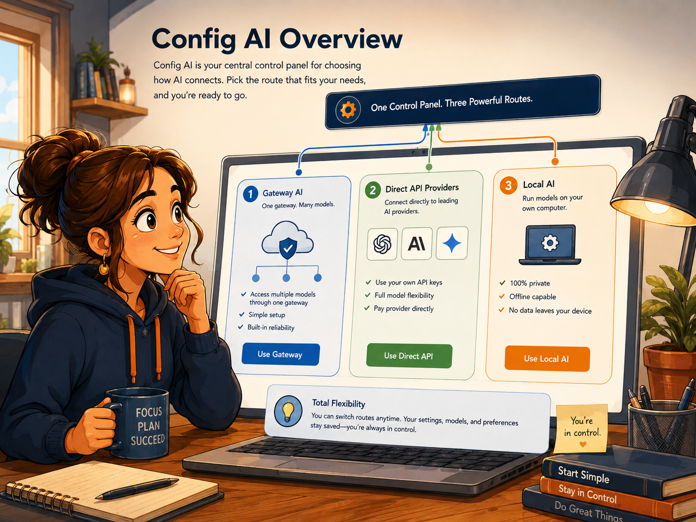
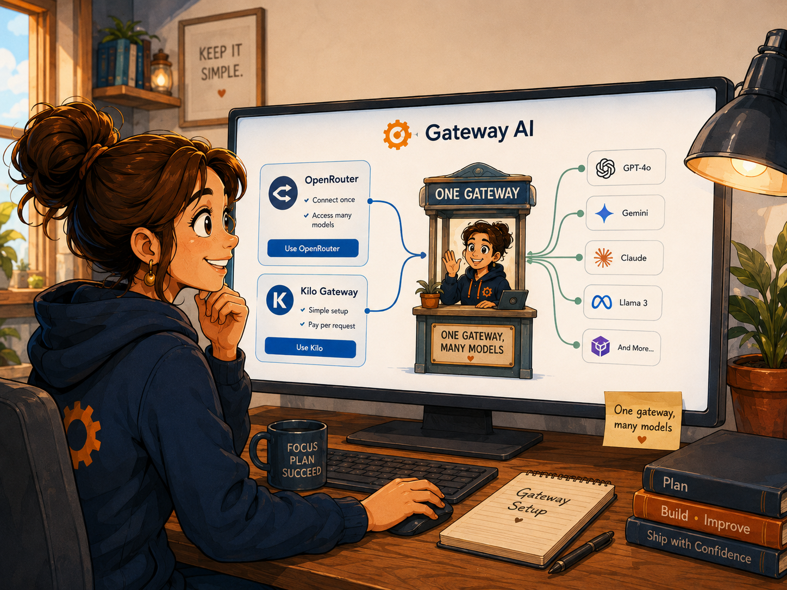
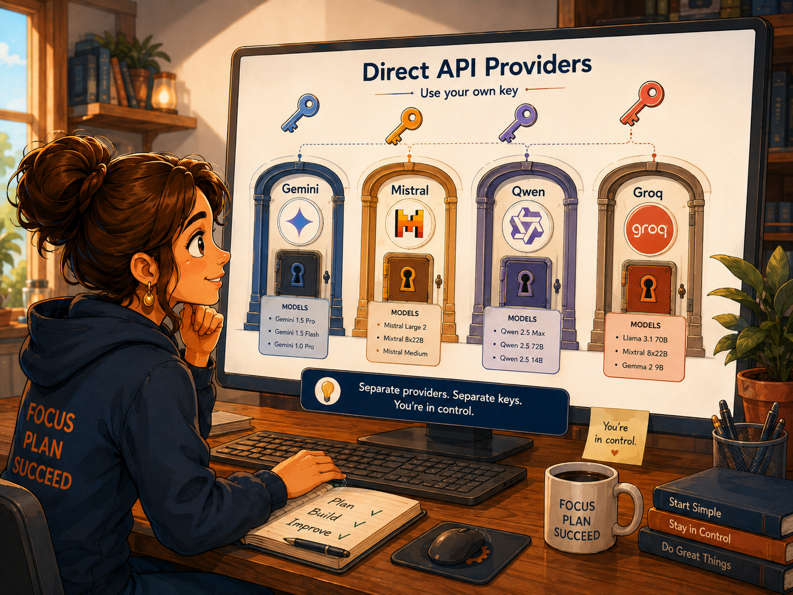
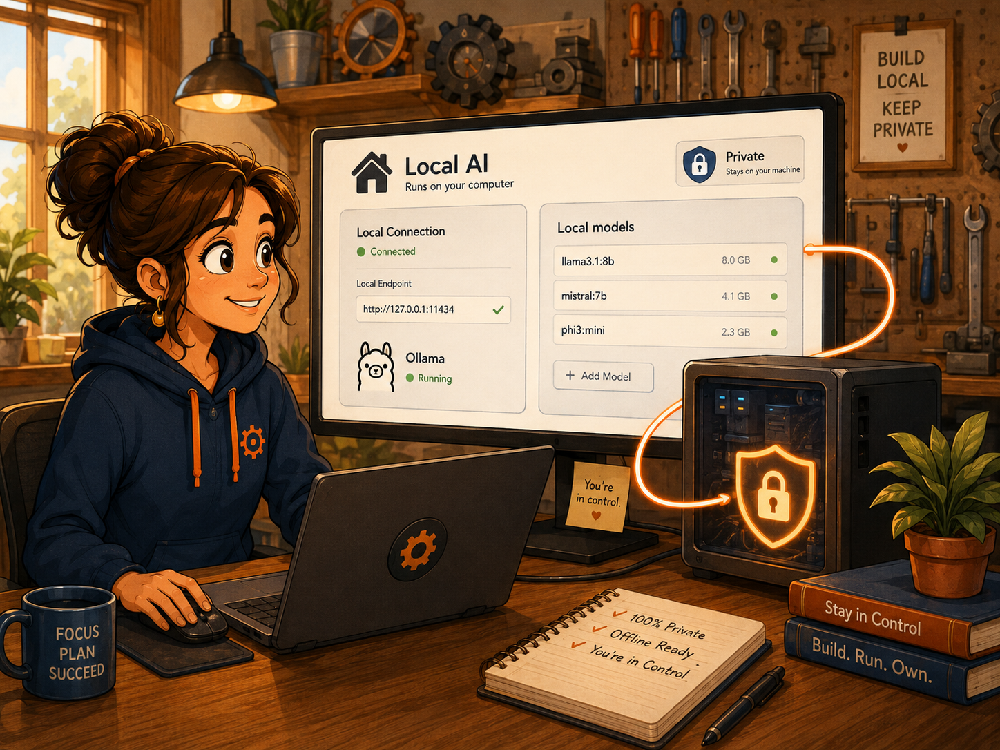
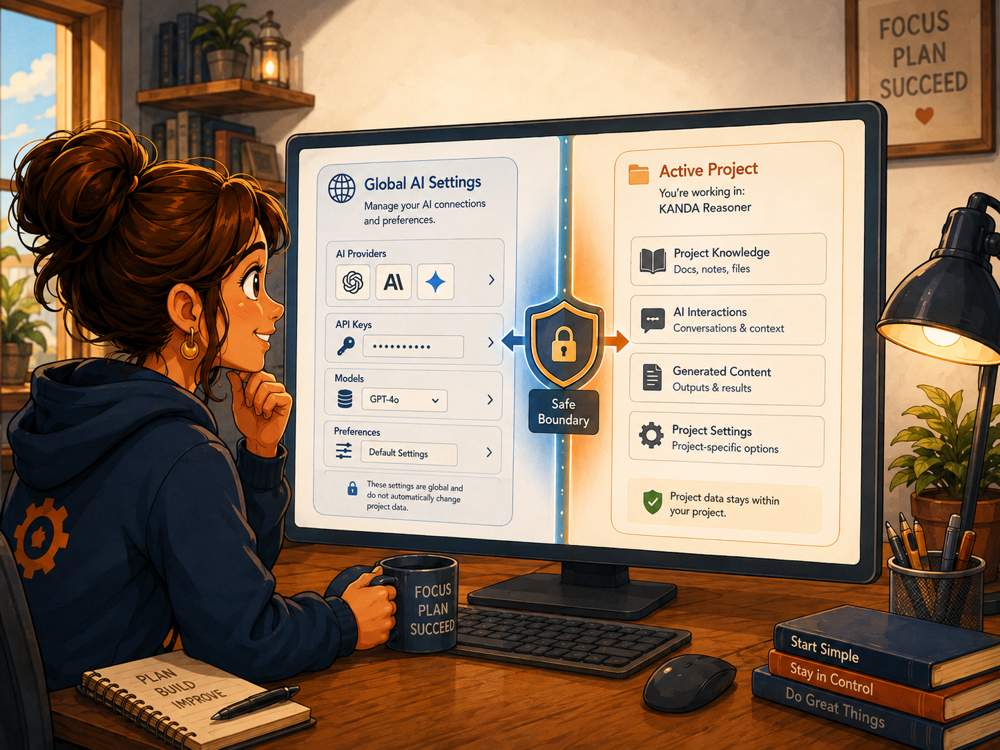

# Config AI

Audience: a first-time KANDA Reasoner user who may never have configured an AI service before.

Purpose: explain, in plain English, how to connect KANDA Reasoner to gateway Web AI, direct provider APIs, and a Local AI runtime; how to select a model; how to use the selected configuration; and how to avoid accidental charges or privacy mistakes.

<!--
Artwork metadata — maintainer only
1. Subject: Config AI as a household control desk routing three kinds of AI connection.
   Asset: assets/drawings/config_ai_opener_control_desk.png
   Format: PNG, 1448x1086 source; full-width opener.
   Alt: Friendly guide at a colorful control desk routing Gateway, Direct API, and Local AI tickets.
   Caption: Choose one route, prepare its key or local runtime, then select the model you want to use.
   Prompt summary: hand-drawn daily-life service desk with three clearly labeled lanes, navy/orange/blue palette, friendly people, imperfect linework, hand lettering.
   Density justification: required opener for a comprehensive help file.
   Analogy: a station information desk sends each traveler to the correct lane.
   Artwork status: uploaded_existing_png.
   Visual inspection: passed — visible characters, everyday objects, uneven strokes, hand-lettered labels, no stock-vector look.
2. Subject: Gateway setup through OpenRouter or Kilo.
   Asset: assets/drawings/config_ai_gateway_key_counter.png
   Format: PNG, 1448x1086 source; section illustration.
   Alt: A ticket counter where OpenRouter and Kilo keys open a shared gateway to approved free models.
   Caption: A gateway is one front desk that can lead to several approved models.
   Prompt summary: warm railway ticket counter, key cards, model departure board, two users, navy/orange accents.
   Density justification: explains the complete Config Web AI section.
   Analogy: one ticket counter gives access to several destinations.
   Artwork status: uploaded_existing_png.
   Visual inspection: passed.
3. Subject: Direct API setup for Gemini, Mistral, Qwen, and Groq.
   Asset: assets/drawings/config_ai_direct_provider_keyring.png
   Format: PNG, 1448x1086 source; section illustration.
   Alt: A key shop with four labeled provider doors and a safety meter for free access.
   Caption: Each direct provider has its own key, account rules, free limit, and model catalog.
   Prompt summary: hand-drawn key shop, four doors, quota meter, friendly clerk, bold handwritten labels.
   Density justification: explains four distinct direct providers in one coherent section.
   Analogy: separate building doors need separate keys.
   Artwork status: uploaded_existing_png.
   Visual inspection: passed.
4. Subject: Local AI setup with a local OpenAI-compatible runtime.
   Asset: assets/drawings/config_ai_local_home_workshop.png
   Format: PNG, 1448x1086 source; section illustration.
   Alt: A home workshop computer serving local models while an unplugged cloud remains outside.
   Caption: Local AI works through a runtime running on your own computer.
   Prompt summary: cozy workshop, desktop computer, small server tower, model cards, unplugged cloud outside the window.
   Density justification: explains Config Local AI and local privacy expectations.
   Analogy: a home workshop runs its own tools instead of visiting a remote service.
   Artwork status: uploaded_existing_png.
   Visual inspection: passed.
5. Subject: Using the selected configuration and respecting the Tool-versus-Project boundary.
   Asset: assets/drawings/config_ai_use_and_safety_bridge.png
   Format: PNG, 1448x1086 source; section illustration.
   Alt: A bridge from global AI settings to a selected project conversation with a human approval gate.
   Caption: Config AI chooses the connection; each workflow still chooses the Project and asks for approval when required.
   Prompt summary: bridge checkpoint, global settings backpack, project folder, approval gate, friendly guard, hand lettering.
   Density justification: explains use after configuration, safety boundaries, and troubleshooting.
   Analogy: a travel pass chooses the transport, but every trip still needs the correct destination and checkpoint.
   Artwork status: uploaded_existing_png.
   Visual inspection: passed.
-->

<figure class="chapter-drawing chapter-opener-wide">

<figcaption>Choose one route, prepare its key or local runtime, then select the model you want to use.</figcaption>
</figure>

## The simple idea

Config AI is the control center for **how KANDA Reasoner reaches an AI model**.

It answers three practical questions:

1. Do you want to use an online model through a gateway?
2. Do you want to connect directly to one official provider?
3. Do you want to use a model running on your own computer?

Config AI does not choose the active Project, does not decide what source evidence is sent, and does not grant permission to write files. It stores application-level connection and model choices. The exact Project and request are still chosen by the workflow that uses AI.

i

<strong>Best first-time choice:</strong> configure one provider, refresh its model list, select one model, and send one short non-sensitive test question before configuring anything else.

## How To Use This

1. Decide whether you want **Config Web AI**, **Direct API Providers**, or **Config Local AI**.
2. Prepare the required API key or start your local AI runtime.
3. Select the provider and load its model catalog.
4. Select one approved model.
5. Open Web AI or Local AI and send a small test question.
6. Read the status message if the request fails; most first-time problems are a missing key, an exhausted free quota, or a local runtime that is not running.

## Which option should a first-time user choose?

### Choose Config Web AI when

- you want one gateway that can expose several models;
- you already have an OpenRouter or Kilo account;
- you want KANDA to show only approved free Python-coding models from that gateway;
- you are comfortable sending the approved request to a remote service.

### Choose Direct API Providers when

- you specifically want Gemini, Mistral, Qwen, or Groq;
- you have an official API key for that provider;
- you understand that each provider has its own free-tier rules and rate limits;
- you want the request to go directly to that provider instead of through OpenRouter or Kilo.

### Choose Config Local AI when

- you have a local OpenAI-compatible runtime such as Ollama running on your computer;
- you want the model to run locally;
- you understand that local speed and quality depend on your computer and installed model;
- you do not need a remote provider for that task.

You can configure more than one route. Only the route selected for the current conversation is used.

## Before you begin: what an API key is

An API key is a secret text value that lets an application use your provider account. Treat it like a password.

In KANDA:

- a pasted key is kept only for the current application session;
- a loaded environment key is read from the process or your Windows User environment;
- the key remains masked in the field;
- KANDA does not intentionally save or log the secret;
- closing KANDA clears session-only keys.

Never paste a key into a question, chat message, screenshot, issue report, source file, or Project document.

!

<strong>API keys are secrets.</strong> KANDA masks the key field, but your clipboard, screenshots, and other applications are outside KANDA's control.

## Two ways to provide a key

### Method 1: paste the key for this session

1. Open the correct Config AI subtab.
2. Select the provider.
3. Paste the key into the **API key** field.
4. Click **Use Key / Load Environment**.
5. Confirm that the Credential row says a key is loaded for this session.

This is the easiest first-time method. You must repeat it after restarting KANDA.

### Method 2: use a Windows User environment variable

Each provider has an expected variable name:

| Provider | Environment variable |
|---|---|
| OpenRouter | `OPENROUTER_API_KEY` |
| Kilo | `KILO_API_KEY` |
| Google Gemini | `GEMINI_API_KEY` |
| Mistral | `MISTRAL_API_KEY` |
| Qwen / Alibaba Cloud Model Studio | `DASHSCOPE_API_KEY` |
| Groq | `GROQ_API_KEY` |

Plain-English Windows steps:

1. Open the Windows Start menu.
2. Search for **environment variables**.
3. Open **Edit environment variables for your account**.
4. Under User variables, click **New**.
5. Enter the exact variable name from the table.
6. Paste the API key as the value.
7. Save the dialogs.
8. In KANDA, leave the API-key field empty and click **Use Key / Load Environment**.
9. If KANDA does not find the new variable, close and reopen KANDA, then try again.

## Config Web AI: OpenRouter and Kilo

<figure class="section-drawing">

<figcaption>A gateway is one front desk that can lead to several approved models.</figcaption>
</figure>

Config Web AI is the gateway configuration page. A gateway is like one front desk that can lead to several model providers.

### Controls on this page

#### Gateway

Select either **OpenRouter** or **Kilo AI Gateway**.

Changing the gateway changes which API key, model catalog, privacy notice, and availability rules apply.

#### API key

Paste a session-only key here, or leave the field empty when loading an environment variable.

#### Use Key / Load Environment

This button has two behaviors:

- field contains text: use the pasted key for this session;
- field is empty: load the selected gateway's environment variable.

#### Credential

This line tells you whether KANDA currently has a usable key and where it came from. It never shows the actual secret.

#### Model

After refreshing the catalog, select one approved model. KANDA does not automatically substitute a different model when the selected model is unavailable.

#### Refresh Models

Requests the current model list from the selected gateway. The list is then filtered so that only approved zero-cost Python-coding models are visible.

#### Free models only

This is locked on. It is a safety rule, not a preference. KANDA's strict free-only configuration does not intentionally show paid models in this catalog.

#### Catalog status

Shows whether the list is loading, loaded, empty, or failed. It may also show how many gateway models were examined and how many were approved.

#### Capabilities

Shows useful facts such as context-window size and whether structured output is known to be supported.

#### Privacy

Summarizes that the request is remote and may be processed or retained under the selected gateway and upstream provider policies.

### OpenRouter setup

1. Create or sign in to an OpenRouter account.
2. Create an API key in the OpenRouter key settings.
3. In KANDA, open **Config AI > Config Web AI**.
4. Select **OpenRouter**.
5. Paste the key, or configure `OPENROUTER_API_KEY`.
6. Click **Use Key / Load Environment**.
7. Click **Refresh Models**.
8. Select one visible `[FREE]` Python-coding model.
9. Read the Privacy and Capabilities rows.
10. Open **Web AI > Web Advisory Config**, choose **Gateway**, **OpenRouter**, and the selected model.

Important: OpenRouter's free-model availability and limits can change. A model being labeled free does not mean unlimited, private, or suitable for production use.

### Kilo AI Gateway setup

1. Open **Config AI > Config Web AI**.
2. Select **Kilo AI Gateway**.
3. Try **Refresh Models**. KANDA currently allows the gateway's available anonymous free route when supported.
4. If your Kilo setup requires an account key, create one in Kilo Gateway and paste it or configure `KILO_API_KEY`.
5. Click **Use Key / Load Environment** when using a key.
6. Refresh the catalog and choose one approved free model.
7. Open **Web AI > Web Advisory Config**, choose **Gateway**, **Kilo AI Gateway**, and the selected model.

A free Kilo platform account and a free inference model are not the same thing. Always check the current model and usage status before sending important work.

## Direct API Providers: the shared setup pattern

<figure class="section-drawing">

<figcaption>Each direct provider has its own key, account rules, free limit, and model catalog.</figcaption>
</figure>

Direct API Providers connects KANDA to an official provider without OpenRouter or Kilo.

All four direct providers follow the same basic sequence:

1. Select the provider.
2. Obtain the provider's official API key.
3. Paste the key or load the correct environment variable.
4. Leave the official Base URL unchanged unless you have a specific, verified reason to change it.
5. Keep the Free access guard checked only when your account really satisfies the statement beside it.
6. Click **Refresh Approved Models**.
7. Select a Python model.
8. Read Catalog status, Capabilities, Privacy, and the final status line.
9. In **Web AI > Web Advisory Config**, select **Direct API**, that provider, and the selected model.

### Direct provider control reference

#### Direct provider

Chooses Gemini, Mistral, Qwen, or Groq. Selecting a name in the list displays that provider. Using the key, changing the Base URL, toggling the guard, or refreshing models activates it in the shared configuration.

#### Base URL

This is the official API address. First-time users should leave it unchanged.

Only advanced users with an official regional or organization-specific endpoint should edit it. KANDA requires a valid HTTPS URL and rejects credentials or fragments inside the URL.

#### Free access guard

The guard is a statement from you to KANDA. It does not inspect your billing account and does not turn on a provider's free mode.

When checked, you are confirming that the provider account meets the displayed free-access condition. When unchecked, KANDA blocks chat readiness for that provider.

#### Refresh Approved Models

Loads or constructs the provider catalog and then shows only models allowed by KANDA's free Python-coding policy.

### Google Gemini API

Use this when you want a direct Gemini model.

1. Create or view a Gemini API key in Google AI Studio.
2. Keep the Google project on the unbilled Free Tier when you intend strict free-only use.
3. In KANDA, select **Google Gemini API**.
4. Paste the key or configure `GEMINI_API_KEY`.
5. Click **Use Key / Load Environment**.
6. Keep **Require an unbilled Gemini Free Tier project** checked only when that statement is true.
7. Click **Refresh Approved Models**.
8. Select a visible Gemini model.

Common Gemini message:

- `429 RESOURCE_EXHAUSTED`: the request reached Gemini, but the current request, token, or daily quota was exceeded. Wait for the retry period or select another configured provider/model. This is not a broken Send button.

Privacy warning: Gemini Free Tier content may be used by Google to improve products under its current terms. Do not send sensitive Project source unless that policy is acceptable to you.

### Mistral API Free Mode

1. Create or sign in to a Mistral account.
2. Activate Mistral Studio in Free mode.
3. Create an API key.
4. In KANDA, select **Mistral API Free Mode**.
5. Paste the key or configure `MISTRAL_API_KEY`.
6. Click **Use Key / Load Environment**.
7. Confirm **Require Mistral Free mode** only while the account is actually in Free mode.
8. Refresh and select one approved model.

Mistral Free mode has limited usage and rate limits. KANDA does not authorize a paid fallback.

### Qwen API Free Quota

1. Create or sign in to Alibaba Cloud Model Studio.
2. Create a general Model Studio API key for the region and service you intend to use.
3. Enable **Free Quota Only** where the official console offers it and where it applies.
4. In KANDA, select **Qwen API Free Quota**.
5. Paste the key or configure `DASHSCOPE_API_KEY`.
6. Click **Use Key / Load Environment**.
7. Confirm **Require Qwen Free Quota Only** only when the account and selected model are protected by that setting.
8. Refresh and select one approved Qwen coding model.

Qwen free quota can depend on account, model, region, activation date, and remaining quota. A subscription-specific or coding-plan key may follow different billing rules from a general Model Studio key. Use the official key type that matches KANDA's displayed Base URL and your intended free-quota setup.

### Groq API Free Plan

1. Create or sign in to GroqCloud.
2. Create an API key in Groq Console.
3. Keep the organization on the Free Plan when you intend strict free-only use.
4. In KANDA, select **Groq API Free Plan**.
5. Paste the key or configure `GROQ_API_KEY`.
6. Click **Use Key / Load Environment**.
7. Confirm **Require a Groq Free Plan organization** only when true.
8. Refresh and select one approved model.

Groq uses request and token rate limits. A 429 response normally means a rate limit was reached. Wait for the provider's reset or use another configured provider.

## Config Local AI

<figure class="section-drawing">

<figcaption>Local AI works through a runtime running on your own computer.</figcaption>
</figure>

Config Local AI sets one global local endpoint and one global local model for KANDA workflows that use Local AI.

### What KANDA expects

KANDA expects an OpenAI-compatible local API. The common Ollama-compatible address is:

`http://127.0.0.1:11434/v1`

KANDA does not install the runtime, start it, or download a model. Those steps happen in the local runtime itself.

### First-time local setup

1. Install and start your chosen OpenAI-compatible local runtime.
2. Download or make available at least one chat model in that runtime.
3. Open **Config AI > Config Local AI**.
4. Leave the Base URL on `http://127.0.0.1:11434/v1` when using the normal local Ollama address.
5. Click **Refresh Local AI Models**.
6. Select a model in **Global Local AI model**.
7. Read the Status line and confirm it shows the endpoint and selected model.
8. Open **Local AI** and send a small test question.

### OpenAI-compatible base URL

This is the address where KANDA contacts the local runtime.

- `127.0.0.1` means this computer.
- `11434` is the common Ollama local port.
- `/v1` selects the OpenAI-compatible API shape expected by KANDA.

KANDA normalizes common variations, including a full `/chat/completions` path, back to a stable `/v1` root.

### Refresh Local AI Models

This asks the local runtime which models are currently available. The runtime must be running before this button can succeed.

### Global Local AI model

Select the model you want all Local AI workflows to use. The field is editable so an advanced user can enter a model identifier that the runtime supports, even if it was not returned in the current catalog.

### Local privacy expectations

A local model can keep inference on your computer, but privacy still depends on the runtime, model, extensions, cloud-model features, logging, and network configuration you chose. “Local AI” does not automatically prove that every component is offline.

## How to use the configured model

<figure class="section-drawing">

<figcaption>Config AI chooses the connection; each workflow still chooses the Project and asks for approval when required.</figcaption>
</figure>

### Use a gateway or direct provider in Web AI

1. Configure the provider in Config AI.
2. Open **Web AI**.
3. Open **Web Advisory Config**.
4. Set **Access** to Gateway or Direct API.
5. Select the Provider.
6. Select the Python model.
7. Confirm the Active Project and context information.
8. Open **Project Conversation**.
9. Paste or type your question.
10. Click Send and review the approval dialog when shown.

Config AI chooses the connection and model. Web AI chooses the Active Project and builds the exact Project-aware request.

### Use Local AI

1. Configure the local Base URL and model.
2. Open **Local AI**.
3. Confirm the correct Active Project when the workflow provides a Project selector.
4. Ask a small test question.
5. Read the evidence and status before using the answer for important work.

## What each status means

| Status or symptom | Plain-English meaning | What to do |
|---|---|---|
| API key not configured | KANDA has no usable key for that provider | Paste the correct key or load the correct environment variable |
| Environment variable not found | The selected variable name is missing from the process and Windows User environment | Check the exact variable name; reopen KANDA after creating it |
| Not loaded | No model catalog has been loaded for the active provider | Configure the key if required, then refresh |
| Loading... | KANDA is contacting the provider or runtime | Wait; do not start several refreshes |
| FAILED | The provider/runtime request failed | Read the final status line for the exact reason |
| No approved models | The catalog loaded, but nothing matched KANDA's strict free Python-coding rules | Try another provider or wait for catalog availability to change |
| Credential ready, model missing | The key works, but no model is selected | Refresh and select a model |
| Free access guard unchecked | KANDA is intentionally blocking direct-provider chat readiness | Confirm the account's actual free setting before checking the guard |
| 401 / unauthenticated | The key is missing, incorrect, expired, or for the wrong service | Create or paste the correct key |
| 403 / permission denied | The account, project, region, or key lacks permission | Check the provider console and official setup |
| 429 / rate limit / quota exhausted | The request arrived, but the current free allowance is exhausted | Wait for reset or select another configured provider/model |
| Local connection refused | Nothing is listening at the local Base URL | Start the local runtime and verify its port |
| Local model not listed | The runtime did not report that model | Download/activate the model, refresh, or enter its exact supported ID |

## Common mistakes

- Pasting a Gemini key while Mistral is the displayed provider.
- Clicking Refresh before the required key is loaded.
- Assuming the Free access guard changes provider billing.
- Editing the Base URL without an official reason.
- Assuming a free model has unlimited requests.
- Assuming free means private.
- Expecting KANDA to install or start Ollama.
- Selecting a provider in Config AI but not selecting it again in Web Advisory Config.
- Reading a 429 quota error as a broken Send button.
- Sending secrets or sensitive Project content before reading the Privacy row.

## Good habits

1. Test with a short, non-sensitive question first.
2. Keep only the provider account mode you actually intend to use.
3. Use environment variables for repeated use and session paste for quick testing.
4. Never store keys in Project source.
5. Read the provider's current rate-limit and data-policy pages.
6. Keep a second configured provider for small tasks when the first free quota is exhausted.
7. Use ChatGPT or the primary approved workflow for important Project changes; treat secondary free providers as advisory unless their result is independently verified.
8. Confirm the Active Project before every Project-aware request.

## Tool-versus-Project boundary

Config AI owns global connection settings such as provider, endpoint, key presence, model selection, and free-access confirmation.

It does not own:

- Active Project identity;
- Project Root or Project Support Root;
- source snapshots;
- the exact evidence included in a request;
- approval to send sensitive context;
- permission to write Project files;
- Error Memory or Freeze Memory authority.

Each workflow resolves its own Project and request identity immediately before the call. This separation prevents a global AI setting from silently becoming Project authority.

## Further reading

Local code remains the primary source of truth for what KANDA displays and enforces. For account creation, keys, quotas, and current provider policies, consult the current official documentation:

- OpenRouter: API Keys, Models, Free Models, and FAQ.
- Kilo AI Gateway: Quickstart, Authentication, Models and Providers, and Usage/Billing.
- Google AI for Developers: Gemini API keys, Pricing, Rate limits, and Troubleshooting.
- Mistral Docs: Activate Studio and generate an API key, Free mode, and Usage and limits.
- Alibaba Cloud Model Studio: Get an API key, OpenAI-compatible API, New-user free quota, and Free Quota Only.
- GroqDocs: Quickstart, Models, Rate Limits, Billing FAQs, and Spend Limits.
- Ollama Docs: API Introduction, OpenAI compatibility, and Authentication.

## Validation rule

The Config AI help page must remain local-only, preserve the standard blue-orange book layout, use the same hand-drawn daily-life illustration language as the approved help files, describe only real controls, and never change provider runtime behavior or imply that configuration grants Project write authority.
