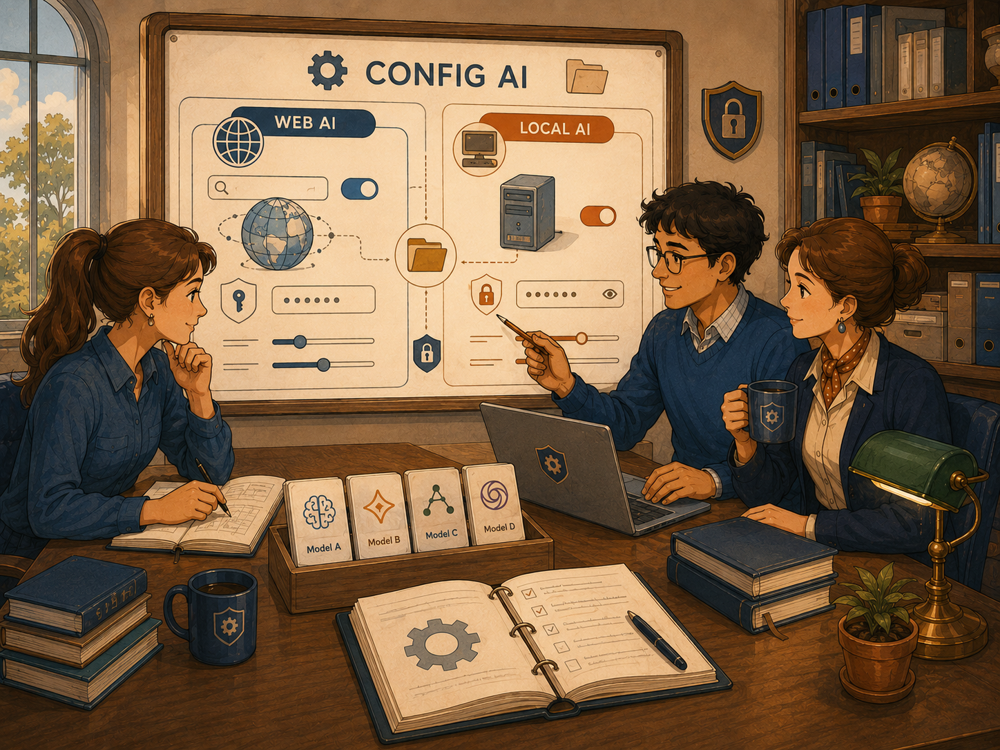
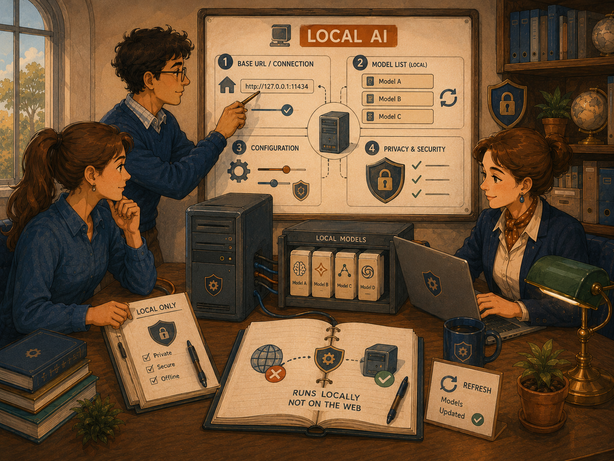
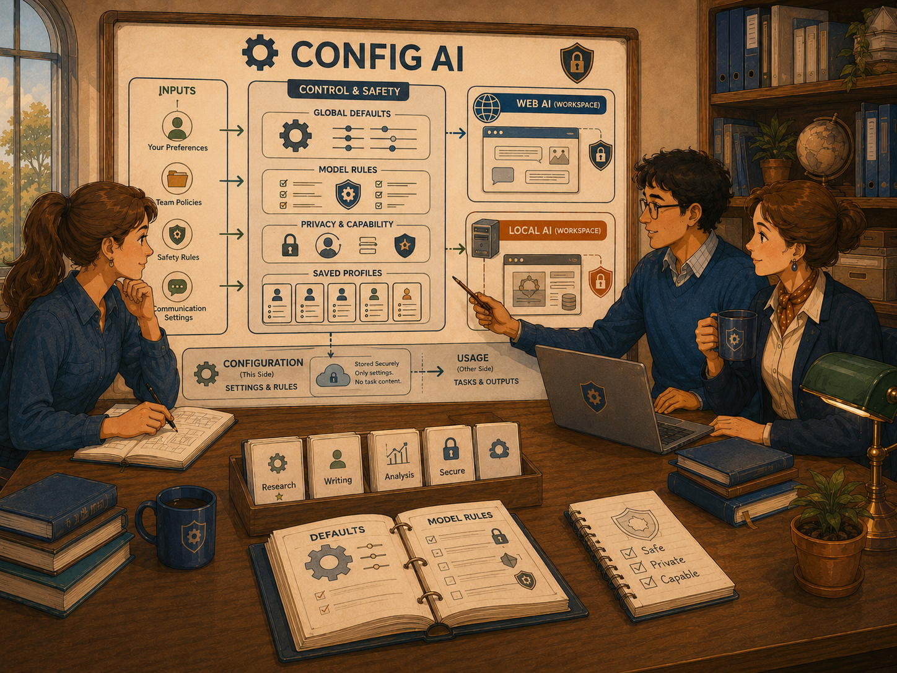

# Config AI

First-Time User Tutorial

Config AI is the central place where KANDA Reasoner stores the global connection and model choices used by Web AI and Local AI workflows. It has two sub-tabs: **Config Web AI** and **Config Local AI**.

Image note:

- Subject: Config AI as the central control desk for Web AI and Local AI.
- Asset path: `assets/drawings/config_ai_opener_global_controls.png`.
- Alt text: Three colleagues review a central configuration board with separate Web AI and Local AI areas, model choices, privacy symbols, and shared global controls.
- Caption: Configure the connection and model once, then let each workflow use those settings with its own active project.
- Artwork status: `primary_contextual_config_ai_raster`.

## What Config AI Means

Config AI is the global settings area for AI connections and model selection.

It does not hold the active project itself.

**In plain English:** Config AI is like the control panel for choosing which AI service KANDA may call and which model it should use. The individual workflow tab still decides which project is active and what exact information is sent for that task.

The two sub-tabs have different jobs:

1. **Config Web AI** controls the web-connected gateway, session credential, model catalog, model selection, capabilities, and privacy information.
2. **Config Local AI** controls the local OpenAI-compatible address and the single global Local AI model.

## What This Tab Does

Config AI lets you:

- choose the Web AI gateway;
- provide a session-only API key;
- load a key from the environment;
- refresh the Web AI model catalog;
- show only free Web AI models;
- select the global Web AI model;
- inspect model capabilities and privacy information;
- set the Local AI base URL;
- refresh locally available models;
- select the global Local AI model;
- see connection and catalog status.

Config AI does not:

- store the active Project Root;
- store the active project identity;
- choose which files a workflow will send;
- approve a project payload;
- grant source-writing authority;
- install or validate code changes.

1

<strong>The safest first-time order is configure one side at a time.</strong> Complete Config Web AI only when you need a web provider. Complete Config Local AI only when a local model service is running.

## Before You Start

Decide which kind of AI you intend to use.

### Use Config Web AI when

- the workflow needs a web-connected provider;
- current external information may be required;
- the selected provider supplies a model catalog;
- an API key or authenticated provider connection is available.

### Use Config Local AI when

- a compatible local model server is already installed and running;
- you know its base URL;
- the model should run through that local endpoint;
- the workflow should use the single global Local AI model.

!

<strong>Do not enter random addresses, keys, or model names.</strong> Config AI is shared global Tool state, so an incorrect setting can affect every KANDA workflow that uses that AI type.

## The Safest First-Time Workflow

### Step 1 - Open the correct sub-tab

Choose either **Config Web AI** or **Config Local AI**.

Do not configure both merely because both are visible.

### Step 2 - Enter only the required connection information

For Web AI, choose the gateway and provide the correct session credential.

For Local AI, enter the actual OpenAI-compatible base URL used by your local model service.

### Step 3 - Refresh the model list

Click the appropriate refresh button.

Wait for the status message.

### Step 4 - Select one model

Choose one model from the populated list.

Do not assume that the first model is the best model for every task.

### Step 5 - Read the status and capability information

Check whether the catalog loaded, a credential was found, and a model is active.

### Step 6 - Return to the workflow tab

The workflow tab will use the global setting but will still resolve its own active project and task context.

## Config Web AI

Image note:

- Subject: Configuring the web gateway, session key, model catalog, current web research, and project context.
- Asset path: `assets/drawings/config_ai_web_configuration.png`.
- Alt text: A team reviews a Config Web AI board showing provider choice, a protected session key, model selection, web search, official sources, and project context.
- Caption: Choose the gateway, load a session credential, refresh the catalog, and inspect the model before using Web AI.
- Artwork status: `primary_contextual_config_ai_raster`.

### Gateway

The **Gateway** field selects the web AI service used by KANDA.

The available choices come from the gateway profiles supported by the application.

A gateway is the service KANDA contacts before it can use a web-connected model.

### API key

The **API key** field accepts a credential for the selected gateway.

The field hides the characters while you type.

The current interface describes this key as **session-only**.

That means the key is kept in memory for the running application session rather than being treated as a permanent project file.

### Load Environment Key

The **Load Environment Key** button looks for the gateway's expected key in:

- the current process environment;
- the Windows User environment.

If the expected environment variable is not found, KANDA shows an information message naming the missing variable.

### Credential

The **Credential** status shows where the current credential came from or whether one is available.

Read this status before trying to refresh models.

### Model

The **Model** field shows the models currently visible in the catalog.

A model entry may display:

- a free marker;
- a readable display name;
- the model identifier.

Selecting a model makes it the global Web AI model used by workflows that rely on Config AI.

### Refresh Models

The **Refresh Models** button asks the selected gateway for its current model catalog.

The button may be disabled while the catalog status is `Loading...`.

### Free models only

The **Free models only** checkbox filters the visible model list.

It is enabled by default in the current interface.

A free model is not automatically private, better, safer, faster, or suitable for every task.

### Catalog status

The **Catalog status** field reports whether the model list is loading, available, unavailable, or affected by an error.

Do not select a model before the catalog has loaded successfully.

### Capabilities

The **Capabilities** field summarizes selected-model information such as:

- whether structured output appears supported;
- context-window size;
- cost label.

`NO/UNKNOWN` does not always mean a capability is impossible. It may mean the catalog does not provide enough information.

### Privacy

The **Privacy** field shows the privacy summary associated with the selected gateway profile.

Read it before sending sensitive material.

### Web AI warning

The Config Web AI page explicitly warns:

- API keys remain in memory only;
- free does not mean private;
- every workflow still requires approval for its exact Project payload.

This warning is a core safety boundary, not decorative text.

## Web AI First-Time Setup

Use this sequence:

1. Select the correct Gateway.
2. Enter the session-only API key or use Load Environment Key.
3. Confirm the Credential status.
4. Leave Free models only enabled for the first catalog test when appropriate.
5. Click Refresh Models.
6. Wait for Catalog status to finish loading.
7. Select one model.
8. Read Capabilities.
9. Read Privacy.
10. Return to the workflow that needs Web AI.

## Config Local AI

Image note:

- Subject: Configuring an OpenAI-compatible local server, refreshing local models, selecting one model, and preserving local privacy boundaries.
- Asset path: `assets/drawings/config_ai_local_configuration.png`.
- Alt text: A team reviews a Local AI configuration board with a loopback base URL, local server, local model list, refresh control, and privacy checks.
- Caption: Point KANDA to the real local model service, refresh the catalog, and select one global Local AI model.
- Artwork status: `primary_contextual_config_ai_raster`.

### OpenAI-compatible base URL

The **OpenAI-compatible base URL** is the address KANDA uses to contact the local model service.

The placeholder shown by the interface is:

`http://127.0.0.1:11434/v1`

This is an example of a local loopback address. It is not proof that your local service uses that exact address.

Use the address provided by your actual local model application or server.

### Global Local AI model

The **Global Local AI model** field shows the current model and the models found by the local service.

The field is editable so a model identifier can remain visible even when it was not returned in the latest catalog.

### Refresh Local AI Models

The **Refresh Local AI Models** button asks the configured local service for its available model list.

The local model service must already be running and reachable.

### Status

The Local AI status area shows:

- catalog status;
- active configuration summary.

Read this after changing the base URL or refreshing models.

### Tool-owned global configuration

The Local AI page explains that this configuration is shared by every KANDA workflow that uses Local AI.

It stores no active:

- Project identity;
- Project Root;
- Project Support path;
- source snapshot;
- write authority.

## Local AI First-Time Setup

Use this sequence:

1. Start the local model service outside KANDA.
2. Confirm the service's OpenAI-compatible base URL.
3. Enter the base URL in Config Local AI.
4. Click Refresh Local AI Models.
5. Read the Status.
6. Select the intended global Local AI model.
7. Return to the workflow that needs Local AI.
8. Confirm that workflow's active project before making a request.

## Tool-versus-Project Boundary

Image note:

- Subject: Global Config AI settings separated from project-specific task context and source authority.
- Asset path: `assets/drawings/config_ai_tool_project_boundary.png`.
- Alt text: A central Config AI board receives preferences and safety rules, then supplies separate Web AI and Local AI workspaces while protected project decisions remain outside the global settings.
- Caption: Config AI stores global connection and model rules. Each workflow still owns its active project and exact request.
- Artwork status: `primary_contextual_config_ai_raster`.

This is the most important concept in Config AI.

### Tool state

Config AI owns global Tool state such as:

- gateway;
- session credential;
- Web AI model;
- free-only filter;
- local base URL;
- Local AI model;
- catalog state.

### Project state

The individual workflow owns project-specific state such as:

- active Project Root;
- selected project identity;
- files or source snapshot;
- exact task request;
- exact payload;
- write authority;
- validation responsibility.

**In plain English:** Config AI chooses the telephone service and the person answering the call. The workflow decides which project is being discussed and what information is allowed into that call.

## What Is Shared Globally

Changing a Config AI setting can affect multiple workflows.

Examples include:

- Local AI chat;
- Web AI chat;
- architecture assistance;
- code or docstring assistance;
- Error Memory assistance;
- Freeze workflow assistance;
- other KANDA tabs that open Config AI.

Do not change the global model during an important workflow without understanding that other tabs may use the new selection.

## Session Keys and Environment Keys

### Session-only key

A session-only key is entered in the Config Web AI field and retained for the running application session.

It should not be placed in source code, help files, screenshots, exported reports, or project JSON.

### Environment key

An environment key is stored outside the project and loaded by name.

This can reduce repeated manual entry.

The environment still needs to contain the exact variable expected by the selected gateway.

### Key safety

Never:

- paste a key into chat history;
- commit a key to Git;
- include a key in a patch ZIP;
- include a key in validation evidence;
- include a key in a screenshot;
- send a key to an unrelated provider.

## Choosing a Model

Choose a model based on the actual task.

Consider:

- web access;
- structured output;
- context window;
- cost;
- speed;
- privacy;
- provider availability;
- code reasoning;
- response quality.

The most expensive model is not automatically the best choice.

A free model is not automatically the safest choice.

A large context window is not proof that the model will use all context correctly.

## What Success Looks Like

### Successful Web AI configuration

- correct gateway selected;
- credential recognized;
- catalog loaded;
- intended model selected;
- capabilities visible;
- privacy summary read;
- workflow can make a Web AI request.

### Successful Local AI configuration

- local service running;
- correct base URL entered;
- local catalog refreshed;
- intended model selected;
- status reports the active configuration;
- workflow can make a Local AI request.

## Common Mistakes

### Entering a project path in Config AI

Config AI does not store the active project.

Use the workflow tab to select or resolve the project.

### Assuming the placeholder URL is always correct

The Local AI placeholder is an example.

Use the real address of the running local service.

### Refreshing Web AI models without a credential

The gateway may reject the request or return no usable catalog.

### Assuming free means private

The interface explicitly warns that free does not mean private.

### Selecting a model without reading capabilities

The model may lack expected structured output, context size, or other requirements.

### Changing the global model during another workflow

Other tabs may immediately use the new global selection.

### Treating Config AI as write authority

Model configuration does not approve source changes.

## If Something Goes Wrong

### Environment key not found

Confirm the expected environment-variable name for the selected gateway.

Make sure it exists in the process or Windows User environment.

Restart KANDA after changing environment variables when necessary.

### Web model catalog does not load

Check:

- gateway;
- credential;
- internet connection;
- provider availability;
- current catalog status.

### No Web AI model is visible

Disable or enable Free models only as appropriate, then refresh again.

Confirm the provider returned models.

### Local model refresh fails

Check:

- local model service is running;
- base URL is correct;
- `/v1` compatibility is supported;
- firewall or security software is not blocking the connection;
- model service exposes an OpenAI-compatible catalog.

### The selected model disappears

The provider or local service may have changed its catalog.

Refresh and select an available model.

### A workflow still reports no model configured

Return to Config AI and confirm the global selection.

Then reopen or refresh the workflow if it cached an older state.

## First-Time Checklist

Before Config Web AI:

- [ ] Correct gateway selected
- [ ] Correct session or environment credential
- [ ] Credential status checked
- [ ] Catalog refreshed
- [ ] Free-only filter understood
- [ ] Model selected
- [ ] Capabilities read
- [ ] Privacy summary read

Before Config Local AI:

- [ ] Local model service installed
- [ ] Local service running
- [ ] Correct OpenAI-compatible base URL
- [ ] Local models refreshed
- [ ] Intended model selected
- [ ] Status checked

Before returning to a workflow:

- [ ] Correct AI type chosen
- [ ] Global model confirmed
- [ ] Active project will be selected in the workflow
- [ ] Exact payload will be reviewed there
- [ ] No source-writing authority assumed
- [ ] Sensitive data rules understood

## Important Safety Boundary

Config AI chooses global connection and model settings.

It does not choose the active project, approve the exact payload, authorize source modification, validate a patch, or freeze behavior.

Each workflow must still:

1. resolve the correct active project;
2. build its own request identity;
3. decide what context is appropriate;
4. preserve human confirmation;
5. validate any resulting change separately.

## Final Rule

**Configure the connection and model globally, but select the project, review the payload, and authorize any source change only inside the specific governed workflow that needs it.**
