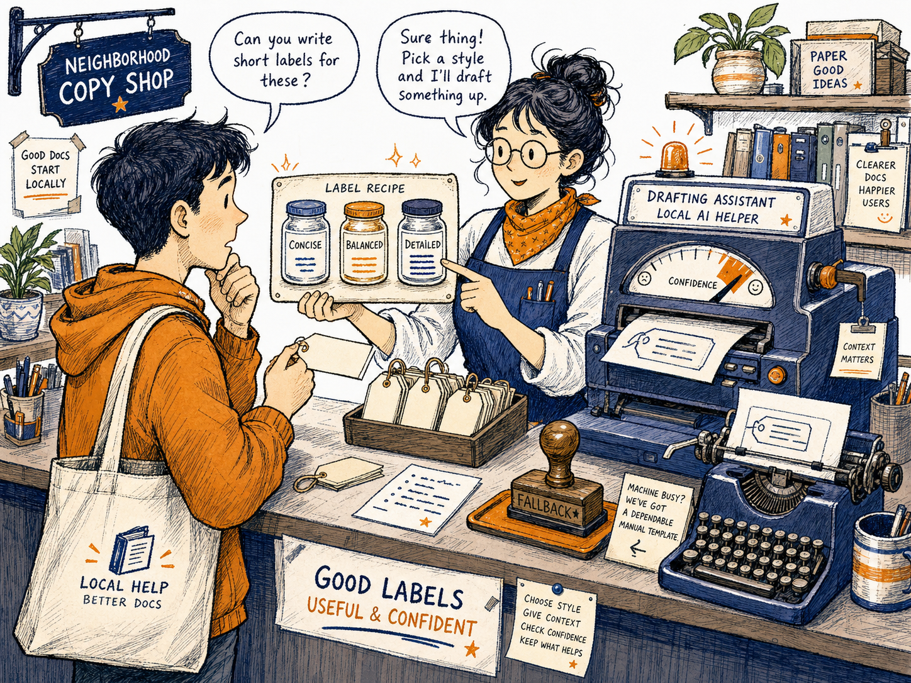
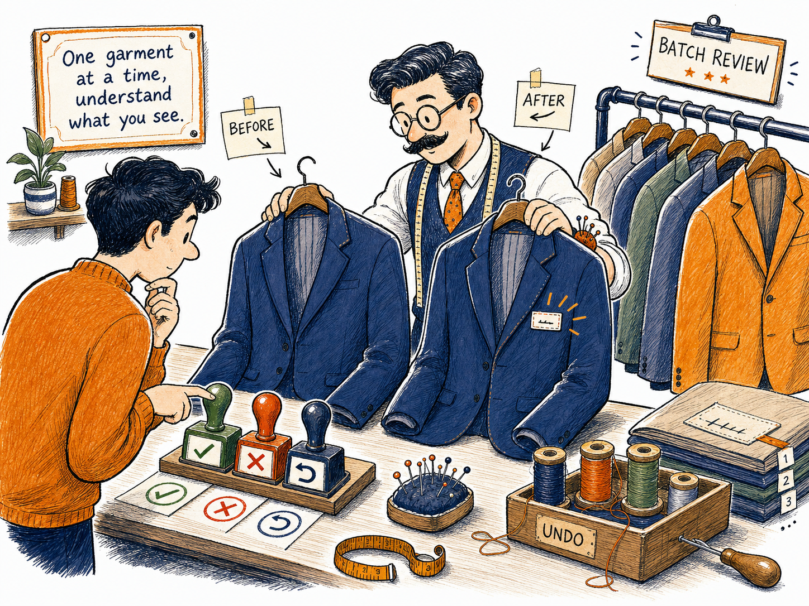
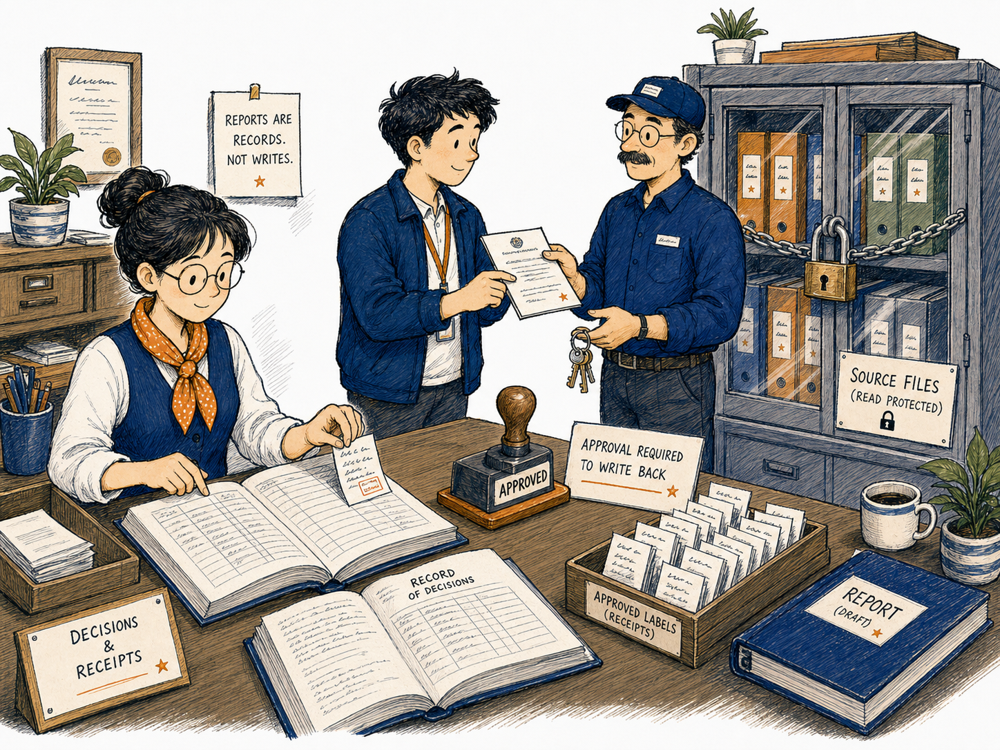

# Docstring Assistant

First-Time User Tutorial

Docstring Assistant helps you find Python code that has no explanation attached to it, prepare safe descriptions, review them, and only write them into source files when you deliberately choose the writing mode.

Image note:

- Subject: Docstring Assistant as a library desk that finds unlabeled books and drafts shelf labels.
- Asset path: `assets/drawings/docstring_assistant_opener_library.png`.
- Alt text: A librarian and an engineer identify books with blank spines, prepare labels, and place them in a review tray before filing them.
- Caption: Find the missing labels, review each suggestion, and write only after you are satisfied.
- Artwork status: `primary_characterful_raster`.

## What Is a Docstring?

A docstring is a short explanation stored inside Python code.

It tells a person, an editor, or another tool what a module, class, function, or method is supposed to do.

For example, a function may calculate a total correctly but still be difficult to understand. A docstring adds a readable explanation without changing the calculation itself.

**In plain English:** A docstring is like the label on a medicine box or the title on a folder. The contents may already be correct, but the label helps you understand what is inside before opening it.

## What This Tab Does

Docstring Assistant can perform three different jobs:

1. **Scan** - find code that is missing docstrings.
2. **Diff** - show the exact text changes that would be made.
3. **Write** - insert validated docstrings into the selected source files.

These jobs are separate on purpose.

Scanning does not write to your code. Previewing a diff does not write to your code. Writing happens only when you choose Write mode and complete the required confirmation.

1

<strong>The safest order is Scan, then Diff, then Write.</strong> Do not begin with Write mode when you are learning the tab.

## Before You Start

Image note:

- Subject: Selecting a small area and scanning it before any writing.
- Asset path: `assets/drawings/docstring_assistant_scan_post_room.png`.
- Alt text: Workers in a sorting room identify parcels with blank labels while the conveyor remains paused.
- Caption: Inspect a small area first. Writing can wait until the review list is correct.
- Artwork status: `primary_characterful_raster`.

Before your first run:

1. Make sure the **Project Root** points to the project you actually want to inspect.
2. Start with a small scope, such as one file or one folder.
3. Choose **Scan** mode.
4. Leave the writing confirmation disabled.
5. Use the default worker count unless you have a reason to change it.
6. Save the report after the scan so you can review the findings.

**Project Root** means the main folder of the project. It is usually the folder that contains the application code, project configuration, and top-level project files.

!

<strong>A wrong Project Root means the wrong project may be scanned.</strong> Stop and correct the path before running anything.

## The Safest First-Time Workflow

Use this exact sequence for your first session.

### Step 1 - Choose Scan mode

Select **Scan** in the Mode field.

Scan mode searches for missing docstrings and produces findings. It does not modify Python files.

**You should see:** messages in the Output area and new rows in the review/report area.

### Step 2 - Choose a small scope

Select one file, one module, or one folder rather than the full project.

Use **Browse** to select the target.

**Why this helps:** A small first run is easier to understand and easier to verify.

### Step 3 - Choose what should be checked

Use the checkboxes for:

- Modules
- Classes
- Functions or methods
- File-address information, when available

For a normal first test, checking modules, classes, and functions or methods is reasonable.

### Step 4 - Run the scan

Click **Run selected mode**.

The Stop button becomes available while the operation is active.

**Do not close the application while the scan is running.**

### Step 5 - Review the findings

Open the review list and select one row at a time.

Look at:

- the file name;
- the symbol name;
- the original source snippet;
- whether a draft exists;
- the current review status.

### Step 6 - Generate one draft

Select one row and click **Generate Draft**.

Do not generate all drafts before you have checked at least one single-row result.

### Step 7 - Compare before and after

Read the **Before Correction** and **After Correction** areas.

The suggested docstring should describe the code accurately. It must not invent behavior that the code does not have.

### Step 8 - Save your decision

Use **Save Review Decision**, **Approve Row**, or **Reject Row** as appropriate.

### Step 9 - Preview the exact diff

After the review looks correct, select **Diff** mode and run it for the same small scope.

The diff is the exact before-and-after source change.

### Step 10 - Write only after approval

Select **Write** mode only after:

- the scan is correct;
- the draft is correct;
- the diff is correct;
- the target path is correct;
- you are ready to modify the source files.

Enable the writing confirmation only at this final stage.

## Run Options

### Mode

The Mode field controls what the run will do.

| Mode | What it does | Changes source files? | First-time recommendation |
|---|---|---:|---|
| Scan | Finds missing docstrings and creates review findings. | No | Start here |
| Diff | Shows the exact changes that would be made. | No | Use after reviewing |
| Write | Inserts validated docstrings into source files. | Yes | Use last |

### Scope

The Scope field controls how much of the project is included.

Possible choices may include:

- Full project
- Package or folder
- Module or file

Use the narrowest scope that can answer your current question.

**In plain English:** Do not inspect the whole hospital when you only need to check one room.

### Target Path

The Target Path identifies the file or folder inside the project that should be processed.

Use **Browse** instead of typing a long path when possible.

Use **Clear** to remove the selected target and return to the broader scope behavior.

### Modules, Classes, and Functions or Methods

These checkboxes decide which types of Python objects should be checked.

- **Module** - the Python file as a whole.
- **Class** - a code structure that groups data and behavior.
- **Function** - a named block of code that performs a task.
- **Method** - a function that belongs to a class.

You do not need to understand Python deeply to use these options. They simply decide which kinds of missing explanations should appear in the report.

### Workers

Workers control how many scanning tasks may run at the same time.

More workers can make a large scan faster, but they do not make the result more accurate.

Use the default value for normal work.

### Run selected mode

Starts the currently selected Scan, Diff, or Write operation.

Always read the selected mode before clicking.

### Stop Running Selected Mode

Requests the active operation to stop.

Stopping may not be instantaneous because the current file or small task may need to finish safely first.

## AI Assistance

Image note:

- Subject: AI assistance as a drafting service with a dependable fallback.
- Asset path: `assets/drawings/docstring_assistant_ai_copy_shop.png`.
- Alt text: A copy shop prepares short, balanced, and detailed labels while a manual typewriter remains available as a fallback.
- Caption: AI prepares a draft. You remain responsible for deciding whether it is correct.
- Artwork status: `primary_characterful_raster`.

AI assistance can prepare draft docstrings for review.

It does not replace your decision.

### Enable AI assistance

Turns AI-based draft generation on or off.

When AI assistance is off, the tab can use its deterministic heuristic method.

### Open Config AI

Opens the shared AI configuration area.

Use it when you need to configure the active local or web AI provider.

### Provider, gateway, and model

These fields determine which configured AI service creates the draft.

The exact options depend on the AI services available in your KANDA installation.

### Refresh models

Updates the list of models available from the selected provider.

Use it after installing a model or changing provider configuration.

### Load Environment Key

Loads an API key from the current environment when the selected web provider requires one.

The key should not be typed into reports or copied into help text.

### Free models only

Filters the available model list to free models when the selected provider supports that distinction.

### Concise, Balanced, and Detailed

These choices control how long the suggested docstring should be.

- **Concise** - short explanation.
- **Balanced** - moderate detail.
- **Detailed** - fuller explanation.

Length is not the same as correctness. A long docstring can still be wrong.

!

<strong>Never approve a draft only because it sounds professional.</strong> Compare it with the actual code and reject anything that invents behavior.

## The Report Area

The Report area stores the findings and review state.

### Report path

Shows where the report file will be saved or loaded.

### Save report

Saves the current findings, drafts, and review decisions.

Use this before closing the application or changing to another project.

### Load report

Loads a previously saved report.

Only load a report that belongs to the same project and source state.

### Copy report

Copies the report text to the clipboard.

This is useful when you need to provide the report to an AI or paste it into another review tool.

A report is evidence about the workflow. It is not proof that source files were changed.

## Review and Correct Missing Docstrings

Image note:

- Subject: Human comparison of the original code and the suggested correction.
- Asset path: `assets/drawings/docstring_assistant_review_tailor.png`.
- Alt text: A tailor compares an item before and after a label is added while a reviewer chooses approve, reject, or undo.
- Caption: Compare the original and suggested version before approving the label.
- Artwork status: `primary_characterful_raster`.

### Previous and Next

Move through the rows in the review list.

### Reset

Returns the current review view to its initial state.

Use it when the selected row or displayed draft appears inconsistent.

### Filter

Limits the visible rows.

Use the filter to focus on:

- items that need review;
- uncertain drafts;
- approved rows;
- rejected rows;
- other available statuses.

### Before Correction

Shows the original source context.

Read this first.

### After Correction

Shows the suggested result.

Read it next and compare it with the original.

### Generate Draft

Creates a draft for the selected row only.

This is the safest drafting button for a first-time user.

### Generate Visible Drafts

Creates drafts for all rows currently visible under the active filter.

Check the filter before clicking.

### Generate All Drafts

Creates drafts for all eligible rows.

Use this only after a single-row draft has worked correctly and the provider settings are verified.

### Stop AI Drafts

Requests the active AI draft operation to stop.

### Undo Last Bulk Drafts

Reverts the most recent visible-row or all-row draft generation when undo information is available.

### Save Review Decision

Saves the edited draft and the current decision for the selected row.

### Approve Row

Marks the selected suggestion as approved in the report.

Approval does not automatically mean the source file has been written unless a separate write operation is performed.

### Reject Row

Marks the selected suggestion as rejected.

Use this when the draft is inaccurate, unnecessary, too vague, or misleading.

### Undo Row Change

Reverts the latest review change for the selected row when possible.

### Approve Visible Rows

Approves all currently visible rows.

Use this carefully. Check the filter and inspect the visible set before clicking.

!

<strong>Bulk approval is not a substitute for review.</strong> The button is fast, but it assumes you have already checked the visible rows.

## Scan, Diff, and Write Explained

### Scan is observation

Scan mode looks and reports.

It should be your default starting point.

### Diff is preview

Diff mode shows exactly what would change.

A plus sign usually represents added text. A minus sign usually represents removed text.

For a docstring-only operation, the important change should be the added explanatory string.

### Write is modification

Write mode changes source files.

The tool validates the generated Python and rejects changes that would alter non-docstring code structure. This is an important safety check, but it does not remove the need for human review.

**In plain English:** The safety check confirms that the engine did not quietly change the machinery while adding the label. You still need to confirm that the label itself is accurate.

## What Success Looks Like

A successful first session usually looks like this:

1. The correct project path is visible.
2. A small file or folder is selected.
3. Scan mode completes without an error.
4. The review list contains understandable findings.
5. One selected draft accurately describes the code.
6. The report is saved.
7. Diff mode shows only the intended docstring addition.
8. Write mode is used only after confirmation.
9. The source file remains valid Python.
10. The final docstring appears in the intended location.

## Common Mistakes

### Starting with the full project

A full-project scan can produce many rows and make the first review confusing.

**Safer action:** Start with one file or folder.

### Starting with Write mode

Write mode changes source files.

**Safer action:** Scan first and preview the diff.

### Selecting the wrong target path

A valid path can still point to the wrong project area.

**Safer action:** Read the path before every run.

### Generating all drafts immediately

A provider or style problem can be repeated across many rows.

**Safer action:** Generate one selected draft first.

### Confusing a saved report with saved source files

Saving a report stores findings and decisions, not necessarily source changes.

**Safer action:** Treat report saving and source writing as separate actions.

### Approving fluent but inaccurate text

AI can produce confident language that does not match the code.

**Safer action:** Compare every important claim with the original source.

### Loading an old report after the code changed

An old report may refer to line numbers or source content that no longer match.

**Safer action:** Run a fresh scan when the project has changed significantly.

## If Something Goes Wrong

### The run does not start

Check:

- Project Root;
- Mode;
- Scope;
- Target Path;
- whether another run is already active.

### No rows are found

This may mean:

- the selected code already has docstrings;
- the target path is too narrow;
- the relevant object-type checkboxes are disabled;
- the wrong file or folder was selected.

### AI draft generation fails

Check:

- AI assistance is enabled;
- provider configuration;
- model availability;
- environment key when required;
- network access for a web provider;
- local model service for a local provider.

You can disable AI assistance and use the heuristic draft method.

### The draft is poor

Reject it, change the style or model, and generate a new draft.

Do not approve a poor draft merely to continue the workflow.

### Diff shows unrelated code changes

Stop.

Do not use Write mode.

Save the report and investigate why the preview contains changes beyond the expected docstring addition.

### Write mode reports an error

Read the Output panel.

The tool may have rejected unsafe or invalid generated source. A rejected write is safer than an uncertain write.

## First-Time Checklist

Before scanning:

- [ ] Correct Project Root
- [ ] Correct Mode
- [ ] Small Scope
- [ ] Correct Target Path
- [ ] Correct object-type checkboxes

Before generating drafts:

- [ ] Review list belongs to the current scan
- [ ] One row selected
- [ ] Provider and model checked
- [ ] Generate one draft first

Before approving:

- [ ] Original source read
- [ ] Suggested docstring read
- [ ] No invented behavior
- [ ] Correct row and file

Before writing:

- [ ] Scan completed
- [ ] Report saved
- [ ] Diff reviewed
- [ ] Only intended docstring changes shown
- [ ] Write confirmation deliberate
- [ ] Project backup or version control available

## Important Safety Boundary

Image note:

- Subject: Reports and source-writing authority kept separate.
- Asset path: `assets/drawings/docstring_assistant_report_clerk.png`.
- Alt text: A clerk records review decisions in a ledger while source files remain in a separate locked cabinet.
- Caption: Reports record decisions. Writing source files remains a separate deliberate action.
- Artwork status: `primary_characterful_raster`.

Docstring Assistant separates:

- finding missing explanations;
- drafting text;
- reviewing text;
- saving reports;
- previewing changes;
- writing source files.

This separation protects the project.

Do not remove or bypass the confirmation and validation steps merely to make the workflow faster.

## Final Rule

For normal work, remember this sentence:

**Scan first, review one draft, save the report, inspect the diff, and write only when the result is clearly correct.**
