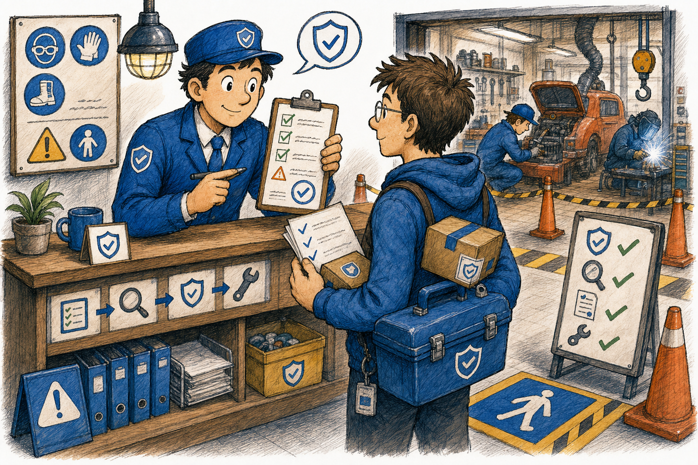
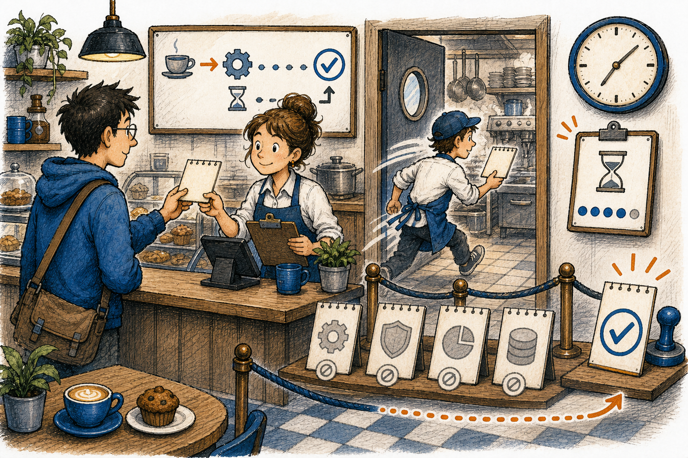
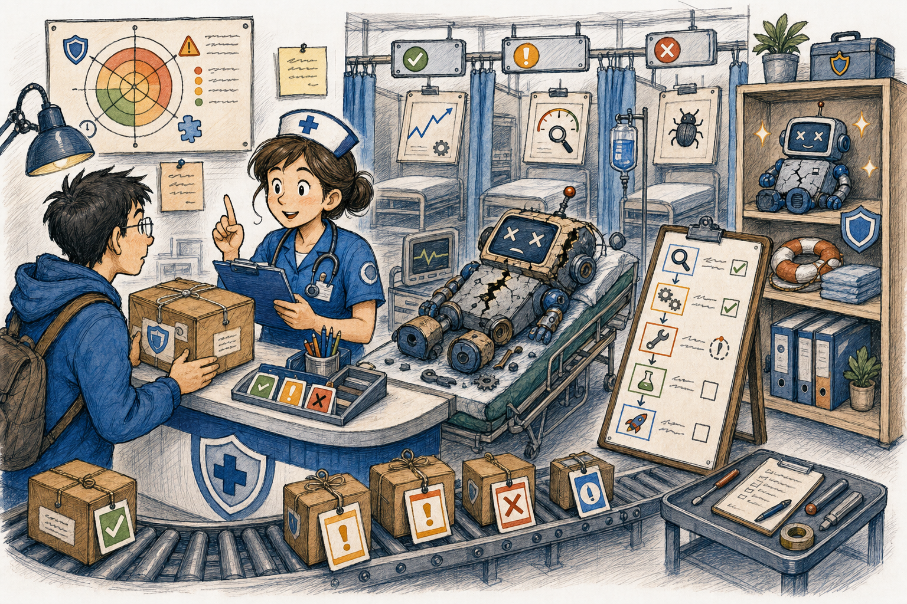
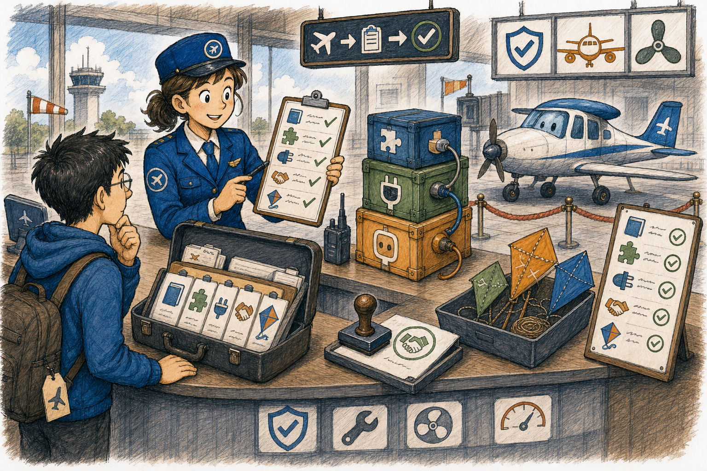

# Audit Project > Engineering Safety

Mode selected: Creation Pipeline. No Engineering Safety Markdown source, rendered HTML page, or manifest entry existed for this tab.

Engineering Safety is the desktop safety desk inside Audit Project, beside Architecture Review. Full Audit runs Complete Enginneering Review across every catalog item and writes one discriminated log. Pontual Audit preserves the original tool groups, one-command runner, and result window without granting permission to patch, approve, or freeze anything.

Image note:

- Subject: Engineering Safety as a careful workshop desk where risky parts are inspected before work begins.
- Asset path: `assets/drawings/engineering_safety_opener_workshop.png`.
- Asset format and display role: local PNG primary characterful raster artwork for the chapter opener.
- Alt text: Hand-made workshop cartoon where a safety reviewer checks tools, parts, and evidence cards before code work starts.
- Caption: Engineering Safety is the workshop desk that checks the tools before the repair begins.
- Prompt summary: hand-made editorial cartoon, daily-life workshop safety desk metaphor, friendly reviewer, labeled but unreadable cards, KANDA blue/orange teaching accents, visible hatching and paper texture, original scene only.
- Density-rule justification: this is the chapter-opener drawing for a large help file with many command families and safety themes.
- Section analogy source: the opening explanation compares Engineering Safety to a workshop safety desk.
- Artwork status: `primary_characterful_raster`.
- Visual-inspection result: PASS - expressive hand-made raster scene, ordinary workshop props, visible imperfect ink lines and hatching, no simple SVG/vector placeholder look, and no readable prompt text.

## What Problem This Solves

**Technical:** Engineering Safety is a child tab of the stable `architecture_review` Audit Project shell tab. The panel owns an immutable button catalog, builds runnable CLI arguments, delegates command execution to the Safety Suite CLI facade, and displays captured output in the GUI. Full Audit iterates the catalog in order, continues after individual failures, and marks interactive Ruff Corrections for manual review instead of applying them. Pontual Audit preserves the existing command groups. Its invariant is authority separation: this tab may inspect, draft, and report, but it must not silently mutate project source, approve a route, or freeze a milestone.

**In plain English:** Think of it as a workshop safety desk. Before anyone drills, cuts, rewires, or ships a machine, the desk checks the tool list, labels the parts, looks at the risk cards, and hands back a written receipt. If the desk points at the wrong drawer or starts doing the repair itself, the rest of the workshop can damage the wrong part.

> **Further reading:** Local code: `reasoner_tools_gui_engineering_safety_panel.py`, `_reasoner_tools_gui_engineering_safety_panel_commands.py`, `kanda_reasoner_app/safety_suite_cli/commands.py`. Technical source categories: official Python documentation for `argparse`, `dataclasses`, `subprocess`, `concurrent.futures`, and `ast`; Qt for Python documentation for `QTimer`.

## Layout Research Note

This document keeps the existing book-help CSS and adopts one technical-book layout idea: long command inventories are split into sectioned tables and short reading cards so the desktop Qt help window stays scannable. The idea is grounded in reputable editorial-typography guidance on table legibility and documentation-design guidance on chunked reference pages; no remote CSS, fonts, icons, gradients, or marketing layout patterns were added.

## Full Audit And Pontual Audit

Full Audit is the left Engineering Safety child tab. Its `Complete Enginneering Review` button runs every safe catalog command in canonical order and produces one text log with section, feature label, command, outcome, status, stdout, and stderr. `Cancel Review` requests cooperative cancellation between catalog items: the sonar stops immediately, the current command is allowed to settle, later items are skipped, the final log is marked `CANCELLED`, and the controls return to idle only after worker settlement. KANDA's canonical floating green sonar activity monitor keeps the same `greenSonarActivityPanel` object name and gradient background used elsewhere; Engineering Safety does not own a separate radar painter. One failed command does not hide later results. Interactive Ruff Corrections is included as `MANUAL REVIEW REQUIRED` and is never opened or applied automatically.

Pontual Audit is the right child tab and keeps the original Engineering Safety layout: Source Hygiene, Engineering Safety, Governance Automation, Stack Compatibility, Draft Reliability, Project Symbol Atlas, Utilities, and the punctual output window. Engineering Safety does not create a second Project Root field or Browse button; both Full Audit and Pontual Audit use the single Project Root selector already shown in the shared Audit Project header.

## How The GUI Command Path Works

Image note:

- Subject: GUI buttons becoming one safe command order at a time.
- Asset path: `assets/drawings/engineering_safety_command_cafe.png`.
- Asset format and display role: local PNG primary characterful raster artwork for the GUI command path section.
- Alt text: Hand-made cafe cartoon where one order ticket at a time is sent from a counter to a careful back-room command runner.
- Caption: One button, one ticket, one receipt.
- Prompt summary: hand-made editorial cartoon, daily-life cafe counter metaphor, button tickets, one active order, receipt output, KANDA blue/orange teaching accents, visible hatching and paper texture, original scene only.
- Density-rule justification: this drawing covers the GUI command runner and asynchronous execution path, a distinct major section.
- Section analogy source: the command-path explanation compares button presses to cafe order tickets.
- Artwork status: `primary_characterful_raster`.
- Visual-inspection result: PASS - expressive cafe scene with organic linework, no flat vector style, and no readable prompt text.

**Technical:** `ENGINEERING_SAFETY_PANEL_CATALOG` defines the panel actions as data: section, label, command name, and tooltip. `create_engineering_safety_panel()` imports PySide6 lazily, receives the shared Audit Project root through an explicit provider, groups buttons by section, and connects each button to `run_command()`. The command runner uses a single `ThreadPoolExecutor(max_workers=1)` plus `QTimer.singleShot(150, ...)` polling so the GUI event loop stays responsive while a command runs. Full Audit owns one cooperative cancellation event and adapts the reusable `GreenSonarActivityMonitor` public template already used by other KANDA workflows. Requesting cancellation stops and hides the sonar immediately, but does not project the worker idle early: the current command settles, the future completes, and only then are controls re-enabled. Buttons are disabled during a run to preserve one active command and one coherent output stream. If this path is wrong, the GUI can freeze, two command outputs can mix, or a cancellation can leave stale running state.

**In plain English:** The panel is like a cafe counter. Every button writes one order ticket, the kitchen handles one order at a time, and the counter shows one receipt when the order is done. If two tickets are cooked in the same pan, or the server keeps the counter frozen while waiting, the customer cannot tell which receipt belongs to which order.

> **Further reading:** Local code: `reasoner_tools_gui_engineering_safety_panel.py`. Technical source categories: Qt for Python `QTimer` event scheduling; Python `concurrent.futures.ThreadPoolExecutor`; Python callable and exception behavior.

## Source Hygiene

Image note:

- Subject: BOM scans, shadow audits, shadow plans, and facade cleanup as a tailor inspecting labels and seams before repair.
- Asset path: `assets/drawings/engineering_safety_source_hygiene_tailor.png`.
- Asset format and display role: local PNG primary characterful raster artwork for the Source Hygiene section.
- Alt text: Hand-made tailor shop cartoon where a careful tailor checks labels, fabric edges, and repair plans before touching garments.
- Caption: Source Hygiene checks the labels before anyone alters the garment.
- Prompt summary: hand-made editorial cartoon, daily-life tailor and laundry metaphor, labels for encodings, seams for facades, repair plan cards, KANDA blue/orange teaching accents, visible hatching and paper texture, original scene only.
- Density-rule justification: this drawing covers the Source Hygiene command family, separate from report triage and governance.
- Section analogy source: the Source Hygiene explanation compares source files to garments with labels, seams, and repair plans.
- Artwork status: `primary_characterful_raster`.
- Visual-inspection result: PASS - characterful tailor scene, strong handmade texture, clear everyday analogy, no simple SVG/vector placeholder look.

**Technical:** Source Hygiene commands inspect text encoding and public symbol ownership before source edits happen. `bom-scan` checks for UTF-8 BOM and decoding trouble. `shadow-audit` parses Python source with AST-based public-symbol checks. `shadow-plan` converts audit findings into a read-only correction plan. `facade-fix-plan` builds a safe facade cleanup plan without applying edits from the GUI. Their invariant is source ownership clarity: the active owner file, facade, public symbol, and encoding must be known before a patch moves or exports code. If this layer is skipped, a change can hide a symbol, corrupt import behavior, or introduce text decoding noise that looks like a code problem.

**In plain English:** Source Hygiene is a tailor checking clothes before alteration. The label says how to wash it, the seam shows where pieces join, and the repair card says what can be changed. If the tailor ignores the label or cuts the wrong seam, the garment may still look familiar but no longer fits the person who needs it.

> **Further reading:** Local code: `kanda_reasoner_app/source_hygiene/bom_scanner.py`, `shadow_audit.py`, `shadow_planner.py`, `shadow_fixer.py`. Technical source categories: Python `ast` documentation for syntax-tree parsing; Python text encoding behavior.

## Engineering Safety Reports

Image note:

- Subject: Risk radar, crash triage, refactor playbook, and shared report schemas as a clinic intake desk.
- Asset path: `assets/drawings/engineering_safety_triage_clinic.png`.
- Asset format and display role: local PNG primary characterful raster artwork for the engineering reports section.
- Alt text: Hand-made clinic cartoon where a patient chart, risk meter, and staged treatment board explain engineering safety reports.
- Caption: Reports diagnose the change before treatment starts.
- Prompt summary: hand-made editorial cartoon, daily-life clinic intake metaphor, risk radar as checkup board, crash triage as patient chart, refactor plan as treatment stages, KANDA blue/orange teaching accents, visible hatching and paper texture, original scene only.
- Density-rule justification: this drawing covers the report-producing safety commands and their shared report contract.
- Section analogy source: the report explanation compares risk, crash, and refactor analysis to clinic diagnosis and treatment planning.
- Artwork status: `primary_characterful_raster`.
- Visual-inspection result: PASS - warm clinic scene with expressive people, readable metaphor without depending on labels, hand-drawn linework and texture.

**Technical:** The Engineering Safety report family produces advisory reports. `risk-radar` estimates blast radius from changed files, validation output, and bundle manifest evidence. `crash-triage` extracts traceback frames and implicated files from crash evidence. `refactor-playbook` builds staged inspect/scope/extract/validate/rollback guidance. `EngineeringSafetyReport` and the report writer keep report type, risk, confidence, evidence, and output formatting consistent. If the schema or report writer is wrong, downstream readers can compare unlike reports, lose risk context, or treat thin evidence as high confidence.

**In plain English:** This section works like a clinic. The radar is the quick checkup, crash triage reads the symptom chart, and the refactor playbook is the treatment plan. If the clinic writes the wrong patient name or skips the diagnosis, the next person may treat the wrong problem.

> **Further reading:** Local code: `kanda_reasoner_app/engineering_safety/risk_radar.py`, `crash_triage.py`, `refactor_playbook.py`, `schemas.py`, `report_writer.py`. Technical source categories: Python `dataclasses` documentation for report value objects; Python regular expression and traceback text parsing concepts.

## Governance, Stack, And Reliability Drafts

Image note:

- Subject: Release notes, push plans, stack briefs, API contracts, and property tests as an airport preflight desk.
- Asset path: `assets/drawings/engineering_safety_preflight_governance.png`.
- Asset format and display role: local PNG primary characterful raster artwork for governance, stack, and reliability drafts.
- Alt text: Hand-made airport preflight cartoon where a pilot checks manifests, parts, and safety stamps before a small plane leaves.
- Caption: Governance checks the flight plan before takeoff.
- Prompt summary: hand-made editorial cartoon, daily-life airport preflight metaphor, release manifest, validation checklist, compatible parts, contract stamp, KANDA blue/orange teaching accents, visible hatching and paper texture, original scene only.
- Density-rule justification: this drawing covers the governance, stack compatibility, and reliability draft family, a distinct section with several commands.
- Section analogy source: the explanation compares release and validation drafting to airport preflight checks.
- Artwork status: `primary_characterful_raster`.
- Visual-inspection result: PASS - detailed airport scene, handmade texture, everyday safety metaphor, no simple icon sheet, no readable prompt text.

**Technical:** Governance, Stack, and Draft Reliability commands prepare evidence-backed drafts: `release-notes` from explicit bundle evidence, `push-plan` from default validation checks, `stack-brief` from dependency/runtime compatibility notes, `api-contract` from input/output guard needs, and `property-test` from invariant examples. Their invariant is traceability: every recommendation must point back to supplied evidence or an explicit code contract. If a draft is invented without evidence, it can make releases look safer than they are or produce tests that check the wrong behavior.

**In plain English:** This group is an airport preflight desk. Release notes are the manifest, push plan is the checklist, stack brief checks that the parts fit the plane, and reliability drafts mark which doors and gauges must be tested. If the preflight clerk stamps a plane without checking the parts, the flight may leave with a missing piece.

> **Further reading:** Local code: `kanda_reasoner_app/governance_automation/`, `stack_compatibility/`, `reliability_guidance/`. Technical source categories: Python `argparse` documentation for required command inputs and command choices; testing-reference guidance for property-based invariants.

## Project Symbol Atlas

Image note:

- Subject: Symbol ownership, related files, evidence freshness, and pre-patch gates as a city map office.
- Asset path: `assets/drawings/engineering_safety_symbol_atlas_city_map.png`.
- Asset format and display role: local PNG primary characterful raster artwork for the Project Symbol Atlas section.
- Alt text: Hand-made city map office cartoon where a guide traces buildings, owners, gates, and related routes before sending a visitor onward.
- Caption: The atlas finds the right address before a patch starts walking.
- Prompt summary: hand-made editorial cartoon, daily-life city map office metaphor, colored pins for symbols, buildings for owner files, gates for pre-patch checks, KANDA blue/orange teaching accents, visible hatching and paper texture, original scene only.
- Density-rule justification: this drawing covers the Project Symbol Atlas family, which has many distinct owner and evidence commands.
- Section analogy source: the Atlas explanation compares source ownership to addresses, gates, routes, and map pins.
- Artwork status: `primary_characterful_raster`.
- Visual-inspection result: PASS - rich city-map scene, characterful human guide, clear everyday analogy, handmade hatching, no flat vector placeholder style.

**Technical:** Project Symbol Atlas commands help find code ownership before edits. `atlas-report` builds a project report, `evidence-freshness` checks whether evidence still matches live source, `find-symbol` and `find-owner` locate known symbols and likely owner files, `facade-owner` distinguishes facade from owner, `main-helpers` maps public API ownership, `related-files` locates tests and support files, and `pre-patch-gate` checks ownership before patching. Their invariant is edit locality: a patch should touch the owning file and related tests, not a lookalike facade or stale evidence. If this layer fails, a change can land in the wrong address and leave the real owner untouched.

**In plain English:** The Atlas is a city map office. Before you visit a building, the guide checks the address, the gate, the nearby files, and whether the printed map is still current. If the map is stale or the guide sends you to a storefront instead of the workshop behind it, your repair happens at the wrong place.

> **Further reading:** Local code: `kanda_reasoner_app/safety_suite_cli/project_symbol_atlas_commands.py`, `reasoner_symbol_atlas` integration points, and Project Analysis Evidence helpers. Technical source categories: Python path handling and AST/source-scanning documentation.

## Operating Checklist

Image note:

- Subject: The safe operating habit for Engineering Safety as a library checkout desk with receipts and stamps.
- Asset path: `assets/drawings/engineering_safety_operating_library.png`.
- Asset format and display role: local PNG primary characterful raster artwork for the operating checklist section.
- Alt text: Hand-made library desk cartoon where a librarian stamps checked evidence, returns receipts, and keeps advisory reports in order.
- Caption: Keep the receipt, then repair only the shelf that owns the problem.
- Prompt summary: hand-made editorial cartoon, daily-life library checkout metaphor, evidence books, safety stamps, returned receipts, advisory report cart, KANDA blue/orange teaching accents, visible hatching and paper texture, original scene only.
- Density-rule justification: this drawing closes the large help file with the common operating habit across all command families.
- Section analogy source: the checklist explanation compares Engineering Safety output to library receipts and shelf ownership.
- Artwork status: `primary_characterful_raster`.
- Visual-inspection result: PASS - hand-made library scene, expressive figures, no readable labels needed, visible paper texture and line variation.

Use the tab in this order:

1. Run `list-tools` when you need to confirm the available CLI surface.
2. Run Source Hygiene before moving public symbols, facades, or generated text files.
3. Run Risk Change Radar before broad edits and Crash Triage after a failure.
4. Run Refactor Playbook before extracting or reshaping a module.
5. Run Project Symbol Atlas before creating, moving, or patching symbols.
6. Run Governance, Stack, and Reliability drafts only when you have concrete evidence to feed them.
7. Treat every output as advisory evidence. Repair in the owning box, rerun the relevant check, then freeze only after independent validation is clean.

## Command Family Catalog

| Section | Command | Technical | In plain English | Grounding |
|---|---|---|---|---|
| Source Hygiene | `bom-scan` | Scans project text files for UTF-8 BOM and decoding issues before source edits. If wrong, text noise can masquerade as code breakage. | The tailor checks the wash label before altering the garment; a wrong label can ruin the fabric. | Local `bom_scanner.py`; Python text encoding docs. |
| Source Hygiene | `shadow-audit` | Audits public-symbol and facade conflicts using source parsing. If wrong, the public API can point at the wrong implementation. | The tailor checks whether two garments share the same tag; duplicate tags confuse the closet. | Local `shadow_audit.py`; Python `ast` docs. |
| Source Hygiene | `shadow-plan` | Turns shadow findings into a read-only correction plan. If wrong, repair steps may target symptoms instead of owner files. | The tailor writes the repair card before picking up scissors. | Local `shadow_planner.py`; Python data-structure docs. |
| Source Hygiene | `facade-fix-plan` | Builds a safe facade cleanup plan without applying GUI edits. If wrong, a facade can hide or duplicate owner behavior. | The tailor marks a seam plan without cutting cloth yet. | Local `shadow_fixer.py`; Python import/facade source behavior. |
| Engineering Safety | `risk-radar` | Scores changed files, validation output, and bundle evidence to estimate blast radius. If wrong, high-risk edits can look routine. | The clinic checks the vital signs before treatment. | Local `risk_radar.py`; Python `dataclasses` docs. |
| Engineering Safety | `crash-triage` | Extracts traceback/log clues and first files to inspect. If wrong, debugging starts in the wrong file. | The clinic reads the chart before sending the patient to a specialist. | Local `crash_triage.py`; Python traceback/text parsing docs. |
| Engineering Safety | `refactor-playbook` | Produces staged inspect, scope, extract, validate, and rollback guidance. If wrong, refactors can outrun tests and rollback. | The clinic writes a treatment plan before surgery. | Local `refactor_playbook.py`; testing and rollback design guidance. |
| Governance Automation | `release-notes` | Drafts release notes from explicit bundle evidence. If wrong, release text can claim unproven changes. | The airport manifest lists only cargo that is actually on the plane. | Local release notes generator; Python `argparse` docs. |
| Governance Automation | `push-plan` | Shows the default validation plan for a push. If wrong, the push can skip the check that would catch a break. | The preflight clerk follows the checklist before takeoff. | Local push validator; command-parser docs. |
| Stack Compatibility | `stack-brief` | Drafts dependency and runtime compatibility notes. If wrong, the app can be tested on a different toolset than the one shipped. | The mechanic checks that every part fits the aircraft. | Local stack compatibility module; package/runtime docs. |
| Draft Reliability | `api-contract` | Drafts input/output guard recommendations for a function. If wrong, callers can send shapes the function was never meant to accept. | The counter marks what forms are accepted before the line opens. | Local API contract guidance; Python function/signature docs. |
| Draft Reliability | `property-test` | Drafts invariant-based test guidance. If wrong, tests may check examples but miss the rule that must always hold. | The inspector tests that every package keeps its promised weight and seal. | Local property-test guidance; testing-reference categories. |
| Project Symbol Atlas | `atlas-report` | Builds a project symbol and ownership report. If wrong, later edits use an incomplete map. | The map office draws the city before giving directions. | Local Atlas commands; source-scanning docs. |
| Project Symbol Atlas | `evidence-freshness` | Checks whether saved analysis evidence still matches live source. If wrong, stale maps guide current repairs. | The guide checks whether the printed map still matches the streets. | Local evidence freshness command; file timestamp/path docs. |
| Project Symbol Atlas | `find-symbol` | Finds an existing symbol before new code is created. If wrong, duplicate code can appear beside the owner. | The map office checks if the building already exists. | Local symbol lookup; Python AST/source docs. |
| Project Symbol Atlas | `find-owner` | Locates the likely owner file for a symbol. If wrong, edits go to the wrong address. | The guide finds who owns the building before sending workers there. | Local owner lookup; path/source docs. |
| Project Symbol Atlas | `facade-owner` | Resolves whether a target file is a facade and identifies the owner. If wrong, a facade can be patched while the real room stays broken. | The storefront may not be the workshop; the guide checks the back address. | Local facade owner logic; Python import/source docs. |
| Project Symbol Atlas | `main-helpers` | Maps main file, helper files, and public API owner. If wrong, helpers drift from the public entry point. | The map links the front desk, storage room, and service door. | Local main/helper mapping; project structure docs. |
| Project Symbol Atlas | `related-files` | Finds tests, helpers, manifests, diagnostics, and support files. If wrong, a patch can miss the receipt or test shelf. | The guide points to nearby shelves that must be checked with the main address. | Local related-file logic; path handling docs. |
| Project Symbol Atlas | `pre-patch-gate` | Runs ownership checks before editing source files. If wrong, the patch starts walking before the address is verified. | The city gate checks the permit before work begins. | Local pre-patch gate; source ownership rules. |
| Utilities | `list-tools` | Lists available Safety Suite CLI commands. If wrong, the user cannot verify the command surface. | The library clerk shows the catalog before checkout. | Local CLI facade; Python `argparse` docs. |

## Authority Boundary

Engineering Safety is advisory. It can run local safety commands, display command text, capture stdout/stderr, and help a human choose the next inspection. It must not patch source from the Help page, mutate prompt canons, approve AI routes, rewrite manifest data without an explicit edit request, or freeze project state. A clean Engineering Safety report is evidence, not approval.

## Further Reading Map

- GUI registration: `kanda_reasoner_app/reasoner_tools_gui_shell/tool_specs.py`.
- GUI panel and catalog: `reasoner_tools_gui_engineering_safety_panel.py`.
- Private command runner: `_reasoner_tools_gui_engineering_safety_panel_commands.py`.
- Safety Suite CLI facade: `kanda_reasoner_app/safety_suite_cli/commands.py`.
- Source Hygiene backends: `kanda_reasoner_app/source_hygiene/`.
- Engineering Safety report backends: `kanda_reasoner_app/engineering_safety/`.
- Project Symbol Atlas CLI integration: `kanda_reasoner_app/safety_suite_cli/project_symbol_atlas_commands.py`.
- Rich help resolver: `kanda_reasoner_app/reasoner_tools_gui_shell/help_docs/path_resolver.py`.
- Rich help renderer: `kanda_reasoner_app/reasoner_tools_gui_shell/help_docs/renderer.py`.
- Help artwork canon: `kanda_prompt_workspace/prompt_library/ACTIVE_PROMPTS/12_generalized_project_canons/desktop_help_document_layout_canon.md`.
- External technical source categories used: official Python `argparse`, `dataclasses`, `subprocess`, `concurrent.futures`, and `ast`; Qt for Python `QTimer`; editorial typography and technical documentation layout guidance.

## Validation Rule

The help document must remain local-only: Markdown source, deterministic HTML/CSS, original local PNG drawings, no remote resources in rendered files, and a desktop Qt renderer with safe fallbacks. Source and rendered files must preserve the same section coverage, command families, artwork, authority boundary, and further-reading map.
