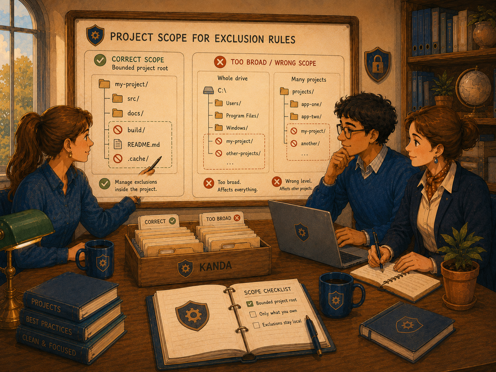
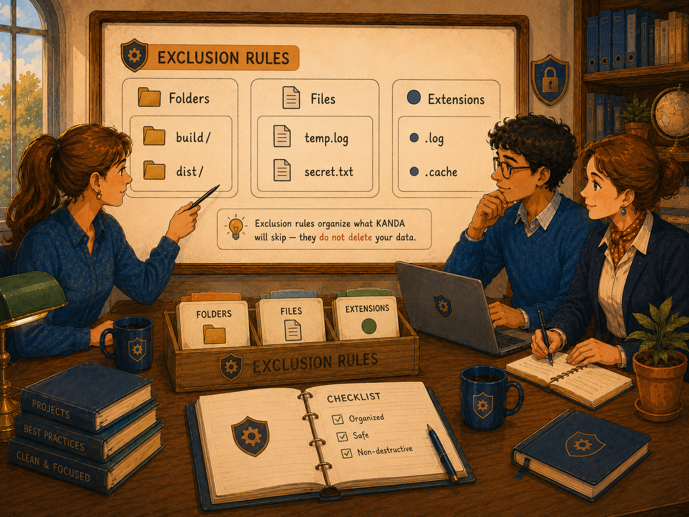

# Exclusion Rules

First-Time User Tutorial

Exclusion Rules tells KANDA Reasoner which folders, files, and file extensions should be treated as outside the active project during project collection, validation, mapping, and other workflows that use the shared exclusion policy.

Image note:

- Subject: Exclusion Rules as a project filter that keeps useful project material in scope and skips unwanted items.
- Asset path: `assets/drawings/exclusion_rules_opener_project_filter.png`.
- Alt text: Three colleagues review a project tree where source and documentation remain included while build folders, cache folders, and temporary files are marked as excluded.
- Caption: Exclusion Rules controls what KANDA treats as part of the project during analysis. It does not delete the excluded items.
- Artwork status: `primary_contextual_exclusion_rules_raster`.

## What Exclusion Rules Means

An exclusion rule tells KANDA to ignore a named folder, file, file pattern, or extension when a supported workflow examines the project.

**In plain English:** Exclusion Rules is a filter. It tells KANDA, “This item may exist on the computer, but do not treat it as part of the project you are analyzing.”

Examples include:

- build output;
- temporary files;
- Python cache folders;
- virtual environments;
- archived copies;
- log files;
- backup files;
- generated packages;
- dependency folders.

Excluded items remain on disk.

They are not moved, renamed, edited, or deleted by this tab.

## Why Exclusion Rules Matters

A project may contain many items that are not useful for architecture review, project export, AI context, validation, or source mapping.

Without exclusions, KANDA may:

- scan unnecessary files;
- include generated output;
- analyze duplicate copies;
- include backup folders;
- create noisy reports;
- increase package size;
- send irrelevant context to an AI;
- mistake archived code for active code;
- produce slower project collection.

A careful exclusion list keeps the active project view cleaner and more accurate.

## What This Tab Does

The Exclusion Rules tab lets you:

1. choose the project root whose rules you want to manage;
2. see whether rules are project-specific or fallback-only;
3. manage ignored folder names and patterns;
4. manage ignored file names and patterns;
5. manage ignored file extensions;
6. add, edit, remove, or clear rules;
7. save manually when desired;
8. reset the active scope to built-in defaults;
9. keep separate rule sets for separate project roots.

Every list change is auto-saved.

The manual Save Rules button is optional.

1

<strong>The safest first-time order is select the exact project root, read the scope message, review the existing defaults, add only one clearly unnecessary item, and then run a project workflow to confirm the result.</strong>

## Important Safety Boundary

Exclusion Rules changes project analysis scope.

It does not change the file system.

An excluded item:

- remains in its original folder;
- remains available to other software;
- remains available to Windows;
- can still be opened manually;
- can be restored to KANDA analysis by removing the rule.

!

<strong>Excluding an important source folder can make KANDA behave as though that code does not belong to the project.</strong> Add rules carefully and verify the result after every meaningful change.

## Before You Start

Before editing rules:

1. identify the exact project you intend to manage;
2. confirm that the project root is not an entire drive;
3. confirm that it is not a parent folder containing several projects;
4. understand whether the item is active source, generated output, cache, backup, or archive;
5. avoid excluding anything you have not inspected;
6. remember that rules may affect several KANDA workflows.

## The Safest First-Time Workflow

### Step 1 - Select the Project Root

Use the **Project Root** field or click **Search**.

Choose the root folder of the actual project.

### Step 2 - Read the Scope message

The scope message explains whether:

- no project root is selected;
- the rules are fallback rules only;
- the rules are saved only for the selected project;
- Project Reasoner-specific defaults are active.

### Step 3 - Review the existing defaults

Do not begin by clearing all lists.

The tab already supplies common exclusions.

### Step 4 - Add one rule

Add one clearly unnecessary folder, file, or extension.

### Step 5 - Confirm auto-save

The tab saves immediately after adding, editing, removing, or clearing an item.

### Step 6 - Run a project workflow

Use a project map, collector, validation, or another workflow that respects Exclusion Rules.

Check that only the intended material disappeared from analysis.

### Step 7 - Correct the rule when necessary

Edit or remove the rule if important material was excluded.

## Project Root

Image note:

- Subject: Correct project-root scope compared with an entire drive or a parent folder containing several projects.
- Asset path: `assets/drawings/exclusion_rules_project_scope.png`.
- Alt text: A team compares one correctly bounded project root with a whole drive and a parent folder containing several unrelated projects.
- Caption: Exclusion Rules should normally be managed inside one bounded project root.
- Artwork status: `primary_contextual_exclusion_rules_raster`.

### Project Root field

The Project Root field shows the active root used to identify the current rule set.

You may type a path and leave the field, or use Search.

### Search

Search opens a folder chooser.

The chosen folder becomes the active project root.

### Correct scope

A good project root usually contains the project's source folders, configuration, documentation, and project-level files.

### Scope that is too broad

Avoid selecting:

- `C:\`;
- an entire external drive;
- a general `projects` folder;
- your user-profile folder;
- a folder containing unrelated applications.

A broad root can cause rules to affect the wrong scope.

## Project-Specific Rules

Each project root owns an independent rule set.

When a project root is selected, the scope message says that exclusions are saved only for that project root.

Other project roots keep separate lists.

The preferences key is based on the resolved project-root path.

**In plain English:** The rule “ignore build” for Project A does not automatically become the editable Project B rule set merely because both projects exist on the same computer.

## Fallback Rules

When no Project Root is selected, the tab uses the special fallback scope.

The scope message explains that these are fallback rules only.

Fallback rules are not a substitute for selecting the actual project.

Use a real project root whenever you are preparing exclusions for a specific project.

## Reasoner Project Defaults

When the selected root is recognized as a KANDA Reasoner project, additional project-specific default folder rules become active.

These defaults are designed to reduce noise from legacy, deprecated, backup, scratch, copied, and workbench areas.

The scope message identifies whether **Reasoner project defaults** are active or inactive.

## The Three Rule Categories

Image note:

- Subject: Separate folder, file, and extension rule categories.
- Asset path: `assets/drawings/exclusion_rules_rule_categories.png`.
- Alt text: Three colleagues review separate panels for excluded folders, excluded file names or patterns, and excluded file extensions.
- Caption: Keep folder rules, file rules, and extension rules in the correct category.
- Artwork status: `primary_contextual_exclusion_rules_raster`.

The tab keeps three independent lists.

### Folders

The folder section is labeled:

`These folders are not part of the project and must be ignored`

Folder rules can contain:

- exact folder names;
- folder-name patterns;
- wildcard patterns supported by the shared exclusion policy.

Common examples include:

- `__pycache__`
- `.git`
- `.venv`
- `build`
- `dist`
- `node_modules`
- `archive`
- `*backup*`

A folder rule may match a folder with that name anywhere in the project tree, depending on the shared policy.

### Files

The file section is labeled:

`These files are not part of the project and must be ignored`

File rules can contain:

- an exact file name;
- a file-name pattern;
- a wildcard pattern.

Examples include:

- `debug.log`
- `temporary.tmp`
- `*.log`
- `*.tmp`

### Extensions

The extension section is labeled:

`These extensions are not part of the project and must be ignored`

An extension rule usually begins with a period.

Examples include:

- `.pyc`
- `.pyo`
- `.log`
- `.tmp`
- `.bak`
- `.swp`

Extension rules apply by file suffix.

## Built-In Default Rules

The project-agnostic default folder list includes common items such as:

- `__pycache__`
- `.git`
- `.idea`
- `.vscode`
- `.pytest_cache`
- `.mypy_cache`
- `.ruff_cache`
- `.coverage`
- `htmlcov`
- `.venv`
- `venv`
- `env`
- `build`
- `dist`
- `node_modules`
- project-reference folders
- `project_freeze_ledger`

The default file patterns include:

- `*.log`
- `*.tmp`

The default extensions include:

- `.pyc`
- `.pyo`
- `.log`
- `.tmp`
- `.bak`
- `.swp`

These defaults are merged with saved project-specific rules.

## Default Rules Are Merged Back In

When rules are loaded, built-in defaults are merged with saved rules.

The merge:

- preserves project-specific entries;
- adds current built-in defaults;
- removes empty values;
- prevents case-insensitive duplicates.

This means a newly introduced built-in default may reappear when the project rules are loaded.

## Add Folder

**Add Folder (browse)** opens a folder chooser.

The tab stores the selected folder's name, not the entire selected path.

Example:

Selecting:

`E:\my_project\build`

adds:

`build`

This is useful for folder-name rules that should match that folder name in the project.

The tab blocks an exact duplicate and shows a Duplicate warning.

## Edit Folder

Select one folder entry and click **Edit Folder**.

The edit dialog lets you change the folder name or pattern.

If nothing is selected, the tab shows:

`Select an item to edit.`

If the new text exactly duplicates another item, the change is blocked.

The edit is auto-saved.

## Remove Folder

Select one folder entry and click **Remove Folder**.

The selected entry is removed and the list is auto-saved.

There is no extra confirmation for removing one selected item.

## Clear All Folders

Click **Clear All Folders** to remove every visible folder entry.

The tab asks:

`Remove all items from this list?`

Choose Yes only after reviewing the consequences.

The list is auto-saved after confirmation.

Built-in defaults may return later when rules are reloaded because defaults are merged into saved rules.

## Add File

**Add File (browse)** opens a file chooser.

The tab stores the selected file's name, not its entire absolute path.

The chooser supports Python files and all files.

Selecting:

`E:\my_project\logs\debug.log`

adds:

`debug.log`

Exact duplicates are blocked.

## Edit File

Select a file entry and click **Edit File**.

The dialog accepts a file name or pattern.

Examples include:

- `debug.log`
- `generated.json`
- `*.tmp`

The change is auto-saved.

## Remove File

Select one file entry and click **Remove File**.

The item is removed and the list is auto-saved.

## Clear All Files

**Clear All Files** asks for confirmation before removing every file entry.

The result is auto-saved.

## Add Extension

**Add Extension (text)** opens a text dialog.

Enter an extension such as:

`.pyc`

Use a leading period for clarity and consistency.

Exact duplicates are blocked.

## Edit Extension

Select an extension and click **Edit Extension**.

Enter the corrected extension.

The change is auto-saved.

## Remove Extension

Select an extension and click **Remove Extension**.

The selected item is removed and auto-saved.

## Clear All Extensions

**Clear All Extensions** asks for confirmation before clearing the list.

The change is auto-saved.

## Duplicate Protection

The tab checks for exact duplicates before adding or editing an entry.

When a duplicate is found, it shows a warning such as:

`'build' already exists.`

Duplicate protection is category-specific.

A folder entry and a file entry can contain similar text because they belong to different lists.

## Auto-Save

Auto-save is active.

The tab calls Save Rules after:

- adding;
- editing;
- removing;
- clearing;
- resetting to defaults.

You do not need to click the manual Save button after every edit.

## Save Rules

The button label says:

`Save Rules (auto-save is on - optional)`

Use it when you want to deliberately re-save the visible lists.

It stores:

- folders;
- files;
- extensions;
- the active project rule key;
- the compatibility rule copy used by existing consumers.

## Reset to Defaults

The button label says:

`Reset to Defaults (auto-saved)`

Reset replaces the visible lists with the built-in defaults for the active scope.

When the active root is a recognized KANDA Reasoner project, the Reasoner-specific defaults are included.

Reset is auto-saved.

Reset does not restore a previous custom rule set.

## Last Browse Location

The tab remembers the last folder used by its browse dialogs.

This makes repeated folder and file selection easier.

The last browse location is convenience state, not an exclusion rule.

## How Exclusions Are Used

The shared exclusion policy is consumed by project workflows such as:

- project collection;
- source-tree export;
- project JSON filtering;
- context-bundle generation;
- reconstruction payload generation;
- bundle checking;
- architecture-related validation;
- docstring file discovery;
- other workflows that use the unified exclusion policy.

The exact set may grow as more existing workflows adopt the shared policy.

## Exclusion Does Not Mean Deletion

Image note:

- Subject: Included project items are analyzed while excluded items remain safely stored on disk.
- Asset path: `assets/drawings/exclusion_rules_safety_boundary.png`.
- Alt text: A project tree shows included source and documentation being analyzed while excluded build, distribution, log, and cache items remain safely stored in a separate cabinet.
- Caption: Exclusion removes an item from KANDA analysis. It does not remove the item from the computer.
- Artwork status: `primary_contextual_exclusion_rules_raster`.

Excluded items remain in the file system.

KANDA's exclusion decision affects whether a supported workflow treats the path as active project material.

It does not perform a file-deletion operation.

## What Success Looks Like

A successful Exclusion Rules setup usually has:

1. the exact project root selected;
2. a project-specific scope message;
3. common defaults still present;
4. generated and temporary items excluded;
5. active source folders included;
6. no important configuration accidentally excluded;
7. separate rules for separate projects;
8. project collection becoming cleaner;
9. reports containing less duplicate or archived material;
10. excluded files still present on disk.

## Common Mistakes

### Selecting the wrong Project Root

Rules may be saved under the wrong project key.

### Managing fallback rules instead of project rules

The active project may not receive the intended exclusions.

### Excluding `src`, `app`, or another active source folder

Major portions of the project may disappear from analysis.

### Adding a full path when a folder name is expected

The folder rule may not match as intended.

### Forgetting the leading period in an extension

The extension may not match the expected suffix format.

### Clearing defaults without understanding merge behavior

Built-in defaults may return when rules are reloaded.

### Using broad wildcard rules

A rule such as `*copy*` can match more folders than expected.

### Excluding a backup that is still the only valid copy

KANDA may stop seeing material you still rely on.

### Assuming exclusion protects a secret from all software

Exclusion only controls supported KANDA workflows. It does not encrypt or delete the file.

## If Something Goes Wrong

### The wrong rules appear

Check the Project Root and scope message.

You may be viewing fallback rules or another project's rules.

### A rule does not seem to work

Check:

- category;
- exact spelling;
- leading period for extensions;
- wildcard pattern;
- active project root;
- whether the workflow uses the shared exclusion policy;
- whether the workflow needs to be rerun.

### An important folder disappeared from reports

Remove or edit the matching rule, then rerun the project workflow.

### A removed default returns

Built-in defaults are merged back into loaded rules.

### Save fails

The tab opens an error window containing the save error.

Check whether the GUI preferences file and its parent folder are writable.

### Reset removed custom rules

Reset replaces the visible active-scope rules with defaults.

Re-add the required project-specific entries.

### A duplicate cannot be added

The exact entry already exists in the same category.

Edit the existing entry instead.

## First-Time Checklist

Before editing:

- [ ] Correct project root selected
- [ ] Scope message read
- [ ] Fallback versus project-specific scope understood
- [ ] Existing defaults reviewed
- [ ] Item inspected before exclusion

For folder rules:

- [ ] Folder is generated, temporary, archived, duplicated, or otherwise outside active scope
- [ ] Folder name or pattern is not too broad
- [ ] Active source folders remain included

For file rules:

- [ ] Exact file name or pattern is correct
- [ ] Important configuration files remain included
- [ ] Wildcards are narrow enough

For extension rules:

- [ ] Leading period used
- [ ] Extension is truly unwanted in project analysis
- [ ] Rule will not hide important source formats

After editing:

- [ ] Auto-save completed without an error
- [ ] Project workflow rerun
- [ ] Expected item excluded
- [ ] Important items still visible
- [ ] Excluded item still exists on disk
- [ ] Other project roots remain unaffected

## Final Rule

**Select the exact project root, keep active source in scope, exclude only clearly unwanted material, and verify the result in a real project workflow after every meaningful rule change.**
