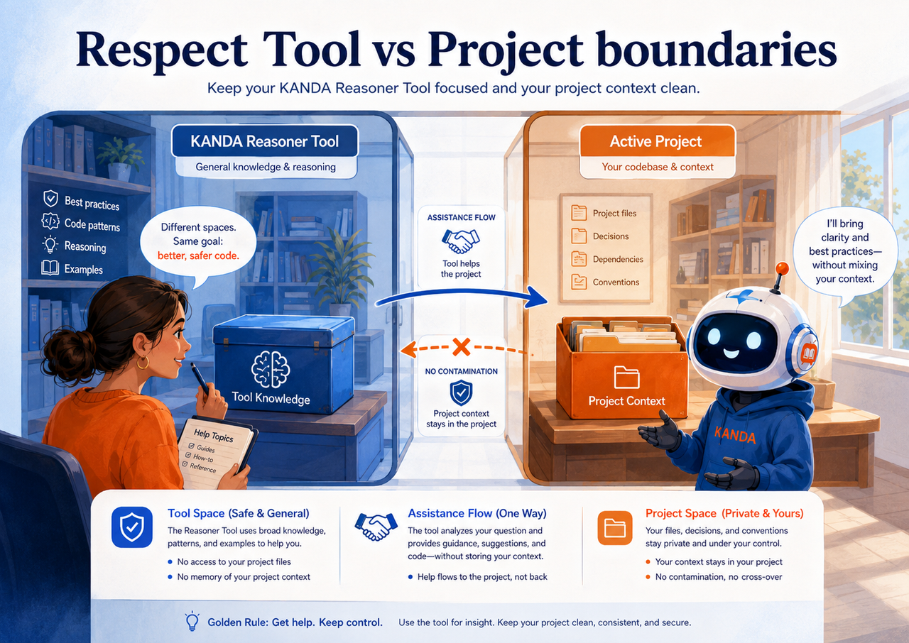
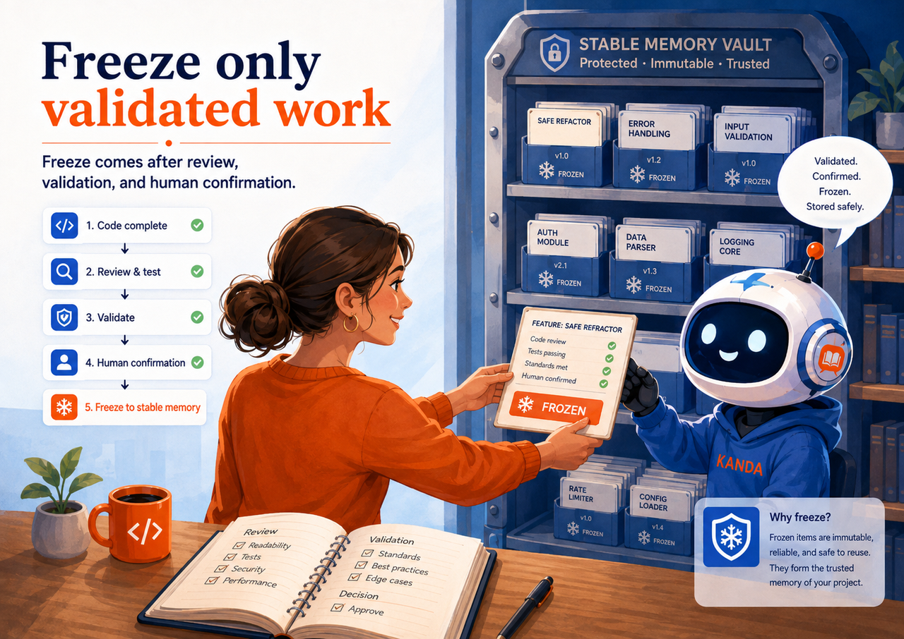

# Kanda Phrasebook

Mini-Prompts for Safer AI Coding

Kanda Phrasebook is a practical help guide for non-programmer users who build software through conversation with AI and the KANDA Reasoner Tool.

Image note:

- Subject: A non-programmer and a friendly AI assistant use a curated mini-prompt library during software development.
- Asset path: `assets/drawings/kanda_phrasebook_opener.png`.
- Alt text: A user and KANDA assistant review a mini-prompt library for safer AI coding.
- Caption: The right mini-prompt restores the right engineering behavior at the right moment.
- Artwork status: `primary_contextual_kanda_phrasebook_raster`.

## What This Help File Is

This guide contains 310 reusable mini-prompts. Each mini-prompt is followed by a plain-English explanation that tells you what it does, when to use it, and which common AI failure it is designed to correct.

**In plain English:** Think of the Phrasebook as a set of precise steering instructions. When the AI begins to drift, guess, overbuild, touch the wrong files, skip validation, or forget KANDA rules, choose the sentence that describes the problem and paste it into the conversation.

## How to Use the Phrasebook

1. Identify what the AI is doing incorrectly or what stage of work you are entering.
2. Open the matching section.
3. Expand the mini-prompt you need.
4. Replace placeholders such as `<target>` and `<active_project>` with the real current values.
5. Paste the complete mini-prompt into the AI conversation.
6. Read the plain-English explanation when you are unsure whether the command fits the situation.

<figure class="section-drawing">
  
  <figcaption>Choose the mini-prompt that matches the AI behavior you need to restore.</figcaption>
</figure>

## Important Placeholders

- `<active_project>`: the Project currently selected in KANDA Reasoner.
- `<active_project_root>`: the source root of that Project.
- `<active_project_support_root>`: the Project-owned sibling support root.
- `<target>`: the module, feature, workflow, prompt, or artifact under discussion.
- `<primary_box>`: the Box that owns the main responsibility.
- `<public_facade>`: the supported public contract of the owning Box.
- `<feature_id>`: the immutable identity of the current feature or repair.
- `<operation_id>`: the identity of the current operation.
- `<validation_marker>`: the exact success marker expected from validation.

## Quick Section Map

- [A. Universal Prefixes](#a-section) - 5 mini-prompts
- [B. Improved Versions Of Common User Phrases](#b-section) - 12 mini-prompts
- [C. Routing And Prompt-Library Commands](#c-section) - 15 mini-prompts
- [D. Verified Problem, Scope, And Change Admission](#d-section) - 14 mini-prompts
- [E. Tool Versus Active Project Boundary](#e-section) - 18 mini-prompts
- [F. Box Architecture And Public Contracts](#f-section) - 18 mini-prompts
- [G. Shielding And No-Leak Protection](#g-section) - 14 mini-prompts
- [H. Brick Wall And Mcard Commands](#h-section) - 16 mini-prompts
- [I. Source Truth, Freshness, And Evidence](#i-section) - 14 mini-prompts
- [J. State, Lifecycle, Async, And Gui Control](#j-section) - 16 mini-prompts
- [K. Refactoring, Clean Code, And Module Size](#k-section) - 18 mini-prompts
- [L. Testing And Validation](#l-section) - 18 mini-prompts
- [M. Patch, Zip, Installation, And Terminal Delivery](#m-section) - 18 mini-prompts
- [N. Freeze And Error Memory](#n-section) - 18 mini-prompts
- [O. Documentation, Help, And User Experience](#o-section) - 12 mini-prompts
- [P. Research, Handoff, And Anti-Hallucination](#p-section) - 14 mini-prompts
- [Q. Status, Progress, And Handoff Phrases](#q-section) - 10 mini-prompts
- [R. Composite Mini-Prompt Recipes](#r-section) - 10 mini-prompts
- [S. Phrases That Should Not Be Used Alone](#s-section) - 10 mini-prompts
- [T. One-Line Command Deck](#t-section) - 40 mini-prompts

!

<strong>A mini-prompt does not replace evidence.</strong> It tells the AI how to work. Current source inspection, validation, human confirmation, and owner boundaries still decide whether the result is acceptable.

## A. Universal Prefixes

Use these opening commands when you need to restore the complete KANDA engineering frame before a task begins.

  
A1 Full universal implementation prefix

  

    
<strong>Mini-prompt</strong>

    <pre><code>Treat KANDA Reasoner as the reusable Tool and &lt;active_project&gt; as the Active Project. Preserve Tool-versus-Project separation even during self-hosting. Route this task through the current prompt indexes, load only the smallest applicable specialist prompt set, apply Box Architecture and NO_LEAK logic, and use Brick Wall as the final coding authority. Inspect exact current source before proposing code. Prefer the smallest verified intervention, preserve public contracts and single-state ownership, validate from current source, and do not claim installation, validation, Freeze, or Error Memory completion without observed evidence.</code></pre>
    
<strong>Plain-English explanation</strong>

    
This command gives the AI the complete KANDA operating frame before implementation. It identifies the Tool and selected Project, requires prompt routing, Box and NO_LEAK protection, Brick Wall authority, exact-source inspection, minimal change, and truthful evidence reporting. Use it at the beginning of an important implementation or when the AI has forgotten several project rules at once.

  

  
A2 Short universal guard

  

    
<strong>Mini-prompt</strong>

    <pre><code>Respect Tool/Project boundaries, Box ownership, public-contract-only communication, NO_LEAK logic, current exact source, and Brick Wall authorization. Make the smallest bounded change and preserve all unrelated behavior.</code></pre>
    
<strong>Plain-English explanation</strong>

    
This is the compact version of the universal guard. It reminds the AI to respect the Tool/Project split, ownership, public interfaces, no-leak rules, live source, and final authorization while changing as little as possible. Use it during an ongoing task when the full A1 prompt would be excessive.

  

  
A3 Surgical repair prefix

  

    
<strong>Mini-prompt</strong>

    <pre><code>This is a surgical repair of &lt;target&gt;. Identify the verified defect, its canonical owner, public contract, consumers, and regression risk. Change only the smallest authorized file set inside the owning Box. Keep unrelated corrected behavior shielded and unchanged.</code></pre>
    
<strong>Plain-English explanation</strong>

    
This command tells the AI to repair one verified problem without redesigning the surrounding system. It must find the real defect, the feature that owns it, the approved interface used by other code, and the regression risk, then touch only the smallest allowed set of files. Use it when you want a precise repair or when the AI is rewriting too much unrelated code.

  

  
A4 Read-only audit prefix

  

    
<strong>Mini-prompt</strong>

    <pre><code>Audit only. Inspect current Project source and relevant KANDA prompts, but do not modify source, generate an installable patch, write Project memory, or claim validation. Separate findings, evidence, assumptions, and unresolved questions.</code></pre>
    
<strong>Plain-English explanation</strong>

    
This command puts the AI into inspection-only mode. It may read and report, but it must not edit source, build a patch, write memory, or pretend that validation occurred. Use it when you want diagnosis, architecture review, or a second opinion before approving implementation.

  

  
A5 Quality-over-growth prefix

  

    
<strong>Mini-prompt</strong>

    <pre><code>Do not create a new engine, scanner, registry, schema, report owner, or context system merely because it sounds useful. First prove a concrete inadequacy in the current canonical capability. Prefer repair, consolidation, or no change.</code></pre>
    
<strong>Plain-English explanation</strong>

    
This command prevents feature inflation. It requires proof that the existing system is genuinely inadequate before creating another engine, scanner, registry, schema, or report owner. Use it when the AI keeps proposing new infrastructure instead of improving what already exists.

  

## B. Improved Versions Of Common User Phrases

These are stronger replacements for informal reminders such as use Brick Wall, respect Box Logic, or use the exact prompt.

  
B1 Instead of: &quot;Remember to respect box logic.&quot;

  

    
<strong>Mini-prompt</strong>

    <pre><code>Use: Apply the Box Architecture Canon. Identify the primary Box, public facade, private internals, state owner, allowed files, declared supporting touches, out-of-scope files, cross-Box contracts, and focused boundary validators before coding.</code></pre>
    
<strong>Plain-English explanation</strong>

    
This makes the informal phrase &quot;respect box logic&quot; concrete. The AI must identify the owning feature container, its approved public entry point, private internals, state owner, allowed files, cross-feature contracts, and validators before coding. Use it when the AI says it will respect architecture but does not show how.

  

  
B2 Instead of: &quot;Use Brick Wall.&quot;

  

    
<strong>Mini-prompt</strong>

    <pre><code>Use: Invoke Brick Wall KPR-03-001 now. Show the live Q01-Q40 ledger, current blockers, next safe action, and authorization status. Do not begin with implementation code.</code></pre>
    
<strong>Plain-English explanation</strong>

    
This turns &quot;use Brick Wall&quot; into a visible readiness check. The AI must show the Q01-Q40 status, blockers, authorization, and next safe action before writing code. Use it when the AI jumps directly into implementation or says Brick Wall is satisfied without showing evidence.

  

  
B3 Instead of: &quot;M-card logic is necessary here.&quot;

  

    
<strong>Mini-prompt</strong>

    <pre><code>Use: Evaluate MCard applicability under KPR-12-005. Treat KANDA Reasoner as the reusable card machine, &lt;active_project&gt; as the card owner, and &lt;target&gt; as the inserted card. Bind all work to current Project, target, freshness, generation, operation, authorization, and transaction identity. Preserve Project results and eject only target-specific Tool state after verified completion or rollback.</code></pre>
    
<strong>Plain-English explanation</strong>

    
This tells the AI to decide whether MCard lifecycle tracking applies to the selected target. It treats the Tool as the reusable machine, the Project as the owner, and the current file or feature as the inserted card whose identity and freshness must remain bound to the operation. Use it when switching projects or targets could leave stale plans, previews, or background results.

  

  
B4 Instead of: &quot;Use exactly the prompt uploaded.&quot;

  

    
<strong>Mini-prompt</strong>

    <pre><code>Use: Route to the canonical prompt by exact prompt_id, prompt_code, or prompt_path and apply its current text directly. Do not paraphrase, substitute, merge, or rely on a remembered version when exact prompt content is available.</code></pre>
    
<strong>Plain-English explanation</strong>

    
This requires the AI to load and follow the exact uploaded canonical prompt rather than a summary remembered from an earlier chat. Use it when wording, metadata, or special rules must be preserved exactly, or when the AI appears to be paraphrasing away important constraints.

  

  
B5 Instead of: &quot;Search in prompt library for the correct prompt.&quot;

  

    
<strong>Mini-prompt</strong>

    <pre><code>Use: Use startup routing first to identify the smallest applicable prompt group, folder card, and specialist prompt path. Open only those canonical prompt-library files. Check duplicates, overlap, owner conflicts, and required companions before applying them.</code></pre>
    
<strong>Plain-English explanation</strong>

    
This tells the AI to use KANDA routing to find the smallest correct set of prompts instead of opening the whole library or guessing. It must also check overlap, duplicates, owners, and companion prompts. Use it when the AI does not know which prompt applies or loads too much context.

  

  
B6 Instead of: &quot;This is canonical.&quot;

  

    
<strong>Mini-prompt</strong>

    <pre><code>Use: Treat this as a proposed canon until current source, owner, consumers, validators, metadata, routing, and conflicts are audited. It becomes authoritative only after governed validation and explicit Freeze confirmation. Do not override an existing frozen owner silently.</code></pre>
    
<strong>Plain-English explanation</strong>

    
This prevents an idea from becoming &quot;canon&quot; merely because someone called it canonical. The AI must reconcile owners, consumers, validators, routing, and frozen behavior, then require governed validation and human Freeze confirmation. Use it when proposing a permanent rule or changing an existing one.

  

  
B7 Instead of: &quot;Do not mess with the rest of the code.&quot;

  

    
<strong>Mini-prompt</strong>

    <pre><code>Use: Preserve every unrelated public contract and validated behavior. Declare the exact changed-file set and files explicitly out of scope. Reject opportunistic cleanup, formatting churn, renaming, or dependency changes outside the verified repair boundary.</code></pre>
    
<strong>Plain-English explanation</strong>

    
This protects already-correct code from collateral changes. The AI must name the exact files it may change, list what is out of scope, and avoid opportunistic cleanup or renaming. Use it when a small request starts producing a broad diff.

  

  
B8 Instead of: &quot;Do not let code leak.&quot;

  

    
<strong>Mini-prompt</strong>

    <pre><code>Use: Apply NO_LEAK classification. Block wrong-root writes, Tool/Project leakage, cross-Box private reach-in, hidden mutable-state ownership, public API ownership leakage, generated-artifact-as-source authority, and validation or Freeze evidence leakage.</code></pre>
    
<strong>Plain-English explanation</strong>

    
This converts &quot;do not leak&quot; into specific checks for wrong-root writes, Tool/Project mixing, private reach-in, duplicate state ownership, false source authority, and misplaced evidence. Use it when the AI uses NO_LEAK as a slogan without checking the real leak paths.

  

  
B9 Instead of: &quot;Check the real code; do not guess.&quot;

  

    
<strong>Mini-prompt</strong>

    <pre><code>Use: Inspect exact current source, imports, exports, consumers, state owners, current validators, and source fingerprints. Label unsupported conclusions as unresolved. Do not infer runtime success or current behavior from handoff text, memory, filenames, or generated artifacts alone.</code></pre>
    
<strong>Plain-English explanation</strong>

    
This forces the AI to inspect the live source, imports, exports, consumers, state owners, and validators before drawing conclusions. Use it when the AI is reasoning from memory, a handoff, filenames, or generated reports instead of the actual code.

  

  
B10 Instead of: &quot;Make it SOLID and DRY.&quot;

  

    
<strong>Mini-prompt</strong>

    <pre><code>Use: Preserve one cohesive responsibility per owner, stable dependency direction, explicit public contracts, and one authoritative implementation per behavior. Do not create abstraction, helper fragmentation, or indirection unless it removes verified duplication or ownership confusion.</code></pre>
    
<strong>Plain-English explanation</strong>

    
This asks for SOLID and DRY in a controlled way. It favors clear ownership and one implementation per behavior but blocks unnecessary abstractions and tiny helper files. Use it when &quot;clean code&quot; is causing over-engineering or fragmentation.

  

  
B11 Instead of: &quot;Protect this feature.&quot;

  

    
<strong>Mini-prompt</strong>

    <pre><code>Use: Run a Shield Applicability Decision. Strengthen or create focused regression fitness functions only for proven authority, state, boundary, stale-result, path, concurrency, fallback, or high-impact contract risk. Reuse existing tests when sufficient.</code></pre>
    
<strong>Plain-English explanation</strong>

    
This requires a risk-based decision about regression protection. The AI should create or strengthen a focused test only when a real authority, state, path, concurrency, fallback, or contract risk exists. Use it when protection is needed but you do not want ceremonial tests.

  

  
B12 Instead of: &quot;Go step by step.&quot;

  

    
<strong>Mini-prompt</strong>

    <pre><code>Use: Work through explicit evidence checkpoints: verified problem, Error Memory, exact source, Tool/Project identity, Box boundary, public contracts, state ownership, implementation plan, sandbox validation, patch contract, user-local validation, Freeze, and handoff. Do not advance past a blocked checkpoint.</code></pre>
    
<strong>Plain-English explanation</strong>

    
This defines the actual checkpoints hidden inside &quot;go step by step.&quot; The AI must move through evidence, source, boundaries, planning, validation, delivery, Freeze, and handoff without skipping a blocked stage. Use it when the AI moves too quickly or mixes several lifecycle stages.

  

## C. Routing And Prompt-Library Commands

Use these commands when the AI must route through the Prompt Library instead of guessing which instructions apply.

  
C1 Route this task before solving it. State Fast Path or Routed Work Path and list the exact required prompt groups and specialist prompt paths.

  

    
<strong>Mini-prompt</strong>

    <pre><code></code></pre>
    
<strong>Plain-English explanation</strong>

    
This controls how the AI finds and loads the correct prompt instructions before working. In practical terms, it will make the AI route this task before solving it. State Fast Path or Routed Work Path and list the exact required prompt groups and specialist prompt paths. Use it when selecting, creating, editing, registering, or validating prompt-library behavior.

  

  
C2 Load only the smallest current prompt set that owns this task. Do not load broad groups merely for reassurance.

  

    
<strong>Mini-prompt</strong>

    <pre><code></code></pre>
    
<strong>Plain-English explanation</strong>

    
This controls how the AI finds and loads the correct prompt instructions before working. In practical terms, it will make the AI load only the smallest current prompt set that owns this task. Do not load broad groups merely for reassurance. Use it when selecting, creating, editing, registering, or validating prompt-library behavior.

  

  
C3 Use the prompt navigation index, group assimilation index, and relevant folder card before selecting specialist prompts.

  

    
<strong>Mini-prompt</strong>

    <pre><code></code></pre>
    
<strong>Plain-English explanation</strong>

    
This controls how the AI finds and loads the correct prompt instructions before working. In practical terms, it will make the AI use the prompt navigation index, group assimilation index, and relevant folder card before selecting specialist prompts. Use it when selecting, creating, editing, registering, or validating prompt-library behavior.

  

  
C4 Search the canonical prompt library for existing ownership before proposing a new prompt, bridge, schema, or workflow.

  

    
<strong>Mini-prompt</strong>

    <pre><code></code></pre>
    
<strong>Plain-English explanation</strong>

    
This controls how the AI finds and loads the correct prompt instructions before working. In practical terms, it will make the AI search the canonical prompt library for existing ownership before proposing a new prompt, bridge, schema, or workflow. Use it when selecting, creating, editing, registering, or validating prompt-library behavior.

  

  
C5 Check whether this behavior already exists under another prompt_id, alias, router bridge, metadata record, or folder owner.

  

    
<strong>Mini-prompt</strong>

    <pre><code></code></pre>
    
<strong>Plain-English explanation</strong>

    
This controls how the AI finds and loads the correct prompt instructions before working. In practical terms, it will clarify this rule: Check whether this behavior already exists under another prompt_id, alias, router bridge, metadata record, or folder owner. Use it when selecting, creating, editing, registering, or validating prompt-library behavior.

  

  
C6 Prefer update, reconcile, link, or register over creating a duplicate prompt.

  

    
<strong>Mini-prompt</strong>

    <pre><code></code></pre>
    
<strong>Plain-English explanation</strong>

    
This controls how the AI finds and loads the correct prompt instructions before working. In practical terms, it will make the AI prefer update, reconcile, link, or register over creating a duplicate prompt. Use it when selecting, creating, editing, registering, or validating prompt-library behavior.

  

  
C7 Use the exact canonical prompt path and preserve prompt identity, metadata, routing registration, and validator coverage.

  

    
<strong>Mini-prompt</strong>

    <pre><code></code></pre>
    
<strong>Plain-English explanation</strong>

    
This controls how the AI finds and loads the correct prompt instructions before working. In practical terms, it will make the AI use the exact canonical prompt path and preserve prompt identity, metadata, routing registration, and validator coverage. Use it when selecting, creating, editing, registering, or validating prompt-library behavior.

  

  
C8 Do not copy the full specialist prompt into GUI source. Keep the GUI dynamically linked to the canonical prompt path.

  

    
<strong>Mini-prompt</strong>

    <pre><code></code></pre>
    
<strong>Plain-English explanation</strong>

    
This controls how the AI finds and loads the correct prompt instructions before working. In practical terms, it will prevent the AI from copying the full specialist prompt into GUI source. Keep the GUI dynamically linked to the canonical prompt path. Use it when selecting, creating, editing, registering, or validating prompt-library behavior.

  

  
C9 Do not promote an on-request prompt into always-startup loading without a separate governed startup-delivery change.

  

    
<strong>Mini-prompt</strong>

    <pre><code></code></pre>
    
<strong>Plain-English explanation</strong>

    
This controls how the AI finds and loads the correct prompt instructions before working. In practical terms, it will prevent the AI from promoting an on-request prompt into always-startup loading without a separate governed startup-delivery change. Use it when selecting, creating, editing, registering, or validating prompt-library behavior.

  

  
C10 When prompts conflict, identify the narrow authoritative owner for each behavior instead of combining them into a larger super-prompt.

  

    
<strong>Mini-prompt</strong>

    <pre><code></code></pre>
    
<strong>Plain-English explanation</strong>

    
This controls how the AI finds and loads the correct prompt instructions before working. In practical terms, it will define what the AI must do when prompts conflict, identify the narrow authoritative owner for each behavior instead of combining them into a larger super-prompt. Use it when selecting, creating, editing, registering, or validating prompt-library behavior.

  

  
C11 Apply project-specific prompt generalization: remove hardcoded project names, roots, slugs, feature instances, and one-off assumptions while preserving the domain contract.

  

    
<strong>Mini-prompt</strong>

    <pre><code></code></pre>
    
<strong>Plain-English explanation</strong>

    
This controls how the AI finds and loads the correct prompt instructions before working. In practical terms, it will make the AI apply project-specific prompt generalization: remove hardcoded project names, roots, slugs, feature instances, and one-off assumptions while preserving the domain contract. Use it when selecting, creating, editing, registering, or validating prompt-library behavior.

  

  
C12 Preserve placeholders for Active Project, Tool root, Project support root, target, feature identity, and validation marker.

  

    
<strong>Mini-prompt</strong>

    <pre><code></code></pre>
    
<strong>Plain-English explanation</strong>

    
This controls how the AI finds and loads the correct prompt instructions before working. In practical terms, it will make the AI preserve placeholders for Active Project, Tool root, Project support root, target, feature identity, and validation marker. Use it when choosing tests, interpreting results, or deciding whether the evidence is strong enough to claim success.

  

  
C13 Verify prompt freshness. Do not use a stale generated startup copy as the canonical source.

  

    
<strong>Mini-prompt</strong>

    <pre><code></code></pre>
    
<strong>Plain-English explanation</strong>

    
This controls how the AI finds and loads the correct prompt instructions before working. In practical terms, it will make the AI verify prompt freshness. Do not use a stale generated startup copy as the canonical source. Use it after files, projects, targets, prompts, or validators have changed, or when old results may still be present.

  

  
C14 State which prompt owns architecture, which owns delivery, which owns Freeze, which owns Error Memory, and which owns final authorization.

  

    
<strong>Mini-prompt</strong>

    <pre><code></code></pre>
    
<strong>Plain-English explanation</strong>

    
This controls how the AI finds and loads the correct prompt instructions before working. In practical terms, it will make the AI clearly state which prompt owns architecture, which owns delivery, which owns Freeze, which owns Error Memory, and which owns final authorization. Use it after the feature has been validated locally or when the AI is preparing, previewing, or recording frozen behavior.

  

  
C15 If no existing prompt is adequate, return the verified gap and proposed owner before authoring anything.

  

    
<strong>Mini-prompt</strong>

    <pre><code></code></pre>
    
<strong>Plain-English explanation</strong>

    
This controls how the AI finds and loads the correct prompt instructions before working. In practical terms, it will define what the AI must do if no existing prompt is adequate, return the verified gap and proposed owner before authoring anything. Use it when selecting, creating, editing, registering, or validating prompt-library behavior.

  

## D. Verified Problem, Scope, And Change Admission

These commands force the AI to prove the problem, scope, and need for change before implementation is admitted.

  
D1 Prove the problem before implementation. Show concrete evidence, practical impact, current owner inspected, and why the current capability is inadequate.

  

    
<strong>Mini-prompt</strong>

    <pre><code></code></pre>
    
<strong>Plain-English explanation</strong>

    
This controls whether a change should be admitted, how large it may become, and where it must stop. In practical terms, it will clarify this rule: Prove the problem before implementation. Show concrete evidence, practical impact, current owner inspected, and why the current capability is inadequate. Use it when the AI is expanding scope, adding unnecessary features, or changing code before proving the problem.

  

  
D2 Search for disconfirming evidence that the current system may already solve this problem.

  

    
<strong>Mini-prompt</strong>

    <pre><code></code></pre>
    
<strong>Plain-English explanation</strong>

    
This controls whether a change should be admitted, how large it may become, and where it must stop. In practical terms, it will make the AI search for disconfirming evidence that the current system may already solve this problem. Use it when the AI is expanding scope, adding unnecessary features, or changing code before proving the problem.

  

  
D3 Classify the change as NEW_FEATURE, REPAIR_EXISTING, CONSOLIDATE, VALIDATOR_ONLY, or NO_CHANGE.

  

    
<strong>Mini-prompt</strong>

    <pre><code></code></pre>
    
<strong>Plain-English explanation</strong>

    
This controls whether a change should be admitted, how large it may become, and where it must stop. In practical terms, it will make the AI classify the change as NEW_FEATURE, REPAIR_EXISTING, CONSOLIDATE, VALIDATOR_ONLY, or NO_CHANGE. Use it when choosing tests, interpreting results, or deciding whether the evidence is strong enough to claim success.

  

  
D4 Prefer the smallest adequate intervention that yields a measurable reliability, correctness, safety, usability, or performance gain.

  

    
<strong>Mini-prompt</strong>

    <pre><code></code></pre>
    
<strong>Plain-English explanation</strong>

    
This controls whether a change should be admitted, how large it may become, and where it must stop. In practical terms, it will make the AI prefer the smallest adequate intervention that yields a measurable reliability, correctness, safety, usability, or performance gain. Use it when someone asks to make code faster but no measured bottleneck or comparison baseline has been established.

  

  
D5 Do not expand scope to unrelated debt. Record unrelated findings separately.

  

    
<strong>Mini-prompt</strong>

    <pre><code></code></pre>
    
<strong>Plain-English explanation</strong>

    
This controls whether a change should be admitted, how large it may become, and where it must stop. In practical terms, it will prevent the AI from expanding scope to unrelated debt. Record unrelated findings separately. Use it when the task is growing, unrelated cleanup is appearing, or the AI does not know when to stop.

  

  
D6 Define the exact target and exact non-targets before editing.

  

    
<strong>Mini-prompt</strong>

    <pre><code></code></pre>
    
<strong>Plain-English explanation</strong>

    
This controls whether a change should be admitted, how large it may become, and where it must stop. In practical terms, it will make the AI define the exact target and exact non-targets before editing. Use it when the task is growing, unrelated cleanup is appearing, or the AI does not know when to stop.

  

  
D7 Use one primary Box per governed release. Declare every supporting touch and why it is necessary.

  

    
<strong>Mini-prompt</strong>

    <pre><code></code></pre>
    
<strong>Plain-English explanation</strong>

    
This controls whether a change should be admitted, how large it may become, and where it must stop. In practical terms, it will make the AI use one primary Box per governed release. Declare every supporting touch and why it is necessary. Use it when the AI is expanding scope, adding unnecessary features, or changing code before proving the problem.

  

  
D8 Limit the patch to one coherent behavior or, when explicitly justified, no more than two tightly related implementation islands.

  

    
<strong>Mini-prompt</strong>

    <pre><code></code></pre>
    
<strong>Plain-English explanation</strong>

    
This controls whether a change should be admitted, how large it may become, and where it must stop. In practical terms, it will make the AI limit the patch to one coherent behavior or, when explicitly justified, no more than two tightly related implementation islands. Use it when the AI is expanding scope, adding unnecessary features, or changing code before proving the problem.

  

  
D9 Do not bundle refactoring, feature expansion, GUI redesign, prompt changes, and storage migration into one vague patch.

  

    
<strong>Mini-prompt</strong>

    <pre><code></code></pre>
    
<strong>Plain-English explanation</strong>

    
This controls whether a change should be admitted, how large it may become, and where it must stop. In practical terms, it will prevent the AI from bundling refactoring, feature expansion, GUI redesign, prompt changes, and storage migration into one vague patch. Use it when selecting, creating, editing, registering, or validating prompt-library behavior.

  

  
D10 Identify the stopping condition before implementation. Stop when the named objective is met.

  

    
<strong>Mini-prompt</strong>

    <pre><code></code></pre>
    
<strong>Plain-English explanation</strong>

    
This controls whether a change should be admitted, how large it may become, and where it must stop. In practical terms, it will make the AI identify the stopping condition before implementation. Stop when the named objective is met. Use it when the task is growing, unrelated cleanup is appearing, or the AI does not know when to stop.

  

  
D11 State the rollback boundary before changing source.

  

    
<strong>Mini-prompt</strong>

    <pre><code></code></pre>
    
<strong>Plain-English explanation</strong>

    
This controls whether a change should be admitted, how large it may become, and where it must stop. In practical terms, it will make the AI clearly state the rollback boundary before changing source. Use it before a source-changing operation so the exact earlier state can be restored if anything fails.

  

  
D12 Reject the task as BLOCKED when ownership, exact source, current Project identity, or validation evidence is unresolved.

  

    
<strong>Mini-prompt</strong>

    <pre><code></code></pre>
    
<strong>Plain-English explanation</strong>

    
This controls whether a change should be admitted, how large it may become, and where it must stop. In practical terms, it will make the AI reject the task as BLOCKED when ownership, exact source, current Project identity, or validation evidence is unresolved. Use it when choosing tests, interpreting results, or deciding whether the evidence is strong enough to claim success.

  

  
D13 Use NO_CHANGE when the existing implementation is already adequate.

  

    
<strong>Mini-prompt</strong>

    <pre><code></code></pre>
    
<strong>Plain-English explanation</strong>

    
This controls whether a change should be admitted, how large it may become, and where it must stop. In practical terms, it will make the AI use NO_CHANGE when the existing implementation is already adequate. Use it when the AI is expanding scope, adding unnecessary features, or changing code before proving the problem.

  

  
D14 Do not optimize without a named workload, current baseline, and correctness guard.

  

    
<strong>Mini-prompt</strong>

    <pre><code></code></pre>
    
<strong>Plain-English explanation</strong>

    
This controls whether a change should be admitted, how large it may become, and where it must stop. In practical terms, it will prevent the AI from optimizing without a named workload, current baseline, and correctness guard. Use it when someone asks to make code faster but no measured bottleneck or comparison baseline has been established.

  

## E. Tool Versus Active Project Boundary

These commands keep the reusable KANDA Reasoner Tool separate from the currently selected Active Project.

<figure class="section-drawing">
  
  <figcaption>Tool and Project are separate ownership spaces even during self-hosting.</figcaption>
</figure>

  
E1 Resolve and display Tool root, Active Project root, Active Project support root, and transient daily-work root separately.

  

    
<strong>Mini-prompt</strong>

    <pre><code></code></pre>
    
<strong>Plain-English explanation</strong>

    
This protects the boundary between the reusable KANDA Reasoner Tool and the currently selected Project. In practical terms, it will make the AI resolve and display Tool root, Active Project root, Active Project support root, and transient daily-work root separately. Use it when there is any risk of writing to the wrong root, mixing Tool code with Project code, or hardcoding one project.

  

  
E2 Treat Tool and Project as logically separate even if their physical roots are identical during self-hosting.

  

    
<strong>Mini-prompt</strong>

    <pre><code></code></pre>
    
<strong>Plain-English explanation</strong>

    
This protects the boundary between the reusable KANDA Reasoner Tool and the currently selected Project. In practical terms, it will make the AI treat Tool and Project as logically separate even if their physical roots are identical during self-hosting. Use it when KANDA Reasoner is using itself as the selected Project and the Tool and Project roles could be confused.

  

  
E3 KANDA Reasoner Tool owns reusable engines, GUI implementation, routing, validators, and generic workflow code.

  

    
<strong>Mini-prompt</strong>

    <pre><code></code></pre>
    
<strong>Plain-English explanation</strong>

    
This protects the boundary between the reusable KANDA Reasoner Tool and the currently selected Project. In practical terms, it will clarify this rule: KANDA Reasoner Tool owns reusable engines, GUI implementation, routing, validators, and generic workflow code. Use it when there is any risk of writing to the wrong root, mixing Tool code with Project code, or hardcoding one project.

  

  
E4 &lt;active_project&gt; owns its source, generated helper modules, Project-specific Preview, receipts, validation evidence, Error Memory, and Freeze memory.

  

    
<strong>Mini-prompt</strong>

    <pre><code></code></pre>
    
<strong>Plain-English explanation</strong>

    
This protects the boundary between the reusable KANDA Reasoner Tool and the currently selected Project. In practical terms, it will clarify this rule: the selected Project owns its source, generated helper modules, Project-specific Preview, receipts, validation evidence, Error Memory, and Freeze memory. Use it when there is any risk of writing to the wrong root, mixing Tool code with Project code, or hardcoding one project.

  

  
E5 Do not hardcode KANDA Reasoner as the Active Project in Project-specific paths.

  

    
<strong>Mini-prompt</strong>

    <pre><code></code></pre>
    
<strong>Plain-English explanation</strong>

    
This protects the boundary between the reusable KANDA Reasoner Tool and the currently selected Project. In practical terms, it will prevent the AI from hardcoding KANDA Reasoner as the Active Project in Project-specific paths. Use it when there is any risk of writing to the wrong root, mixing Tool code with Project code, or hardcoding one project.

  

  
E6 Do not write Project-specific support state inside &lt;active_project_root&gt;.

  

    
<strong>Mini-prompt</strong>

    <pre><code></code></pre>
    
<strong>Plain-English explanation</strong>

    
This protects the boundary between the reusable KANDA Reasoner Tool and the currently selected Project. In practical terms, it will prevent the AI from writing Project-specific support state inside the selected Project source root. Use it when there is any risk of writing to the wrong root, mixing Tool code with Project code, or hardcoding one project.

  

  
E7 Route durable Project support artifacts to &lt;active_project_support_root&gt;, not to Tool source and not to transient daily-work.

  

    
<strong>Mini-prompt</strong>

    <pre><code></code></pre>
    
<strong>Plain-English explanation</strong>

    
This protects the boundary between the reusable KANDA Reasoner Tool and the currently selected Project. In practical terms, it will make the AI route durable Project support artifacts to the selected Project support root, not to Tool source and not to transient daily-work. Use it when there is any risk of writing to the wrong root, mixing Tool code with Project code, or hardcoding one project.

  

  
E8 Treat &lt;daily_work_root&gt; as disposable and ownership-free. It must not own source truth, durable validation evidence, Error Memory, Freeze memory, or canonical Preview truth.

  

    
<strong>Mini-prompt</strong>

    <pre><code></code></pre>
    
<strong>Plain-English explanation</strong>

    
This protects the boundary between the reusable KANDA Reasoner Tool and the currently selected Project. In practical terms, it will make the AI treat the temporary daily-work folder as disposable and ownership-free. It must not own source truth, durable validation evidence, Error Memory, Freeze memory, or canonical Preview truth. Use it when there is any risk of writing to the wrong root, mixing Tool code with Project code, or hardcoding one project.

  

  
E9 Do not create reusable Tool-engine folders inside an external Project root.

  

    
<strong>Mini-prompt</strong>

    <pre><code></code></pre>
    
<strong>Plain-English explanation</strong>

    
This protects the boundary between the reusable KANDA Reasoner Tool and the currently selected Project. In practical terms, it will prevent the AI from creating reusable Tool-engine folders inside an external Project root. Use it when there is any risk of writing to the wrong root, mixing Tool code with Project code, or hardcoding one project.

  

  
E10 Do not place Project source, Project memory, or Project receipts inside the KANDA Tool root merely because the Tool produced them.

  

    
<strong>Mini-prompt</strong>

    <pre><code></code></pre>
    
<strong>Plain-English explanation</strong>

    
This protects the boundary between the reusable KANDA Reasoner Tool and the currently selected Project. In practical terms, it will prevent the AI from placing Project source, Project memory, or Project receipts inside the KANDA Tool root merely because the Tool produced them. Use it when there is any risk of writing to the wrong root, mixing Tool code with Project code, or hardcoding one project.

  

  
E11 Resolve the selected Project through the canonical Project-selection authority. Do not restore a competing private Project-root setting.

  

    
<strong>Mini-prompt</strong>

    <pre><code></code></pre>
    
<strong>Plain-English explanation</strong>

    
This protects the boundary between the reusable KANDA Reasoner Tool and the currently selected Project. In practical terms, it will make the AI resolve the selected Project through the canonical Project-selection authority. Do not restore a competing private Project-root setting. Use it when there is any risk of writing to the wrong root, mixing Tool code with Project code, or hardcoding one project.

  

  
E12 When no Project is selected, clear Project-owned state and block Project-owned background work.

  

    
<strong>Mini-prompt</strong>

    <pre><code></code></pre>
    
<strong>Plain-English explanation</strong>

    
This protects the boundary between the reusable KANDA Reasoner Tool and the currently selected Project. In practical terms, it will define what the AI must do when no Project is selected, clear Project-owned state and block Project-owned background work. Use it when the application is open without a selected Project or when stale Project data remains visible.

  

  
E13 Before every write, prove the target is structurally contained inside the intended owner root.

  

    
<strong>Mini-prompt</strong>

    <pre><code></code></pre>
    
<strong>Plain-English explanation</strong>

    
This protects the boundary between the reusable KANDA Reasoner Tool and the currently selected Project. In practical terms, it will make the AI check the required conditions before every write, prove the target is structurally contained inside the intended owner root. Use it before any write or installation when a path could escape into the wrong folder, drive, Tool root, or Project root.

  

  
E14 Reject traversal, sibling-prefix, cross-drive, UNC, symlink, junction, reparse-point, and case-collision escapes.

  

    
<strong>Mini-prompt</strong>

    <pre><code></code></pre>
    
<strong>Plain-English explanation</strong>

    
This protects the boundary between the reusable KANDA Reasoner Tool and the currently selected Project. In practical terms, it will make the AI reject traversal, sibling-prefix, cross-drive, UNC, symlink, junction, reparse-point, and case-collision escapes. Use it before any write or installation when a path could escape into the wrong folder, drive, Tool root, or Project root.

  

  
E15 Do not derive support-root formulas independently when a public canonical root resolver exists.

  

    
<strong>Mini-prompt</strong>

    <pre><code></code></pre>
    
<strong>Plain-English explanation</strong>

    
This protects the boundary between the reusable KANDA Reasoner Tool and the currently selected Project. In practical terms, it will prevent the AI from deriving support-root formulas independently when a public canonical root resolver exists. Use it when there is any risk of writing to the wrong root, mixing Tool code with Project code, or hardcoding one project.

  

  
E16 Classify every touched item exactly once as Tool source, Project source, durable Project support, transient workspace, generated evidence, external input, or blocked write.

  

    
<strong>Mini-prompt</strong>

    <pre><code></code></pre>
    
<strong>Plain-English explanation</strong>

    
This protects the boundary between the reusable KANDA Reasoner Tool and the currently selected Project. In practical terms, it will make the AI classify every touched item exactly once as Tool source, Project source, durable Project support, transient workspace, generated evidence, external input, or blocked write. Use it when there is any risk of writing to the wrong root, mixing Tool code with Project code, or hardcoding one project.

  

  
E17 Keep selected-project source archives and handoffs as generated evidence, never as current source authority.

  

    
<strong>Mini-prompt</strong>

    <pre><code></code></pre>
    
<strong>Plain-English explanation</strong>

    
This protects the boundary between the reusable KANDA Reasoner Tool and the currently selected Project. In practical terms, it will make the AI keep selected-project source archives and handoffs as generated evidence, never as current source authority. Use it when there is any risk of writing to the wrong root, mixing Tool code with Project code, or hardcoding one project.

  

  
E18 During self-hosting, explicitly state which operation changes the KANDA Tool and which operation analyzes or modifies the KANDA Project.

  

    
<strong>Mini-prompt</strong>

    <pre><code></code></pre>
    
<strong>Plain-English explanation</strong>

    
This protects the boundary between the reusable KANDA Reasoner Tool and the currently selected Project. In practical terms, it will clarify this rule: During self-hosting, explicitly state which operation changes the KANDA Tool and which operation analyzes or modifies the KANDA Project. Use it when KANDA Reasoner is using itself as the selected Project and the Tool and Project roles could be confused.

  

## F. Box Architecture And Public Contracts

These commands identify the owning Box, public contract, state owner, and legal communication paths before code changes.

<figure class="section-drawing">
  
  <figcaption>A surgical change repairs the owner without rewriting the rest of the system.</figcaption>
</figure>

  
F1 Identify the one primary responsibility owner for &lt;target&gt;.

  

    
<strong>Mini-prompt</strong>

    <pre><code></code></pre>
    
<strong>Plain-English explanation</strong>

    
This applies Box Architecture, meaning each feature container has one owner, one job, and an approved way for other code to use it. In practical terms, it will make the AI identify the one primary responsibility owner for the current target. Use it when responsibilities, ownership, public APIs, or cross-feature communication are unclear.

  

  
F2 Name the public facade that consumers are allowed to call.

  

    
<strong>Mini-prompt</strong>

    <pre><code></code></pre>
    
<strong>Plain-English explanation</strong>

    
This applies Box Architecture, meaning each feature container has one owner, one job, and an approved way for other code to use it. In practical terms, it will make the AI name the approved public interface that other parts of the application are allowed to call. Use it when one feature is calling another feature directly or when the approved interface is unclear.

  

  
F3 List private internals that must remain unreachable from other Boxes.

  

    
<strong>Mini-prompt</strong>

    <pre><code></code></pre>
    
<strong>Plain-English explanation</strong>

    
This applies Box Architecture, meaning each feature container has one owner, one job, and an approved way for other code to use it. In practical terms, it will make the AI list internal implementation details that must remain unreachable from other Boxes. Use it when one feature is calling another feature directly or when the approved interface is unclear.

  

  
F4 Consumers must use public contracts; no private import, callback reach-in, attribute mutation, or filesystem reach-in is allowed.

  

    
<strong>Mini-prompt</strong>

    <pre><code></code></pre>
    
<strong>Plain-English explanation</strong>

    
This applies Box Architecture, meaning each feature container has one owner, one job, and an approved way for other code to use it. In practical terms, it will clarify this rule: Consumers must use public contracts; no private import, callback reach-in, attribute mutation, or filesystem reach-in is allowed. Use it when one feature is calling another feature directly or when the approved interface is unclear.

  

  
F5 Commands request an owner action; events report an owner fact. Do not use shared mutable objects as an implicit contract.

  

    
<strong>Mini-prompt</strong>

    <pre><code></code></pre>
    
<strong>Plain-English explanation</strong>

    
This applies Box Architecture, meaning each feature container has one owner, one job, and an approved way for other code to use it. In practical terms, it will clarify this rule: Commands request an owner action; events report an owner fact. Do not use shared mutable objects as an implicit contract. Use it when responsibilities, ownership, public APIs, or cross-feature communication are unclear.

  

  
F6 Declare producer and consumer contracts, including inputs, outputs, events, errors, fallback, and compatibility expectations.

  

    
<strong>Mini-prompt</strong>

    <pre><code></code></pre>
    
<strong>Plain-English explanation</strong>

    
This applies Box Architecture, meaning each feature container has one owner, one job, and an approved way for other code to use it. In practical terms, it will make the AI declare producer and consumer contracts, including inputs, outputs, events, errors, fallback, and compatibility expectations. Use it when one feature is calling another feature directly or when the approved interface is unclear.

  

  
F7 Preserve dependency direction toward stable abstractions and declared owners.

  

    
<strong>Mini-prompt</strong>

    <pre><code></code></pre>
    
<strong>Plain-English explanation</strong>

    
This applies Box Architecture, meaning each feature container has one owner, one job, and an approved way for other code to use it. In practical terms, it will make the AI preserve dependency direction toward stable abstractions and declared owners. Use it when responsibilities, ownership, public APIs, or cross-feature communication are unclear.

  

  
F8 Every mutable state must have one owner Box, one canonical truth, one initializer, and one mutation route.

  

    
<strong>Mini-prompt</strong>

    <pre><code></code></pre>
    
<strong>Plain-English explanation</strong>

    
This applies Box Architecture, meaning each feature container has one owner, one job, and an approved way for other code to use it. In practical terms, it will clarify this rule: Every runtime data that can change must have one owner Box, one canonical truth, one initializer, and one mutation route. Use it when two or more files or features appear able to change the same runtime data.

  

  
F9 Derived views, caches, projections, and snapshots may exist but must not become mutation authorities.

  

    
<strong>Mini-prompt</strong>

    <pre><code></code></pre>
    
<strong>Plain-English explanation</strong>

    
This applies Box Architecture, meaning each feature container has one owner, one job, and an approved way for other code to use it. In practical terms, it will clarify this rule: Derived views, caches, projections, and snapshots may exist but must not become mutation authorities. Use it when responsibilities, ownership, public APIs, or cross-feature communication are unclear.

  

  
F10 Registries may locate public owners but must not absorb domain behavior or become hidden state owners.

  

    
<strong>Mini-prompt</strong>

    <pre><code></code></pre>
    
<strong>Plain-English explanation</strong>

    
This applies Box Architecture, meaning each feature container has one owner, one job, and an approved way for other code to use it. In practical terms, it will clarify this rule: Registries may locate public owners but must not absorb domain behavior or become hidden state owners. Use it when two or more files or features appear able to change the same runtime data.

  

  
F11 Generated artifacts, Preview, reports, and exports are not implementation source truth.

  

    
<strong>Mini-prompt</strong>

    <pre><code></code></pre>
    
<strong>Plain-English explanation</strong>

    
This applies Box Architecture, meaning each feature container has one owner, one job, and an approved way for other code to use it. In practical terms, it will clarify this rule: Generated artifacts, Preview, reports, and exports are not implementation source truth. Use it when responsibilities, ownership, public APIs, or cross-feature communication are unclear.

  

  
F12 Declare supporting touches explicitly and keep them bounded.

  

    
<strong>Mini-prompt</strong>

    <pre><code></code></pre>
    
<strong>Plain-English explanation</strong>

    
This applies Box Architecture, meaning each feature container has one owner, one job, and an approved way for other code to use it. In practical terms, it will make the AI declare supporting touches explicitly and keep them bounded. Use it when responsibilities, ownership, public APIs, or cross-feature communication are unclear.

  

  
F13 Reject God Box expansion, ownership-free helper layers, duplicate owners, and coordination super-systems.

  

    
<strong>Mini-prompt</strong>

    <pre><code></code></pre>
    
<strong>Plain-English explanation</strong>

    
This applies Box Architecture, meaning each feature container has one owner, one job, and an approved way for other code to use it. In practical terms, it will make the AI reject God Box expansion, ownership-free helper layers, duplicate owners, and coordination super-systems. Use it when ownership is duplicated or one feature is absorbing too many responsibilities.

  

  
F14 If a consumer needs private data, change or extend the public contract instead of reaching into internals.

  

    
<strong>Mini-prompt</strong>

    <pre><code></code></pre>
    
<strong>Plain-English explanation</strong>

    
This applies Box Architecture, meaning each feature container has one owner, one job, and an approved way for other code to use it. In practical terms, it will define what the AI must do if a consumer needs private data, change or extend the public contract instead of reaching into internals. Use it when one feature is calling another feature directly or when the approved interface is unclear.

  

  
F15 Define unavailable, disabled, replaced, deprecated, removed, and fallback behavior for optional features.

  

    
<strong>Mini-prompt</strong>

    <pre><code></code></pre>
    
<strong>Plain-English explanation</strong>

    
This applies Box Architecture, meaning each feature container has one owner, one job, and an approved way for other code to use it. In practical terms, it will make the AI define unavailable, disabled, replaced, deprecated, removed, and fallback behavior for optional features. Use it when responsibilities, ownership, public APIs, or cross-feature communication are unclear.

  

  
F16 Preserve one canonical owner for each scanner, schema, report, state authority, and path formula.

  

    
<strong>Mini-prompt</strong>

    <pre><code></code></pre>
    
<strong>Plain-English explanation</strong>

    
This applies Box Architecture, meaning each feature container has one owner, one job, and an approved way for other code to use it. In practical terms, it will make the AI preserve one official owner for each scanner, schema, report, state authority, and path formula. Use it when ownership is duplicated or one feature is absorbing too many responsibilities.

  

  
F17 Do not create a new shared helper merely to hide an unresolved ownership decision.

  

    
<strong>Mini-prompt</strong>

    <pre><code></code></pre>
    
<strong>Plain-English explanation</strong>

    
This applies Box Architecture, meaning each feature container has one owner, one job, and an approved way for other code to use it. In practical terms, it will prevent the AI from creating a new shared helper merely to hide an unresolved ownership decision. Use it when responsibilities, ownership, public APIs, or cross-feature communication are unclear.

  

  
F18 Return a Box Boundary Audit before implementation when boundaries are material.

  

    
<strong>Mini-prompt</strong>

    <pre><code></code></pre>
    
<strong>Plain-English explanation</strong>

    
This applies Box Architecture, meaning each feature container has one owner, one job, and an approved way for other code to use it. In practical terms, it will make the AI return a Box Boundary Audit before implementation when boundaries are material. Use it when responsibilities, ownership, public APIs, or cross-feature communication are unclear.

  

## G. Shielding And No-Leak Protection

These commands shield unrelated Boxes and prevent private reach-in, wrong-root writes, and cross-feature contamination.

  
G1 Shield the existing validated behavior before changing the owning Box.

  

    
<strong>Mini-prompt</strong>

    <pre><code></code></pre>
    
<strong>Plain-English explanation</strong>

    
This protects working behavior against regressions, wrong ownership, and cross-boundary leakage. In practical terms, it will clarify this rule: Shield the existing validated behavior before changing the owning Box. Use it when a change could damage already-correct behavior or allow one feature to invade another feature&#x27;s internals.

  

  
G2 State the invariant in public-contract language before writing a regression test.

  

    
<strong>Mini-prompt</strong>

    <pre><code></code></pre>
    
<strong>Plain-English explanation</strong>

    
This protects working behavior against regressions, wrong ownership, and cross-boundary leakage. In practical terms, it will make the AI clearly state the invariant in public-contract language before writing a regression test. Use it when a change could damage already-correct behavior or allow one feature to invade another feature&#x27;s internals.

  

  
G3 Add or strengthen focused fitness functions for the exact boundary at risk.

  

    
<strong>Mini-prompt</strong>

    <pre><code></code></pre>
    
<strong>Plain-English explanation</strong>

    
This protects working behavior against regressions, wrong ownership, and cross-boundary leakage. In practical terms, it will make the AI add or strengthen focused fitness functions for the exact boundary at risk. Use it when a change could damage already-correct behavior or allow one feature to invade another feature&#x27;s internals.

  

  
G4 Include positive controls and negative boundary cases.

  

    
<strong>Mini-prompt</strong>

    <pre><code></code></pre>
    
<strong>Plain-English explanation</strong>

    
This protects working behavior against regressions, wrong ownership, and cross-boundary leakage. In practical terms, it will make the AI include positive controls and negative boundary cases. Use it when a change could damage already-correct behavior or allow one feature to invade another feature&#x27;s internals.

  

  
G5 Protect forbidden authority escalation, not just expected outputs.

  

    
<strong>Mini-prompt</strong>

    <pre><code></code></pre>
    
<strong>Plain-English explanation</strong>

    
This protects working behavior against regressions, wrong ownership, and cross-boundary leakage. In practical terms, it will clarify this rule: Protect forbidden authority escalation, not just expected outputs. Use it when a change could damage already-correct behavior or allow one feature to invade another feature&#x27;s internals.

  

  
G6 Test stale-result, transaction, concurrency, path, fallback, and removal behavior when applicable.

  

    
<strong>Mini-prompt</strong>

    <pre><code></code></pre>
    
<strong>Plain-English explanation</strong>

    
This protects working behavior against regressions, wrong ownership, and cross-boundary leakage. In practical terms, it will make the AI test stale-result, transaction, concurrency, path, fallback, and removal behavior when applicable. Use it when a change could write to the wrong place or treat generated evidence as real source code.

  

  
G7 Reuse current focused validators when they already prove the invariant.

  

    
<strong>Mini-prompt</strong>

    <pre><code></code></pre>
    
<strong>Plain-English explanation</strong>

    
This protects working behavior against regressions, wrong ownership, and cross-boundary leakage. In practical terms, it will clarify this rule: Reuse current focused validators when they already prove the invariant. Use it when a change could damage already-correct behavior or allow one feature to invade another feature&#x27;s internals.

  

  
G8 Do not create a ceremonial shield for every milestone or refactor.

  

    
<strong>Mini-prompt</strong>

    <pre><code></code></pre>
    
<strong>Plain-English explanation</strong>

    
This protects working behavior against regressions, wrong ownership, and cross-boundary leakage. In practical terms, it will prevent the AI from creating a ceremonial shield for every milestone or refactor. Use it when a change could damage already-correct behavior or allow one feature to invade another feature&#x27;s internals.

  

  
G9 Keep shield tests inside the owning Box or canonical validation owner; do not create a parallel global shield engine.

  

    
<strong>Mini-prompt</strong>

    <pre><code></code></pre>
    
<strong>Plain-English explanation</strong>

    
This protects working behavior against regressions, wrong ownership, and cross-boundary leakage. In practical terms, it will make the AI keep shield tests inside the owning Box or canonical validation owner; do not create a parallel global shield engine. Use it when a change could damage already-correct behavior or allow one feature to invade another feature&#x27;s internals.

  

  
G10 Preserve source, durable Preview, and disposable Shadow as distinct authorities.

  

    
<strong>Mini-prompt</strong>

    <pre><code></code></pre>
    
<strong>Plain-English explanation</strong>

    
This protects working behavior against regressions, wrong ownership, and cross-boundary leakage. In practical terms, it will make the AI preserve source, durable Preview, and disposable Shadow as distinct authorities. Use it when a change could damage already-correct behavior or allow one feature to invade another feature&#x27;s internals.

  

  
G11 Prevent wrong-root writes and generated-artifact-as-source promotion.

  

    
<strong>Mini-prompt</strong>

    <pre><code></code></pre>
    
<strong>Plain-English explanation</strong>

    
This protects working behavior against regressions, wrong ownership, and cross-boundary leakage. In practical terms, it will clarify this rule: Prevent wrong-root writes and generated-artifact-as-source promotion. Use it when a change could write to the wrong place or treat generated evidence as real source code.

  

  
G12 Keep validation evidence in its durable owner and prevent evidence from leaking into source authority.

  

    
<strong>Mini-prompt</strong>

    <pre><code></code></pre>
    
<strong>Plain-English explanation</strong>

    
This protects working behavior against regressions, wrong ownership, and cross-boundary leakage. In practical terms, it will make the AI keep validation evidence in its durable owner and prevent evidence from leaking into source authority. Use it when a change could damage already-correct behavior or allow one feature to invade another feature&#x27;s internals.

  

  
G13 Do not call NO_LEAK a security sandbox; describe the exact architectural and runtime checks it performs.

  

    
<strong>Mini-prompt</strong>

    <pre><code></code></pre>
    
<strong>Plain-English explanation</strong>

    
This protects working behavior against regressions, wrong ownership, and cross-boundary leakage. In practical terms, it will prevent the AI from calling NO_LEAK a security sandbox; describe the exact architectural and runtime checks it performs. Use it when a change could damage already-correct behavior or allow one feature to invade another feature&#x27;s internals.

  

  
G14 Fail closed when ownership, state authority, or path containment is unknown.

  

    
<strong>Mini-prompt</strong>

    <pre><code></code></pre>
    
<strong>Plain-English explanation</strong>

    
This protects working behavior against regressions, wrong ownership, and cross-boundary leakage. In practical terms, it will clarify this rule: Fail closed when ownership, state authority, or path containment is unknown. Use it when a change could write to the wrong place or treat generated evidence as real source code.

  

## H. Brick Wall And Mcard Commands

These commands activate Brick Wall readiness checks and MCard lifecycle control when those governance layers apply.

  
H1 Brick Wall. Show the live Q01-Q40 status before any code.

  

    
<strong>Mini-prompt</strong>

    <pre><code></code></pre>
    
<strong>Plain-English explanation</strong>

    
This uses Brick Wall and MCard to control readiness, authorization, target identity, and the lifecycle of the current operation. In practical terms, it will clarify this rule: Brick Wall. Show the live Q01-Q40 status before any code. Use it when the AI starts coding before readiness checks, loses track of the selected target, or treats lifecycle status as authorization.

  

  
H2 Update Brick Wall after this evidence change and reset every source-sensitive item invalidated by the new source or patch revision.

  

    
<strong>Mini-prompt</strong>

    <pre><code></code></pre>
    
<strong>Plain-English explanation</strong>

    
This uses Brick Wall and MCard to control readiness, authorization, target identity, and the lifecycle of the current operation. In practical terms, it will clarify this rule: Update Brick Wall after this evidence change and reset every source-sensitive item invalidated by the new source or patch revision. Use it when the AI starts coding before readiness checks, loses track of the selected target, or treats lifecycle status as authorization.

  

  
H3 Do not mark a Brick Wall item complete without current evidence.

  

    
<strong>Mini-prompt</strong>

    <pre><code></code></pre>
    
<strong>Plain-English explanation</strong>

    
This uses Brick Wall and MCard to control readiness, authorization, target identity, and the lifecycle of the current operation. In practical terms, it will prevent the AI from marking a Brick Wall item complete without current evidence. Use it when the AI starts coding before readiness checks, loses track of the selected target, or treats lifecycle status as authorization.

  

  
H4 Keep coding blocked until verified-problem, Error Memory, exact-source, Tool/Project, Box, public-contract, state-owner, and write-authorization gates are complete.

  

    
<strong>Mini-prompt</strong>

    <pre><code></code></pre>
    
<strong>Plain-English explanation</strong>

    
This uses Brick Wall and MCard to control readiness, authorization, target identity, and the lifecycle of the current operation. In practical terms, it will make the AI keep coding blocked until verified-problem, Error Memory, exact-source, Tool/Project, Box, public-contract, state-owner, and write-authorization gates are complete. Use it when the AI starts coding before readiness checks, loses track of the selected target, or treats lifecycle status as authorization.

  

  
H5 State separately whether you may begin coding, write source, build a patch, deliver a patch, claim validation, and Freeze.

  

    
<strong>Mini-prompt</strong>

    <pre><code></code></pre>
    
<strong>Plain-English explanation</strong>

    
This uses Brick Wall and MCard to control readiness, authorization, target identity, and the lifecycle of the current operation. In practical terms, it will make the AI clearly state separately whether you may begin coding, write source, build a patch, deliver a patch, claim validation, and Freeze. Use it when the AI starts coding before readiness checks, loses track of the selected target, or treats lifecycle status as authorization.

  

  
H6 Show the next safe action, not only the final goal.

  

    
<strong>Mini-prompt</strong>

    <pre><code></code></pre>
    
<strong>Plain-English explanation</strong>

    
This uses Brick Wall and MCard to control readiness, authorization, target identity, and the lifecycle of the current operation. In practical terms, it will make the AI show the next safe action, not only the final goal. Use it when the AI starts coding before readiness checks, loses track of the selected target, or treats lifecycle status as authorization.

  

  
H7 Evaluate MCard applicability for &lt;target&gt;; do not assume every edited file is a card lifecycle.

  

    
<strong>Mini-prompt</strong>

    <pre><code></code></pre>
    
<strong>Plain-English explanation</strong>

    
This uses Brick Wall and MCard to control readiness, authorization, target identity, and the lifecycle of the current operation. In practical terms, it will clarify this rule: Evaluate MCard applicability for the current target; do not assume every edited file is a card lifecycle. Use it when the AI starts coding before readiness checks, loses track of the selected target, or treats lifecycle status as authorization.

  

  
H8 Bind the card to Active Project identity, target relative path, freshness value, session, operation, plan, Preview, generation, authorization, and transaction.

  

    
<strong>Mini-prompt</strong>

    <pre><code></code></pre>
    
<strong>Plain-English explanation</strong>

    
This uses Brick Wall and MCard to control readiness, authorization, target identity, and the lifecycle of the current operation. In practical terms, it will clarify this rule: Bind the card to Active Project identity, target relative path, freshness value, session, operation, plan, Preview, generation, authorization, and transaction. Use it when the selected Project or target changes while old analysis, workers, or callbacks may still exist.

  

  
H9 Reject stale asynchronous results whose Project, target, source fingerprint, operation, or generation does not match the current card.

  

    
<strong>Mini-prompt</strong>

    <pre><code></code></pre>
    
<strong>Plain-English explanation</strong>

    
This uses Brick Wall and MCard to control readiness, authorization, target identity, and the lifecycle of the current operation. In practical terms, it will make the AI reject stale asynchronous results whose Project, target, file identity hash, operation, or generation does not match the current card. Use it when the selected Project or target changes while old analysis, workers, or callbacks may still exist.

  

  
H10 Root or target switching must invalidate old analysis, plan, Preview, authorization, callbacks, and worker generations.

  

    
<strong>Mini-prompt</strong>

    <pre><code></code></pre>
    
<strong>Plain-English explanation</strong>

    
This uses Brick Wall and MCard to control readiness, authorization, target identity, and the lifecycle of the current operation. In practical terms, it will clarify this rule: Root or target switching must invalidate old analysis, plan, Preview, authorization, callbacks, and worker generations. Use it when the selected Project or target changes while old analysis, workers, or callbacks may still exist.

  

  
H11 Cancellation must stop or settle workers and callbacks; generation invalidation alone is not cleanup.

  

    
<strong>Mini-prompt</strong>

    <pre><code></code></pre>
    
<strong>Plain-English explanation</strong>

    
This uses Brick Wall and MCard to control readiness, authorization, target identity, and the lifecycle of the current operation. In practical terms, it will clarify this rule: Cancellation must stop or settle workers and callbacks; generation invalidation alone is not cleanup. Use it when the selected Project or target changes while old analysis, workers, or callbacks may still exist.

  

  
H12 Do not eject while apply, rollback, cancellation, child process, callback, or transaction remains unresolved.

  

    
<strong>Mini-prompt</strong>

    <pre><code></code></pre>
    
<strong>Plain-English explanation</strong>

    
This uses Brick Wall and MCard to control readiness, authorization, target identity, and the lifecycle of the current operation. In practical terms, it will prevent the AI from ejecting while apply, rollback, cancellation, child process, callback, or transaction remains unresolved. Use it when stopping or finishing an operation so the Tool clears only safe target-specific state.

  

  
H13 After verified terminal completion, clear target-specific Tool state and retain Project-owned source, helpers, Preview, receipts, and durable evidence.

  

    
<strong>Mini-prompt</strong>

    <pre><code></code></pre>
    
<strong>Plain-English explanation</strong>

    
This uses Brick Wall and MCard to control readiness, authorization, target identity, and the lifecycle of the current operation. In practical terms, it will clarify this rule: After verified terminal completion, clear target-specific Tool state and retain Project-owned source, helpers, Preview, receipts, and durable evidence. Use it when stopping or finishing an operation so the Tool clears only safe target-specific state.

  

  
H14 MCard confirms lifecycle readiness but never authorizes coding or source mutation.

  

    
<strong>Mini-prompt</strong>

    <pre><code></code></pre>
    
<strong>Plain-English explanation</strong>

    
This uses Brick Wall and MCard to control readiness, authorization, target identity, and the lifecycle of the current operation. In practical terms, it will clarify this rule: MCard confirms lifecycle readiness but never authorizes coding or source mutation. Use it when the AI starts coding before readiness checks, loses track of the selected target, or treats lifecycle status as authorization.

  

  
H15 Preserve APPLIED_NOT_VERIFIED as a real state between mutation return and post-write verification.

  

    
<strong>Mini-prompt</strong>

    <pre><code></code></pre>
    
<strong>Plain-English explanation</strong>

    
This uses Brick Wall and MCard to control readiness, authorization, target identity, and the lifecycle of the current operation. In practical terms, it will make the AI preserve APPLIED_NOT_VERIFIED as a real state between mutation return and post-write verification. Use it when the AI starts coding before readiness checks, loses track of the selected target, or treats lifecycle status as authorization.

  

  
H16 Detect and block concurrent sessions that silently operate on the same card identity.

  

    
<strong>Mini-prompt</strong>

    <pre><code></code></pre>
    
<strong>Plain-English explanation</strong>

    
This uses Brick Wall and MCard to control readiness, authorization, target identity, and the lifecycle of the current operation. In practical terms, it will clarify this rule: Detect and block concurrent sessions that silently operate on the same card identity. Use it when two sessions might edit or analyze the same target at the same time.

  

## I. Source Truth, Freshness, And Evidence

These commands distinguish current source truth from generated evidence, stale context, and unsupported claims.

  
I1 Current exact source is implementation truth. Error Memory is prevention guidance, not source truth.

  

    
<strong>Mini-prompt</strong>

    <pre><code></code></pre>
    
<strong>Plain-English explanation</strong>

    
This tells the AI what evidence is trustworthy, current, and strong enough to support a coding decision. In practical terms, it will clarify this rule: Current exact source is implementation truth. Error Memory is prevention guidance, not source truth. Use it when the AI appears to rely on memory, old exports, filenames, assumptions, or unexecuted commands.

  

  
I2 Inspect current owner files, public facade, private implementations, imports, exports, consumers, validators, and module sizes.

  

    
<strong>Mini-prompt</strong>

    <pre><code></code></pre>
    
<strong>Plain-English explanation</strong>

    
This tells the AI what evidence is trustworthy, current, and strong enough to support a coding decision. In practical terms, it will make the AI inspect current owner files, approved public interface, private implementations, imports, exports, other code that uses the feature, validators, and module sizes. Use it when the AI appears to rely on memory, old exports, filenames, assumptions, or unexecuted commands.

  

  
I3 Record source fingerprints before planning and recheck them immediately before write.

  

    
<strong>Mini-prompt</strong>

    <pre><code></code></pre>
    
<strong>Plain-English explanation</strong>

    
This tells the AI what evidence is trustworthy, current, and strong enough to support a coding decision. In practical terms, it will make the AI record file identity hashes before planning and recheck them immediately before write. Use it after code, prompts, validators, Projects, or targets have changed and earlier evidence may no longer be valid.

  

  
I4 Do not rely on handoff-only, source-archive-only, filename-only, or generated-report-only evidence for current behavior.

  

    
<strong>Mini-prompt</strong>

    <pre><code></code></pre>
    
<strong>Plain-English explanation</strong>

    
This tells the AI what evidence is trustworthy, current, and strong enough to support a coding decision. In practical terms, it will prevent the AI from relying on handoff-only, source-archive-only, filename-only, or generated-report-only evidence for current behavior. Use it when the AI is relying on an archive, handoff, filename, or report instead of the live current code.

  

  
I5 Label every evidence item as current, stale, partial, unresolved, or not applicable.

  

    
<strong>Mini-prompt</strong>

    <pre><code></code></pre>
    
<strong>Plain-English explanation</strong>

    
This tells the AI what evidence is trustworthy, current, and strong enough to support a coding decision. In practical terms, it will clarify this rule: Label every evidence item as current, stale, partial, unresolved, or not applicable. Use it after code, prompts, validators, Projects, or targets have changed and earlier evidence may no longer be valid.

  

  
I6 Reset evidence-sensitive approvals after any source upload, patch revision, root switch, target switch, or validator change.

  

    
<strong>Mini-prompt</strong>

    <pre><code></code></pre>
    
<strong>Plain-English explanation</strong>

    
This tells the AI what evidence is trustworthy, current, and strong enough to support a coding decision. In practical terms, it will clarify this rule: Reset evidence-sensitive approvals after any source upload, patch revision, root switch, target switch, or validator change. Use it after code, prompts, validators, Projects, or targets have changed and earlier evidence may no longer be valid.

  

  
I7 Preserve provenance: command, environment, source fingerprint, prompt revision, validator revision, marker, timestamp, and limitation.

  

    
<strong>Mini-prompt</strong>

    <pre><code></code></pre>
    
<strong>Plain-English explanation</strong>

    
This tells the AI what evidence is trustworthy, current, and strong enough to support a coding decision. In practical terms, it will make the AI preserve provenance: command, environment, file identity hash, prompt revision, validator revision, marker, timestamp, and limitation. Use it after code, prompts, validators, Projects, or targets have changed and earlier evidence may no longer be valid.

  

  
I8 Distinguish observed runtime evidence from static inference.

  

    
<strong>Mini-prompt</strong>

    <pre><code></code></pre>
    
<strong>Plain-English explanation</strong>

    
This tells the AI what evidence is trustworthy, current, and strong enough to support a coding decision. In practical terms, it will make the AI distinguish observed runtime evidence from static inference. Use it when the AI is about to claim that something ran or passed without direct execution evidence.

  

  
I9 Do not convert a proposed validation command into a PASS claim.

  

    
<strong>Mini-prompt</strong>

    <pre><code></code></pre>
    
<strong>Plain-English explanation</strong>

    
This tells the AI what evidence is trustworthy, current, and strong enough to support a coding decision. In practical terms, it will prevent the AI from converting a proposed validation command into a PASS claim. Use it when the AI is about to claim that something ran or passed without direct execution evidence.

  

  
I10 Report NOT_RUN, BLOCKED, INCONCLUSIVE, FAIL, FLAKY, or PASS truthfully.

  

    
<strong>Mini-prompt</strong>

    <pre><code></code></pre>
    
<strong>Plain-English explanation</strong>

    
This tells the AI what evidence is trustworthy, current, and strong enough to support a coding decision. In practical terms, it will make the AI report NOT_RUN, BLOCKED, INCONCLUSIVE, FAIL, FLAKY, or PASS truthfully. Use it when the AI is about to claim that something ran or passed without direct execution evidence.

  

  
I11 Request the smallest scenario-specific trace, log, focused test, or terminal evidence package when runtime behavior matters.

  

    
<strong>Mini-prompt</strong>

    <pre><code></code></pre>
    
<strong>Plain-English explanation</strong>

    
This tells the AI what evidence is trustworthy, current, and strong enough to support a coding decision. In practical terms, it will clarify this rule: Request the smallest scenario-specific trace, log, focused test, or terminal evidence package when runtime behavior matters. Use it when the AI is about to claim that something ran or passed without direct execution evidence.

  

  
I12 Do not over-request source archives when current source evidence is already sufficient.

  

    
<strong>Mini-prompt</strong>

    <pre><code></code></pre>
    
<strong>Plain-English explanation</strong>

    
This tells the AI what evidence is trustworthy, current, and strong enough to support a coding decision. In practical terms, it will prevent the AI from over-requesting source archives when current source evidence is already sufficient. Use it when the AI is relying on an archive, handoff, filename, or report instead of the live current code.

  

  
I13 Treat successful sandbox validation and user-local validation as separate evidence states.

  

    
<strong>Mini-prompt</strong>

    <pre><code></code></pre>
    
<strong>Plain-English explanation</strong>

    
This tells the AI what evidence is trustworthy, current, and strong enough to support a coding decision. In practical terms, it will make the AI treat successful sandbox validation and user-local validation as separate evidence states. Use it when the AI appears to rely on memory, old exports, filenames, assumptions, or unexecuted commands.

  

  
I14 Treat installation success and validation success as separate evidence states.

  

    
<strong>Mini-prompt</strong>

    <pre><code></code></pre>
    
<strong>Plain-English explanation</strong>

    
This tells the AI what evidence is trustworthy, current, and strong enough to support a coding decision. In practical terms, it will make the AI treat installation success and validation success as separate evidence states. Use it when the AI appears to rely on memory, old exports, filenames, assumptions, or unexecuted commands.

  

## J. State, Lifecycle, Async, And Gui Control

These commands control mutable state, reruns, asynchronous work, GUI lifecycle, and stale-result rejection.

  
J1 Declare the source of truth for this UI or workflow state.

  

    
<strong>Mini-prompt</strong>

    <pre><code></code></pre>
    
<strong>Plain-English explanation</strong>

    
This controls UI state, background work, cancellation, stale results, and safe user confirmation. In practical terms, it will make the AI declare the source of truth for this UI or workflow state. Use it when reruns, project switching, background tasks, GUI callbacks, or cancellation can leave stale or unsafe state.

  

  
J2 Define state reset before a new run so stale results cannot survive into the next operation.

  

    
<strong>Mini-prompt</strong>

    <pre><code></code></pre>
    
<strong>Plain-English explanation</strong>

    
This controls UI state, background work, cancellation, stale results, and safe user confirmation. In practical terms, it will make the AI define state reset before a new run so stale results cannot survive into the next operation. Use it for reruns, background work, cancellation, timeouts, or rapid Project and target switching.

  

  
J3 Define failure-mode handling for partial success, missing data, invalid input, cancellation, timeout, and dependency failure.

  

    
<strong>Mini-prompt</strong>

    <pre><code></code></pre>
    
<strong>Plain-English explanation</strong>

    
This controls UI state, background work, cancellation, stale results, and safe user confirmation. In practical terms, it will make the AI define failure-mode handling for partial success, missing data, invalid input, cancellation, timeout, and dependency failure. Use it for reruns, background work, cancellation, timeouts, or rapid Project and target switching.

  

  
J4 Define the validation boundary that must pass before the next operation starts.

  

    
<strong>Mini-prompt</strong>

    <pre><code></code></pre>
    
<strong>Plain-English explanation</strong>

    
This controls UI state, background work, cancellation, stale results, and safe user confirmation. In practical terms, it will make the AI define the validation boundary that must pass before the next operation starts. Use it when reruns, project switching, background tasks, GUI callbacks, or cancellation can leave stale or unsafe state.

  

  
J5 Define the rollback boundary that restores the exact predecessor without damaging unrelated state.

  

    
<strong>Mini-prompt</strong>

    <pre><code></code></pre>
    
<strong>Plain-English explanation</strong>

    
This controls UI state, background work, cancellation, stale results, and safe user confirmation. In practical terms, it will make the AI define the rollback boundary that restores the exact predecessor without damaging unrelated state. Use it when reruns, project switching, background tasks, GUI callbacks, or cancellation can leave stale or unsafe state.

  

  
J6 Preserve a human confirmation gate for consequential writes.

  

    
<strong>Mini-prompt</strong>

    <pre><code></code></pre>
    
<strong>Plain-English explanation</strong>

    
This controls UI state, background work, cancellation, stale results, and safe user confirmation. In practical terms, it will make the AI preserve a human confirmation gate for consequential writes. Use it when the workflow shows a preview or is about to perform an important write that must remain under human control.

  

  
J7 Separate read-only Preview from mutation authority.

  

    
<strong>Mini-prompt</strong>

    <pre><code></code></pre>
    
<strong>Plain-English explanation</strong>

    
This controls UI state, background work, cancellation, stale results, and safe user confirmation. In practical terms, it will make the AI separate read-only Preview from mutation authority. Use it when the workflow shows a preview or is about to perform an important write that must remain under human control.

  

  
J8 Use immutable operation identity for workers, callbacks, results, and writes.

  

    
<strong>Mini-prompt</strong>

    <pre><code></code></pre>
    
<strong>Plain-English explanation</strong>

    
This controls UI state, background work, cancellation, stale results, and safe user confirmation. In practical terms, it will make the AI use immutable operation identity for workers, callbacks, results, and writes. Use it for reruns, background work, cancellation, timeouts, or rapid Project and target switching.

  

  
J9 A stale result must not repopulate UI, open a gate, write source, or write durable evidence.

  

    
<strong>Mini-prompt</strong>

    <pre><code></code></pre>
    
<strong>Plain-English explanation</strong>

    
This controls UI state, background work, cancellation, stale results, and safe user confirmation. In practical terms, it will clarify this rule: A stale result must not repopulate UI, open a gate, write source, or write durable evidence. Use it for reruns, background work, cancellation, timeouts, or rapid Project and target switching.

  

  
J10 When no Active Project exists, present an explicit empty state instead of scanning Path.cwd() or restoring stale state.

  

    
<strong>Mini-prompt</strong>

    <pre><code></code></pre>
    
<strong>Plain-English explanation</strong>

    
This controls UI state, background work, cancellation, stale results, and safe user confirmation. In practical terms, it will define what the AI must do when no Active Project exists, present an explicit empty state instead of scanning Path.cwd() or restoring stale state. Use it for reruns, background work, cancellation, timeouts, or rapid Project and target switching.

  

  
J11 Keep Project-selection controls visible while clearing only Project-specific values during unload.

  

    
<strong>Mini-prompt</strong>

    <pre><code></code></pre>
    
<strong>Plain-English explanation</strong>

    
This controls UI state, background work, cancellation, stale results, and safe user confirmation. In practical terms, it will make the AI keep Project-selection controls visible while clearing only Project-specific values during unload. Use it when reruns, project switching, background tasks, GUI callbacks, or cancellation can leave stale or unsafe state.

  

  
J12 Do not hide a backend error inside a GUI success state; propagate it to the validation and release gate.

  

    
<strong>Mini-prompt</strong>

    <pre><code></code></pre>
    
<strong>Plain-English explanation</strong>

    
This controls UI state, background work, cancellation, stale results, and safe user confirmation. In practical terms, it will prevent the AI from hiding a backend error inside a GUI success state; propagate it to the validation and release gate. Use it when reruns, project switching, background tasks, GUI callbacks, or cancellation can leave stale or unsafe state.

  

  
J13 For queued Qt signals, thread affinity, visibility, clicks, or destruction behavior, use real Qt validation when material.

  

    
<strong>Mini-prompt</strong>

    <pre><code></code></pre>
    
<strong>Plain-English explanation</strong>

    
This controls UI state, background work, cancellation, stale results, and safe user confirmation. In practical terms, it will clarify this rule: For queued Qt signals, thread affinity, visibility, clicks, or destruction behavior, use real Qt validation when material. Use it when changing windows, controls, signals, screen scaling, background GUI behavior, or Qt object lifetime.

  

  
J14 Treat deterministic QObject and QWebEngine teardown and zero process exit as part of validation.

  

    
<strong>Mini-prompt</strong>

    <pre><code></code></pre>
    
<strong>Plain-English explanation</strong>

    
This controls UI state, background work, cancellation, stale results, and safe user confirmation. In practical terms, it will make the AI treat deterministic QObject and QWebEngine teardown and zero process exit as part of validation. Use it when changing windows, controls, signals, screen scaling, background GUI behavior, or Qt object lifetime.

  

  
J15 Design GUI layouts for laptop through 4K, avoiding fixed-size-only assumptions and hidden controls.

  

    
<strong>Mini-prompt</strong>

    <pre><code></code></pre>
    
<strong>Plain-English explanation</strong>

    
This controls UI state, background work, cancellation, stale results, and safe user confirmation. In practical terms, it will clarify this rule: Design GUI layouts for laptop through 4K, avoiding fixed-size-only assumptions and hidden controls. Use it when changing windows, controls, signals, screen scaling, background GUI behavior, or Qt object lifetime.

  

  
J16 Separate GUI intent emission from domain logic ownership.

  

    
<strong>Mini-prompt</strong>

    <pre><code></code></pre>
    
<strong>Plain-English explanation</strong>

    
This controls UI state, background work, cancellation, stale results, and safe user confirmation. In practical terms, it will make the AI separate GUI intent emission from domain logic ownership. Use it when reruns, project switching, background tasks, GUI callbacks, or cancellation can leave stale or unsafe state.

  

## K. Refactoring, Clean Code, And Module Size

These commands guide safe refactoring, clean-code decisions, cohesive helper extraction, and module-size limits.

  
K1 First decide whether this is refactoring or intentional behavior change.

  

    
<strong>Mini-prompt</strong>

    <pre><code></code></pre>
    
<strong>Plain-English explanation</strong>

    
This controls safe refactoring, clean code, public compatibility, and module size. In practical terms, it will make the AI first decide whether this is refactoring or intentional behavior change. Use it when reorganizing code, splitting a large module, or improving structure without changing behavior.

  

  
K2 Preserve public imports, names, signatures, decorators, defaults, exceptions, side effects, events, and observable behavior unless an explicit contract change is approved.

  

    
<strong>Mini-prompt</strong>

    <pre><code></code></pre>
    
<strong>Plain-English explanation</strong>

    
This controls safe refactoring, clean code, public compatibility, and module size. In practical terms, it will make the AI preserve public imports, names, signatures, decorators, defaults, exceptions, side effects, events, and observable behavior unless an explicit contract change is approved. Use it when reorganizing code that other modules already import or depend on.

  

  
K3 Name the smell and show exact evidence before selecting a transformation.

  

    
<strong>Mini-prompt</strong>

    <pre><code></code></pre>
    
<strong>Plain-English explanation</strong>

    
This controls safe refactoring, clean code, public compatibility, and module size. In practical terms, it will make the AI name the smell and show exact evidence before selecting a transformation. Use it when reorganizing code, splitting a large module, or improving structure without changing behavior.

  

  
K4 Prefer one coherent transformation unit over mechanical micro-edits.

  

    
<strong>Mini-prompt</strong>

    <pre><code></code></pre>
    
<strong>Plain-English explanation</strong>

    
This controls safe refactoring, clean code, public compatibility, and module size. In practical terms, it will make the AI prefer one coherent transformation unit over mechanical micro-edits. Use it when reorganizing code, splitting a large module, or improving structure without changing behavior.

  

  
K5 Keep the original public facade thin and stable when splitting implementation.

  

    
<strong>Mini-prompt</strong>

    <pre><code></code></pre>
    
<strong>Plain-English explanation</strong>

    
This controls safe refactoring, clean code, public compatibility, and module size. In practical terms, it will make the AI keep the original approved public interface thin and stable when splitting implementation. Use it when reorganizing code, splitting a large module, or improving structure without changing behavior.

  

  
K6 Split by cohesive responsibility, not arbitrary line ranges.

  

    
<strong>Mini-prompt</strong>

    <pre><code></code></pre>
    
<strong>Plain-English explanation</strong>

    
This controls safe refactoring, clean code, public compatibility, and module size. In practical terms, it will clarify this rule: Split by cohesive responsibility, not arbitrary line ranges. Use it when reorganizing code, splitting a large module, or improving structure without changing behavior.

  

  
K7 Format normally under PEP 8 before counting physical lines.

  

    
<strong>Mini-prompt</strong>

    <pre><code></code></pre>
    
<strong>Plain-English explanation</strong>

    
This controls safe refactoring, clean code, public compatibility, and module size. In practical terms, it will clarify this rule: Format normally under PEP 8 before counting physical lines. Use it when reorganizing code, splitting a large module, or improving structure without changing behavior.

  

  
K8 Ideal touched Python module size is approximately 400 lines or fewer; hard maximum is 500 physical lines.

  

    
<strong>Mini-prompt</strong>

    <pre><code></code></pre>
    
<strong>Plain-English explanation</strong>

    
This controls safe refactoring, clean code, public compatibility, and module size. In practical terms, it will clarify this rule: Ideal touched Python module size is approximately 400 lines or fewer; hard maximum is 500 physical lines. Use it when a Python file is large, is being split, or may be fragmented into poorly chosen helper files.

  

  
K9 If a touched module is or would become larger than 500 lines, route to the Large Module Refactor Protocol before implementation.

  

    
<strong>Mini-prompt</strong>

    <pre><code></code></pre>
    
<strong>Plain-English explanation</strong>

    
This controls safe refactoring, clean code, public compatibility, and module size. In practical terms, it will define what the AI must do if a touched module is or would become larger than 500 lines, route to the Large Module Refactor Protocol before implementation. Use it when a Python file is large, is being split, or may be fragmented into poorly chosen helper files.

  

  
K10 Do not compress formatting, combine statements, remove required blank lines, duplicate logic, or pad files to satisfy a line target.

  

    
<strong>Mini-prompt</strong>

    <pre><code></code></pre>
    
<strong>Plain-English explanation</strong>

    
This controls safe refactoring, clean code, public compatibility, and module size. In practical terms, it will prevent the AI from compressing formatting, combine statements, remove required blank lines, duplicate logic, or pad files to satisfy a line target. Use it when reorganizing code, splitting a large module, or improving structure without changing behavior.

  

  
K11 Avoid tiny helper crumbs. Create helpers only when they own a coherent responsibility.

  

    
<strong>Mini-prompt</strong>

    <pre><code></code></pre>
    
<strong>Plain-English explanation</strong>

    
This controls safe refactoring, clean code, public compatibility, and module size. In practical terms, it will make the AI avoid tiny helper crumbs. Create helpers only when they own a coherent responsibility. Use it when a Python file is large, is being split, or may be fragmented into poorly chosen helper files.

  

  
K12 Keep helper dependency direction one-way and prohibit helper-to-facade cycles.

  

    
<strong>Mini-prompt</strong>

    <pre><code></code></pre>
    
<strong>Plain-English explanation</strong>

    
This controls safe refactoring, clean code, public compatibility, and module size. In practical terms, it will make the AI keep helper dependency direction one-way and prohibit helper-to-facade cycles. Use it when a Python file is large, is being split, or may be fragmented into poorly chosen helper files.

  

  
K13 Preserve one authoritative DRY owner for each behavior.

  

    
<strong>Mini-prompt</strong>

    <pre><code></code></pre>
    
<strong>Plain-English explanation</strong>

    
This controls safe refactoring, clean code, public compatibility, and module size. In practical terms, it will make the AI preserve one authoritative DRY owner for each behavior. Use it when reorganizing code, splitting a large module, or improving structure without changing behavior.

  

  
K14 Do not rename stable symbols merely for stylistic preference when consumers or external contracts rely on them.

  

    
<strong>Mini-prompt</strong>

    <pre><code></code></pre>
    
<strong>Plain-English explanation</strong>

    
This controls safe refactoring, clean code, public compatibility, and module size. In practical terms, it will prevent the AI from renaming stable symbols merely for stylistic preference when other code that uses the feature or external contracts rely on them. Use it when reorganizing code that other modules already import or depend on.

  

  
K15 Use comments and docstrings to preserve non-obvious contracts, not to narrate obvious code or invent facts.

  

    
<strong>Mini-prompt</strong>

    <pre><code></code></pre>
    
<strong>Plain-English explanation</strong>

    
This controls safe refactoring, clean code, public compatibility, and module size. In practical terms, it will make the AI use comments and docstrings to preserve non-obvious contracts, not to narrate obvious code or invent facts. Use it when reorganizing code, splitting a large module, or improving structure without changing behavior.

  

  
K16 Stop refactoring when the named objective is met and record unrelated debt separately.

  

    
<strong>Mini-prompt</strong>

    <pre><code></code></pre>
    
<strong>Plain-English explanation</strong>

    
This controls safe refactoring, clean code, public compatibility, and module size. In practical terms, it will make the AI stop refactoring when the named objective is met and record unrelated debt separately. Use it when reorganizing code, splitting a large module, or improving structure without changing behavior.

  

  
K17 Require exact predecessor rollback and consumer compatibility validation.

  

    
<strong>Mini-prompt</strong>

    <pre><code></code></pre>
    
<strong>Plain-English explanation</strong>

    
This controls safe refactoring, clean code, public compatibility, and module size. In practical terms, it will clarify this rule: Require exact predecessor rollback and consumer compatibility validation. Use it before a source-changing refactor so the exact previous version can be restored.

  

  
K18 For multiple refactor slices, deliver ordered bounded patches; validate and Freeze each before the next.

  

    
<strong>Mini-prompt</strong>

    <pre><code></code></pre>
    
<strong>Plain-English explanation</strong>

    
This controls safe refactoring, clean code, public compatibility, and module size. In practical terms, it will clarify this rule: For multiple refactor slices, deliver ordered bounded patches; validate and Freeze each before the next. Use it when reorganizing code, splitting a large module, or improving structure without changing behavior.

  

## L. Testing And Validation

These commands require deterministic tests, focused validators, failure-path coverage, and honest acceptance evidence.

<figure class="section-drawing">
  
  <figcaption>Validation converts a plausible answer into evidence you can trust.</figcaption>
</figure>

  
L1 Select tests from behavior and risk, not from a universal test pyramid or fixed quota.

  

    
<strong>Mini-prompt</strong>

    <pre><code></code></pre>
    
<strong>Plain-English explanation</strong>

    
This controls how the AI selects, runs, and reports tests and validation. In practical terms, it will make the AI select tests from behavior and risk, not from a universal test pyramid or fixed quota. Use it when the AI proposes weak tests, claims success without evidence, or validates the wrong copy of the code.

  

  
L2 Define the behavior contract and failure reproduction before choosing tests.

  

    
<strong>Mini-prompt</strong>

    <pre><code></code></pre>
    
<strong>Plain-English explanation</strong>

    
This controls how the AI selects, runs, and reports tests and validation. In practical terms, it will make the AI define the behavior contract and failure reproduction before choosing tests. Use it when the AI proposes weak tests, claims success without evidence, or validates the wrong copy of the code.

  

  
L3 Map every changed file to the validators that protect it or state why a validator is not applicable.

  

    
<strong>Mini-prompt</strong>

    <pre><code></code></pre>
    
<strong>Plain-English explanation</strong>

    
This controls how the AI selects, runs, and reports tests and validation. In practical terms, it will make the AI map every changed file to the validators that protect it or state why a validator is not applicable. Use it when the AI proposes weak tests, claims success without evidence, or validates the wrong copy of the code.

  

  
L4 Use the smallest sufficient deterministic validation set.

  

    
<strong>Mini-prompt</strong>

    <pre><code></code></pre>
    
<strong>Plain-English explanation</strong>

    
This controls how the AI selects, runs, and reports tests and validation. In practical terms, it will make the AI use the smallest sufficient deterministic validation set. Use it when the AI proposes weak tests, claims success without evidence, or validates the wrong copy of the code.

  

  
L5 Include negative and failure-path coverage when risk is material.

  

    
<strong>Mini-prompt</strong>

    <pre><code></code></pre>
    
<strong>Plain-English explanation</strong>

    
This controls how the AI selects, runs, and reports tests and validation. In practical terms, it will make the AI include negative and failure-path coverage when risk is material. Use it when the AI proposes weak tests, claims success without evidence, or validates the wrong copy of the code.

  

  
L6 Verify public facade, consumers, state ownership, boundary rejection, and fallback behavior.

  

    
<strong>Mini-prompt</strong>

    <pre><code></code></pre>
    
<strong>Plain-English explanation</strong>

    
This controls how the AI selects, runs, and reports tests and validation. In practical terms, it will make the AI verify approved public interface, other code that uses the feature, state ownership, boundary rejection, and fallback behavior. Use it when the AI proposes weak tests, claims success without evidence, or validates the wrong copy of the code.

  

  
L7 Use isolated fixtures that cannot mutate real Tool source, Project source, durable support, or drive-root locations.

  

    
<strong>Mini-prompt</strong>

    <pre><code></code></pre>
    
<strong>Plain-English explanation</strong>

    
This controls how the AI selects, runs, and reports tests and validation. In practical terms, it will make the AI use isolated fixtures that cannot mutate real Tool source, Project source, durable support, or drive-root locations. Use it when the AI proposes weak tests, claims success without evidence, or validates the wrong copy of the code.

  

  
L8 Snapshot protected paths before and after validation when writes are possible.

  

    
<strong>Mini-prompt</strong>

    <pre><code></code></pre>
    
<strong>Plain-English explanation</strong>

    
This controls how the AI selects, runs, and reports tests and validation. In practical terms, it will clarify this rule: Snapshot protected paths before and after validation when writes are possible. Use it when the AI proposes weak tests, claims success without evidence, or validates the wrong copy of the code.

  

  
L9 Mock only at stable boundaries when it improves isolation.

  

    
<strong>Mini-prompt</strong>

    <pre><code></code></pre>
    
<strong>Plain-English explanation</strong>

    
This controls how the AI selects, runs, and reports tests and validation. In practical terms, it will make the AI mock only at stable boundaries when it improves isolation. Use it when the AI proposes weak tests, claims success without evidence, or validates the wrong copy of the code.

  

  
L10 Do not impose fixed coverage or mutation thresholds without risk evidence.

  

    
<strong>Mini-prompt</strong>

    <pre><code></code></pre>
    
<strong>Plain-English explanation</strong>

    
This controls how the AI selects, runs, and reports tests and validation. In practical terms, it will prevent the AI from imposing fixed coverage or mutation thresholds without risk evidence. Use it when the AI proposes weak tests, claims success without evidence, or validates the wrong copy of the code.

  

  
L11 Use property or mutation testing only as a bounded pilot with measurable unique value.

  

    
<strong>Mini-prompt</strong>

    <pre><code></code></pre>
    
<strong>Plain-English explanation</strong>

    
This controls how the AI selects, runs, and reports tests and validation. In practical terms, it will make the AI use property or mutation testing only as a bounded pilot with measurable unique value. Use it when the AI proposes weak tests, claims success without evidence, or validates the wrong copy of the code.

  

  
L12 Validate current source after installation; do not validate only the patch workspace.

  

    
<strong>Mini-prompt</strong>

    <pre><code></code></pre>
    
<strong>Plain-English explanation</strong>

    
This controls how the AI selects, runs, and reports tests and validation. In practical terms, it will clarify this rule: Validate current source after installation; do not validate only the patch workspace. Use it when the AI may be validating a temporary workspace instead of the code that will actually run.

  

  
L13 Validate from the exact final ZIP on a clean copy when feasible.

  

    
<strong>Mini-prompt</strong>

    <pre><code></code></pre>
    
<strong>Plain-English explanation</strong>

    
This controls how the AI selects, runs, and reports tests and validation. In practical terms, it will clarify this rule: Validate from the exact final ZIP on a clean copy when feasible. Use it when the AI may be validating a temporary workspace instead of the code that will actually run.

  

  
L14 Require exact expected markers and process exit code zero.

  

    
<strong>Mini-prompt</strong>

    <pre><code></code></pre>
    
<strong>Plain-English explanation</strong>

    
This controls how the AI selects, runs, and reports tests and validation. In practical terms, it will clarify this rule: Require exact expected markers and process exit code zero. Use it when deciding whether the available evidence is strong enough to claim validation success.

  

  
L15 Preserve current-source execution evidence before claiming PASS.

  

    
<strong>Mini-prompt</strong>

    <pre><code></code></pre>
    
<strong>Plain-English explanation</strong>

    
This controls how the AI selects, runs, and reports tests and validation. In practical terms, it will make the AI preserve current-source execution evidence before claiming PASS. Use it when deciding whether the available evidence is strong enough to claim validation success.

  

  
L16 Distinguish preexisting baseline failures from regressions introduced by the patch.

  

    
<strong>Mini-prompt</strong>

    <pre><code></code></pre>
    
<strong>Plain-English explanation</strong>

    
This controls how the AI selects, runs, and reports tests and validation. In practical terms, it will make the AI distinguish preexisting baseline failures from regressions introduced by the patch. Use it when a validator fails and you need to know whether the patch caused the failure or merely exposed an older problem.

  

  
L17 Do not waive a directly affected failed validator merely because unrelated validators pass.

  

    
<strong>Mini-prompt</strong>

    <pre><code></code></pre>
    
<strong>Plain-English explanation</strong>

    
This controls how the AI selects, runs, and reports tests and validation. In practical terms, it will prevent the AI from waiving a directly affected failed validator merely because unrelated validators pass. Use it when deciding whether the available evidence is strong enough to claim validation success.

  

  
L18 Include rollback or reversal evidence for source-changing operations.

  

    
<strong>Mini-prompt</strong>

    <pre><code></code></pre>
    
<strong>Plain-English explanation</strong>

    
This controls how the AI selects, runs, and reports tests and validation. In practical terms, it will make the AI include rollback or reversal evidence for source-changing operations. Use it when the AI proposes weak tests, claims success without evidence, or validates the wrong copy of the code.

  

## M. Patch, Zip, Installation, And Terminal Delivery

These commands govern patch ZIP contents, Windows installation, validation, rollback, and terminal behavior.

  
M1 Treat patch delivery as a governed release event, not as a file attachment.

  

    
<strong>Mini-prompt</strong>

    <pre><code></code></pre>
    
<strong>Plain-English explanation</strong>

    
This controls safe patch ZIP creation, installation, validation, rollback, and terminal behavior. In practical terms, it will make the AI treat patch delivery as a governed release event, not as a file attachment. Use it when preparing or delivering a patch, especially if ZIP, install, validation, and rollback steps are becoming mixed.

  

  
M2 Never deliver an isolated ZIP. Include install instructions, validation instructions, expected markers, Freeze handling, and Error Memory handling when applicable in the same response.

  

    
<strong>Mini-prompt</strong>

    <pre><code></code></pre>
    
<strong>Plain-English explanation</strong>

    
This controls safe patch ZIP creation, installation, validation, rollback, and terminal behavior. In practical terms, it will prevent the AI from ever delivering an isolated ZIP. Include install instructions, validation instructions, expected markers, Freeze handling, and Error Memory handling when applicable in the same response. Use it when preparing or delivering a patch, especially if ZIP, install, validation, and rollback steps are becoming mixed.

  

  
M3 Package only declared changed files and required release metadata.

  

    
<strong>Mini-prompt</strong>

    <pre><code></code></pre>
    
<strong>Plain-English explanation</strong>

    
This controls safe patch ZIP creation, installation, validation, rollback, and terminal behavior. In practical terms, it will make the AI package only declared changed files and required release metadata. Use it when preparing or delivering a patch, especially if ZIP, install, validation, and rollback steps are becoming mixed.

  

  
M4 Verify the exact ZIP member set, paths, hashes, collisions, traversal safety, links, and undeclared payloads.

  

    
<strong>Mini-prompt</strong>

    <pre><code></code></pre>
    
<strong>Plain-English explanation</strong>

    
This controls safe patch ZIP creation, installation, validation, rollback, and terminal behavior. In practical terms, it will make the AI verify the exact ZIP member set, paths, hashes, collisions, traversal safety, links, and undeclared payloads. Use it when preparing or delivering a patch, especially if ZIP, install, validation, and rollback steps are becoming mixed.

  

  
M5 A freezeable ZIP must contain one root-level KANDA_FREEZE_HINT.json generated from the same payload source as the Freeze form.

  

    
<strong>Mini-prompt</strong>

    <pre><code></code></pre>
    
<strong>Plain-English explanation</strong>

    
This controls safe patch ZIP creation, installation, validation, rollback, and terminal behavior. In practical terms, it will clarify this rule: A freezeable ZIP must contain one root-level KANDA_FREEZE_HINT.json generated from the same payload source as the Freeze form. Use it when preparing or delivering a patch, especially if ZIP, install, validation, and rollback steps are becoming mixed.

  

  
M6 Do not duplicate KANDA_FREEZE_HINT.json inside the install payload.

  

    
<strong>Mini-prompt</strong>

    <pre><code></code></pre>
    
<strong>Plain-English explanation</strong>

    
This controls safe patch ZIP creation, installation, validation, rollback, and terminal behavior. In practical terms, it will prevent the AI from duplicating KANDA_FREEZE_HINT.json inside the install payload. Use it when preparing or delivering a patch, especially if ZIP, install, validation, and rollback steps are becoming mixed.

  

  
M7 Resolve the drive from &lt;active_project_root&gt;, stage the downloaded ZIP under &lt;daily_work_root&gt;, remove the drive-root copy after successful staging, and install only from the staged ZIP.

  

    
<strong>Mini-prompt</strong>

    <pre><code></code></pre>
    
<strong>Plain-English explanation</strong>

    
This controls safe patch ZIP creation, installation, validation, rollback, and terminal behavior. In practical terms, it will make the AI resolve the drive from the selected Project source root, stage the downloaded ZIP under the temporary daily-work folder, remove the drive-root copy after successful staging, and install only from the staged ZIP. Use it when handling a downloaded ZIP or disposable installer files so they go to the correct temporary folder.

  

  
M8 Do not search Downloads or Desktop as the default installer source.

  

    
<strong>Mini-prompt</strong>

    <pre><code></code></pre>
    
<strong>Plain-English explanation</strong>

    
This controls safe patch ZIP creation, installation, validation, rollback, and terminal behavior. In practical terms, it will prevent the AI from searching Downloads or Desktop as the default installer source. Use it when handling a downloaded ZIP or disposable installer files so they go to the correct temporary folder.

  

  
M9 Keep installers and disposable artifacts out of Tool and Project source roots.

  

    
<strong>Mini-prompt</strong>

    <pre><code></code></pre>
    
<strong>Plain-English explanation</strong>

    
This controls safe patch ZIP creation, installation, validation, rollback, and terminal behavior. In practical terms, it will make the AI keep installers and disposable artifacts out of Tool and Project source roots. Use it when preparing or delivering a patch, especially if ZIP, install, validation, and rollback steps are becoming mixed.

  

  
M10 Use transactional installation with exact baseline hash checks and rollback on failure.

  

    
<strong>Mini-prompt</strong>

    <pre><code></code></pre>
    
<strong>Plain-English explanation</strong>

    
This controls safe patch ZIP creation, installation, validation, rollback, and terminal behavior. In practical terms, it will make the AI use transactional installation with exact baseline hash checks and rollback on failure. Use it when installation must either complete fully or restore the exact earlier state.

  

  
M11 Separate installation, validation, Freeze preparation, and Error Memory into independently pasteable lifecycle blocks.

  

    
<strong>Mini-prompt</strong>

    <pre><code></code></pre>
    
<strong>Plain-English explanation</strong>

    
This controls safe patch ZIP creation, installation, validation, rollback, and terminal behavior. In practical terms, it will make the AI separate installation, validation, Freeze preparation, and Error Memory into independently pasteable lifecycle blocks. Use it when preparing or delivering a patch, especially if ZIP, install, validation, and rollback steps are becoming mixed.

  

  
M12 One terminal block must not execute multiple lifecycle phases.

  

    
<strong>Mini-prompt</strong>

    <pre><code></code></pre>
    
<strong>Plain-English explanation</strong>

    
This controls safe patch ZIP creation, installation, validation, rollback, and terminal behavior. In practical terms, it will clarify this rule: One terminal block must not execute multiple lifecycle phases. Use it when producing Windows terminal commands and preserving the agreed install and validation behavior.

  

  
M13 Successful installation may clear the terminal only under the canonical install-success footer. Validation, Freeze, diagnostics, and errors remain visible until the user confirms cleanup.

  

    
<strong>Mini-prompt</strong>

    <pre><code></code></pre>
    
<strong>Plain-English explanation</strong>

    
This controls safe patch ZIP creation, installation, validation, rollback, and terminal behavior. In practical terms, it will clarify this rule: Successful installation may clear the terminal only under the canonical install-success footer. Validation, Freeze, diagnostics, and errors remain visible until the user confirms cleanup. Use it when producing Windows terminal commands and preserving the agreed install and validation behavior.

  

  
M14 Keep the terminal open. Never close it automatically.

  

    
<strong>Mini-prompt</strong>

    <pre><code></code></pre>
    
<strong>Plain-English explanation</strong>

    
This controls safe patch ZIP creation, installation, validation, rollback, and terminal behavior. In practical terms, it will make the AI keep the terminal open. Never close it automatically. Use it when producing Windows terminal commands and preserving the agreed install and validation behavior.

  

  
M15 Use Windows PowerShell-compatible APIs for the verified target environment.

  

    
<strong>Mini-prompt</strong>

    <pre><code></code></pre>
    
<strong>Plain-English explanation</strong>

    
This controls safe patch ZIP creation, installation, validation, rollback, and terminal behavior. In practical terms, it will make the AI use Windows PowerShell-compatible APIs for the verified target environment. Use it when producing Windows terminal commands and preserving the agreed install and validation behavior.

  

  
M16 Use exact current artifact paths rather than guessed destinations or placeholders in executable commands.

  

    
<strong>Mini-prompt</strong>

    <pre><code></code></pre>
    
<strong>Plain-English explanation</strong>

    
This controls safe patch ZIP creation, installation, validation, rollback, and terminal behavior. In practical terms, it will make the AI use exact current artifact paths rather than guessed destinations or placeholders in executable commands. Use it when preparing or delivering a patch, especially if ZIP, install, validation, and rollback steps are becoming mixed.

  

  
M17 Block ZIP delivery with CONTRACT NOT MET - PATCH DELIVERY BLOCKED when the release contract is unverified.

  

    
<strong>Mini-prompt</strong>

    <pre><code></code></pre>
    
<strong>Plain-English explanation</strong>

    
This controls safe patch ZIP creation, installation, validation, rollback, and terminal behavior. In practical terms, it will clarify this rule: Block ZIP delivery with CONTRACT NOT MET - PATCH DELIVERY BLOCKED when the release contract is unverified. Use it when preparing or delivering a patch, especially if ZIP, install, validation, and rollback steps are becoming mixed.

  

  
M18 Do not claim the patch is installed merely because the ZIP was created or downloaded.

  

    
<strong>Mini-prompt</strong>

    <pre><code></code></pre>
    
<strong>Plain-English explanation</strong>

    
This controls safe patch ZIP creation, installation, validation, rollback, and terminal behavior. In practical terms, it will prevent the AI from claiming the patch is installed merely because the ZIP was created or downloaded. Use it when preparing or delivering a patch, especially if ZIP, install, validation, and rollback steps are becoming mixed.

  

## N. Freeze And Error Memory

These commands control Freeze memory and Error Memory so only validated, human-confirmed work becomes durable memory.

<figure class="section-drawing">
  
  <figcaption>Freeze follows review, validation, and explicit human confirmation.</figcaption>
</figure>

  
N1 Treat Preview Freeze Entry as read-only.

  

    
<strong>Mini-prompt</strong>

    <pre><code></code></pre>
    
<strong>Plain-English explanation</strong>

    
This controls Freeze Memory and Error Memory so they remain evidence-based and human governed. In practical terms, it will make the AI treat Preview Freeze Entry as read-only. Use it after local validation or when preparing, previewing, writing, or refreshing frozen feature memory.

  

  
N2 Preserve explicit human Confirm and Write; never automate or bypass it.

  

    
<strong>Mini-prompt</strong>

    <pre><code></code></pre>
    
<strong>Plain-English explanation</strong>

    
This controls Freeze Memory and Error Memory so they remain evidence-based and human governed. In practical terms, it will make the AI preserve explicit human Confirm and Write; never automate or bypass it. Use it after local validation or when preparing, previewing, writing, or refreshing frozen feature memory.

  

  
N3 Freeze only after current user-local validation contains the exact feature marker and STATUS: IN_SYNC when required.

  

    
<strong>Mini-prompt</strong>

    <pre><code></code></pre>
    
<strong>Plain-English explanation</strong>

    
This controls Freeze Memory and Error Memory so they remain evidence-based and human governed. In practical terms, it will clarify this rule: Freeze only after current user-local validation contains the exact feature marker and STATUS: IN_SYNC when required. Use it after local validation or when preparing, previewing, writing, or refreshing frozen feature memory.

  

  
N4 Generate Freeze hint and Freeze form from one canonical payload source.

  

    
<strong>Mini-prompt</strong>

    <pre><code></code></pre>
    
<strong>Plain-English explanation</strong>

    
This controls Freeze Memory and Error Memory so they remain evidence-based and human governed. In practical terms, it will make the AI generate Freeze hint and Freeze form from one canonical payload source. Use it after local validation or when preparing, previewing, writing, or refreshing frozen feature memory.

  

  
N5 Store Project-specific freeze intake under the selected Project support root.

  

    
<strong>Mini-prompt</strong>

    <pre><code></code></pre>
    
<strong>Plain-English explanation</strong>

    
This controls Freeze Memory and Error Memory so they remain evidence-based and human governed. In practical terms, it will make the AI store Project-specific freeze intake under the selected Project support root. Use it after local validation or when preparing, previewing, writing, or refreshing frozen feature memory.

  

  
N6 Store Project-specific frozen memory under the selected Project support root, never inside the reusable project_freeze_ledger engine.

  

    
<strong>Mini-prompt</strong>

    <pre><code></code></pre>
    
<strong>Plain-English explanation</strong>

    
This controls Freeze Memory and Error Memory so they remain evidence-based and human governed. In practical terms, it will make the AI store Project-specific frozen memory under the selected Project support root, never inside the reusable project_freeze_ledger engine. Use it after local validation or when preparing, previewing, writing, or refreshing frozen feature memory.

  

  
N7 Do not infer Freeze completion from a merged hint, a Preview, or staged evidence.

  

    
<strong>Mini-prompt</strong>

    <pre><code></code></pre>
    
<strong>Plain-English explanation</strong>

    
This controls Freeze Memory and Error Memory so they remain evidence-based and human governed. In practical terms, it will prevent the AI from inferring Freeze completion from a merged hint, a Preview, or staged evidence. Use it after local validation or when preparing, previewing, writing, or refreshing frozen feature memory.

  

  
N8 Refresh startup Freeze context after a confirmed local Freeze write.

  

    
<strong>Mini-prompt</strong>

    <pre><code></code></pre>
    
<strong>Plain-English explanation</strong>

    
This controls Freeze Memory and Error Memory so they remain evidence-based and human governed. In practical terms, it will make the AI refresh startup Freeze context after a confirmed local Freeze write. Use it after local validation or when preparing, previewing, writing, or refreshing frozen feature memory.

  

  
N9 Read compact Error Memory before implementation planning and coding.

  

    
<strong>Mini-prompt</strong>

    <pre><code></code></pre>
    
<strong>Plain-English explanation</strong>

    
This controls Freeze Memory and Error Memory so they remain evidence-based and human governed. In practical terms, it will make the AI read compact Error Memory before implementation planning and coding. Use it before coding to avoid known mistakes, or after a real reusable failure that may deserve a prevention lesson.

  

  
N10 Use full Error Memory only when the compact manifest or current task justifies it.

  

    
<strong>Mini-prompt</strong>

    <pre><code></code></pre>
    
<strong>Plain-English explanation</strong>

    
This controls Freeze Memory and Error Memory so they remain evidence-based and human governed. In practical terms, it will make the AI use full Error Memory only when the compact manifest or current task justifies it. Use it before coding to avoid known mistakes, or after a real reusable failure that may deserve a prevention lesson.

  

  
N11 Map every relevant Error Memory lesson to an existing validator, a new focused test, a current-source reinterpretation, or an evidence-backed not-applicable decision.

  

    
<strong>Mini-prompt</strong>

    <pre><code></code></pre>
    
<strong>Plain-English explanation</strong>

    
This controls Freeze Memory and Error Memory so they remain evidence-based and human governed. In practical terms, it will make the AI map every relevant Error Memory lesson to an existing validator, a new focused test, a current-source reinterpretation, or an evidence-backed not-applicable decision. Use it before coding to avoid known mistakes, or after a real reusable failure that may deserve a prevention lesson.

  

  
N12 Verify each lesson against current file, symbol, facade, owner, status, supersession, and source fingerprint.

  

    
<strong>Mini-prompt</strong>

    <pre><code></code></pre>
    
<strong>Plain-English explanation</strong>

    
This controls Freeze Memory and Error Memory so they remain evidence-based and human governed. In practical terms, it will make the AI verify each lesson against current file, symbol, facade, owner, status, supersession, and file identity hash. Use it after validated work, after a reusable error, or whenever the AI tries to automate a human confirmation step.

  

  
N13 Error Memory is prevention guidance, not implementation source truth.

  

    
<strong>Mini-prompt</strong>

    <pre><code></code></pre>
    
<strong>Plain-English explanation</strong>

    
This controls Freeze Memory and Error Memory so they remain evidence-based and human governed. In practical terms, it will clarify this rule: Error Memory is prevention guidance, not implementation source truth. Use it before coding to avoid known mistakes, or after a real reusable failure that may deserve a prevention lesson.

  

  
N14 Create or promote an Error Memory lesson only from actual reusable failure evidence and after duplicate checks.

  

    
<strong>Mini-prompt</strong>

    <pre><code></code></pre>
    
<strong>Plain-English explanation</strong>

    
This controls Freeze Memory and Error Memory so they remain evidence-based and human governed. In practical terms, it will make the AI create or promote an Error Memory lesson only from actual reusable failure evidence and after duplicate checks. Use it before coding to avoid known mistakes, or after a real reusable failure that may deserve a prevention lesson.

  

  
N15 Memorize Error remains explicitly human governed.

  

    
<strong>Mini-prompt</strong>

    <pre><code></code></pre>
    
<strong>Plain-English explanation</strong>

    
This controls Freeze Memory and Error Memory so they remain evidence-based and human governed. In practical terms, it will clarify this rule: Memorize Error remains explicitly human governed. Use it before coding to avoid known mistakes, or after a real reusable failure that may deserve a prevention lesson.

  

  
N16 Do not infer memorization from staging, draft generation, or active-ready preparation.

  

    
<strong>Mini-prompt</strong>

    <pre><code></code></pre>
    
<strong>Plain-English explanation</strong>

    
This controls Freeze Memory and Error Memory so they remain evidence-based and human governed. In practical terms, it will prevent the AI from inferring memorization from staging, draft generation, or active-ready preparation. Use it after validated work, after a reusable error, or whenever the AI tries to automate a human confirmation step.

  

  
N17 When a user-detected mistake occurs, explain root cause, correct the workflow, validate the prevention check, and prepare the lesson for human review.

  

    
<strong>Mini-prompt</strong>

    <pre><code></code></pre>
    
<strong>Plain-English explanation</strong>

    
This controls Freeze Memory and Error Memory so they remain evidence-based and human governed. In practical terms, it will define what the AI must do when a user-detected mistake occurs, explain root cause, correct the workflow, validate the prevention check, and prepare the lesson for human review. Use it after validated work, after a reusable error, or whenever the AI tries to automate a human confirmation step.

  

  
N18 Do not include secrets, credentials, patient data, or proprietary source in Error Memory or Freeze evidence.

  

    
<strong>Mini-prompt</strong>

    <pre><code></code></pre>
    
<strong>Plain-English explanation</strong>

    
This controls Freeze Memory and Error Memory so they remain evidence-based and human governed. In practical terms, it will prevent the AI from including secrets, credentials, patient data, or proprietary source in Error Memory or Freeze evidence. Use it after local validation or when preparing, previewing, writing, or refreshing frozen feature memory.

  

## O. Documentation, Help, And User Experience

These commands guide first-time-user help, readable documentation, local images, responsive layout, and truthful technical explanation.

  
O1 Inspect the real current UI and code before documenting controls or workflow.

  

    
<strong>Mini-prompt</strong>

    <pre><code></code></pre>
    
<strong>Plain-English explanation</strong>

    
This controls creation and maintenance of help files and user documentation. In practical terms, it will make the AI inspect the real current UI and code before documenting controls or workflow. Use it when creating or updating help content for a non-programmer or when documentation may be stale.

  

  
O2 Explain every control, action order, result, path, warning, recovery step, and orange reminder in plain English.

  

    
<strong>Mini-prompt</strong>

    <pre><code></code></pre>
    
<strong>Plain-English explanation</strong>

    
This controls creation and maintenance of help files and user documentation. In practical terms, it will make the AI explain every control, action order, result, path, warning, recovery step, and orange reminder in plain English. Use it when creating or updating help content for a non-programmer or when documentation may be stale.

  

  
O3 Separate technical explanation from first-time-user explanation.

  

    
<strong>Mini-prompt</strong>

    <pre><code></code></pre>
    
<strong>Plain-English explanation</strong>

    
This controls creation and maintenance of help files and user documentation. In practical terms, it will make the AI separate technical explanation from first-time-user explanation. Use it when creating or updating help content for a non-programmer or when documentation may be stale.

  

  
O4 Use practical daily-life analogies without changing the technical meaning.

  

    
<strong>Mini-prompt</strong>

    <pre><code></code></pre>
    
<strong>Plain-English explanation</strong>

    
This controls creation and maintenance of help files and user documentation. In practical terms, it will make the AI use practical daily-life analogies without changing the technical meaning. Use it when creating or updating help content for a non-programmer or when documentation may be stale.

  

  
O5 Do not describe a deprecated, hidden, renamed, or nonexistent control as current.

  

    
<strong>Mini-prompt</strong>

    <pre><code></code></pre>
    
<strong>Plain-English explanation</strong>

    
This controls creation and maintenance of help files and user documentation. In practical terms, it will prevent the AI from describing a deprecated, hidden, renamed, or nonexistent control as current. Use it when creating or updating help content for a non-programmer or when documentation may be stale.

  

  
O6 Keep help dynamically aligned with the owning public contract and current UI labels.

  

    
<strong>Mini-prompt</strong>

    <pre><code></code></pre>
    
<strong>Plain-English explanation</strong>

    
This controls creation and maintenance of help files and user documentation. In practical terms, it will make the AI keep help dynamically aligned with the owning public contract and current UI labels. Use it when creating or updating help content for a non-programmer or when documentation may be stale.

  

  
O7 Route durable help documents to the selected Project support owner when Project-specific; keep reusable Tool help with the Tool owner.

  

    
<strong>Mini-prompt</strong>

    <pre><code></code></pre>
    
<strong>Plain-English explanation</strong>

    
This controls creation and maintenance of help files and user documentation. In practical terms, it will make the AI route durable help documents to the selected Project support owner when Project-specific; keep reusable Tool help with the Tool owner. Use it when creating or updating help content for a non-programmer or when documentation may be stale.

  

  
O8 Do not store durable documentation only under daily-work.

  

    
<strong>Mini-prompt</strong>

    <pre><code></code></pre>
    
<strong>Plain-English explanation</strong>

    
This controls creation and maintenance of help files and user documentation. In practical terms, it will prevent the AI from storing durable documentation only under daily-work. Use it when creating or updating help content for a non-programmer or when documentation may be stale.

  

  
O9 Explain what happens on success, failure, cancellation, missing Project, stale input, and recovery.

  

    
<strong>Mini-prompt</strong>

    <pre><code></code></pre>
    
<strong>Plain-English explanation</strong>

    
This controls creation and maintenance of help files and user documentation. In practical terms, it will make the AI explain what happens on success, failure, cancellation, missing Project, stale input, and recovery. Use it when creating or updating help content for a non-programmer or when documentation may be stale.

  

  
O10 Avoid ELI5 wording when professional plain-English explanation is clearer.

  

    
<strong>Mini-prompt</strong>

    <pre><code></code></pre>
    
<strong>Plain-English explanation</strong>

    
This controls creation and maintenance of help files and user documentation. In practical terms, it will make the AI avoid ELI5 wording when professional plain-English explanation is clearer. Use it when creating or updating help content for a non-programmer or when documentation may be stale.

  

  
O11 Preserve layout and visual canon when updating content unless a separate design change is approved.

  

    
<strong>Mini-prompt</strong>

    <pre><code></code></pre>
    
<strong>Plain-English explanation</strong>

    
This controls creation and maintenance of help files and user documentation. In practical terms, it will make the AI preserve layout and visual canon when updating content unless a separate design change is approved. Use it when creating or updating help content for a non-programmer or when documentation may be stale.

  

  
O12 Never invent technical behavior merely to make documentation complete.

  

    
<strong>Mini-prompt</strong>

    <pre><code></code></pre>
    
<strong>Plain-English explanation</strong>

    
This controls creation and maintenance of help files and user documentation. In practical terms, it will prevent the AI from ever inventing technical behavior merely to make documentation complete. Use it when creating or updating help content for a non-programmer or when documentation may be stale.

  

## P. Research, Handoff, And Anti-Hallucination

These commands prevent hallucination and define when to inspect source, request specialist review, or research current sources.

  
P1 Use current Project evidence first. Escalate to web research, books, or specialist review only when it can materially change the decision.

  

    
<strong>Mini-prompt</strong>

    <pre><code></code></pre>
    
<strong>Plain-English explanation</strong>

    
This controls web research, book research, specialist handoffs, and anti-hallucination behavior. In practical terms, it will make the AI use current Project evidence first. Escalate to web research, books, or specialist review only when it can materially change the decision. Use it when outside technical information may change the decision and the research must remain focused and verifiable.

  

  
P2 Before web research, name the exact technical uncertainty and current files or contracts being compared.

  

    
<strong>Mini-prompt</strong>

    <pre><code></code></pre>
    
<strong>Plain-English explanation</strong>

    
This controls web research, book research, specialist handoffs, and anti-hallucination behavior. In practical terms, it will make the AI check the required conditions before web research, name the exact technical uncertainty and current files or contracts being compared. Use it when outside technical information may change the decision and the research must remain focused and verifiable.

  

  
P3 Prefer official documentation, primary repositories, release notes, issues, and standards for technical implementation claims.

  

    
<strong>Mini-prompt</strong>

    <pre><code></code></pre>
    
<strong>Plain-English explanation</strong>

    
This controls web research, book research, specialist handoffs, and anti-hallucination behavior. In practical terms, it will make the AI prefer official documentation, primary repositories, release notes, issues, and standards for technical implementation claims. Use it when outside technical information may change the decision and the research must remain focused and verifiable.

  

  
P4 Separate source-derived findings, web findings, inference, and recommendation.

  

    
<strong>Mini-prompt</strong>

    <pre><code></code></pre>
    
<strong>Plain-English explanation</strong>

    
This controls web research, book research, specialist handoffs, and anti-hallucination behavior. In practical terms, it will make the AI separate source-derived findings, web findings, inference, and recommendation. Use it when outside technical information may change the decision and the research must remain focused and verifiable.

  

  
P5 Do not cite a source that was not actually retrieved.

  

    
<strong>Mini-prompt</strong>

    <pre><code></code></pre>
    
<strong>Plain-English explanation</strong>

    
This controls web research, book research, specialist handoffs, and anti-hallucination behavior. In practical terms, it will prevent the AI from citing a source that was not actually retrieved. Use it when outside technical information may change the decision and the research must remain focused and verifiable.

  

  
P6 Reject suggestions supported only by one weak or untested source when risk is material.

  

    
<strong>Mini-prompt</strong>

    <pre><code></code></pre>
    
<strong>Plain-English explanation</strong>

    
This controls web research, book research, specialist handoffs, and anti-hallucination behavior. In practical terms, it will make the AI reject suggestions supported only by one weak or untested source when risk is material. Use it when outside technical information may change the decision and the research must remain focused and verifiable.

  

  
P7 Do not add complexity for marginal or unmeasured gain.

  

    
<strong>Mini-prompt</strong>

    <pre><code></code></pre>
    
<strong>Plain-English explanation</strong>

    
This controls web research, book research, specialist handoffs, and anti-hallucination behavior. In practical terms, it will prevent the AI from adding complexity for marginal or unmeasured gain. Use it when current source is not enough, knowledge may be outdated, or an independent specialist opinion would reduce risk.

  

  
P8 Ask an external specialist to review and advise, not to implement, when independent critique is useful.

  

    
<strong>Mini-prompt</strong>

    <pre><code></code></pre>
    
<strong>Plain-English explanation</strong>

    
This controls web research, book research, specialist handoffs, and anti-hallucination behavior. In practical terms, it will make the AI ask an external specialist to review and advise, not to implement, when independent critique is useful. Use it when an independent expert opinion could reveal risks or alternatives before implementation.

  

  
P9 A handoff must include role, Project context, current problem, proposed solution, specific questions, safety constraints, requested output, and the instruction: Do not implement. Only review and advise.

  

    
<strong>Mini-prompt</strong>

    <pre><code></code></pre>
    
<strong>Plain-English explanation</strong>

    
This controls web research, book research, specialist handoffs, and anti-hallucination behavior. In practical terms, it will clarify this rule: A handoff must include role, Project context, current problem, proposed solution, specific questions, safety constraints, requested output, and the instruction: Do not implement. Only review and advise. Use it when an independent expert opinion could reveal risks or alternatives before implementation.

  

  
P10 External review is evidence, not authority. Reconcile it with current source, canonical owners, and Brick Wall.

  

    
<strong>Mini-prompt</strong>

    <pre><code></code></pre>
    
<strong>Plain-English explanation</strong>

    
This controls web research, book research, specialist handoffs, and anti-hallucination behavior. In practical terms, it will clarify this rule: External review is evidence, not authority. Reconcile it with current source, official owners, and Brick Wall. Use it when outside technical information may change the decision and the research must remain focused and verifiable.

  

  
P11 Do not guess when current source or runtime evidence can resolve the question.

  

    
<strong>Mini-prompt</strong>

    <pre><code></code></pre>
    
<strong>Plain-English explanation</strong>

    
This controls web research, book research, specialist handoffs, and anti-hallucination behavior. In practical terms, it will prevent the AI from guessing when current source or runtime evidence can resolve the question. Use it when outside technical information may change the decision and the research must remain focused and verifiable.

  

  
P12 If evidence conflicts, state the conflict and remain BLOCKED or INCONCLUSIVE.

  

    
<strong>Mini-prompt</strong>

    <pre><code></code></pre>
    
<strong>Plain-English explanation</strong>

    
This controls web research, book research, specialist handoffs, and anti-hallucination behavior. In practical terms, it will define what the AI must do if evidence conflicts, state the conflict and remain BLOCKED or INCONCLUSIVE. Use it when sources disagree or the evidence is not strong enough for a safe decision.

  

  
P13 Use the anti-hallucination protocol for bounded evidence synthesis and truthful evidence states.

  

    
<strong>Mini-prompt</strong>

    <pre><code></code></pre>
    
<strong>Plain-English explanation</strong>

    
This controls web research, book research, specialist handoffs, and anti-hallucination behavior. In practical terms, it will make the AI use the anti-hallucination protocol for bounded evidence synthesis and truthful evidence states. Use it when current source is not enough, knowledge may be outdated, or an independent specialist opinion would reduce risk.

  

  
P14 Do not claim execution, test passage, installation, or validation from reasoning alone.

  

    
<strong>Mini-prompt</strong>

    <pre><code></code></pre>
    
<strong>Plain-English explanation</strong>

    
This controls web research, book research, specialist handoffs, and anti-hallucination behavior. In practical terms, it will prevent the AI from claiming execution, test passage, installation, or validation from reasoning alone. Use it when current source is not enough, knowledge may be outdated, or an independent specialist opinion would reduce risk.

  

## Q. Status, Progress, And Handoff Phrases

These commands help the AI report status, blockers, completed work, remaining work, and safe handoff information.

  
Q1 Show what is verified, inferred, unresolved, blocked, and not applicable.

  

    
<strong>Mini-prompt</strong>

    <pre><code></code></pre>
    
<strong>Plain-English explanation</strong>

    
This makes the AI report progress and lifecycle status precisely instead of using vague completion language. In practical terms, it will make the AI show what is verified, inferred, unresolved, blocked, and not applicable. Use it when you need an exact progress report, handoff, blocker, or next action.

  

  
Q2 State the current phase, primary Box, exact target, current source identity, and next safe action.

  

    
<strong>Mini-prompt</strong>

    <pre><code></code></pre>
    
<strong>Plain-English explanation</strong>

    
This makes the AI report progress and lifecycle status precisely instead of using vague completion language. In practical terms, it will make the AI clearly state the current phase, primary Box, exact target, current source identity, and next safe action. Use it when you need an exact progress report, handoff, blocker, or next action.

  

  
Q3 Tell me which files are allowed to change and which are explicitly out of scope.

  

    
<strong>Mini-prompt</strong>

    <pre><code></code></pre>
    
<strong>Plain-English explanation</strong>

    
This makes the AI report progress and lifecycle status precisely instead of using vague completion language. In practical terms, it will clarify this rule: Tell me which files are allowed to change and which are explicitly out of scope. Use it when you need an exact progress report, handoff, blocker, or next action.

  

  
Q4 Report what changed since the last Brick Wall update and which checks were reset by freshness changes.

  

    
<strong>Mini-prompt</strong>

    <pre><code></code></pre>
    
<strong>Plain-English explanation</strong>

    
This makes the AI report progress and lifecycle status precisely instead of using vague completion language. In practical terms, it will make the AI report what changed since the last Brick Wall update and which checks were reset by freshness changes. Use it when you need an exact progress report, handoff, blocker, or next action.

  

  
Q5 State how many roadmap steps are complete, which step is current, and what remains.

  

    
<strong>Mini-prompt</strong>

    <pre><code></code></pre>
    
<strong>Plain-English explanation</strong>

    
This makes the AI report progress and lifecycle status precisely instead of using vague completion language. In practical terms, it will make the AI clearly state how many roadmap steps are complete, which step is current, and what remains. Use it when you need an exact progress report, handoff, blocker, or next action.

  

  
Q6 Do not promise future background work. Complete the current bounded task or report the exact blocker.

  

    
<strong>Mini-prompt</strong>

    <pre><code></code></pre>
    
<strong>Plain-English explanation</strong>

    
This makes the AI report progress and lifecycle status precisely instead of using vague completion language. In practical terms, it will prevent the AI from promising future background work. Complete the current bounded task or report the exact blocker. Use it when you need an exact progress report, handoff, blocker, or next action.

  

  
Q7 At session end, produce a factual handoff with current source state, installed state, validation state, Freeze state, Error Memory state, blockers, and next safe action.

  

    
<strong>Mini-prompt</strong>

    <pre><code></code></pre>
    
<strong>Plain-English explanation</strong>

    
This makes the AI report progress and lifecycle status precisely instead of using vague completion language. In practical terms, it will clarify this rule: At session end, produce a factual handoff with current source state, installed state, validation state, Freeze state, Error Memory state, blockers, and next safe action. Use it when you need an exact progress report, handoff, blocker, or next action.

  

  
Q8 Preserve historical prose as historical when frontmatter already records a feature as frozen or superseded.

  

    
<strong>Mini-prompt</strong>

    <pre><code></code></pre>
    
<strong>Plain-English explanation</strong>

    
This makes the AI report progress and lifecycle status precisely instead of using vague completion language. In practical terms, it will make the AI preserve historical prose as historical when frontmatter already records a feature as frozen or superseded. Use it when you need an exact progress report, handoff, blocker, or next action.

  

  
Q9 Do not say complete when only source preparation, patch creation, installation, validation, Preview, or staging is complete.

  

    
<strong>Mini-prompt</strong>

    <pre><code></code></pre>
    
<strong>Plain-English explanation</strong>

    
This makes the AI report progress and lifecycle status precisely instead of using vague completion language. In practical terms, it will prevent the AI from saying complete when only source preparation, patch creation, installation, validation, Preview, or staging is complete. Use it when you need an exact progress report, handoff, blocker, or next action.

  

  
Q10 Use precise lifecycle language: prepared, packaged, installed, validated, Freeze-ready, Previewed, frozen, staged for Error Memory, memorized.

  

    
<strong>Mini-prompt</strong>

    <pre><code></code></pre>
    
<strong>Plain-English explanation</strong>

    
This makes the AI report progress and lifecycle status precisely instead of using vague completion language. In practical terms, it will make the AI use precise lifecycle language: prepared, packaged, installed, validated, Freeze-ready, Previewed, frozen, staged for Error Memory, memorized. Use it when you need an exact progress report, handoff, blocker, or next action.

  

## R. Composite Mini-Prompt Recipes

These are complete recipes that combine several safeguards for common implementation situations.

  
R1 Safe bug repair

  

    
<strong>Mini-prompt</strong>

    <pre><code>Treat this as a user-detected repair of &lt;target&gt;. Invoke Brick Wall, read compact Error Memory, inspect exact current owner source and consumers, resolve Tool/Project identity, run a Box Boundary Audit, and identify the smallest repair. Preserve unrelated behavior, add focused regression protection, validate on current source, and prepare one governed patch with separate install, validate, Freeze, and Error Memory phases. Do not claim completion without observed evidence.</code></pre>
    
<strong>Plain-English explanation</strong>

    
This is the full copy-paste recipe for repairing a user-detected bug. It combines Brick Wall, Error Memory, exact-source inspection, boundary review, minimal repair, regression testing, governed patch delivery, Freeze, and Error Memory follow-up. Use it when an error has been observed and you want the complete safe workflow.

  

  
R2 Safe feature implementation

  

    
<strong>Mini-prompt</strong>

    <pre><code>Before implementing &lt;target&gt;, prove a verified capability gap and search for existing owners to avoid duplication. Resolve the Active Project, select one primary Box, define the public contract and single state owner, compare bounded options when necessary, and obtain Brick Wall authorization. Implement the smallest cohesive feature, validate positive and negative behavior, and deliver through the governed release lifecycle.</code></pre>
    
<strong>Plain-English explanation</strong>

    
This is the full recipe for adding a feature. It requires proof that the capability is missing, checks for duplicate owners, assigns one Box and one state owner, gets authorization, validates good and bad paths, and follows the release lifecycle. Use it when adding new behavior rather than repairing existing behavior.

  

  
R3 Safe refactor

  

    
<strong>Mini-prompt</strong>

    <pre><code>Classify this as behavior-preserving refactoring, inspect exact source and consumers, define the public contract and rollback boundary, and route to the Large Module Refactor Protocol if any touched module is or would exceed 500 lines. Split by cohesive responsibility, preserve imports and behavior, avoid micro-modules, validate consumers and exact rollback, and Freeze each bounded refactor slice before continuing.</code></pre>
    
<strong>Plain-English explanation</strong>

    
This is the full behavior-preserving refactor recipe. It protects public imports and behavior, checks consumers, defines rollback, routes large modules correctly, splits by responsibility, and freezes each bounded slice. Use it when reorganizing code without intentionally changing what users observe.

  

  
R4 GUI correction

  

    
<strong>Mini-prompt</strong>

    <pre><code>Audit the real current GUI implementation and owner contracts before changing it. Keep GUI code responsible for user intent and presentation only; preserve domain ownership, Project selection authority, state reset, failure-mode handling, stale-result rejection, and laptop-to-4K usability. Add real Qt validation when signal delivery, thread affinity, visibility, clicks, or teardown are material.</code></pre>
    
<strong>Plain-English explanation</strong>

    
This is the full GUI correction recipe. It keeps presentation separate from domain logic, protects project-selection and state rules, handles stale results, and asks for real Qt tests when GUI behavior cannot be proven statically. Use it for layout, controls, signals, background UI work, and window lifecycle bugs.

  

  
R5 Prompt-library change

  

    
<strong>Mini-prompt</strong>

    <pre><code>Route this as governed prompt-authoring work. Audit existing prompts, aliases, metadata, routing indexes, folder card, duplicates, overlap, ownership, and create-versus-update-versus-register options. Apply project-specific generalization, preserve exact prompt identity and required companions, validate human and machine routing, and do not edit generated startup copies as canonical source.</code></pre>
    
<strong>Plain-English explanation</strong>

    
This is the full prompt-library maintenance recipe. It audits existing prompts and routing before creating anything, generalizes project-specific wording, preserves identity and metadata, and validates both human and machine routing. Use it when adding, editing, registering, or replacing a KANDA prompt.

  

  
R6 Patch delivery

  

    
<strong>Mini-prompt</strong>

    <pre><code>Treat this delivery as a governed release event. Use the exact final ZIP, enforce the declared member set and hashes, stage it under the Active Project daily-work root, install transactionally, validate current installed source, merge Freeze evidence only after validation, and handle Error Memory only for actual reusable failure evidence. Never emit an isolated ZIP.</code></pre>
    
<strong>Plain-English explanation</strong>

    
This is the full governed patch-release recipe. It controls the final ZIP, staging folder, transactional installation, installed-source validation, Freeze evidence, and Error Memory handling. Use it when the code is ready to be packaged for the user.

  

  
R7 Freeze continuation

  

    
<strong>Mini-prompt</strong>

    <pre><code>Use the current validated feature identity and local evidence. Confirm that validation_evidence_summary contains the exact literal feature marker and STATUS: IN_SYNC when required. Generate the Freeze form from the same payload as KANDA_FREEZE_HINT.json, keep Preview read-only, and leave Confirm and Write to explicit human action.</code></pre>
    
<strong>Plain-English explanation</strong>

    
This is the full Freeze continuation recipe. It checks the exact validation markers, keeps the Freeze hint and form synchronized, preserves read-only Preview, and reserves the final write for the human. Use it after local validation has passed and you are ready to prepare a Freeze entry.

  

  
R8 Architecture audit

  

    
<strong>Mini-prompt</strong>

    <pre><code>Audit &lt;target&gt; using exact current source. Identify the primary Box, public facade, private internals, state owners, dependency direction, consumers, path authorities, generated-artifact status, cross-Box communication, and boundary risks. Search for duplicate owners or coordination super-systems. Return evidence and blockers; do not code from the audit alone.</code></pre>
    
<strong>Plain-English explanation</strong>

    
This is the full architecture-audit recipe. It examines ownership, public and private boundaries, state, dependencies, path authorities, generated evidence, and duplicate systems, but does not authorize coding by itself. Use it before a structural change or when ownership is disputed.

  

  
R9 Research-assisted decision

  

    
<strong>Mini-prompt</strong>

    <pre><code>State the verified current implementation and precise uncertainty. Search current authoritative sources only where they can change the decision, compare findings against existing KANDA owners, reject low-value complexity, and update the bounded proposal. External evidence does not authorize source writes.</code></pre>
    
<strong>Plain-English explanation</strong>

    
This is the full research-assisted decision recipe. It starts from the verified current implementation, searches only for the specific uncertainty, rejects low-value complexity, and updates the proposal without treating external sources as write authority. Use it when current technical information could change the design.

  

  
R10 Handoff to another AI

  

    
<strong>Mini-prompt</strong>

    <pre><code>Prepare a specialist review handoff for &lt;target&gt;. Explain the Project, Tool/Project boundary, primary Box, current source evidence, verified problem, proposed solution, unresolved risks, safety constraints, and exact questions. Ask for corrections and alternatives. End with: Do not implement. Only review and advise.</code></pre>
    
<strong>Plain-English explanation</strong>

    
This is the full handoff recipe for obtaining an independent specialist review. It gives the other AI enough project and architecture context, asks exact questions, preserves safety limits, and explicitly forbids implementation. Use it when you want ideas, risks, or critique before approving code.

  

## S. Phrases That Should Not Be Used Alone

These examples show vague phrases that are unsafe when used alone and explain what stronger context must accompany them.

  
S1 &quot;Go.&quot;

  

    
<strong>Mini-prompt</strong>

    <pre><code>Replace with: Proceed only through the currently authorized Brick Wall phase and state the exact next safe action.</code></pre>
    
<strong>Plain-English explanation</strong>

    
This replaces a phrase that is too vague to safely control a coding task. In practical terms, it will clarify this rule: Replace with: Proceed only through the currently authorized Brick Wall phase and state the exact next safe action. Use the replacement when the original phrase causes the AI to guess what you meant.

  

  
S2 &quot;This is canonical.&quot;

  

    
<strong>Mini-prompt</strong>

    <pre><code>Replace with: Treat this as a proposed canon pending owner reconciliation, validation, and explicit Freeze.</code></pre>
    
<strong>Plain-English explanation</strong>

    
This replaces a phrase that is too vague to safely control a coding task. In practical terms, it will clarify this rule: Replace with: Treat this as a proposed canon pending owner reconciliation, validation, and explicit Freeze. Use it after the feature has been validated locally or when the AI is preparing, previewing, or recording frozen behavior.

  

  
S3 &quot;Use box logic.&quot;

  

    
<strong>Mini-prompt</strong>

    <pre><code>Replace with: Run the complete Box Boundary Audit and preserve public-contract-only communication and single-state ownership.</code></pre>
    
<strong>Plain-English explanation</strong>

    
This replaces a phrase that is too vague to safely control a coding task. In practical terms, it will clarify this rule: Replace with: Run the complete Box Boundary Audit and preserve public-contract-only communication and single-state ownership. Use it when several files or features appear able to change the same data.

  

  
S4 &quot;Use Brick Wall.&quot;

  

    
<strong>Mini-prompt</strong>

    <pre><code>Replace with: Invoke KPR-03-001 and display Q01-Q40, blockers, next safe action, and authorization before code.</code></pre>
    
<strong>Plain-English explanation</strong>

    
This replaces a phrase that is too vague to safely control a coding task. In practical terms, it will clarify this rule: Replace with: Invoke KPR-03-001 and display Q01-Q40, blockers, next safe action, and authorization before code. Use the replacement when the original phrase causes the AI to guess what you meant.

  

  
S5 &quot;Use MCard.&quot;

  

    
<strong>Mini-prompt</strong>

    <pre><code>Replace with: Evaluate KPR-12-005 applicability and bind lifecycle to current Project, target, freshness, generation, operation, authorization, and transaction.</code></pre>
    
<strong>Plain-English explanation</strong>

    
This replaces a phrase that is too vague to safely control a coding task. In practical terms, it will clarify this rule: Replace with: Evaluate KPR-12-005 applicability and bind lifecycle to current Project, target, freshness, generation, operation, authorization, and transaction. Use it after files, projects, targets, prompts, or validators have changed, or when old results may still be present.

  

  
S6 &quot;Do not hallucinate.&quot;

  

    
<strong>Mini-prompt</strong>

    <pre><code>Replace with: Inspect exact current source and observed evidence; label unsupported claims unresolved and never convert inference into PASS.</code></pre>
    
<strong>Plain-English explanation</strong>

    
This replaces a phrase that is too vague to safely control a coding task. In practical terms, it will clarify this rule: Replace with: Inspect exact current source and observed evidence; label unsupported claims unresolved and never convert inference into PASS. Use it when choosing tests, interpreting results, or deciding whether the evidence is strong enough to claim success.

  

  
S7 &quot;Do not break anything.&quot;

  

    
<strong>Mini-prompt</strong>

    <pre><code>Replace with: Preserve the named public contracts and validated behavior, declare out-of-scope files, and add focused regression tests for the exact risk.</code></pre>
    
<strong>Plain-English explanation</strong>

    
This replaces a phrase that is too vague to safely control a coding task. In practical terms, it will clarify this rule: Replace with: Preserve the named public contracts and validated behavior, declare out-of-scope files, and add focused regression tests for the exact risk. Use it when choosing tests, interpreting results, or deciding whether the evidence is strong enough to claim success.

  

  
S8 &quot;Make it faster.&quot;

  

    
<strong>Mini-prompt</strong>

    <pre><code>Replace with: Name the workload, measure a baseline, preserve correctness, and implement only a proven bottleneck improvement with repeatable evidence.</code></pre>
    
<strong>Plain-English explanation</strong>

    
This replaces a phrase that is too vague to safely control a coding task. In practical terms, it will clarify this rule: Replace with: Name the workload, measure a baseline, preserve correctness, and implement only a proven bottleneck improvement with repeatable evidence. Use it when someone asks to make code faster but no measured bottleneck or comparison baseline has been established.

  

  
S9 &quot;Refactor this file.&quot;

  

    
<strong>Mini-prompt</strong>

    <pre><code>Replace with: Classify refactor versus feature, inspect consumers, define the preserved contract and rollback boundary, and route large-module work when required.</code></pre>
    
<strong>Plain-English explanation</strong>

    
This replaces a phrase that is too vague to safely control a coding task. In practical terms, it will clarify this rule: Replace with: Classify refactor versus feature, inspect other code that uses the feature, define the preserved contract and rollback boundary, and route large-module work when required. Use it before a source-changing operation so the exact earlier state can be restored if anything fails.

  

  
S10 &quot;Give me the ZIP.&quot;

  

    
<strong>Mini-prompt</strong>

    <pre><code>Replace with: Deliver one governed patch ZIP only after the exact ZIP contract passes, together with install, validation, expected markers, Freeze, and Error Memory handling.</code></pre>
    
<strong>Plain-English explanation</strong>

    
This replaces a phrase that is too vague to safely control a coding task. In practical terms, it will clarify this rule: Replace with: Deliver one governed patch ZIP only after the exact ZIP contract passes, together with install, validation, expected markers, Freeze, and Error Memory handling. Use it after the feature has been validated locally or when the AI is preparing, previewing, or recording frozen behavior.

  

## T. One-Line Command Deck

This compact deck contains short one-line reminders for use during active coding conversations.

  
T1 Brick Wall now; no code first.

  

    
<strong>Mini-prompt</strong>

    <pre><code></code></pre>
    
<strong>Plain-English explanation</strong>

    
This is a very short reminder command for use during an active coding conversation. In practical terms, it will clarify this rule: Brick Wall now; no code first. Use it as a quick correction when the conversation is already in progress and the longer prompt would be unnecessary.

  

  
T2 Route this through the canonical prompt library.

  

    
<strong>Mini-prompt</strong>

    <pre><code></code></pre>
    
<strong>Plain-English explanation</strong>

    
This is a very short reminder command for use during an active coding conversation. In practical terms, it will make the AI route this through the canonical prompt library. Use it when selecting, creating, editing, registering, or validating prompt-library behavior.

  

  
T3 Load the exact specialist prompt, not a remembered paraphrase.

  

    
<strong>Mini-prompt</strong>

    <pre><code></code></pre>
    
<strong>Plain-English explanation</strong>

    
This is a very short reminder command for use during an active coding conversation. In practical terms, it will make the AI load the exact specialist prompt, not a remembered paraphrase. Use it when selecting, creating, editing, registering, or validating prompt-library behavior.

  

  
T4 Prove the problem before adding capability.

  

    
<strong>Mini-prompt</strong>

    <pre><code></code></pre>
    
<strong>Plain-English explanation</strong>

    
This is a very short reminder command for use during an active coding conversation. In practical terms, it will clarify this rule: Prove the problem before adding capability. Use it as a quick correction when the conversation is already in progress and the longer prompt would be unnecessary.

  

  
T5 Prefer repair or consolidation over a new engine.

  

    
<strong>Mini-prompt</strong>

    <pre><code></code></pre>
    
<strong>Plain-English explanation</strong>

    
This is a very short reminder command for use during an active coding conversation. In practical terms, it will make the AI prefer repair or consolidation over a new engine. Use it when the AI proposes another system that may duplicate an existing KANDA capability.

  

  
T6 Resolve Tool and Active Project separately.

  

    
<strong>Mini-prompt</strong>

    <pre><code></code></pre>
    
<strong>Plain-English explanation</strong>

    
This is a very short reminder command for use during an active coding conversation. In practical terms, it will make the AI resolve Tool and Active Project separately. Use it as a quick correction when the conversation is already in progress and the longer prompt would be unnecessary.

  

  
T7 Preserve self-hosting logical separation.

  

    
<strong>Mini-prompt</strong>

    <pre><code></code></pre>
    
<strong>Plain-English explanation</strong>

    
This is a very short reminder command for use during an active coding conversation. In practical terms, it will make the AI preserve self-hosting logical separation. Use it when KANDA Reasoner is using itself as the selected Project and the two roles could be confused.

  

  
T8 Run the Box Boundary Audit.

  

    
<strong>Mini-prompt</strong>

    <pre><code></code></pre>
    
<strong>Plain-English explanation</strong>

    
This is a very short reminder command for use during an active coding conversation. In practical terms, it will make the AI run the Box Boundary Audit. Use it as a quick correction when the conversation is already in progress and the longer prompt would be unnecessary.

  

  
T9 Use public contracts only; no private reach-in.

  

    
<strong>Mini-prompt</strong>

    <pre><code></code></pre>
    
<strong>Plain-English explanation</strong>

    
This is a very short reminder command for use during an active coding conversation. In practical terms, it will make the AI use public contracts only; no private reach-in. Use it when one feature is calling another feature directly or when the approved interface is unclear.

  

  
T10 Declare one mutable-state owner.

  

    
<strong>Mini-prompt</strong>

    <pre><code></code></pre>
    
<strong>Plain-English explanation</strong>

    
This is a very short reminder command for use during an active coding conversation. In practical terms, it will make the AI declare one mutable-state owner. Use it when several files or features appear able to change the same data.

  

  
T11 Apply NO_LEAK classification.

  

    
<strong>Mini-prompt</strong>

    <pre><code></code></pre>
    
<strong>Plain-English explanation</strong>

    
This is a very short reminder command for use during an active coding conversation. In practical terms, it will make the AI apply NO_LEAK classification. Use it as a quick correction when the conversation is already in progress and the longer prompt would be unnecessary.

  

  
T12 Run a Shield Applicability Decision.

  

    
<strong>Mini-prompt</strong>

    <pre><code></code></pre>
    
<strong>Plain-English explanation</strong>

    
This is a very short reminder command for use during an active coding conversation. In practical terms, it will make the AI run a Shield Applicability Decision. Use it as a quick correction when the conversation is already in progress and the longer prompt would be unnecessary.

  

  
T13 Inspect exact current source and consumers.

  

    
<strong>Mini-prompt</strong>

    <pre><code></code></pre>
    
<strong>Plain-English explanation</strong>

    
This is a very short reminder command for use during an active coding conversation. In practical terms, it will make the AI inspect exact current source and other code that uses the feature. Use it as a quick correction when the conversation is already in progress and the longer prompt would be unnecessary.

  

  
T14 Recheck source fingerprints immediately before write.

  

    
<strong>Mini-prompt</strong>

    <pre><code></code></pre>
    
<strong>Plain-English explanation</strong>

    
This is a very short reminder command for use during an active coding conversation. In practical terms, it will clarify this rule: Recheck file identity hashes immediately before write. Use it after files, projects, targets, prompts, or validators have changed, or when old results may still be present.

  

  
T15 Treat generated artifacts as evidence, not source truth.

  

    
<strong>Mini-prompt</strong>

    <pre><code></code></pre>
    
<strong>Plain-English explanation</strong>

    
This is a very short reminder command for use during an active coding conversation. In practical terms, it will make the AI treat generated reports, exports, or packages as evidence, not source truth. Use it as a quick correction when the conversation is already in progress and the longer prompt would be unnecessary.

  

  
T16 Apply MCard lifecycle to this target.

  

    
<strong>Mini-prompt</strong>

    <pre><code></code></pre>
    
<strong>Plain-English explanation</strong>

    
This is a very short reminder command for use during an active coding conversation. In practical terms, it will make the AI apply MCard lifecycle to this target. Use it as a quick correction when the conversation is already in progress and the longer prompt would be unnecessary.

  

  
T17 Reject stale asynchronous results.

  

    
<strong>Mini-prompt</strong>

    <pre><code></code></pre>
    
<strong>Plain-English explanation</strong>

    
This is a very short reminder command for use during an active coding conversation. In practical terms, it will make the AI reject stale asynchronous results. Use it after files, projects, targets, prompts, or validators have changed, or when old results may still be present.

  

  
T18 Reset stale state before rerun.

  

    
<strong>Mini-prompt</strong>

    <pre><code></code></pre>
    
<strong>Plain-English explanation</strong>

    
This is a very short reminder command for use during an active coding conversation. In practical terms, it will clarify this rule: Reset stale state before rerun. Use it after files, projects, targets, prompts, or validators have changed, or when old results may still be present.

  

  
T19 Define failure-mode handling.

  

    
<strong>Mini-prompt</strong>

    <pre><code></code></pre>
    
<strong>Plain-English explanation</strong>

    
This is a very short reminder command for use during an active coding conversation. In practical terms, it will make the AI define failure-mode handling. Use it as a quick correction when the conversation is already in progress and the longer prompt would be unnecessary.

  

  
T20 Preserve the human confirmation gate.

  

    
<strong>Mini-prompt</strong>

    <pre><code></code></pre>
    
<strong>Plain-English explanation</strong>

    
This is a very short reminder command for use during an active coding conversation. In practical terms, it will make the AI preserve the human confirmation gate. Use it when the workflow shows a preview or is about to perform an important write that must remain under human control.

  

  
T21 Keep Preview read-only.

  

    
<strong>Mini-prompt</strong>

    <pre><code></code></pre>
    
<strong>Plain-English explanation</strong>

    
This is a very short reminder command for use during an active coding conversation. In practical terms, it will make the AI keep Preview read-only. Use it when the workflow shows a preview or is about to perform an important write that must remain under human control.

  

  
T22 Separate install success from validation success.

  

    
<strong>Mini-prompt</strong>

    <pre><code></code></pre>
    
<strong>Plain-English explanation</strong>

    
This is a very short reminder command for use during an active coding conversation. In practical terms, it will make the AI separate install success from validation success. Use it when choosing tests, interpreting results, or deciding whether the evidence is strong enough to claim success.

  

  
T23 Do not claim PASS without observed markers.

  

    
<strong>Mini-prompt</strong>

    <pre><code></code></pre>
    
<strong>Plain-English explanation</strong>

    
This is a very short reminder command for use during an active coding conversation. In practical terms, it will prevent the AI from claiming PASS without observed markers. Use it when choosing tests, interpreting results, or deciding whether the evidence is strong enough to claim success.

  

  
T24 Use the smallest sufficient deterministic tests.

  

    
<strong>Mini-prompt</strong>

    <pre><code></code></pre>
    
<strong>Plain-English explanation</strong>

    
This is a very short reminder command for use during an active coding conversation. In practical terms, it will make the AI use the smallest sufficient deterministic tests. Use it when choosing tests, interpreting results, or deciding whether the evidence is strong enough to claim success.

  

  
T25 Preserve exact rollback to the predecessor.

  

    
<strong>Mini-prompt</strong>

    <pre><code></code></pre>
    
<strong>Plain-English explanation</strong>

    
This is a very short reminder command for use during an active coding conversation. In practical terms, it will make the AI preserve exact rollback to the predecessor. Use it before a source-changing operation so the exact earlier state can be restored if anything fails.

  

  
T26 Keep touched modules at or below 500 physical lines.

  

    
<strong>Mini-prompt</strong>

    <pre><code></code></pre>
    
<strong>Plain-English explanation</strong>

    
This is a very short reminder command for use during an active coding conversation. In practical terms, it will make the AI keep touched modules at or below 500 physical lines. Use it when a Python file is large, is being split, or may become fragmented into poorly chosen helpers.

  

  
T27 Split by responsibility, not line ranges.

  

    
<strong>Mini-prompt</strong>

    <pre><code></code></pre>
    
<strong>Plain-English explanation</strong>

    
This is a very short reminder command for use during an active coding conversation. In practical terms, it will clarify this rule: Split by responsibility, not line ranges. Use it as a quick correction when the conversation is already in progress and the longer prompt would be unnecessary.

  

  
T28 Do not create tiny helper crumbs.

  

    
<strong>Mini-prompt</strong>

    <pre><code></code></pre>
    
<strong>Plain-English explanation</strong>

    
This is a very short reminder command for use during an active coding conversation. In practical terms, it will prevent the AI from creating tiny helper crumbs. Use it when a Python file is large, is being split, or may become fragmented into poorly chosen helpers.

  

  
T29 Preserve PEP 8, SOLID, DRY, and stable public imports.

  

    
<strong>Mini-prompt</strong>

    <pre><code></code></pre>
    
<strong>Plain-English explanation</strong>

    
This is a very short reminder command for use during an active coding conversation. In practical terms, it will make the AI preserve PEP 8, SOLID, DRY, and stable public imports. Use it as a quick correction when the conversation is already in progress and the longer prompt would be unnecessary.

  

  
T30 One primary Box per release.

  

    
<strong>Mini-prompt</strong>

    <pre><code></code></pre>
    
<strong>Plain-English explanation</strong>

    
This is a very short reminder command for use during an active coding conversation. In practical terms, it will clarify this rule: One primary Box per release. Use it as a quick correction when the conversation is already in progress and the longer prompt would be unnecessary.

  

  
T31 Declare every supporting touch.

  

    
<strong>Mini-prompt</strong>

    <pre><code></code></pre>
    
<strong>Plain-English explanation</strong>

    
This is a very short reminder command for use during an active coding conversation. In practical terms, it will make the AI declare every supporting touch. Use it as a quick correction when the conversation is already in progress and the longer prompt would be unnecessary.

  

  
T32 Never deliver an isolated ZIP.

  

    
<strong>Mini-prompt</strong>

    <pre><code></code></pre>
    
<strong>Plain-English explanation</strong>

    
This is a very short reminder command for use during an active coding conversation. In practical terms, it will prevent the AI from ever delivering an isolated ZIP. Use it when preparing, downloading, staging, installing, or validating a patch package.

  

  
T33 Stage disposable artifacts only under daily-work.

  

    
<strong>Mini-prompt</strong>

    <pre><code></code></pre>
    
<strong>Plain-English explanation</strong>

    
This is a very short reminder command for use during an active coding conversation. In practical terms, it will make the AI stage disposable artifacts only under daily-work. Use it as a quick correction when the conversation is already in progress and the longer prompt would be unnecessary.

  

  
T34 Keep durable evidence under Project support.

  

    
<strong>Mini-prompt</strong>

    <pre><code></code></pre>
    
<strong>Plain-English explanation</strong>

    
This is a very short reminder command for use during an active coding conversation. In practical terms, it will make the AI keep durable evidence under Project support. Use it as a quick correction when the conversation is already in progress and the longer prompt would be unnecessary.

  

  
T35 Freeze only after user-local validation.

  

    
<strong>Mini-prompt</strong>

    <pre><code></code></pre>
    
<strong>Plain-English explanation</strong>

    
This is a very short reminder command for use during an active coding conversation. In practical terms, it will clarify this rule: Freeze only after user-local validation. Use it after the feature has been validated locally or when the AI is preparing, previewing, or recording frozen behavior.

  

  
T36 Confirm and Write remains human-only.

  

    
<strong>Mini-prompt</strong>

    <pre><code></code></pre>
    
<strong>Plain-English explanation</strong>

    
This is a very short reminder command for use during an active coding conversation. In practical terms, it will clarify this rule: Confirm and Write remains human-only. Use it when the workflow shows a preview or is about to perform an important write that must remain under human control.

  

  
T37 Read compact Error Memory before coding.

  

    
<strong>Mini-prompt</strong>

    <pre><code></code></pre>
    
<strong>Plain-English explanation</strong>

    
This is a very short reminder command for use during an active coding conversation. In practical terms, it will make the AI read compact Error Memory before coding. Use it before coding to avoid known mistakes, or after a real repeated error that may deserve a reusable prevention lesson.

  

  
T38 Memorize Error remains human-only.

  

    
<strong>Mini-prompt</strong>

    <pre><code></code></pre>
    
<strong>Plain-English explanation</strong>

    
This is a very short reminder command for use during an active coding conversation. In practical terms, it will clarify this rule: Memorize Error remains human-only. Use it before coding to avoid known mistakes, or after a real repeated error that may deserve a reusable prevention lesson.

  

  
T39 Distinguish verified facts from inference.

  

    
<strong>Mini-prompt</strong>

    <pre><code></code></pre>
    
<strong>Plain-English explanation</strong>

    
This is a very short reminder command for use during an active coding conversation. In practical terms, it will make the AI distinguish verified facts from inference. Use it as a quick correction when the conversation is already in progress and the longer prompt would be unnecessary.

  

  
T40 Show the next safe action and current blocker.

  

    
<strong>Mini-prompt</strong>

    <pre><code></code></pre>
    
<strong>Plain-English explanation</strong>

    
This is a very short reminder command for use during an active coding conversation. In practical terms, it will make the AI show the next safe action and current blocker. Use it as a quick correction when the conversation is already in progress and the longer prompt would be unnecessary.

  

## Final Rule

**Use the smallest mini-prompt that restores the missing behavior. Use a complete recipe only when several safeguards must be re-established together. The Phrasebook guides the AI, but source truth, Box ownership, Brick Wall authorization, validation evidence, and human confirmation remain authoritative.**
