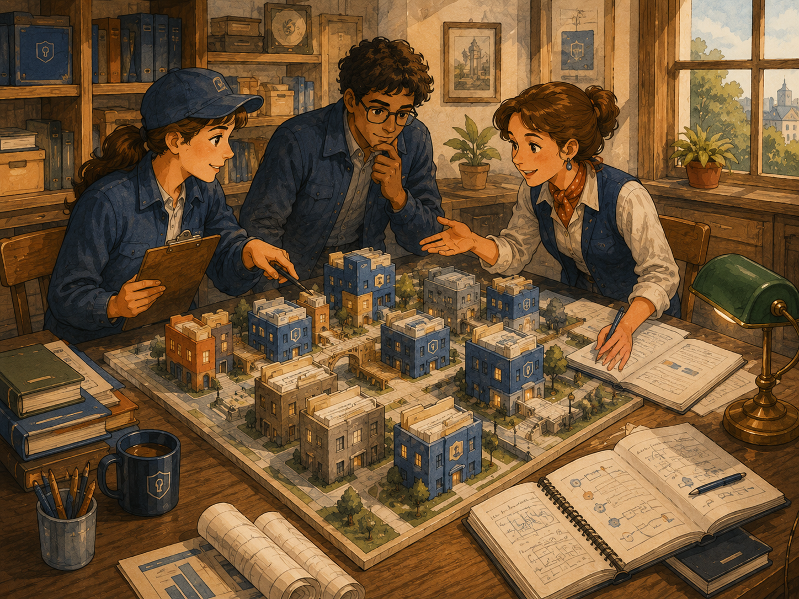
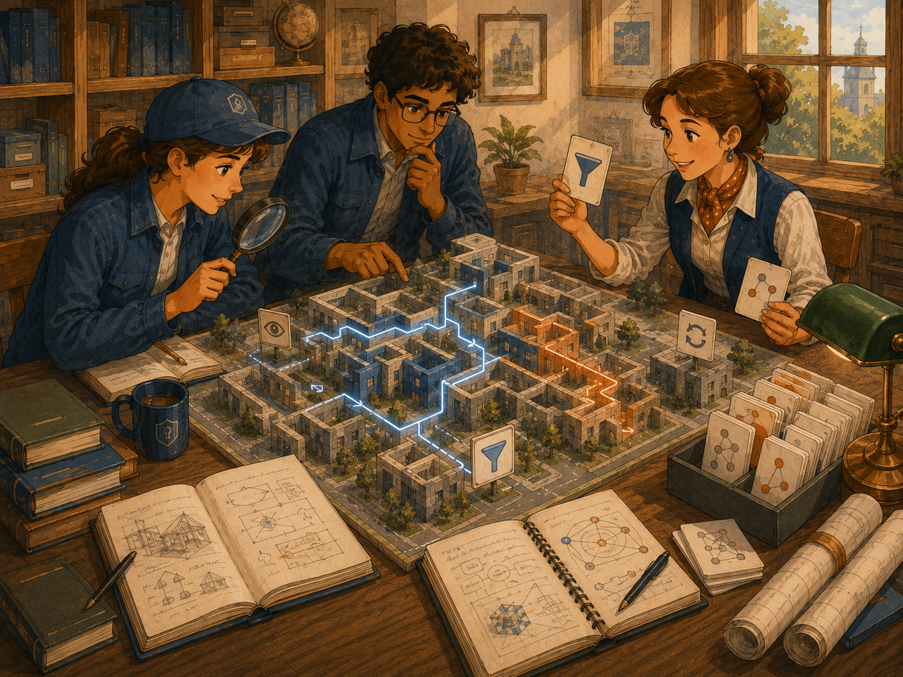

# Project Structure 3D

First-Time User Tutorial

Project Structure 3D is a source-safe visual map of an active KANDA project. It can create or incrementally update its own generated Project JSON in the external Project Support folder, then turns that evidence into an interactive three-dimensional graph without editing project source files.

Image note:

- Subject: A project represented as a carefully organized miniature city.
- Asset path: `assets/drawings/project_structure_3d_opener_city_map.png`.
- Alt text: Three colleagues inspect a miniature project city made of connected buildings, folders, and file cards in a warm study.
- Caption: Project Structure 3D helps you see the shape of the project, then inspect individual parts.
- Artwork status: `primary_contextual_project_structure_3d_raster`.

## What Project Structure 3D Means

Project Structure 3D displays a graph built from existing KANDA evidence.

**In plain English:** It is a visual map. Large groups become visible areas, individual project items become nodes, and relationships become connections.

It can help answer questions such as:

- Which packages contain the most structure?
- Which modules depend on one another?
- Where are classes and functions located?
- Which areas connect to external dependencies?
- Which nodes have semantic relationships?
- How does the architecture view differ from the physical structure view?

## What This Tab Does

Project Structure 3D lets you:

1. view fixture data before a project is selected;
2. create a fresh Project JSON ZIP family for visualization;
3. update an existing Project JSON incrementally;
4. load generated visualization evidence for the selected project;
5. switch between Architecture and Structure;
4. show or hide Imports;
5. show or hide External nodes;
6. show or hide Symbols;
7. show or hide Semantic relationships;
8. refresh project evidence;
9. search visible nodes;
10. fit the entire graph into view;
11. reset the camera;
12. open a local read-only browser preview;
13. navigate backward and forward;
14. return to Overview;
15. isolate or expand selected areas;
16. trace a path between nodes;
17. inspect selected-node details;
18. read renderer and evidence status.

## What This Tab Does Not Do

Project Structure 3D does not:

- replace Architecture Review;
- replace Project Structure Map;
- edit source files;
- write inside the selected project source tree;
- treat generated Project JSON as source authority;
- create project authority;
- validate a code change;
- freeze behavior;
- send project data to a remote website.

1

<strong>Start with Overview.</strong> Confirm the project and evidence badge before filtering or isolating nodes.

## Before You Start

Confirm that:

- the intended project is active;
- the project label shows the correct root;
- the Create Project JSON label is green when a valid JSON ZIP family exists and red when it does not;
- the source badge says whether the view is fixture or project evidence;
- the status line does not report a renderer failure;
- you understand that generated JSON is visualization support evidence, not source authority.

## Fixture Versus Live Project Evidence

Image note:

- Subject: A team compares a small demonstration model with a larger project model assembled from evidence.
- Asset path: `assets/drawings/project_structure_3d_evidence_layers.png`.
- Alt text: Three colleagues compare layered miniature project districts and evidence diagrams in a warm planning room.
- Caption: The fixture demonstrates the viewer. Live project evidence represents the selected project.
- Artwork status: `primary_contextual_project_structure_3d_raster`.

### Read-only fixture

Before a project is selected, the source badge says:

`READ-ONLY FIXTURE`

The project label says:

`Project: not selected`

The fixture exists so the viewer can open and demonstrate its controls.

It is not evidence from the user's current project.

### Live project evidence

After the active project is provided, the tab resolves canonical project evidence and updates:

- the project label;
- the source badge;
- the source status;
- the visible graph;
- the overview details.

Use **Refresh evidence** when the generated evidence has changed and the view needs to be rebuilt.

## Project JSON Controls

The label **JSON is necessary for visualization** identifies the evidence required by the live graph.

### Create Project JSON

Use **Create Project JSON** to discard the previous Project Structure 3D JSON family and build a fresh one from the selected project.

- The button text is green when a valid JSON ZIP family exists.
- The button text is red when it is missing or invalid.
- Creation runs outside the GUI thread and shows a sonar animation.
- JSON bytes are streamed directly into ZIP members instead of assembling the complete document in memory.
- ZIP parts are published in `<project>_show_project_to_AI/project_structure_3d_json`.
- Each ZIP part is limited to 450 MB.
- The previous published family remains available until the new family validates and publishes successfully.

### Update JSON Incrementally

Use **Update JSON Incrementally** after one successful full creation.

The incremental update uses a disk-backed index to:

- add new files and symbols;
- update changed files;
- remove deleted files;
- preserve unchanged records without reparsing them;
- publish a newly validated ZIP family.

If the incremental baseline is missing, run **Create Project JSON** first.

2

<strong>Source-safe boundary.</strong> These controls write generated visualization artifacts outside the selected project. They never modify project source files.

## Architecture and Structure Modes

### Architecture

Architecture mode emphasizes higher-level architectural relationships.

Use it when you want to understand:

- packages;
- modules;
- architectural grouping;
- dependency relationships;
- broader organization.

### Structure

Structure mode emphasizes the physical and symbolic shape of the project.

Use it when you want to inspect:

- paths;
- modules;
- classes;
- functions;
- detailed containment;
- individual graph nodes.

Changing the mode rebuilds the visible graph from the same source snapshot using the selected filters.

## Filters

Image note:

- Subject: Navigating a project model with filters, search, and highlighted paths.
- Asset path: `assets/drawings/project_structure_3d_navigation_filters.png`.
- Alt text: Three colleagues use filter cards, a magnifying glass, and illuminated paths to explore a miniature project city.
- Caption: Filters change what is visible. They do not alter the project evidence.
- Artwork status: `primary_contextual_project_structure_3d_raster`.

### Imports

Shows or hides import and dependency relationships represented by the current graph.

### External

Shows or hides nodes that represent external dependencies or outside components.

### Symbols

Shows or hides symbol-level nodes such as classes, functions, or other indexed symbols.

### Semantic

Shows or hides semantic relationships supplied by existing evidence.

Filters only affect the visible snapshot.

They do not delete evidence or change source files.

## Refresh Evidence

Click **Refresh evidence** when:

- the active project changed;
- Project JSON was created or incrementally updated;
- another compatible workflow updated Project Support evidence;
- the displayed graph appears stale.

The status line reports loading and renderer progress.

Refreshing evidence does not modify the project or regenerate Project JSON.

## Search

The search field accepts a package, module, class, function, dependency, or path.

Use this sequence:

1. type a specific name or path fragment;
2. press Enter or click Search;
3. read the status message;
4. inspect the highlighted or selected result.

If no visible graph node matches, the status line says so.

A node hidden by current filters may not be searchable until its category is visible again.

## Fit Graph

**Fit graph** adjusts the current camera so the visible graph fits the viewport.

Use it after:

- changing filters;
- expanding nodes;
- isolating an area;
- loading a different project;
- losing the graph outside the camera view.

## Reset Camera

**Reset camera** returns the renderer camera to its default orientation and distance.

It does not reset:

- filters;
- selected project;
- evidence;
- navigation history;
- isolated nodes.

## Open in Browser

**Open in browser** creates or opens a local read-only browser preview of the current graph.

The preview uses local generated documents.

It is not permission to navigate to remote websites.

External navigation is blocked by the embedded viewer.

## Navigation Bar

The navigation bar supports project-graph exploration.

Depending on the current selection and renderer state, controls may include:

- Back;
- Forward;
- Overview;
- Isolate;
- Expand;
- Collapse;
- Trace path.

### Back and Forward

Moves through viewer navigation history.

### Overview

Clears the focused view and returns to the graph overview.

### Isolate

Shows the selected node and its relevant neighborhood more clearly.

### Expand and Collapse

Changes the visible detail around a selected node or group.

### Trace path

Displays a relationship path between selected graph points when supported by the current renderer state.

## Selecting a Node

Click a visible node to select it.

The details panel updates with information supplied by the immutable graph snapshot.

The status line displays the selected label.

Click the background to clear selection and return to overview details.

## Details Panel

The right-side details panel shows either:

- overview information; or
- details for the selected node.

Node details may include:

- label;
- node type;
- path;
- package or module;
- symbol information;
- relationships;
- source evidence metadata;
- other snapshot fields.

The details panel is informational and read-only.

## Renderer Status

The bottom status label reports important states such as:

- preparing local renderer;
- loading canonical project evidence;
- loading local project graph;
- renderer page loaded;
- renderer bridge connecting;
- renderer ready;
- selected node;
- no search match;
- blocked external navigation;
- renderer diagnostics;
- renderer unavailable.

Read the status before assuming the graph failed.

## Qt WebEngine Fallback

The primary interactive viewer uses Qt WebEngine.

When Qt WebEngine is unavailable, the tab installs a contained fallback and reports the reason.

The browser preview may remain available even when the embedded renderer is unavailable.

The fallback does not silently send data elsewhere.

## Read-Only Safety Boundary

Image note:

- Subject: A project model remains separated from protected source records and write authority.
- Asset path: `assets/drawings/project_structure_3d_read_only_boundary.png`.
- Alt text: Three colleagues inspect a miniature project while protected source records remain behind a visible safety boundary.
- Caption: The 3D view owns only its generated visualization JSON. It never becomes the owner of source files or source write authority.
- Artwork status: `primary_contextual_project_structure_3d_raster`.

Project Structure 3D reads existing evidence and renders a filtered snapshot.

It must remain separate from:

- source modification;
- canonical scanning ownership;
- project support writing;
- validation authority;
- freeze confirmation.

**In plain English:** The map helps you understand the project. The map does not become the project.

## What Success Looks Like

A successful first session has:

1. the correct project label;
2. a clear fixture or evidence badge;
3. the graph loaded;
4. no unresolved renderer error;
5. Architecture and Structure modes working;
6. filters changing only visible content;
7. Search finding a known node;
8. Fit graph restoring the full view;
9. selection updating the details panel;
10. the source remaining unchanged.

## Common Mistakes

### Treating the fixture as project evidence

Check the source badge and project label.

### Hiding a category and then searching for it

Re-enable the relevant filter.

### Confusing Architecture with Structure

Switch modes and compare the result.

### Assuming Refresh scans the project independently

Refresh rebuilds from canonical existing evidence.

### Assuming Open in browser publishes the graph

It opens a local read-only preview.

### Expecting filters to alter evidence

Filters only change the visible graph snapshot.

### Treating the 3D view as validation

The graph can reveal relationships, but it does not prove a patch is correct.

## If Something Goes Wrong

### The view still shows the fixture

Confirm that an active project root was supplied to the tab, then click Refresh evidence.

### The graph is empty

Check:

- active project;
- source badge;
- status line;
- current filters;
- evidence availability;
- renderer diagnostics.

### Search finds nothing

Check spelling, filters, and whether the node exists in the selected mode.

### The camera is lost

Click Fit graph, then Reset camera if needed.

### The embedded renderer is unavailable

Read the status reason and use Open in browser when available.

### The graph looks stale

Refresh canonical project evidence through its owning workflow, then click Refresh evidence here.

### A remote link was blocked

This is expected safety behavior. The viewer only permits its approved local visualizer resources.

## First-Time Checklist

Before exploring:

- [ ] Correct project selected
- [ ] Project label checked
- [ ] Source badge checked
- [ ] Renderer status checked
- [ ] Read-only boundary understood

While exploring:

- [ ] Architecture and Structure compared
- [ ] Filters changed deliberately
- [ ] Search tested with a known item
- [ ] Fit graph tested
- [ ] Node details inspected
- [ ] Overview restored

Before relying on a conclusion:

- [ ] Fixture not mistaken for evidence
- [ ] Hidden filters considered
- [ ] Canonical evidence freshness confirmed
- [ ] Important finding verified in its owning source or workflow
- [ ] No source modification assumed

## Final Rule

**Use Project Structure 3D to understand and navigate canonical project evidence, but verify important conclusions in the owning evidence or source workflow and keep the viewer strictly read-only.**
