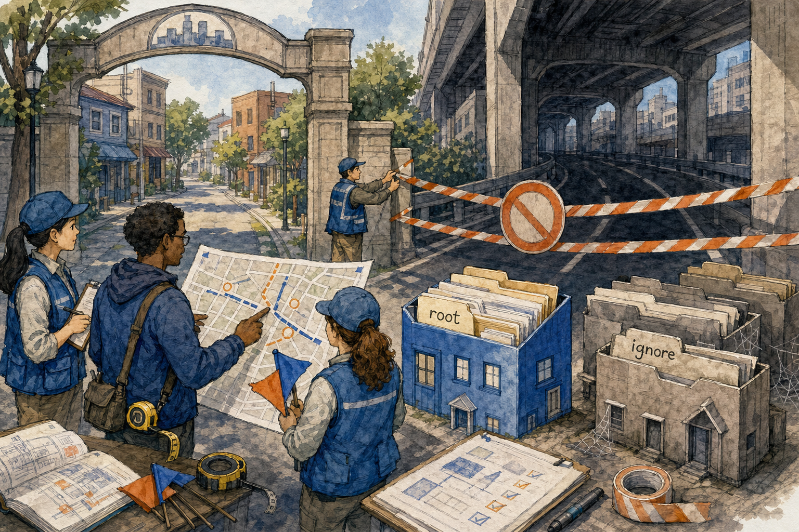
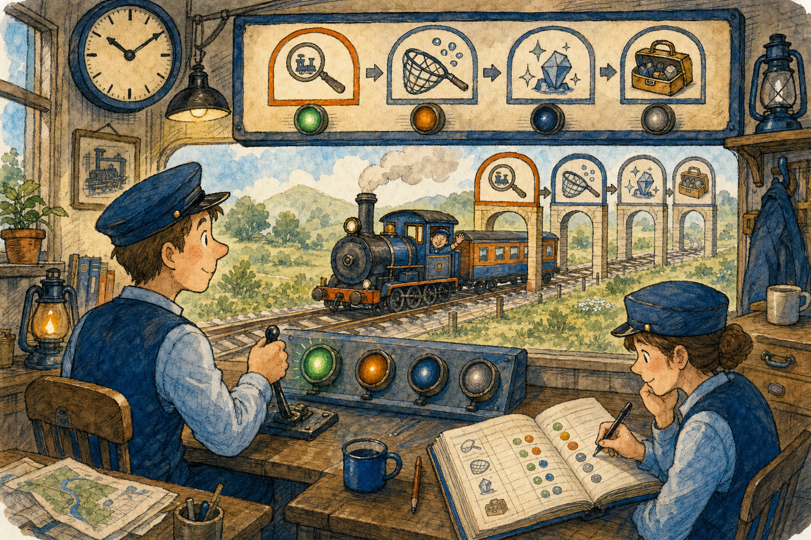

# Show Project to AI

Page summary: **Show Project to AI prepares two upload groups so an AI first learns how it must work and then learns the actual project.** This tutorial is written for a first-time user with no programming background.

Image note:

- Subject: the selected project being prepared as an understandable map for an AI.
- Asset path: `assets/drawings/project_structure_map_opener_city_planning.png`.
- Alt text: Hand-drawn city-planning cartoon where people organize a project map, instruction books, and upload packages for an AI.
- Caption: First give the AI its rule book; then give it the project map.
- Artwork status: `primary_characterful_raster`.

## What This Tab Does

**In plain English:** This tab prepares the files an AI needs before it can safely help with your project. It does not change your application code. It creates copies, summaries, indexes, archives, instructions, and status files for the AI to read.

The AI needs two different kinds of context:

1. **First Prompt Files** - the rule book that tells the AI how to work, which safeguards to follow, and how to request more context.
2. **Second Prompt Files** - the current project map, source archives, images, Error Memory, validation state, and handoff information.

The order matters. The AI must learn the rules before receiving the project.

## Before You Start

Image note:

- Subject: selecting the correct project folder and avoiding the wrong drive or folder.
- Asset path: `assets/drawings/project_structure_map_scope_survey.png`.
- Alt text: Hand-drawn survey crew selecting one project district while a broad drive route is blocked.
- Caption: Select the project itself, not the whole drive.
- Artwork status: `primary_characterful_raster`.

1. Open the **Show Project to AI** tab.
2. Check **Project Root**. This must be the main folder of the project you want the AI to work on.
3. Use **Browse...** when the displayed folder is wrong.
4. Finish any large copy, update, or build operation that is still changing the project.
5. Leave the ZIP limit at **500 MB** unless the AI service requires smaller files.

Example Project Root:

`E:\kanda_reasoner`

A wrong Project Root creates a handoff for the wrong project.

## Recommended First-Time Workflow

Image note:

- Subject: one workflow moving through First Prompt Files, Second Prompt Files, and AI-ready checkpoints.
- Asset path: `assets/drawings/project_structure_map_run_stations.png`.
- Alt text: Hand-drawn station workflow showing instructions first, project files second, and an AI-ready destination.
- Caption: Follow the stations in order; do not send the task before the ready checkpoint.
- Artwork status: `primary_characterful_raster`.

1. Confirm **Project Root**.
2. Select the ZIP size.
3. Click the green **Create First and Second Prompt Files** button.
4. Wait until First Prompt Files finish successfully.
5. Wait until Second Prompt Files and ZIP export finish successfully.
6. Click **Path to First Prompt Files** and open that folder.
7. Start a new AI conversation and upload the First Prompt Files.
8. Wait for the AI to return **STARTUP PACK LOAD CHECK** with status **COMPLETE**.
9. Click **Path to Second Prompt Files** and open that folder.
10. Upload the Second Prompt Files.
11. Wait for **PROJECT READY CHECK** ending with **WAIT_FOR_TASK**.
12. Only then describe the real programming task.

## Why First Prompt Files Must Be Uploaded First

Think of a new employee:

- **First Prompt Files** are the employee handbook, safety training, and working rules.
- **Second Prompt Files** are the building map, current records, source material, and job folder.

Uploading the project before the rules can make the AI read a large amount of information without knowing the project's required boundaries, validation process, or freeze safeguards.

## Main Buttons and Fields

### Create First and Second Prompt Files

This is the green button and the recommended choice for a new AI session. It creates the two groups in the correct order. The second group starts only after the first group finishes cleanly.

It does not send anything to an AI automatically. You still upload the created files yourself.

### Project Root

This field identifies the project being prepared. Confirm it every time you switch projects.

### Browse...

Opens a folder chooser so you can select the correct Project Root without typing the path.

### Create First Prompt Files

Creates only the startup instructions and prompt-library delivery. Use it when the AI startup rules must be refreshed but the project handoff is still current.

### Path to First Prompt Files

Opens the folder containing the first upload group. The usual location is:

`E:\kanda_reasoner_show_project_to_AI\first_prompt_files`

### Create Second Prompt Files

Creates the current project handoff, runs the collector workflow, prepares Error Memory exports, and creates the upload ZIP packages. Use it after meaningful project changes when the First Prompt Files remain current.

### Path to Second Prompt Files

Opens the folder containing the second upload group. The usual location is:

`E:\kanda_reasoner_show_project_to_AI\second_prompt_files`

### ZIP size limit

Controls the maximum target size of each standalone ZIP part. It does not reduce project quality or remove source. It only determines how many upload parts are created.

- **500 MB:** fewer files; best when large uploads are accepted.
- **400, 300, or 200 MB:** middle choices when large uploads are unreliable.
- **100 MB:** more numbered parts; useful for strict upload limits.

When a file name says `part01_of_03`, all three parts belong together. Upload every part in numerical order.

## Where Files Are Created and Why

Image note:

- Subject: source project materials staying in one workshop while generated AI support files are organized in a separate records room.
- Asset path: `assets/drawings/project_structure_map_records_workshop.png`.
- Alt text: Hand-drawn records workshop separating original project materials from generated AI handoff folders.
- Caption: Keep original project files and generated handoff files in separate rooms.
- Artwork status: `primary_characterful_raster`.

The generated files are normally created beside the project, not inside it.

Project source:

`E:\kanda_reasoner`

Generated AI support area:

`E:\kanda_reasoner_show_project_to_AI`

This separation prevents generated ZIPs and evidence files from being mistaken for application source, scanned again as project code, added to version control, or mixed with files that developers edit directly.

## What the Second Prompt Files Contain

Image note:

- Subject: project information organized into a readable archive for AI handoff.
- Asset path: `assets/drawings/project_structure_map_evidence_archive.png`.
- Alt text: Hand-drawn archive where project structure, source indexes, validation records, and Error Memory are organized for an AI.
- Caption: The handoff is an organized library, not one unexplained pile of files.
- Artwork status: `primary_characterful_raster`.

- **_RUN_COLLECTOR_STATUS.txt:** confirms whether collection and ZIP export completed.
- **ai_handoff_upload ZIP:** preferred compact AI-readable project briefing.
- **Compact Error Memory files:** current lessons about mistakes that should not be repeated; normally read every session.
- **source_archive_partXX_of_YY ZIP:** exact project source split into standalone parts when needed.
- **png_assets_partXX_of_YY ZIP:** image assets used when visual inspection or exact reconstruction matters.
- **error_memory_full ZIP:** complete Error Memory; open only for repeated-error debugging, an Error Memory audit, or when compact lessons are insufficient.
- **ai_handoff_all_in_one ZIP:** convenience or fallback archive; normally do not prefer it over `ai_handoff_upload`.

## Orange-Label Reminder Buttons

Image note:

- Subject: a shipping desk selecting one clearly labeled reminder card instead of sending every manual again.
- Asset path: `assets/drawings/project_structure_map_zip_shipping.png`.
- Alt text: Hand-drawn shipping desk where a user selects one orange reminder card for an AI conversation.
- Caption: Paste the smallest reminder that matches what the AI forgot.
- Artwork status: `primary_characterful_raster`.

The orange-label buttons copy focused instructions to the clipboard. They do not recreate First or Second Prompt Files. Use them during a long conversation when the AI starts forgetting a specific rule.

Do not paste every orange reminder by default.

### Answer, Validate, Freeze, Memorize Error

Use when the AI forgets the complete work cycle. It reminds the AI that writing an answer or patch is not the same as validating it, and that freeze and Error Memory have separate governed steps.

### Clean 2sec 2xEnter

Use when PowerShell or terminal instructions end incorrectly. It restores the terminal-cleanup rule:

- successful installation: wait about two seconds and clear the terminal;
- validation, freeze, diagnostics, and errors: wait for two Enter presses and then clear the terminal;
- keep the terminal window open.

### Bridges: Startup

Use when the AI forgets permanent beginning-of-session rules such as module-size limits, project boundaries, no-leak behavior, durable document routing, terminal cleanup, or runtime evidence.

### Bridges: On Demand

Use when the AI knows specialist guidance is needed but has forgotten which routed prompt or owner to load.

### Anti-hallucination: short

Use for a compact reminder when the AI starts guessing paths, file contents, symbols, source behavior, or validation results.

### Anti-hallucination: full

Use for difficult, repeated, high-risk, or evidence-heavy work. It requires stronger separation between verified facts, current source evidence, inference, uncertainty, and outside information.

### Machine-Card: MCard Logic

Use only for Architecture Review Machine-Card work. It restores card ownership, synchronization, lifecycle, and stale-state safeguards.

## Status and Log Areas

The status labels show whether a process is idle, running, finished, or failed. The log records stages, paths, warnings, counts, and errors.

Do not assume that files appearing in a folder means the complete operation succeeded. Read the final status and the last log messages.

## How to Know the AI Is Ready

After uploading First Prompt Files, expect:

- `STARTUP PACK LOAD CHECK`
- startup status `COMPLETE`
- next action waiting for project files

After uploading Second Prompt Files, expect:

- `PROJECT READY CHECK`
- the correct project slug and root
- compact Error Memory loaded
- second-upload handoff loaded
- next action `WAIT_FOR_TASK`

## Common First-Time Mistakes

- Sending the real task before `PROJECT READY CHECK`.
- Uploading Second Prompt Files first.
- Selecting the wrong Project Root.
- Uploading only one numbered ZIP part.
- Opening full Error Memory for every task.
- Assuming a summary replaces exact source inspection.
- Pasting every orange reminder instead of the relevant one.
- Assuming successful file creation means application code was validated.

## Complete Example

You want an AI to add a button to `E:\kanda_reasoner`.

1. Select `E:\kanda_reasoner` as Project Root.
2. Leave ZIP size at 500 MB.
3. Click **Create First and Second Prompt Files**.
4. Upload the files from `first_prompt_files`.
5. Wait for `STARTUP PACK LOAD CHECK`.
6. Upload the files from `second_prompt_files`.
7. Wait for `PROJECT READY CHECK` ending in `WAIT_FOR_TASK`.
8. Describe the new button and where it should appear.
9. The AI should inspect exact source before proposing changes.
10. If the AI later skips validation, use **Answer, Validate, Freeze, Memorize Error** and paste the copied reminder.

## Quick Reference

| Need | Use |
| --- | --- |
| Start a new AI work session | Create First and Second Prompt Files |
| Refresh only startup rules | Create First Prompt Files |
| Refresh only project context | Create Second Prompt Files |
| Find upload group one | Path to First Prompt Files |
| Find upload group two | Path to Second Prompt Files |
| Restore the full work cycle | Answer, Validate, Freeze, Memorize Error |
| Fix terminal ending behavior | Clean 2sec 2xEnter |
| Restore daily rules | Bridges: Startup |
| Request specialist routing | Bridges: On Demand |
| Stop AI guessing | Anti-hallucination short or full |
| Restore Machine-Card rules | MCard Logic |

## Authority Boundary

Show Project to AI creates context and handoff files. It does not automatically upload them, change project source, prove a patch is correct, validate application behavior, or freeze a feature.

## Validation Rule

This help page must remain local-only and keep the existing KANDA book layout, shared CSS, fonts, orange/blue design, responsive behavior, six local cartoon images, source/rendered separation, and `project_structure_map.json` help route.
