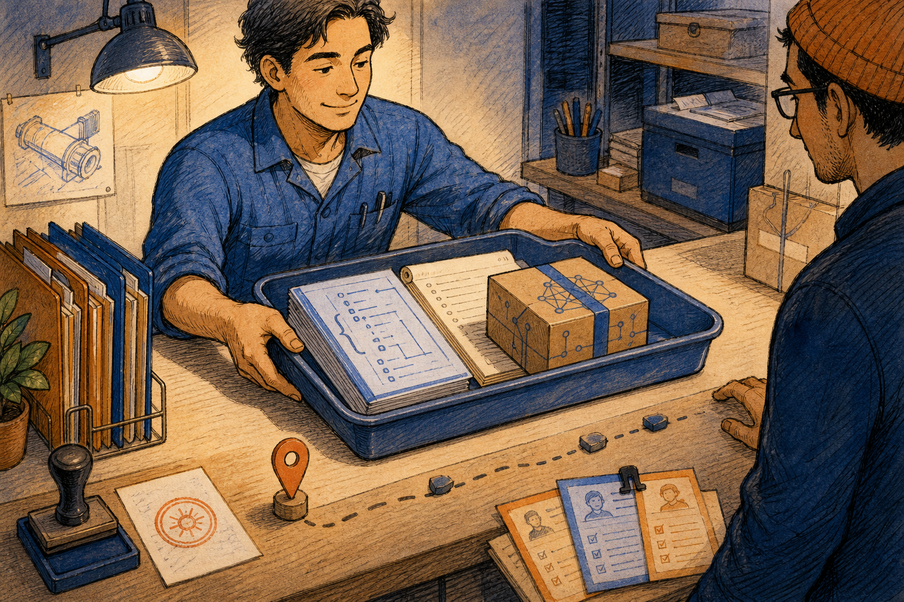

# Refactor Report

Mode selected: Creation Pipeline. The previous Refactor Report help was only a basic fallback catalog, so this page corrects it with rich Markdown source, rendered HTML, manifest routing, and local raster artwork.

Refactor Report builds a daily refactor state vector. It can scan one project folder, compile pasted or loaded state-vector JSON, write the report output tree, and save an AI bundle for review handoff.

Image note:

- Subject: Refactor Report as a workshop desk where engineers compile project structure into a state-vector report.
- Asset path: `assets/drawings/refactor_report_opener_workshop.png`.
- Asset format and display role: local PNG primary characterful raster artwork for the chapter opener.
- Alt text: Hand-made workshop cartoon where engineers study project folders, dependency strings, a report ledger, and an AI bundle box.
- Caption: Refactor Report turns project evidence into a state-vector workbench.
- Prompt summary: hand-made editorial cartoon, daily-life workshop metaphor, expressive engineers, report ledger, dependency network, AI bundle box, KANDA blue/orange accents, visible ink hatching and paper texture, original scene only.
- Density-rule justification: this is the opener drawing for a larger help file with several distinct workflow themes.
- Section analogy source: the opening explanation compares report compilation to a practical workshop preparing a structured ledger.
- Artwork status: `primary_characterful_raster`.
- Visual-inspection result: PASS - expressive hand-made raster scene with folders, graph props, report papers, blue/orange accents, visible hatching, and no simple vector-placeholder look.

## What Problem This Solves

**Technical:** Refactor Report is registered as the `refactor_report` lazy tool. The shell loads `kanda_reasoner_app.daily_rfctr_report.daily_refactor_report.StateVectorCompiler`, which is a desktop Qt window for building a canonical state-vector report from either a selected project folder or existing JSON/text input. Its invariant is evidence compilation: it can read project files, derive or merge state-vector data, write JSON reports and AI bundles, and refresh extraction; it must not patch source code or treat a generated report as proof that source files changed.

**In plain English:** Think of a workshop ledger. Mode A brings in the project folders and measures them. Mode B brings in an already-written ledger page. The output folder stores the finished book, and the AI bundle is the boxed copy sent to the next reviewer. If the wrong folders, stale JSON, or ambiguous output path are used, the next AI or human reviewer will reason from the wrong ledger.

> **Further reading:** Local code: `kanda_reasoner_app/reasoner_tools_gui_shell/tool_specs.py`, `kanda_reasoner_app/daily_rfctr_report/daily_refactor_report.py`, `kanda_reasoner_app/daily_rfctr_report/daily_refactor_report_help/source_loader_private_impl.py`, and the source parts under `kanda_reasoner_app/daily_rfctr_report/daily_refactor_report_help/`. Technical source categories: Qt for Python widgets, Python `json`, `pathlib`, file-dialog behavior, and deterministic artifact writing.

## Layout Research Note

This page follows the established KANDA book-help layout: chapter opener, section drawings, technical explanation, plain-English explanation, a dense control table, checklist, authority boundary, and validation rule. No remote CSS, fonts, icons, screenshots, or marketing patterns were added. The local PNGs are illustrations for comprehension, not hidden controls.

## Mode A Project Folder Scan

Image note:

- Subject: Mode A as a desk scan of one selected project folder.
- Asset path: `assets/drawings/refactor_report_mode_a_scan_workbench.png`.
- Asset format and display role: local PNG primary characterful raster artwork for project-folder scanning.
- Alt text: Hand-made workbench cartoon where an engineer surveys project folders and a scanner turns source pages into a report packet.
- Caption: Mode A scans the selected project folder into structured report evidence.
- Prompt summary: hand-made editorial cartoon, project folder survey, source sheets, scanner lamp, generated report packet, measuring tools, checklists, KANDA blue/orange accents, visible ink hatching, original scene only.
- Density-rule justification: this drawing covers Mode A folder selection, source scanning, and extraction freshness as one major section.
- Section analogy source: the Mode A explanation compares extraction to a measured folder survey.
- Artwork status: `primary_characterful_raster`.
- Visual-inspection result: PASS - clear hand-made project survey scene with folder trays, scanner light, report stack, checklists, and no UI screenshot.

**Technical:** Mode A is the project-file path. Use `Select Project Folder...` in the `Mode A: from project files` area before compiling a fresh report. The tab uses the selected folder as the evidence root and derives a state vector that describes project structure, complexity, dependency shape, governance signals, churn, and refactor pressure. `Force Re-extract` belongs here when cached extraction may be stale after file moves, large refactors, generated-source changes, or failed prior runs.

**In plain English:** Put the right project box on the bench before measuring it. If you scan yesterday's box, a parent folder, or a half-generated workspace, the ledger may look clean while describing the wrong job.

> **Further reading:** Local code: `daily_refactor_report.py` through the loader source parts. Technical source categories: folder selection with Qt, `pathlib.Path`, JSON serialization, and read-only source traversal.

## Mode B Existing State Vector

**Technical:** Mode B is the existing-data path. Use it when you already have pasted chat output, a current state JSON, a state history JSON, or a prior bundle that should be loaded, inspected, or compiled again. `Load Existing JSON` supplies a canonical input file, and pasted text can be used when the state vector was produced outside the current run. This mode is for controlled reuse; it should not silently mix unrelated project evidence.

**In plain English:** Instead of bringing the whole project box back to the bench, you bring a ledger page that was already prepared. That saves time, but only if the page belongs to this project and this date of review.

## Output JSON And AI Bundle Path

**Technical:** `Output JSON` is the report identity and storage target. The `Choose Folder` control selects where the daily refactor output tree should be written. `AI Bundle Path` is optional: if unset, the tool uses its default `daily_refactor/bundles` location; if set with `Set Bundle Path...`, the final AI handoff JSON is written to that exact file path. `Clear` removes that override and returns to the default bundle behavior.

**In plain English:** The report name and folder are the shelf label for the finished ledger. The bundle path is a special shipping address. Use the special address only when another workflow expects the box in that exact place.

## Compile, Refresh, And Save Bundle

**Technical:** `Compile State Vector` runs the normal report pipeline for the selected mode. `Force Re-extract` bypasses reusable extraction state so the compiler rebuilds evidence from current inputs. `Save Bundle Now` writes the AI bundle from the last successful compiled state, which is useful when the report exists but the bundle file needs to be regenerated. These commands depend on a valid source: selected project folder for Mode A, or valid existing JSON/text for Mode B.

**In plain English:** Compile makes the ledger. Force Re-extract remeasures the source before writing. Save Bundle Now makes a fresh boxed copy from the ledger already on the desk.

## Control Reference

| Area | Control or Artifact | Technical Meaning | In Plain English |
| --- | --- | --- | --- |
| Shell | Help | Opens this local rich help page through the lazy-tab shell. | Opens the guide for the report workbench. |
| Mode A | Mode A: from project files | Selects project-folder scanning as the input path. | Bring the project box to the bench. |
| Mode A | Select Project Folder... | Opens a folder picker for the project root to scan. | Choose the exact project box. |
| Step 2 | Output JSON | Report name and output identity used for generated files. | The ledger label. |
| Step 2 | Choose Folder | Selects the output folder for the daily refactor output tree. | Choose the shelf for finished ledgers. |
| Step 2 | Load Existing JSON | Loads an existing state-vector, history, or bundle JSON. | Bring in a ledger page that already exists. |
| Step 2b | AI Bundle Path | Optional exact output file for the AI handoff bundle. | The special shipping address. |
| Step 2b | Set Bundle Path... | Opens a file/path chooser for the bundle override. | Put the boxed copy in a fixed place. |
| Step 2b | Clear | Removes the bundle path override. | Use the normal shipping shelf again. |
| Mode B | Mode B: from pasted text / existing JSON | Uses pasted text or loaded JSON instead of scanning files. | Work from an existing ledger page. |
| Command | Compile State Vector | Runs the normal report compile pipeline. | Write the finished ledger. |
| Command | Force Re-extract | Rebuilds extracted evidence instead of trusting cached state. | Remeasure the project box. |
| Command | Save Bundle Now | Writes a bundle from the last successful compiled state. | Box the current ledger for handoff. |
| Artifact | Daily refactor report JSON | Structured report output used for follow-up review. | The finished ledger. |
| Artifact | AI bundle JSON | Compact handoff artifact for AI review. | The boxed copy for the next reviewer. |

## Operating Checklist

1. Decide whether this is a fresh project scan or an existing state-vector compile.
2. For Mode A, use `Select Project Folder...` on the real repository root, not a broad parent folder.
3. For Mode B, paste or load JSON that belongs to the same project and review date.
4. Set a clear `Output JSON` name and choose the intended output folder.
5. Set `AI Bundle Path` only when a downstream workflow needs an exact file path.
6. Use `Compile State Vector` for the normal run.
7. Use `Force Re-extract` after large refactors, generated-source changes, file moves, or suspected stale cache.
8. Use `Save Bundle Now` only after a successful compile.
9. Treat generated reports and bundles as evidence artifacts, not source-code edits.

## Authority Boundary

Image note:

- Subject: saving the AI bundle as a controlled handoff package.
- Asset path: `assets/drawings/refactor_report_bundle_shipping_desk.png`.
- Asset format and display role: local PNG primary characterful raster artwork for bundle handoff.
- Alt text: Hand-made shipping-counter cartoon where an engineer hands over a tray with a JSON ledger, review notes, and a boxed AI bundle.
- Caption: The bundle is a handoff package, not a source-code patch.
- Prompt summary: hand-made editorial cartoon, shipping counter, structured JSON ledger, review notes, compact AI bundle box, save stamp, path marker, KANDA blue/orange accents, visible ink hatching, original scene only.
- Density-rule justification: this drawing covers AI bundle output, explicit path handoff, and source-edit authority boundaries.
- Section analogy source: the boundary explanation compares bundle writing to shipping a copy of the report.
- Artwork status: `primary_characterful_raster`.
- Visual-inspection result: PASS - clear hand-made handoff scene with report papers, bundle box, path marker, desk lamp, expressive people, and no UI screenshot.

Refactor Report is a report compiler and handoff packer. It can scan selected project files, parse existing JSON/text, write daily refactor JSON outputs, refresh extraction, and save an AI bundle. It must not edit Python source, approve a refactor plan, delete prior evidence, or imply that a source change happened merely because a report was generated.

## Further Reading Map

- **Shell registration:** `kanda_reasoner_app/reasoner_tools_gui_shell/tool_specs.py`.
- **Public facade:** `kanda_reasoner_app/daily_rfctr_report/daily_refactor_report.py`.
- **Implementation loader:** `kanda_reasoner_app/daily_rfctr_report/daily_refactor_report_help/source_loader_private_impl.py`.
- **Preserved implementation source:** `kanda_reasoner_app/daily_rfctr_report/daily_refactor_report_help/daily_refactor_report_source_part_*_private_impl.py`.
- **Fallback help catalog:** `kanda_reasoner_app/reasoner_tools_gui_help/refactor_report.json`.
- **External technical grounding categories:** Qt for Python widgets and dialogs, Python `pathlib`, `json`, deterministic artifact writing, and file-system path containment.

## Validation Rule

The Refactor Report help document must remain local-only: Markdown source, rendered HTML, book-help CSS, local PNG artwork, manifest mapping from `refactor_report.json`, shell-level Help button ownership, stable `Refactor Report` title, real Mode A/Mode B control coverage, and no remote resources.
