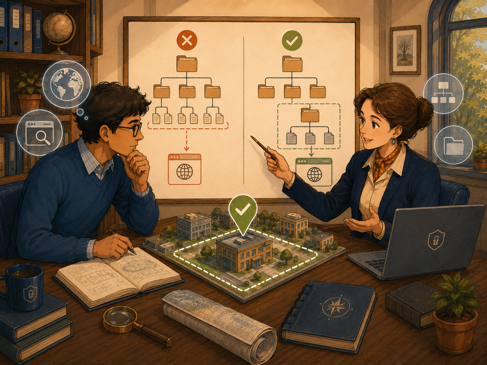
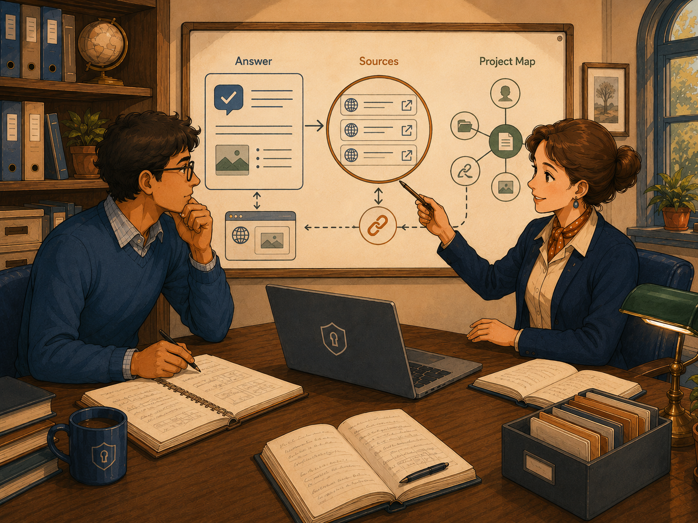
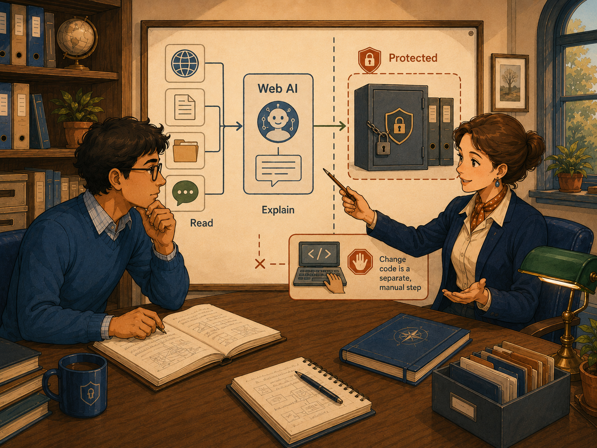

# Web AI

First-Time User Tutorial

Web AI helps you ask questions that combine current web information with the project context available inside KANDA Reasoner. It can explain topics, compare options, collect sources, connect an answer to project areas, and prepare a read-only change preview.

Image note:

- Subject: Web AI combining web research, project folders, and a clear answer.
- Asset path: `assets/drawings/web_ai_opener_research_desk.png`.
- Alt text: An engineer and an adviser review a laptop, organized project folders, a web-search symbol, source links, and a checked answer.
- Caption: Web AI combines web research with the selected project context and returns an answer that can be checked.
- Artwork status: `primary_contextual_web_ai_raster`.

## What Web AI Means

Web AI is the web-connected assistant in KANDA Reasoner.

It can use information from the web and information prepared from your selected project.

**In plain English:** Web AI is like a research assistant with two desks. One desk holds current web sources. The other desk holds the project context that KANDA has prepared. The assistant compares both before answering.

Web AI is useful when a question depends on:

- current documentation;
- recent technical information;
- external standards or services;
- comparison with public sources;
- project-specific files, symbols, or workflows;
- a combination of web research and project context.

## What This Tab Does

Web AI can:

1. Answer a question in plain English.
2. Search for current external information.
3. use available project context;
4. show source links;
5. relate an answer to project areas;
6. preserve project-specific conversation memory;
7. create a read-only Shadow Preview;
8. export or copy conversation material.

Web AI does not automatically modify the project.

1

<strong>The safest first-time order is Select the project, confirm the model, ask one focused question, read the sources, inspect the project mapping, and use Shadow Preview only after the answer is clear.</strong>

## Before You Start

Before your first Web AI question:

1. Select the correct project.
2. Confirm that the project context is current.
3. Open Config AI and confirm the web model.
4. Check that internet access is available.
5. Start a new session when changing projects or topics.
6. Ask one focused question.
7. Read the sources before acting on an important answer.

!

<strong>A polished answer is not the same as a verified answer.</strong> Important claims should be checked against the displayed sources and the relevant project evidence.

## The Safest First-Time Workflow

### Step 1 - Select the correct project

Use the project selector and confirm the displayed project path.

Do not select an entire drive when you only need one project.

### Step 2 - Confirm the web model

Open **Config AI** and check:

- provider;
- model;
- API key or authenticated connection when required;
- whether the selected model supports web use;
- whether the model is currently available.

### Step 3 - Start a clean session

Use **New session** when beginning a separate topic or after changing projects.

This reduces the chance that old conversation assumptions affect the new answer.

### Step 4 - Ask one focused question

Type one clear request in the message box.

A useful first question is:

`Using current official sources, explain how this project should authenticate with the selected service, and show which project files are probably involved.`

### Step 5 - Read the answer

Read the answer from beginning to end.

Notice whether the assistant separates:

- confirmed facts;
- project-specific findings;
- assumptions;
- uncertainty;
- recommendations.

### Step 6 - Inspect the sources

Open the source links used for important claims.

Prefer official documentation, primary sources, and current material.

### Step 7 - Inspect the project connection

Use the project map, file evidence, symbol evidence, or Brain Navigator connection available in the tab.

Confirm that the answer points to the correct project area.

### Step 8 - Use Shadow Preview only when needed

Shadow Preview is for reviewing a proposed change or structured result without automatically writing it to source files.

Read the preview carefully before using any separate implementation workflow.

## Selecting the Correct Project

Image note:

- Subject: Choosing one correct project boundary before web research.
- Asset path: `assets/drawings/web_ai_project_scope_selection.png`.
- Alt text: A planning team compares incorrect broad folder selections with one correctly bounded project area connected to web research.
- Caption: Web research becomes more useful when the selected project boundary is correct.
- Artwork status: `primary_contextual_web_ai_raster`.

The selected project tells Web AI which local context is relevant.

### Good project selection

Choose the folder that contains the actual project.

It usually contains source folders, configuration files, documentation, and project-level metadata.

### Poor project selection

Avoid selecting:

- the whole drive;
- a parent folder containing many unrelated projects;
- an old project copy;
- an export folder;
- a temporary patch folder.

### After the project changes

Refresh or rebuild the project context after meaningful source changes.

Old project context can produce old project answers even when the web information is current.

## Web Model and Provider Controls

### Open Config AI

Opens the shared AI configuration.

Use it to select and verify the provider and model.

### Provider

The provider is the external service that supplies the web-connected model.

### Model

The model is the specific AI system used for the answer.

Different models may vary in:

- speed;
- cost;
- context size;
- web-search support;
- source quality;
- code reasoning;
- answer detail.

### API key or authenticated connection

Some providers require a key or signed-in connection.

Do not paste private keys into the conversation.

### Refresh models

Refreshes the model list after changing provider configuration or account access.

### Web-search setting

When the tab offers a web-search switch or related setting, enable it for questions requiring current external information.

A question about only the loaded project may not need a web search.

## Asking a Good Question

A good Web AI question contains:

1. the topic;
2. the exact task;
3. the project area when relevant;
4. the preferred source type;
5. the expected output.

### Good examples

- `Use official documentation to explain the current authentication flow for this service and relate it to the project's login modules.`
- `Compare the two current libraries for this task and identify which one fits this project's architecture better.`
- `Find the latest official migration guidance, then show which project files would be affected.`
- `Explain this error using current documentation and the displayed project evidence.`

### Weak examples

- `Fix everything.`
- `Tell me about the internet.`
- `Is this good?`
- `What should I do?`

Broad questions can produce broad answers that are difficult to verify.

## Conversations and Memory

### New session

Starts a clean conversation.

Use it for a new project or unrelated topic.

### Conversation history

Stores previous Web AI exchanges for the current workflow.

### Project memory

Project memory can preserve helpful project-specific context between questions.

It can also preserve old assumptions.

### Clear memory

Use Clear memory when:

- changing projects;
- testing a clean answer;
- old context is confusing the result;
- project architecture has changed significantly.

Clearing conversation memory does not delete source files.

## Reading an Answer Correctly

Image note:

- Subject: Reading the answer together with sources and the project map.
- Asset path: `assets/drawings/web_ai_answer_sources_project_map.png`.
- Alt text: An adviser explains a board that connects an answer to web sources, links, files, and a project map.
- Caption: A Web AI answer should be read together with its sources and project connection.
- Artwork status: `primary_contextual_web_ai_raster`.

### Main answer

The main answer is the assistant's explanation.

It may combine web research and project reasoning.

### Sources

Sources show where external claims came from.

Open important sources and check:

- publisher;
- date;
- whether the page is official;
- whether the page actually supports the claim;
- whether a newer version exists.

### Project evidence

Project evidence may include files, symbols, project-map areas, or other collected context.

It explains why the answer relates to a particular part of the project.

### Related topics

Related topics can help you explore the subject further.

They are suggestions, not required next steps.

### Uncertainty

A good answer should identify uncertainty when the evidence is incomplete.

Ask:

`Which parts of this answer are confirmed, inferred, or still uncertain?`

## Source Quality

Not every web page has the same value.

Prefer:

1. official product documentation;
2. official standards;
3. original research;
4. official repositories and release notes;
5. direct provider documentation;
6. reputable technical references.

Be cautious with:

- copied articles;
- old tutorials;
- unsourced summaries;
- forum answers without verification;
- search snippets without opening the page;
- pages describing older software versions.

## Brain Navigator and Project Mapping

Web AI can connect an answer to project areas through project mapping or Brain Navigator.

Use this when you need to understand:

- which feature area is involved;
- which files may own the behavior;
- how one part of the project connects to another;
- where to inspect exact source;
- whether the answer belongs to the current project scope.

Project mapping is navigation assistance.

It is not proof that every relevant file was found.

## Shadow Preview

Shadow Preview shows a proposed change or structured result in a read-only review window.

Use it to inspect:

- proposed text;
- affected areas;
- expected change intent;
- possible source relationship;
- warnings or uncertainty.

Shadow Preview does not itself grant permission to write.

A separate governed implementation and validation process is still required.

!

<strong>Preview is observation, not installation.</strong> Do not confuse a convincing preview with a completed, validated source change.

## Copying and Exporting

Depending on the available controls, Web AI may let you:

- copy an answer;
- copy a source link;
- export a conversation;
- save Markdown;
- preserve a research record.

Check exported material before sharing it.

Exports may contain:

- project paths;
- source links;
- conversation context;
- code excerpts;
- provider output.

Do not share confidential project material unintentionally.

## What Web AI Can and Cannot Prove

Web AI can:

- collect current sources;
- explain external information;
- combine web information with project context;
- compare options;
- identify likely project areas;
- prepare a reviewable suggestion.

Web AI cannot guarantee that:

- every source is correct;
- every source is current;
- every project file was included;
- static project context matches current runtime behavior;
- a suggested change is safe;
- a preview has been installed;
- fluent wording is factual proof.

## What Success Looks Like

A successful first session usually has:

1. the correct project selected;
2. a working web model;
3. one focused question;
4. a clear answer;
5. visible sources;
6. relevant project mapping;
7. uncertainty identified;
8. no unexplained provider error;
9. no automatic source modification;
10. a clear next verification step.

## Common Mistakes

### Asking without selecting the project

The answer may be generic and disconnected from the project.

### Using old project context

The answer may reflect an older project state.

### Trusting only the summary

Important source details may be missing from the summary.

### Ignoring source dates

Technical information can become outdated quickly.

### Using broad questions

The answer may be too general to verify.

### Keeping old memory after changing projects

Old assumptions may influence the new answer.

### Treating Shadow Preview as a completed change

Preview is read-only review, not installation.

### Sharing exported material without checking it

Project information may be included.

## If Something Goes Wrong

### The model does not answer

Check:

- provider connection;
- API key or authentication;
- selected model;
- internet connection;
- provider status;
- whether another request is active.

### Sources do not appear

The selected model or mode may not support web search, or the question may not require external research.

Check Config AI and ask explicitly for current official sources.

### The answer is unrelated to the project

Check the selected project, project context, project memory, and question wording.

### Sources are poor quality

Ask Web AI to use official or primary sources only.

### The answer appears outdated

Ask for current information and request dates or version numbers.

### Shadow Preview does not open

Check whether the answer contains a previewable proposal and inspect the tab's diagnostic log.

### The answer is too technical

Ask:

`Explain this again in plain English for a first-time non-programmer user.`

## First-Time Checklist

Before asking:

- [ ] Correct project selected
- [ ] Current project context available
- [ ] Correct provider and model
- [ ] Internet connection available
- [ ] New session when appropriate
- [ ] One focused question

Before trusting the answer:

- [ ] Important sources opened
- [ ] Source dates checked
- [ ] Official or primary sources preferred
- [ ] Project mapping checked
- [ ] Assumptions identified
- [ ] Uncertainty identified
- [ ] Exact source inspected for important project claims

Before using a proposed change:

- [ ] Shadow Preview reviewed
- [ ] No claim that preview equals installation
- [ ] Separate implementation workflow selected
- [ ] Validation plan prepared
- [ ] Human confirmation preserved

## Important Safety Boundary

Image note:

- Subject: Web AI reading web and project information while source changes remain protected.
- Asset path: `assets/drawings/web_ai_safety_boundary.png`.
- Alt text: Web sources and project records flow into an explanatory assistant while protected source files remain behind a separate manual boundary.
- Caption: Web AI can research and explain. Source changes remain a separate controlled action.
- Artwork status: `primary_contextual_web_ai_raster`.

Web AI can read, research, explain, compare, and preview.

It does not automatically install a patch, validate a release, approve a source change, or freeze project behavior.

Use the appropriate governed workflow for implementation.

## Final Rule

**Select the correct project, ask one focused question, verify the sources, confirm the project connection, and treat every proposed change as read-only until a separate governed implementation is completed.**
