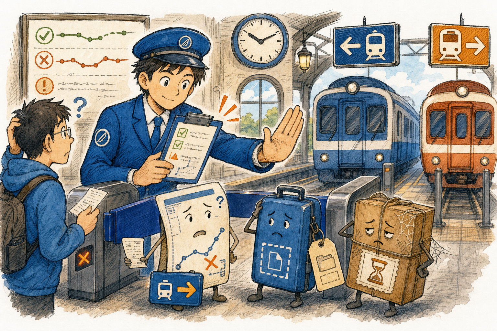
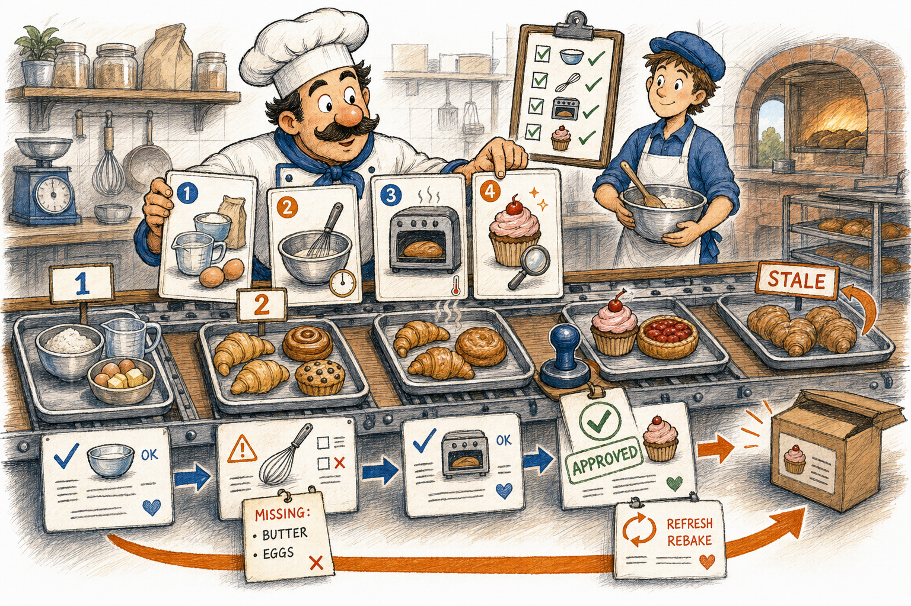
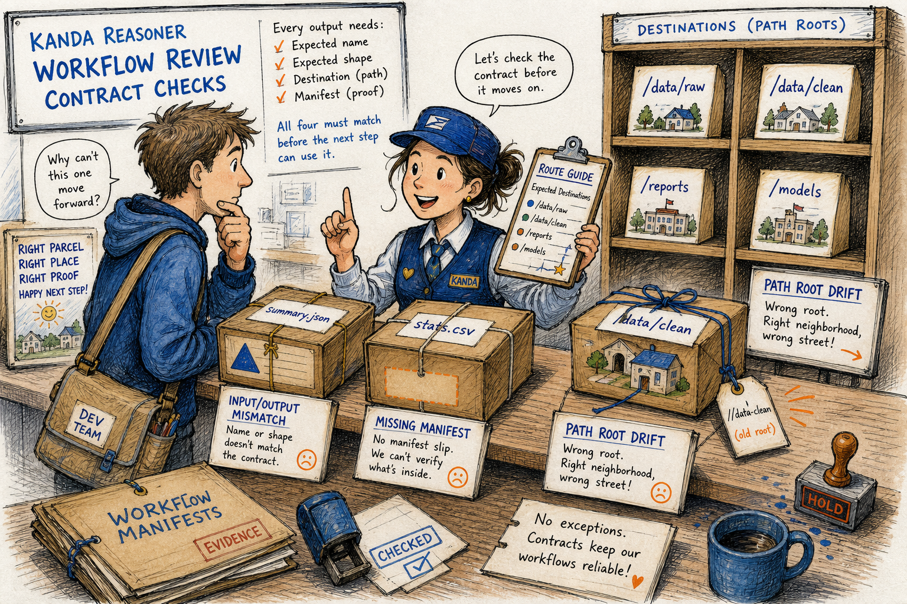
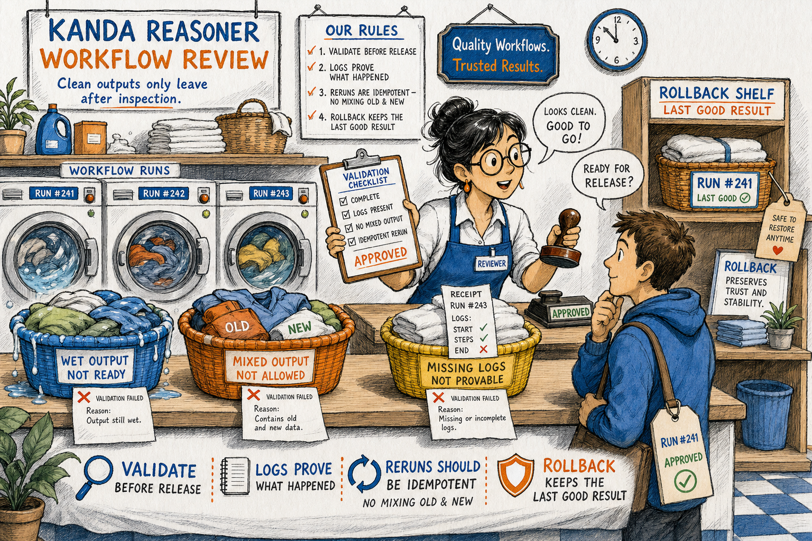

# Workflow Review

Workflow Review is the rightmost child tab inside `Audit Project`, immediately to the right of `Engineering Safety`. Its existing workflow controls and ownership remain unchanged.

Workflow Review is a safety lens in the KANDA Reasoner desktop GUI. It checks whether project workflows still point to the right files, run in the right order, produce the expected artifacts, and leave enough evidence for a safe rerun.

Image note:

- Subject: Workflow Review stopping missing, stale, or misrouted workflow artifacts before they board the wrong train.
- Asset path: `assets/drawings/workflow_review_opener_station.png`.
- Asset format and display role: local PNG primary characterful raster artwork for the chapter opener.
- Alt text: Hand-made train-station cartoon where a reviewer stops confused workflow parcels before they board the wrong platform.
- Caption: Workflow Review checks the ticket before the workflow boards the train.
- Prompt summary: hand-made editorial cartoon, daily-life train-station metaphor, workflow tickets and parcels, expressive station reviewer, KANDA blue/orange teaching accents, visible hatching and paper texture, original scene only.
- Density-rule justification: this is the chapter-opener drawing for a large help file with 25 workflow issue families.
- Artwork status: `primary_characterful_raster`.
- Visual-inspection result: PASS - raster editorial illustration with expressive figures, ordinary station props, organic imperfect ink lines, visible hatching, and no simple SVG/vector placeholder look.

## What Problem This Solves

**Technical:** Workflow Review validates workflow target integrity, step order, input/output contracts, route manifests, generated artifacts, AI evidence handoff, rerun safety, rollback behavior, documentation drift, environment assumptions, and path-root consistency.

**In plain English:** The tool is a station manager for project work. It catches stale tickets, wrong platforms, missing luggage tags, and uninspected output before the next step depends on them.

> **Further reading:** Local evidence: `kanda_reasoner_app/reasoner_tools_gui_help/tab2_workflow.json`; Workflow tab shell registration: `kanda_reasoner_app/reasoner_tools_gui_shell/tool_specs.py`; Workflow manager facade: `kanda_reasoner_app/manage_workflows/manage_workflows.py`.

## How The Workflow Works

Image note:

- Subject: Workflow step sequence, dependency, freshness, and validation checks.
- Asset path: `assets/drawings/workflow_review_sequence_bakery.png`.
- Asset format and display role: local PNG primary characterful raster artwork for the workflow section.
- Alt text: Hand-made bakery cartoon where recipe cards, trays, stale pastries, and stamps explain workflow sequence validation.
- Caption: Good outputs need the right ingredients, the right order, and a final stamp.
- Prompt summary: hand-made editorial cartoon, daily-life bakery assembly-line metaphor, recipe cards as workflow steps, trays as inputs and outputs, validation stamp, KANDA blue/orange teaching accents, visible hatching and paper texture, original scene only.
- Density-rule justification: this drawing explains workflow sequencing, dependency order, stale output refresh, and validation before delivery.
- Artwork status: `primary_characterful_raster`.
- Visual-inspection result: PASS - raster bakery scene with expressive people, everyday props, visible hand-drawn texture, and no dense poster or vector-placeholder look.

1. Open **Workflow Review** from the KANDA Reasoner desktop GUI.
2. Confirm the project root and worker script.
3. Run the workflow review.
4. Read issues as evidence-backed workflow warnings, not as automatic repair commands.
5. Fix the narrow owning workflow, file path, manifest, or validation step.
6. Rerun the workflow and confirm the output is current, non-empty, and validated.

## Authority Boundary

Workflow Review reports workflow risks. It does not rewrite workflows, approve generated output, choose AI routes, mutate canonical JSON, or freeze milestones. It points to the missing contract; the human or routed patch must repair it in the owning box.

## Fast Reading Table

| # | Workflow issue | Technical | In plain English |
|---|---|---|---|
| 1 | Workflow step points to missing file | A command, button, or workflow document references a path that is absent. | The step points to a door that is no longer there. |
| 2 | Workflow step points to deprecated file | The path exists but is no longer the active owner. | The sign still points to an old counter. |
| 3 | Button-to-action mismatch | A visible UI label and the connected function disagree. | The button promises one job and does another. |
| 4 | Step order dependency errors | A later step runs before the earlier step creates its input. | The recipe bakes before the ingredients arrive. |
| 5 | Input/output contract mismatch | One step writes a name or shape the next step does not expect. | The package has the wrong label for the next counter. |
| 6 | Output folder naming mismatch | Different workflow parts use different names for the same output folder. | One worker drops the parcel in a different room. |
| 7 | Stale generated artifacts | Generated files are older than their inputs or source files. | The workflow is serving yesterday's tray. |
| 8 | Missing validation step in workflow | Output is produced without a check that it is valid. | The order leaves the kitchen without inspection. |
| 9 | Placeholder command misuse | Documentation shows placeholders that a user may run literally. | Someone copies `<PATH>` instead of replacing it. |
| 10 | GUI state label mismatch | The UI does not clearly show the loaded file, mode, or track. | The counter does not say which ticket is active. |
| 11 | Dual JSON track workflow mistakes | Canonical web-AI JSON and local-AI working JSON are confused. | A practice copy can overwrite the official form. |
| 12 | Route manifest ignored by upload workflow | The splitter creates a route guide that upload instructions omit. | The map is made, then left on the desk. |
| 13 | web_ai_readme ignored by workflow | The JSON includes a reading guide but the workflow does not tell AI to use it. | The guidebook is packed but nobody opens it. |
| 14 | Missing deterministic route for AI question types | Common question types do not have a clear file or section route. | The helper wanders the station looking for the right platform. |
| 15 | Broken local-AI Ask flow | Evidence selection, deterministic path, streaming, or final answer handling breaks. | The question is asked, but the answer path stalls. |
| 16 | Workflow step does not expose enough logs | A step succeeds or fails without enough evidence to verify what happened. | The receipt says done but shows no details. |
| 17 | Workflow step cannot be rerun idempotently | Running the same step twice changes state unsafely or mixes outputs. | Old and new laundry end up in one basket. |
| 18 | Workflow references old validation logic | The workflow calls a validator that does not know the current contract. | A retired inspector stamps the new package. |
| 19 | Missing rollback or fail-safe workflow | Failure damages or replaces the last known good output. | A bad wash ruins the clean backup. |
| 20 | Workflow documentation drift | Documentation and current code disagree. | The written recipe no longer matches the kitchen. |
| 21 | Missing cross-project generalization | The workflow only works for one hardcoded project. | The route works only from one address. |
| 22 | Workflow assumes wrong encoding or line endings | The workflow reads text with an unsafe encoding or line-ending assumption. | The ticket is read in the wrong language. |
| 23 | Workflow silently succeeds with empty output | A step reports success while output is empty, tiny, or missing required sections. | The box is delivered empty. |
| 24 | Declared dependency vs installed dependency version skew | Project metadata and the runtime environment disagree. | The machine has a different tool than the checklist expects. |
| 25 | Path root drift | The workflow runs from one folder but reads or writes as if it were elsewhere. | The parcel is delivered to the wrong neighborhood. |

## Contracts, Routes, And Evidence

Image note:

- Subject: Workflow input/output contracts, route manifests, and path-root drift.
- Asset path: `assets/drawings/workflow_review_contract_post_office.png`.
- Asset format and display role: local PNG primary characterful raster artwork for the contract and route section.
- Alt text: Hand-made post-office cartoon where parcels, route guides, and shelves explain workflow contracts and path roots.
- Caption: Every workflow parcel needs the expected name, shape, destination, and proof.
- Prompt summary: hand-made editorial cartoon, daily-life post-office sorting metaphor, parcels as generated outputs, route guide clipboard, destination shelves, KANDA blue/orange teaching accents, visible hatching and paper texture, original scene only.
- Density-rule justification: this drawing explains contract, route, manifest, and path-root issues distinct from sequencing and operational safety.
- Artwork status: `primary_characterful_raster`.
- Visual-inspection result: PASS - raster post-office scene with expressive humans, ordinary props, hand-drawn line rhythm, visible hatching, and no flat vector/icon look.

**Technical:** Workflow contracts are the names, locations, formats, manifests, and evidence records that let one step safely feed the next. Route artifacts such as split manifests and web-AI reading guides are not decoration; they are part of the handoff contract.

**In plain English:** A workflow output is like a parcel. It needs the right address, shape, label, and receipt. If any of those are missing, the next person may open the wrong box or search the wrong shelf.

> **Further reading:** `kanda_reasoner_app/manage_workflows/manage_workflows_help/workflow_artifact_route_detectors.py`; `workflow_reader_ai_contract_detectors.py`; `workflow_evidence_output_route_guard_detectors.py`.

## AI Handoff And Local Tracks

**Technical:** Workflow Review flags confusion between canonical web-AI export data, local-AI working copies, route manifests, `web_ai_readme`, deterministic question routing, and local Ask flow health.

**In plain English:** AI should not be handed a pile of papers and told to guess. The workflow must say which file answers which kind of question, which copy is official, and which copy is safe for local experiments.

Common high-risk signals:

- route manifest exists but upload instructions ignore it;
- `web_ai_readme` exists but prompt instructions do not use it;
- canonical JSON and local-AI JSON are mixed;
- Tab 7 Ask flow loses evidence, streaming, or final answer handling;
- generated evidence is written back into source folders instead of managed output.

## Operational Safety

Image note:

- Subject: Workflow validation, logs, idempotent reruns, and rollback safety.
- Asset path: `assets/drawings/workflow_review_validation_laundromat.png`.
- Asset format and display role: local PNG primary characterful raster artwork for the operational safety section.
- Alt text: Hand-made laundromat cartoon where workflow outputs are inspected before release and rollback keeps the last good result.
- Caption: Clean outputs leave only after logs, validation, rerun safety, and rollback are checked.
- Prompt summary: hand-made editorial cartoon, daily-life laundromat metaphor, baskets as workflow runs, receipts as logs, rollback shelf with last good result, KANDA blue/orange teaching accents, visible hatching and paper texture, original scene only.
- Density-rule justification: this final drawing anchors validation, rerun, logs, and rollback because those are the closing operational rules.
- Artwork status: `primary_characterful_raster`.
- Visual-inspection result: PASS - raster laundromat scene with expressive people, ordinary props, clear validation metaphor, visible hatching, and no stock/vector placeholder look.

**Technical:** Safe workflow execution must validate expected files, validate expected JSON shape when applicable, expose logs, support idempotent reruns, preserve last-good outputs, and fail loudly when output is empty or stale.

**In plain English:** A workflow should behave like a careful service counter. It does not hand you wet laundry, mix old and new clothes, hide the receipt, or throw away the clean backup when a new run fails.

## Further Reading Map

- Legacy Workflow Review catalog: `kanda_reasoner_app/reasoner_tools_gui_help/tab2_workflow.json`.
- Workflow tab registration: `kanda_reasoner_app/reasoner_tools_gui_shell/tool_specs.py`.
- Rich help resolver: `kanda_reasoner_app/reasoner_tools_gui_shell/help_docs/path_resolver.py`.
- Rich help renderer: `kanda_reasoner_app/reasoner_tools_gui_shell/help_docs/renderer.py`.
- Workflow manager facade: `kanda_reasoner_app/manage_workflows/manage_workflows.py`.
- Workflow detector helpers: `kanda_reasoner_app/manage_workflows/manage_workflows_help/`.
- Help artwork canon: `kanda_prompt_workspace/prompt_library/ACTIVE_PROMPTS/12_generalized_project_canons/desktop_help_document_layout_canon.md`.

## Operational Checklist

- Confirm the active project root before running the review.
- Confirm the worker script shown for Workflow Review.
- Treat each issue as a workflow contract warning, not as permission for broad edits.
- Repair only the owning path, command, manifest, validation, or documentation contract.
- Rerun the workflow after repair.
- Confirm output freshness, non-empty content, route manifest use, logs, and rollback safety.
- Freeze only after validation evidence is clean and current.

## Validation Rule

The help document must remain local-only: Markdown source, deterministic HTML/CSS, original local PNG drawings, no remote resources in rendered files, and a desktop Qt renderer with safe fallbacks.
