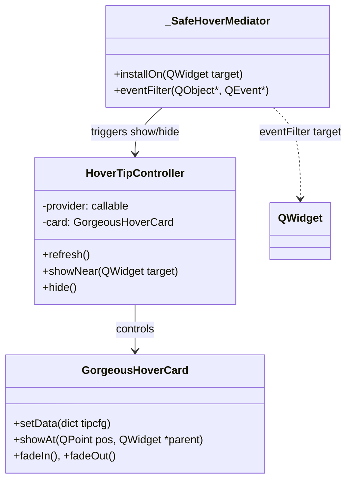

# ✨ `hover_card_tooltip_lane_logic.md`
**Updated:** 2025-10-02  
**Purpose:** How the **Gorgeous Hover‑Card** tooltip that “goes to the lane” works, where it lives, and the **2‑line** way to wire it up.

---

## 🔎 What it is
A **GorgeousHoverCard** (styled popup `QWidget`) that:
- fades in near the mouse,
- shows **title / summary / HTML** (and optional icon, notes),
- stays **inside screen bounds**,
- is driven by a lightweight **controller** plus an **event‑filter mediator** so it **opens on hover** and **closes cleanly**.

Under the hood, it:
- sets **ToolTip / Frameless / AlwaysOnTop** flags,
- uses **“show without activating”** to avoid stealing focus,
- installs **popup/hover guards** so the card disappears when menus open/close.

---

## 🧭 Where it’s attached (the lane path)
The **lane’s FiltersController** owns all dropdowns via `self._key_to_combo`.

The helper below **walks those combos** and attaches a hover‑card to each:
```python
from k05_combobox_forge.k05_4_cmbbx_constructor.filters_controller import attach_hover_cards_to_dropdowns

# inside your lane/controller after _key_to_combo is ready:
attach_hover_cards_to_dropdowns(self)  # walks _key_to_combo and attaches cards
```
That is the **“lane integration point”** you want.

**Concept map**
```mermaid
flowchart LR
  subgraph Lane Controller
    FC[FiltersController]:::code
    MAP[_key_to_combo]:::code
  end
  subgraph Attachers
    WALK[attach_hover_cards_to_dropdowns(controller)]:::code
    ONE[attach_hover_help(widget, tipcfg, ...)]:::code
  end
  subgraph UI
    DD[KandaDropdown (QComboBox)]:::ui
    HC[GorgeousHoverCard]:::ui
  end

  FC --> MAP
  WALK --> MAP
  WALK --> ONE
  MAP --> DD
  ONE --> DD
  ONE --> HC

  classDef code fill:#0f172a,stroke:#67e8f9,color:#e2e8f0;
  classDef ui fill:#1f2937,stroke:#fca5a5,color:#fef3c7;
```
---

## 🧩 Attachment API (one widget)
Use the **idempotent** call:

```python
from k06_templates.tooltip_lane_tmplt import tooltip_help_center

tipcfg = {"title": "Normalization", "summary": "Amplitude scaling & z-score options.",
          "html": "<b>Tip:</b> Choose Z-score for comparability."}
tooltip_help_center.attach_hover_help(my_combo, tipcfg, label="FilterOption: Normalizations")
```
**What it does internally**
- **Removes** any previous mediator/guard for that widget (idempotent).
- Ensures **WA_Hover** and **mouse tracking** are enabled.
- **Disables native Qt tooltips** (to prevent conflicts).
- Builds **GorgeousHoverCard** + **HoverTipController**.
- Installs a **tooltip provider** (returns your `tipcfg`).
- Installs **_SafeHoverMediator** if available; otherwise a safe fallback.
- Adds **popup/hover guards** so cards never “stick”.

> You pass a small dict like: `{"title": "...", "summary": "...", "html": "..."}`.

---

## ⚙️ Internals at a glance

- **HoverTipController** computes a safe position (`_get_safe_position`), calls `card.setData(...)`, then shows with animation.  
- The **mediator** listens for `Enter/Leave/Press/Wheel` and starts a short delay before showing; it hides on exit or user interaction.

**Event Flow**
```mermaid
sequenceDiagram
  participant W as Widget (Combo)
  participant M as _SafeHoverMediator
  participant C as HoverTipController
  participant H as GorgeousHoverCard

  W->>M: QEvent.Enter
  M->>C: schedule show (delay)
  C->>H: setData(tipcfg); showNear(W)
  W->>M: QEvent.Leave / MousePress / Wheel
  M->>C: hide
  C->>H: fadeOut()
```
---

## 🔄 Auto‑refresh when the user changes the combo
Some tooltips should **reflect the current value**. The pattern is:
```python
def _attach_value_aware_tip(combo, base_label, tip_map):
    # initial attach
    val = combo.currentText()
    tipcfg = tip_map.get(val, tip_map.get("__default__"))
    tooltip_help_center.attach_hover_help(combo, tipcfg, label=f"{base_label}: {val}")

    # re-attach on every change with rebuilt config
    combo.currentIndexChanged.connect(lambda _:
        tooltip_help_center.attach_hover_help(
            combo,
            tip_map.get(combo.currentText(), tip_map.get("__default__")),
            label=f"{base_label}: {combo.currentText()}"
        )
    )
```
`tooltip_cmbbx_1.py` demonstrates this idea: **attach once**, then **re‑attach** on `currentIndexChanged` with refreshed content.

---

## 🧪 Wire it up (lane‑wide) — the promised 2 lines
```python
from k05_combobox_forge.k05_4_cmbbx_constructor.filters_controller import attach_hover_cards_to_dropdowns

# after your controller has created/populated its dropdowns (_key_to_combo):
attach_hover_cards_to_dropdowns(self)
```
This iterates each combo, looks up the per‑key config in `controller._params_map`, and calls `attach_hover_help(...)` for you.

---

## 🎯 Or attach to a single combo

```python
from k06_templates.tooltip_lane_tmplt import tooltip_help_center

tipcfg = {"title": "Normalization", "summary": "Amplitude scaling & z-score options."}
tooltip_help_center.attach_hover_help(my_combo, tipcfg, label="FilterOption: Normalizations")
```

---

## ✅ Quick checklist / troubleshooting
- **Hover enabled**: make sure **WA_Hover** and **mouse tracking** are on — the helper sets both and **clears native Qt tooltips**.
- **Mediator present**: ensure **_SafeHoverMediator** is importable in the same module as `attach_hover_help` (preferred). Fallback mediator is used only as a last resort.
- **Window flags**: ToolTip/Frameless/OnTop are set for you; no extra tweaks needed.
- **Guards**: popup/hover guards are installed so the card **never lingers** after menus or focus changes.
- **Logs**: the controller prints `[RESULT] HoverCard attached ...` on success; check stdout if nothing appears.

---

## 📎 Minimal API reference
`attach_hover_cards_to_dropdowns(controller)`  
walks `controller._key_to_combo`, fetches per‑key tipcfg from `controller._params_map`, and attaches a card to each combo.

`attach_hover_help(widget, tipcfg, *, label=None, delay_ms=350, theme=None, ...)`  
idempotent; sets up hover/card/mediator/guards for **one** widget.

---

## 🧰 Example tip maps (value‑aware)
```python
TIP_MAP_NORMALIZATION = {
    "__default__": {"title": "Normalization", "summary": "Standard choices for amplitude scaling."},
    "Z-score":     {"title": "Z‑score", "summary": "Center & scale: (x-μ)/σ. Good for comparability."},
    "Min-Max":     {"title": "Min‑Max", "summary": "Scale to [0,1]. Preserves relative shape."},
}
```
Attach with `_attach_value_aware_tip(combo, "Normalization", TIP_MAP_NORMALIZATION)`.

---

## 🧠 Rationale: why “menus→SIMPLE” and “lane→GORGEOUS”
- **Header menus (Core/Pro)**: actions are hovered **before** a lane exists — native Qt tooltips are **fast & light**.
- **Lane comboboxes**: once widgets exist, users benefit from **rich context** — the hover‑card provides **structured help** (title/summary/HTML) without leaving the screen.

---

