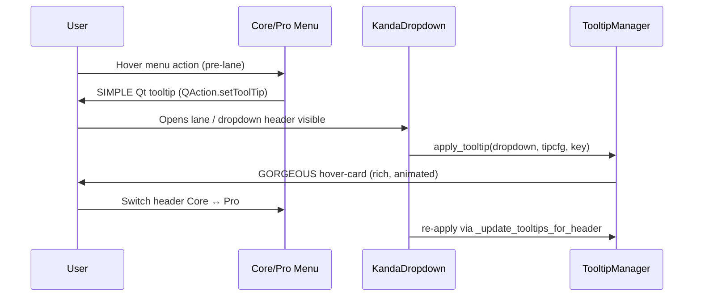

# 🧠 KANDA Middle Tab & Analyzer — Integration Report (report_10.10.25.md)
**Prepared:** 2025-10-01  
**Scope:** Entry runner, lane JSON loader, and middle‑tab ComboFiltersTemplate — with a unified plan for SIMPLE (QAction) and GORGEOUS (hover‑card) tooltips, data flow, and developer workflows.

---

## 1) Executive Summary
This report consolidates three core pieces of the KANDA project UI/analysis stack:
- **project_analizer_2_runner.py** — CLI + IDE entry that exposes the ProjectAnalyzer.
- **cmbbx_lane_json_loader.py** — Source‑of‑truth JSON ➜ in‑memory maps for middle‑tab menus & lane dropdowns.
- **ComboFiltersTemplate** — Middle‑tab controller that builds menus, renders dropdowns, wires signals, and applies tooltips.

Together, they deliver:
- **Repeatable analysis & docs** (runner)  
- **Deterministic config→UI shaping** with deep `$include` (loader)  
- **Centralized tooltip orchestration** (template), split between **light native tips** (menus) and **rich hover‑cards** (dropdown headers).

---

## 2) High‑Level Architecture
```mermaid
flowchart LR
  subgraph A[Config Layer]
    A1[core.json]:::json
    A2[pro.json]:::json
    A3[includes/*.json]:::json
  end

  subgraph B[Loader Layer]
    B1[cmbbx_lane_json_loader.py]:::code
    B2[$include Resolver (deep)]:::code
    B3[Shaper: direct/nested]:::code
  end

  subgraph C[UI Controller Layer]
    C1[ComboFiltersTemplate]:::code
    C2[_rebuild_core/_pro_menus]:::code
    C3[update_dropdowns()]:::code
    C4[_harvest_label_tooltips]:::code
    C5[_rebuild_params_map]:::code
    C6[_update_tooltips_for_header]:::code
  end

  subgraph D[Widgets]
    D1[QMenu/QAction]:::ui
    D2[KandaDropdown (lane)]:::ui
  end

  subgraph E[Analyzer Tooling]
    E1[project_analizer_2_runner.py]:::code
    E2[ProjectAnalyzer]:::code
  end

  A1 --> B1
  A2 --> B1
  A3 --> B1
  B1 --> B2 --> B3
  B3 -->|direct_map/nested_map| C1
  C1 --> C2 --> D1
  C1 --> C3 --> D2
  C1 --> C4 --> C5
  C5 --> D2

  E1 --> E2

  classDef code fill:#111b,stroke:#4ea,stroke-width:1px,color:#ccf;
  classDef json fill:#223,stroke:#6cf,stroke-width:1px,color:#cff;
  classDef ui fill:#1b1122,stroke:#e86,stroke-width:1px,color:#fee;
```
**Key idea**: one config feeds both **menus** and **lane**, so hints and cards remain consistent.

---

## 3) Module Deep Dives
### 3.1 `project_analizer_2_runner.py` — Entry Runner
**Purpose**: turn ProjectAnalyzer into a modular CLI/IDE tool for insights & docs.

**Capabilities**  
- Dev tools & docs: `generate-dev_tools`  
- Complexity: `metrics -n N`  
- Dependencies & hotspots: `dep-hotspots`, `flow-diagrams`  
- Git metadata: `git-meta`  
- Scope targeting: `group-report <name>`, `ad-hoc-report <glob...>`  
- Web explorer: `web-explorer --port 8000`  
- Model export: `export-model -f yaml|json -o file`  
- Debt surfacing: `debt-report`  
- Search: `find <term> -n N`  
- Scaffolding: `scaffold <kind> <Name>`

**IDE Mode (no args)**  
1) `generate_architecture_docs()`  
2) auto group reports via `file_groups.yaml` (`auto: true`) or env `PA_AUTO_GROUPS`

**Cheat‑Sheet**
```bash
python project_analizer_2_runner.py generate-dev_tools
python project_analizer_2_runner.py metrics -n 10
python project_analizer_2_runner.py web-explorer --port 8000
python project_analizer_2_runner.py ad-hoc-report "path/**/*.py" another/file.py
python project_analizer_2_runner.py group-report model_utils
```

---

### 3.2 `cmbbx_lane_json_loader.py` — Lane JSON Loader
**Role**: single source of truth that converts JSON into the two map shapes your middle tab expects.

**Contract**  
- `$include` allowed anywhere; resolver returns a **materialized tree** before shaping.  
- `load_lane_config(path)` ➜
  - `direct_map: { "Section": [[label, [items]], ...] }`
  - `nested_map: { "Group": { "Subgroup": [[label, [items]], ...] } }`
- `load_all(core_json, pro_json)` ➜  
  `(core_direct, core_nested, pro_direct, pro_nested)` ↦ feeds **Main/Pro** buttons.

**Tooltip Paths**  
- **SIMPLE** (menus): each `[label, items]` → `QAction` attach point (`action.setToolTip(...)`).  
- **GORGEOUS** (lane): every string in `items` is a **dropdown id**; attach hover‑card after widget creation.

**Carrying metadata (two options)**  
- **Option A (recommended)**: optional `"tip"` and `"hover"` in entries (back‑compat).  
- **Option B**: separate `tooltips.json` registry; join at UI layer.

---

### 3.3 `ComboFiltersTemplate` — Middle‑Tab Controller
**Role**: builds Core/Pro menus, renders KandaDropdown lane, reloads from maps, styles headers, wires signals, and centralizes tooltip harvesting & application.

**SIMPLE tips (menus)**  
- Built via: `_rebuild_core_menus`, `_rebuild_core_caret_menu`, `_rebuild_pro_menus`, `_rebuild_pro_caret_menu`.  
- Attach during/after build: `action.setToolTip(...)`.  
- `_style_menu(...)` is available for additional tweaks.

**GORGEOUS tips (lane)**  
- On `update_dropdowns()`, create `KandaDropdown` then:  
  `NeuroTooltipManager.apply_tooltip(dropdown, meta, key)`  
- Metadata lives in `self._label_to_tipcfg` and `self._params_map` (from `_harvest_label_tooltips` + `_rebuild_params_map`).

**Refresh on header change**  
- `_update_tooltips_for_header(header_name)` re‑applies hover‑cards to **visible** dropdowns when user flips **Core ↔ Pro**.  
- `NeuroTooltipManager` is imported here so application is centralized.

**Signals**  
- `filterChanged(label, key, value)`  
- `headerFilterSetChanged(str)` → pair with `_update_tooltips_for_header(...)`

---

## 4) Tooltip Strategy — Unified View


**Why this works**  
- **Before lane exists**: light native hints in menu.  
- **After widgets exist**: rich, contextual guidance via hover‑cards.  
- Centralized harvest & apply keeps **rebuild/teardown** symmetric.

---

## 5) Minimal Implementation Diffs (Option A Path)
**Loader: accept records with optional `"tip"` / `"hover"`**
```python
def as_records(lst):
    out = []
    for entry in lst:
        if isinstance(entry, list):  # back-compat
            lab, items = entry[0], list(entry[1])
            out.append({ "label": lab, "items": items, "tip": None, "hover": None })
            continue
        lab   = entry["label"]
        items = list(entry["items"])
        tip   = entry.get("tip")
        hover = entry.get("hover")
        out.append({ "label": lab, "items": items, "tip": tip, "hover": hover })
    return out
```
Then:
```python
direct_map = {k: as_records(v) for k, v in (base.get("direct") or {}).items()}
nested_map = {A: {B: as_records(L) for B, L in sub.items()}
              for A, sub in (base.get("nested") or {}).items()}
```

**Menu helpers: apply SIMPLE tips**
```python
action = menu.addAction(rec["label"])
if rec.get("tip"):
    action.setToolTip(rec["tip"])
```

**Lane build: apply GORGEOUS tips**
```python
dd = make_kanda_dropdown(item_id)
NeuroTooltipManager.apply_tooltip(dd, rec.get("hover"), item_id)
```

---

## 6) Testing Matrix
- **Includes**: nested `$include` in arrays/objects resolve correctly.  
- **Shapes**: `direct_map`/`nested_map` exactly match expected forms (pairs & records).  
- **Menus**: all actions render; tooltips appear on hover.  
- **Lane**: all dropdowns spawn; hover‑cards attach; no memory leaks on teardown.  
- **Header flips**: `_update_tooltips_for_header` reapplies cards without flicker.  
- **Back‑compat**: legacy pair lists load; record format loads.  
- **Errors**: missing include, invalid shape, unknown key → deterministic logs & graceful no‑op.

---

## 7) Developer Playbook
**Daily**  
1. Edit JSON configs (use `$include` for rich content).  
2. Run: `python project_analizer_2_runner.py generate-dev_tools`  
3. Launch explorer: `python project_analizer_2_runner.py web-explorer --port 8000`  
4. Rebuild middle tab (IDE Run) and verify SIMPLE & GORGEOUS tooltips.

**Before PR**  
- Run `metrics`, `dep-hotspots`, and `debt-report`.  
- Export model: `export-model -f yaml -o artifacts/model.yaml`.  
- Record a quick screen of the lane with hover‑cards for reviewer confidence.

---

## 8) Risk & Mitigation
- **Tooltip drift** (JSON vs UI): prefer Option A (metadata co-located).  
- **Large includes**: cache fragments; validate shapes with a schema check.  
- **Teardown leaks**: store guards on widgets (e.g., `_hover_tip_guard`) and clear in lane reset.  
- **Header race**: debounce `_update_tooltips_for_header` on rapid toggles.

---

## 9) Appendices
### A) Loader JSON Example (records + includes)
```jsonc
{
  "$include": ["includes/common_groups.json"],
  "direct": {
    "Time": [
      {"label":"Window","items":["tw_5","tw_10","tw_20"],
        "tip":"Select time window",
        "hover":{"$include":"tips/time_window_hover.json"} }
    ]
  },
  "nested": {
    "Frequency": {
      "Bands": [
        {"label":"Delta-Theta","items":["f_dt_overlay","f_dt_power"]},
        {"label":"Alpha-Beta","items":["f_ab_overlay","f_ab_power"]}
      ]
    }
  }
}
```

### B) ComboFiltersTemplate Snippets
```python
# Styling + SIMPLE tips
def _style_menu(self, menu):
    for act in menu.actions():
        tip = self._simple_tips_registry.get(act.text())
        if tip:
            act.setToolTip(tip)

# Lane build + GORGEOUS attach
def update_dropdowns(self):
    for key in self._ordered_keys_for_current_header():
        dd = self._make_kanda_dropdown(key)
        meta = self._params_map.get(key, {})
        NeuroTooltipManager.apply_tooltip(dd, meta.get("tooltip"), key)
        self._lane_layout.addWidget(dd)
```

### C) Runner Quick Commands
```bash
python project_analizer_2_runner.py metrics -n 15
python project_analizer_2_runner.py dep-hotspots
python project_analizer_2_runner.py debt-report
python project_analizer_2_runner.py web-explorer --port 8080
python project_analizer_2_runner.py export-model -f yaml -o artifacts/model.yaml
```

---

## 10) TL;DR
- Use the **runner** to generate docs, analyze risk, and serve an interactive explorer.  
- Let the **loader** turn JSON into stable menu/lane maps with deep `$include`.  
- Keep **ComboFiltersTemplate** as the canonical place to **harvest** and **apply** both tooltip types — SIMPLE on menus, GORGEOUS on dropdowns — with fast refresh on header flips.

